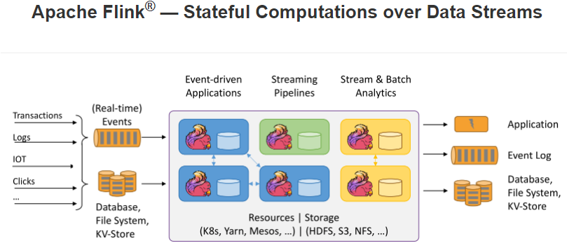
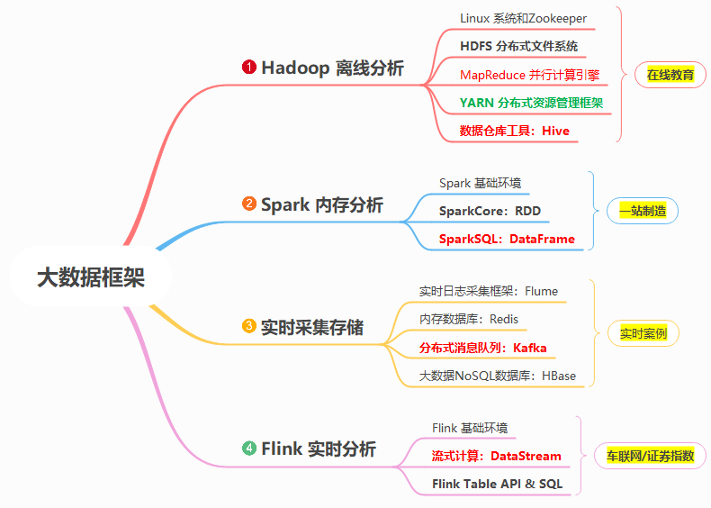

# Flink: 安装部署及入门案例

Apache Flink是一个框架和分布式处理引擎，用于对无界和有界数据流进行有状态计算。Flink设计为在所有常见的集群环境中运行，以内存速度和任何规模执行计算。



## 大数据分析引擎


> 梳理整个大数据课程，分为四大阶段，具体如下所示：

```ini
1）、HADOOP 离线阶段：
	基础课程（LINUX + ZOOKEEPER + HADOOP + HIVE）和项目课程（亿品新零售）
	
2）、SPARK 内存分析阶段：
	基础课程（PySpark）和项目课程（一站制造项目）
	
3）、大数据实时存储阶段：
	Flume、Redis、Kafka、HBase、
	
4）、FLINK 流式计算阶段：
	基础课程（FLINK：流计算及SQL&Table API）和项目课程
```



> 大数据分析领域，数据分析类型：==离线批处理分析（Batch）==和==实时流计算分析（Streaming）==。

```ini
离线分析：
	批处理（Batch Processing）
实时分析：
	流计算（Stream Processing）
	

MapReduce和Spark                        Flink
    批处理                                 流处理（流计算）
        每次处理多条数据                        每次处理1条数据
        很多条数据一起处理                      1条1条数据处理

    批处理                                 流计算
        实时性没有太多要求                      实时性要求很高
        当处理数据时，才运行Task                没有开始处理数据之前，运行Task
        
```

## I. Flink框架概述

### 1. 官方定义


### 2. 流式计算思想


### 3. 应用场景


## II. Flink安装部署

### 1. 运行架构


### 2. 本地集群


### 3. Standalone集群


### 4. Standalone HA


### 5. Flink on YARN

#### 5.1. 运行流程


#### 5.2. Session模式运行


#### 5.3. Per-Job模式


#### 5.4. Application模式运行


## III. Flink入门案例

### 1. 编程模型


### 2. WordCount(批处理)


### 3. WordCount(流计算)


### 4. 打包部署运行


## 附I. 流计算引擎的演进


## 附II. Flink框架技术栈


## 附III. Flink拓展阅读


## 附IV. Flink Standalone集群回顾


## 附V. Hadoop YARN回顾复习


## 附VI. Flink on YARN三种部署模式