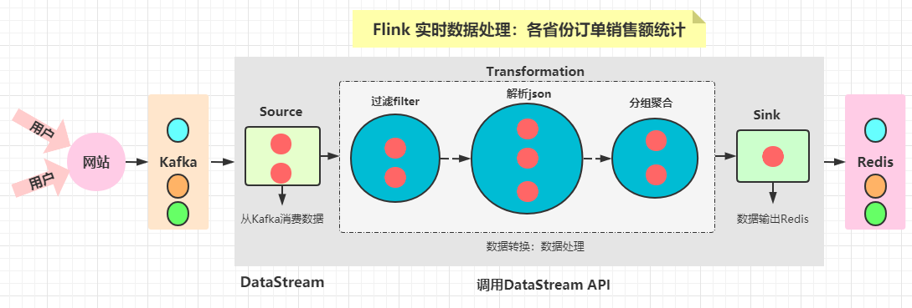
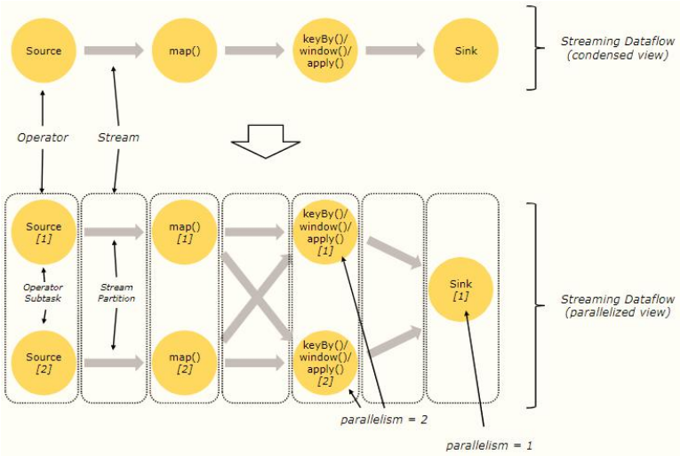
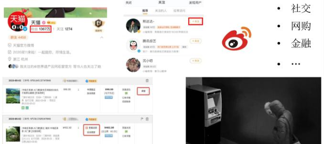
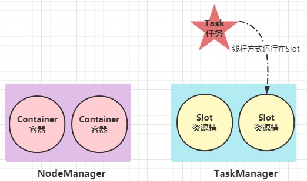
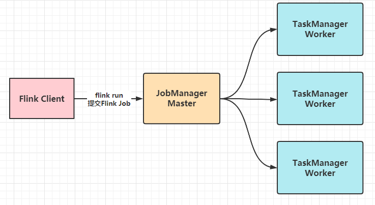
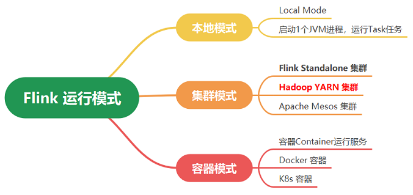
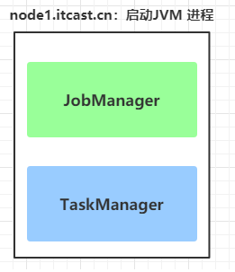

# Flink: 安装部署及入门案例

Apache Flink是一个框架和分布式处理引擎，用于对无界和有界数据流进行有状态计算。Flink设计为在所有常见的集群环境中运行，以内存速度和任何规模执行计算。


## 大数据分析引擎

> 梳理整个大数据课程，分为四大阶段，具体如下所示：

```ini
1）、HADOOP 离线阶段：
	基础课程（LINUX + ZOOKEEPER + HADOOP + HIVE）和项目课程（亿品新零售）
	
2）、SPARK 内存分析阶段：
	基础课程（PySpark）和项目课程（一站制造项目）
	
3）、大数据实时存储阶段：
	Flume、Redis、Kafka、HBase、
	
4）、FLINK 流式计算阶段：
	基础课程（FLINK：流计算及SQL&Table API）和项目课程
```


> 大数据分析领域，数据分析类型：==离线批处理分析（Batch）==和==实时流计算分析（Streaming）==。

```ini
离线分析：
	批处理（Batch Processing）
实时分析：
	流计算（Stream Processing）
	

MapReduce和Spark                        Flink
    批处理                                 流处理（流计算）
        每次处理多条数据                        每次处理1条数据
        很多条数据一起处理                      1条1条数据处理

    批处理                                 流计算
        实时性没有太多要求                      实时性要求很高
        当处理数据时，才运行Task                没有开始处理数据之前，运行Task
        
```

## I. Flink框架概述

### 1. 官方定义

Apache Flink 官网：https://flink.apache.org/

> [Apache Flink 是一个开源的、基于流的、有状态的计算框架。它是分布式地执行的，具备低延迟、高吞吐的优秀性能，并且非常擅长处理有状态的复杂计算逻辑场景。]()


> 官方定义：==**Apache Flink is a framework and distributed processing engine for stateful computations over *unbounded and bounded* data streams.**==

- 1）、计算框架：类似MapReduce框架，分析数据

- 2）、分布式计算框架

  - 分析处理数据时，可以启动多个任务Task，同时并行处理
  - [分布式计算思想：分而治之，先分，后合]()

- 3）、建立在==数据流（DataStream）==之上状态计算框架

  - 处理的数据为`数据流（DataStream）`

  - 在Flink框架中，将所有数据认为是数据流DataStream

    

    - 静态数据：==Bounded Data Stream==，**有界数据流**
    - 动态数据：==Unbounded Data Stream==，**无界数据流，流式数据**

  > [Flink 计算引擎，针对流数据进行处理，来一条数据处理一条数据，所以有界流和无界流。]()

- 4）、状态计算：`Stateful Computions`
  - Flink程序在处理数据时（流式计算，针对无界流数据处理），记录状态State信息
  - 比如以词频统计为例，记录每个单词词频；


> Apache Flink 是 Apache 开源软件基金会的一个**顶级项目**，和许多 Apache 顶级项目一样，如 Spark 起源于 UC 伯克利的实验室， Flink 也是起源于非常有名的大学的实验室——**柏林工业大学实验室**。


> Flink 诞生于欧洲的一个大数据研究项目 `StratoSphere`。早期，Flink 是做 Batch 计算的，但是在 2014 年， StratoSphere 里面的核心成员孵化出 Flink，同年将 Flink 捐赠 Apache，并在后来成为 Apache 的顶级大数据项目，同时 Flink计算的主流方向被定位为 Streaming， 即**用流式计算来做所有大数据的计算**，这就是 Flink 技术诞生的背景。

[项目最初的名称为 Stratosphere，目标是要让大数据的处理看起来更加地简洁。]()


> 由于 Flink 项目吸引了非常多贡献者参与，活跃度等方面也都非常优秀，它**在 2014 年 12 月成为了 Apache 的顶级项目**。成为顶级项目之后，它在一个月之后发布了**第一个 Release 版本 Flink 0.8.0**。在此之后，Flink 基本保持 4 个月 1 个版本的节奏，发展到今天。


> 当阿里收购Flink母公司以后，大力推广Flink使用，以及将内部`Blink`框架功能与Apache Flink框架整合，陆续发布：Flink 1.9.0 版本，Flink 1.10.0（稳当），Flink 1.11.0，Flink `1.12.0`（里程碑版本）。


> Flink 框架尤其在2019年和2020年发展比较迅速，版本迭代更加频繁，尤其2020年底发布`Flink 1.12`版本，**里程碑版本**，`流批一体化编程模式`，并且`Flink Table API和SQL成熟稳定`，可以用于实际生产环境。


> 当Flink框架出现，并且成熟以后，未来的数据分析处理：**实时处理分析**，Flink框架首选。


### 2. 流式计算思想

> [Flink 流式计算程序，来一条处理一条数据，真正流计算。]()


> Flink 框架进行流式计算时，整个流程分为：[数据源Source、数据转换Transformation和数据接收器Sink]()。

```ini
第一步、从数据源获取数据时，将数据封装到数据流
	DataStream
	实际项目，都是从Kafka 消息队列中消费数据
	
第二步、数据处理时，调用DataStream方法
	DataStream#transformation
	类似RDD中转换算子，比如map、flatMap、filter等等

第三步、将分析数据输出到外部存储
	DataStream#sink
	类似RDD中触发/输出算子，比如foreach.....
```

> Flink应用程序进行**分布式**流式计算时，如何做到[并行计算]()，如下图所示：



> 对于Flink框架来说，每个Job运行时，==在处理第一条数据之前，首先需要获取资源，运行Task任务，准备数据到达，当数据到达时，一个个数据处理==。

- Operator：`无论是从数据源Source加载数据，还是调用方法转换Transformation处理数据，到最后数据终端Sink输出，都称为Operator`，分为：`Source Operator、Transformation Operator和Sink Operator` 。
- `Stream`：数据从一个Operator流向另一个Operator； 


[每个Operator可以设置并行度（`Parallelism`），假设【Source】、【map()】及【keyBy()/window()/apply()】三个Operator并行度设置为2，【Sink】Operator并行的设置为1，形成如下示意图：]()



> Flink 流式计算引擎特点：


### 3. 应用场景

> Apache Flink在阿里巴巴主要应用场景如下四类：[实时数仓、实时监控、实时报表、流数据分析	]()


> 官方提出三个方面，Flink框架应用场景：


- 1）、事件驱动型应用：`Event-driven Applications`

[事件驱动表示一个事件会触发另一个或者很多个后续的事件，然后这一系列事件会形成一些信息，基于这些信息需要做一定的处理。]()



```
1、在社交场景下，以【微博】为例，当点击了一个关注之后，被关注人的粉丝数就会发生变化。之后如果被关注的人发了一条微博，关注他的粉丝也会收到消息通知，这是一个典型的事件驱动。

2、在网购的场景底下，如用户给商品做评价，这些评价一方面会影响店铺的星级，另外一方面有恶意差评的检测。此外，用户通过点击信息流，也可看到商品派送或其他状态，这些都可能触发后续的一系列事件。

3、金融反欺诈的场景，诈骗者通过短信诈骗，然后在取款机窃取别人的钱财。在这种场景底下，我们通过摄像头拍摄后，迅速反应识别出来，然后对犯罪的行为进  行相应的处理，一个典型的事件驱动型应用。
```

> **总结一下**，事件驱动型应用是一类具有**状态的应用**，会根据事件流中的事件触发计算、更新状态或进行外部系统操作。事件驱动型应用常见于实时计算业务中，比如：**实时推荐，金融反欺诈，实时规则预警**等。

- 2）、数据分析型应用：`Data Analytics Applications`


```
如双 11 成交额实时汇总，包括PV、UV 的统计；包括上方图中所示，是 Apache 开源软件在全世界不同地区的一个下载量，其实也是一个信息的汇总。
```


如上图所示，以双 11 为例，在 2020 年天猫双 11 购物节，阿里基于 Flink 的实时计算平台每秒处理的消息数达到了 40 亿条，数据体量达到 7TB，订单创建数达到 58 万/秒，计算规模也超过了 150 万核。

> 可以看到，这些应用的场景体量很大且对于实时性要求非常高 ，这也 是Apache Flink 非常擅长的场景。

- 3）、数据管道型应用 (ETL)，`Data Pipeline Applications`

> ETL（Extract-Transform-Load）是从数据源抽取/转换/加载/数据至目的端的过程。


- 传统的 ETL 使用离线处理，经常做的是小时级别或者天级别的 ETL。
- 但是，随着大数据处理呈现实时化趋势，也会有实时数仓的需求，要求在分钟级或者秒级就能够对数据进行更新，从而进行及时的查询，能够看到实时的指标，然后做更实时的判断和分析。


> 在以上场景底下，Flink 能够最大限度地满足实时化的需求。


## II. Flink安装部署

### 1. 运行架构

> Flink Runtime运行时架构组成：==**JobManager（主节点**）和**TaskManager`s`（从节点）**==。

https://nightlies.apache.org/flink/flink-docs-release-1.13/docs/concepts/flink-architecture/


- 1）、==**JobManager**==：主节点Master，为每个Flink Job分配资源，管理和监控Job运行。
  - 主要负责调度 Flink Job 并协调 Task 做 checkpoint；
  - 从 Client 处接收到 Job 和JAR 包等资源后，会生成优化后的执行计划，并以 Task 为单元调度到各个 TaskManager去执行；

- 2）、==**TaskManager**==：从节点Workers，调度每个Job中Task任务执行，及负责Task监控和容错等。
  - 在启动的时候设置：`Slot 槽位数（资源槽）`，每个 slot 能启动 Task，其中Task 为线程。



> ==**Flink Client**==：提交应用程序，给主节点JobManager
>
> - Client 为提交 Job 的客户端，可以是运行在任何机器上（与 JobManager 环境连通即可）。



> Flink支持多种安装运行模式，可以将Flink程序运行在很多地方：



- 第一、`Local 模式`

  [在Windows系统上IDEA集成开发环境编写Flink 代码程序，直接运行测试即为本地测试]()

  - 适用于本地开发和测试环境，占用的资源较少，部署简单
  - 本地模式LocalMode：JobManager和TaskManager运行在==同一个JVM进程==中

  

- 第二、`Standalone 模式`

  [将JobManager和TaskManagers直接运行机器上，称为Standalone集群，Flink框架自己集群]()

  - 可以在测试环境功能验证完毕到版本发布的时候使用，进行性能验证

    https://nightlies.apache.org/flink/flink-docs-release-1.13/docs/deployment/resource-providers/standalone/overview/

  - 高可用HA：Standalone Cluster HA

    https://nightlies.apache.org/flink/flink-docs-release-1.13/docs/deployment/ha/zookeeper_ha/

- 第三、`Flink On Yarn 模式`

  [将JobManager和TaskManagers运行在NodeManage的Container容器中，称为Flink on YARN。]()

  - Flink使用YARN进行调度

    https://nightlies.apache.org/flink/flink-docs-release-1.13/docs/deployment/resource-providers/yarn/

- 第四、`K8s 模式`

  [将JobManager和TaskManagers运行在Docker或K8s容器Container中。]()

  - 由于Flink使用的无状态模式，只需要kubernetes提供计算资源即可。会是Flink以后运行的主流方式，可以起到节约硬件资源和便于管理的效果。

    https://nightlies.apache.org/flink/flink-docs-release-1.13/docs/deployment/resource-providers/native_kubernetes/

```ini
# Apache Flink 框架软件下载：
	https://flink.apache.org/downloads.html
	https://archive.apache.org/dist/flink/
	
# Aapche Flink 官方文档：
	https://ci.apache.org/projects/flink/flink-docs-release-1.13/
```

### 2. 本地集群


### 3. Standalone集群


### 4. Standalone HA


### 5. Flink on YARN

#### 5.1. 运行流程


#### 5.2. Session模式运行


#### 5.3. Per-Job模式


#### 5.4. Application模式运行


## III. Flink入门案例

### 1. 编程模型


### 2. WordCount(批处理)


### 3. WordCount(流计算)


### 4. 打包部署运行


## 附I. 流计算引擎的演进


## 附II. Flink框架技术栈


## 附III. Flink拓展阅读


## 附IV. Flink Standalone集群回顾


## 附V. Hadoop YARN回顾复习


## 附VI. Flink on YARN三种部署模式