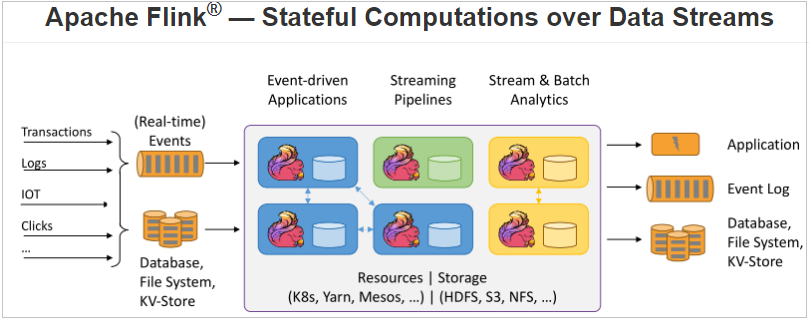
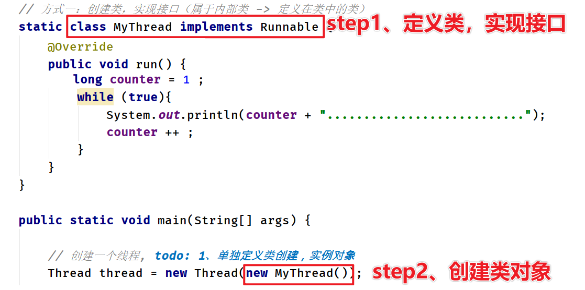
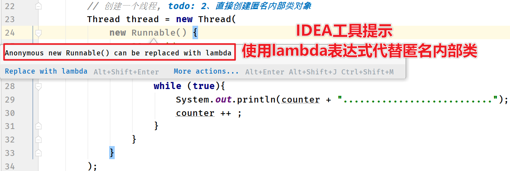
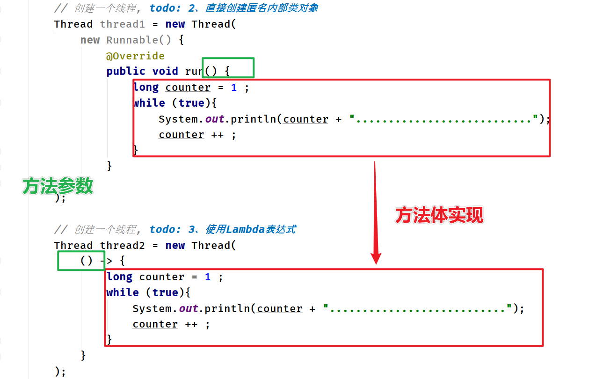

# Flink流批一体API开发

Apache Flink是一个面向分布式数据流处理和批量数据处理的开源计算平台，它能够基于同一个Flink运行时（Flink Runtime），提供支持流处理和批处理两种类型应用的功能。



## 回顾I. Java泛型

> 在Flink中几乎所有处理数据Function函数接口都是**泛型**，**创建子类时需要指定具体类型**。


> 在Java集合类中：`List`列表就是泛型，指定列表存储数据类型；其中`add`方法，接收参数也是泛型，表示接收数据类型。


```Java
package cn.itcast.flink.test;

import java.util.ArrayList;
import java.util.List;

/**
 * Java中列表ArrayList就是泛型类
 */
public class JavaListTest {

	public static void main(String[] args) {
		// 创建列表
		List<String> list = new ArrayList<>() ;

		// 添加数据到列表中
		list.add("hello");
		list.add("world");
		list.add("word");
		list.add("count");

		// 打印数据
		System.out.println(list);
	}

}
```

## 回顾II. Java匿名内部类

> 在Java中OOP中，如果需要**创建接口Interface实现类对象**，有三种方式：**1、单独定义类创建，实例对象**、**2、直接创建匿名内部类对象**、**3、使用Lambda表达式**。


> 以Java中创建线程启动为例，采用不同方式创建Runnable对象。


- 方式1：**单独定义类创建，实例对象**

------



```Java
package cn.itcast.flink.test;

public class JavaThreadTest {

	// 方式一：创建类，实现接口（属于内部类 -> 定义在类中的类）
	static class MyThread implements Runnable {
		@Override
		public void run() {
            long counter = 1 ;
			while (true){
				System.out.println(counter + "...........................");
				counter ++ ;
			}
		}
	}

	public static void main(String[] args) {
		// 创建一个线程, todo: 1、单独定义类创建，实例对象
		Thread thread = new Thread(new MyThread());
		// 启动线程
		thread.start();
	}

}
```

- 方式2：**直接创建匿名内部类对象**

------


- 方式3：**使用Lambda表达式**

------



> 将匿名内部类改为lambda表达式：代码简洁，Java8以后支持特性

```Java
		// 创建一个线程, todo: 3、使用Lambda表达式
		Thread thread = new Thread(
			() -> {
				long counter = 1 ;
				while (true){
					System.out.println(counter + "...........................");
					counter ++ ;
				}
			}
		);
```



