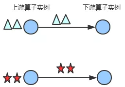
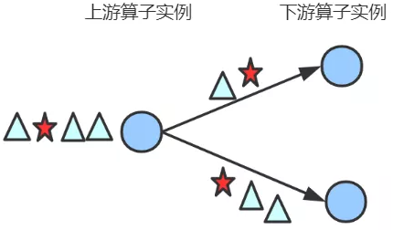
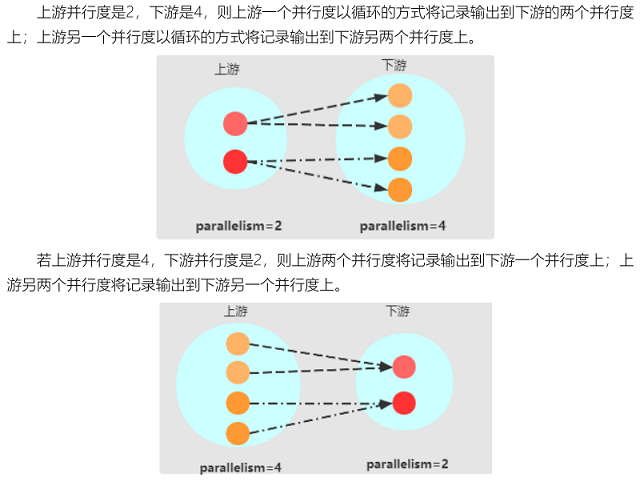
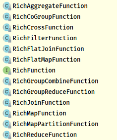
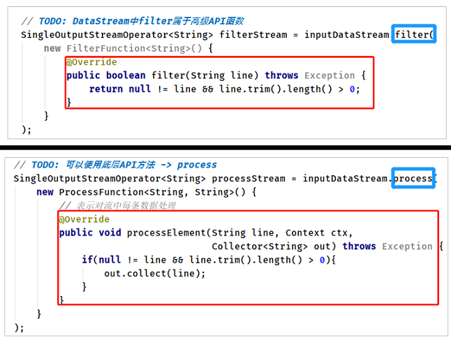
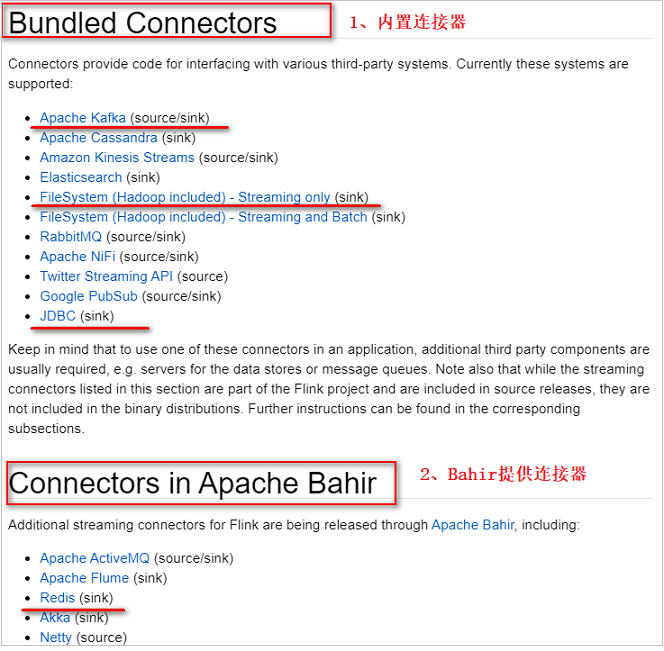

# Flink流批一体&API开发

## -I. ExecutionEnvironment创建方式

> 在Flink 流计算程序中，程序入口：流式执行环境`StreamExecutionEnvironment`，有三种创建方式。


- 第1种：`getExecutionEnvironment`方法，**自动依据当前环境，获取执行环境**


- 第2种：`createLocalEnvironment` 方法，获取本地执行环境，启动1个JVM，运行多个线程


> 无论是`getExecutionEnvironment`还是`createLocalEnvironment`方法在本地模式运行时，创建执行环境，随机生成Web UI界面端口号，可以使用方法：`createLocalEnvironmentWithWebUI`，指定某个端口号，默认为`8081`。


```java
StreamExecutionEnvironment env = StreamExecutionEnvironment.createLocalEnvironmentWithWebUI(new Configuration());
env.setParallelism(2);
```

运行Flink 流计算程序，打开监控页面：


- 第三种：`createRemoteEnvironment` 方法，指定**JobManager**地址，获取远程执行环境，提交应用到集群


> 案例代码演示，针对词频统计WordCount修改，不同方式创建流式执行环境：

```Java
package cn.itcast.flink.start;

import org.apache.flink.api.common.functions.FlatMapFunction;
import org.apache.flink.api.java.tuple.Tuple2;
import org.apache.flink.configuration.Configuration;
import org.apache.flink.streaming.api.datastream.DataStreamSource;
import org.apache.flink.streaming.api.datastream.SingleOutputStreamOperator;
import org.apache.flink.streaming.api.environment.StreamExecutionEnvironment;
import org.apache.flink.util.Collector;

public class WordCountDemo {

	public static void main(String[] args) throws Exception{
		// 1. 执行环境-env
		// TODO: 此种方式，依据运行环境，自动确定创建本地环境还是集群环境
		// StreamExecutionEnvironment env = StreamExecutionEnvironment.getExecutionEnvironment();

		// TODO: 创建本地执行环境，启动一个JVM进程，其中Task任务（SubTask子任务）
		// StreamExecutionEnvironment env = StreamExecutionEnvironment.createLocalEnvironment();

		// TODO: 创建本地执行环境，启动WEB UI界面，默认端口号：8081
		StreamExecutionEnvironment env = StreamExecutionEnvironment.createLocalEnvironmentWithWebUI(new Configuration());
		env.setParallelism(1);

		// 2. 数据源-source
		DataStreamSource<String> inputStream = env.socketTextStream("node1.itcast.cn", 9999);

		// 3. 数据转换-transformation
		SingleOutputStreamOperator<Tuple2<String, Integer>> resultStream = inputStream
			.filter(line -> null != line && line.trim().length() > 0)
			.flatMap(new FlatMapFunction<String, Tuple2<String, Integer>>() {
				@Override
				public void flatMap(String value, Collector<Tuple2<String, Integer>> out) throws Exception {
					String[] words = value.trim().split("\\s+");
					for (String word : words) {
						out.collect(Tuple2.of(word, 1));
					}
				}
			})
			.keyBy(tuple -> tuple.f0)
			.sum("f1");

		// 4. 数据接收器-sink
		resultStream.printToErr();

		// 5. 触发执行-execute
		env.execute("Flink Stream WordCount");
	}

}
```

## I. DataStream Operators

### 1. Physical Partitioning

> 在Flink流计算中DataStream提供一些列分区函数


> 在DataStream函数中提供7种方式，具体如下所示：


- 第一、GlobalPartitioner

> 分区器功能：会**将所有的数据都发送到下游的某个算子实例**(subtask id = 0)。


- 第二、BroadcastPartitioner

> 分区器功能：发送到下游**所有**的算子实例。


- 第三、ForwardPartitioner

> 分区器功能：发送到下游对应的第1个task，保证上下游算子并行度一致，即**上游算子与下游算子是1:1关系**。



[在上下游的算子没有指定分区器的情况下，如果上下游的算子并行度一致，则使用ForwardPartitioner，否则使用RebalancePartitioner，对于ForwardPartitioner，必须保证上下游算子并行度一致，否则会抛出异常]()

- 第四、ShufflePartitioner

> 分区器功能：**随机选择**一个下游算子实例进行发送



- 第五、RebalancePartitioner

> 分区器功能：通过**循环**的方式依次发送到下游的task。


> [在Flink批处理中（离线数据分析中），如果数据倾斜，直接调用`rebalance`函数，将数据均衡分配。]()


- 第六、RescalePartitioner

> 分区器功能：基于上下游Operator并行度，将记录以循环的方式输出到下游Operator每个实例。



> 案例代码演示：DataStream中各种数据分区函数使用

```java
package cn.itcast.flink.transformation;

import org.apache.flink.api.common.functions.Partitioner;
import org.apache.flink.api.java.tuple.Tuple2;
import org.apache.flink.configuration.Configuration;
import org.apache.flink.streaming.api.datastream.DataStream;
import org.apache.flink.streaming.api.datastream.DataStreamSource;
import org.apache.flink.streaming.api.environment.StreamExecutionEnvironment;
import org.apache.flink.streaming.api.functions.source.RichParallelSourceFunction;

import java.util.Random;
import java.util.concurrent.TimeUnit;

/**
 * Flink 流计算中转换函数：对流数据进行分区，函数如下：
 *      global、broadcast、forward、shuffle、rebalance、rescale、partitionCustom
 */
public class _13StreamPartitionDemo {

	public static void main(String[] args) throws Exception {
		// 1. 执行环境-env
		StreamExecutionEnvironment env = StreamExecutionEnvironment.createLocalEnvironmentWithWebUI(new Configuration());
		env.setParallelism(1);

		// 2. 数据源-source
		DataStreamSource<Tuple2<Integer, String>> dataStream = env.addSource(
			new RichParallelSourceFunction<Tuple2<Integer, String>>() {
				private boolean isRunning = true ;

				@Override
				public void run(SourceContext<Tuple2<Integer, String>> ctx) throws Exception {
					int index = 1 ;
					Random random = new Random();
					String[] chars = new String[]{
						"A", "B", "C", "D", "E", "F", "G", "H", "I", "J", "K", "L", "M", "N", "O",
						"P", "Q", "R", "S", "T", "U", "V", "W", "X", "Y", "Z"
					};
					while (isRunning){
						Tuple2<Integer, String> tuple = Tuple2.of(index, chars[random.nextInt(chars.length)]);
						ctx.collect(tuple);

						TimeUnit.SECONDS.sleep(2);
						index ++ ;
					}
				}

				@Override
				public void cancel() {
					isRunning = false ;
				}
			}
		);
		//dataStream.printToErr();

		// 3. 数据转换-transformation
		// TODO: 1、global函数，将所有数据发往1个分区Partition
		DataStream<Tuple2<Integer, String>> globalDataStream = dataStream.global();
		//globalDataStream.print().setParallelism(3);

		// TODO: 2、broadcast函数， 广播数据
		DataStream<Tuple2<Integer, String>> broadcastDataStream = dataStream.broadcast();
		//broadcastDataStream.printToErr().setParallelism(3);

		// TODO: 3、forward函数，上下游并发一样时 一对一发送
		//DataStream<Tuple2<Integer, String>> forwardDataStream = dataStream.setParallelism(3).forward();
		//forwardDataStream.print().setParallelism(3) ;

		// TODO: 4、shuffle函数，随机均匀分配
		DataStream<Tuple2<Integer, String>> shuffleDataStream = dataStream.shuffle();
		//shuffleDataStream.printToErr().setParallelism(3);

		// TODO: 5、rebalance函数，轮流分配
		DataStream<Tuple2<Integer, String>> rebalanceDataStream = dataStream.rebalance();
		//rebalanceDataStream.print().setParallelism(3) ;

		// TODO: 6、rescale函数，本地轮流分配
//		DataStream<Tuple2<Integer, String>> rescaleDataStream = dataStream.setParallelism(4).rescale();
//		rescaleDataStream.printToErr().setParallelism(2);

		// TODO: 7、partitionCustom函数，自定义分区规则
		DataStream<Tuple2<Integer, String>> customDataStream = dataStream.partitionCustom(
			new Partitioner<Integer>() {
				@Override
				public int partition(Integer key, int numPartitions) {
					return key % 2;
				}
			},
			tuple -> tuple.f0
		);
		customDataStream.printToErr().setParallelism(2);

		// 4. 数据终端-sink

		// 5. 触发执行-execute
		env.execute("StreamRepartitionDemo");
	}
}
```

### 2. RichFunction

> “==富函数==”是DataStream API提供的一个函数类的接口，==所有Flink函数类都有其Rich版本==。它与常规函数的不同在于，可以**获取运行环境的上下文，并拥有一些生命周期方法**，所以可以实现更复杂的功能。



> `RichFunction`有一个生命周期的概念，典型的生命周期方法有：`open`和`close` 方法。


- `open()`方法：
  - rich function的初始化方法，当一个算子例如map或者filter被调用之前open()会被调用。
- `close()`方法：
  - 生命周期中的最后一个调用的方法，做一些清理工作。
- `getRuntimeContext()`方法：
  - 提供了函数的RuntimeContext的一些信息，例如函数执行的并行度，任务的名字，以及state状态。

> **案例代码演示**：从Socket读取数据，将字符串类型值，转换保存2位小数Double数值。


测试数据：

```ini
DataStream<String> inputStream = env.fromElements("0.124444", "0.899999", "0.345612", "0.870001");
```

具体代码如下：

```java
package cn.itcast.flink.transformation;

import org.apache.flink.api.common.functions.MapFunction;
import org.apache.flink.api.common.functions.RichMapFunction;
import org.apache.flink.configuration.Configuration;
import org.apache.flink.streaming.api.datastream.DataStream;
import org.apache.flink.streaming.api.datastream.DataStreamSource;
import org.apache.flink.streaming.api.datastream.SingleOutputStreamOperator;
import org.apache.flink.streaming.api.environment.StreamExecutionEnvironment;

import java.text.DecimalFormat;

public class _02StreamRichDemo {

	public static void main(String[] args) throws Exception{
		// 1. 执行环境-env
		StreamExecutionEnvironment env = StreamExecutionEnvironment.createLocalEnvironmentWithWebUI(new Configuration()) ;
		env.setParallelism(1);

		// 2. 数据源-source
		DataStreamSource<String> inputStream = env.fromElements("0.124444", "0.899999", "0.345612", "0.870001");

		// 3. 数据转换-transformation
		// TODO: 使用map函数处理流中每条数据
		DataStream<String> mapStream = inputStream.map(new MapFunction<String, String>() {
			DecimalFormat format = new DecimalFormat("#0.00");
			@Override
			public String map(String value) throws Exception {
				return format.format(Double.parseDouble(value));
			}
		});
		mapStream.print("map>");

		// TODO: 使用richMap函数，处理流中每条数据
		SingleOutputStreamOperator<String> richStream = inputStream.map(new RichMapFunction<String, String>() {
			DecimalFormat format = null ;

			@Override
			public void open(Configuration parameters) throws Exception {
				System.out.println("invoke：open() ............................");
				format = new DecimalFormat("#0.00");
			}

			@Override
			public String map(String value) throws Exception {
				return format.format(Double.parseDouble(value));
			}

			@Override
			public void close() throws Exception {
				System.out.println("invoke：close() ............................");
			}
		});
		richStream.printToErr("rich>");

		// 4. 数据接收器-sink
		// 5. 触发执行-execute
		env.execute("StreamRichDemo") ;
	}

}
```

执行程序，结果如下截图：


### 3. ProcessFunction

> [Flink DataStream API中最底层API，提供`process`方法，其中需要实现`ProcessFunction`函数]()


> 查看抽象类：`ProcessFunction`源码，最主要方法：`processElement`，对流中每条数据进行处理。


> 案例演示：使用`process`函数，代替filter函数，实现对数据过滤操作。



```java
package cn.itcast.flink.transformation;

import org.apache.flink.api.common.functions.FilterFunction;
import org.apache.flink.streaming.api.datastream.DataStreamSource;
import org.apache.flink.streaming.api.datastream.SingleOutputStreamOperator;
import org.apache.flink.streaming.api.environment.StreamExecutionEnvironment;
import org.apache.flink.streaming.api.functions.ProcessFunction;
import org.apache.flink.util.Collector;

/**
 * 使用Flink 计算引擎实现流式数据处理：从Socket接收数据，对数据进行过滤【filter】和【process】
 */
public class _03StreamFilterDemo {

	public static void main(String[] args) throws Exception {
		// 1. 执行环境-env
		StreamExecutionEnvironment env = StreamExecutionEnvironment.getExecutionEnvironment();
		env.setParallelism(1) ;

		// 2. 数据源-source
		DataStreamSource<String> inputStream = env.socketTextStream("node1.itcast.cn", 9999);

		// 3. 数据转换-transformation
		// TODO: DataStream中filter属于高级API函数
		SingleOutputStreamOperator<String> filterStream = inputStream.filter(
			new FilterFunction<String>() {
				@Override
				public boolean filter(String line) throws Exception {
					return null != line && line.trim().length() > 0;
				}
			}
		);
		filterStream.printToErr("filter>");

		// TODO: 可以使用底层API方法 -> process
		SingleOutputStreamOperator<String> processStream = inputStream.process(
			new ProcessFunction<String, String>() {
				@Override
				public void processElement(String line, Context ctx, Collector<String> out) throws Exception {
					if(null != line && line.trim().length() > 0){
						out.collect(line);
					}
				}
			}
		);
		processStream.printToErr("process>");

		// 4. 数据接收器-sink
		// 5. 执行应用-execute
		env.execute("StreamProcessDemo");
	}

}

```

> ​		在词频统计案例中，使用`filter/flatMap/map`三个方法处理DataStream数据，可以直接使用`process`方法完成。

```java
package cn.itcast.flink.transformation;

import org.apache.flink.api.common.functions.FilterFunction;
import org.apache.flink.api.common.functions.FlatMapFunction;
import org.apache.flink.api.common.functions.MapFunction;
import org.apache.flink.api.java.tuple.Tuple2;
import org.apache.flink.streaming.api.datastream.DataStream;
import org.apache.flink.streaming.api.datastream.DataStreamSource;
import org.apache.flink.streaming.api.environment.StreamExecutionEnvironment;
import org.apache.flink.streaming.api.functions.ProcessFunction;
import org.apache.flink.util.Collector;

/**
 * 使用Flink 计算引擎实现流式数据处理：从Socket接收数据，使用process方法数据处理
 */
public class _04StreamProcessDemo {

	public static void main(String[] args) throws Exception {
		// 1. 执行环境-env
		StreamExecutionEnvironment env = StreamExecutionEnvironment.getExecutionEnvironment();
		env.setParallelism(1) ;

		// 2. 数据源-source
		DataStreamSource<String> inputStream = env.socketTextStream("node1.itcast.cn", 9999);

		// 3. 数据转换-transformation
		DataStream<Tuple2<String, Integer>> tupleStream = inputStream
			// 3-1 过滤脏数据
			.filter(new FilterFunction<String>() {
				@Override
				public boolean filter(String line) throws Exception {
					return null != line && line.trim().length() > 0;
				}
			})
			// 3-2 将每行数据按照分隔符分割为单词
			.flatMap(new FlatMapFunction<String, String>() {
				@Override
				public void flatMap(String line, Collector<String> out) throws Exception {
					for (String word : line.trim().split("\\s+")) {
						out.collect(word);
					}
				}
			})
			// 3-3 转换每个单词为二元组，表示单词出现一次
			.map(new MapFunction<String, Tuple2<String, Integer>>() {
				@Override
				public Tuple2<String, Integer> map(String word) throws Exception {
					return Tuple2.of(word, 1);
				}
			});
		tupleStream.printToErr("filter-flatMap-map>");

		// TODO: 可以使用底层API方法 -> process
		DataStream<Tuple2<String, Integer>> processStream = inputStream.process(
			new ProcessFunction<String, Tuple2<String, Integer>>() {
				@Override
				public void processElement(String line, Context ctx, Collector<Tuple2<String, Integer>> out) throws Exception {
					// a. 过滤获取符合条件的数据
					if(null != line && line.trim().length() > 0){
						// b. 分割单词
						String[] words = line.trim().split("\\s+");
						// c. 转换二元组并输出
						for (String word : words) {
							out.collect(Tuple2.of(word, 1));
						}
					}
				}
			}
		);
		processStream.printToErr("process>");

		// 4. 数据终端-sink
		// 5. 执行应用-execute
		env.execute("StreamProcessDemo");
	}

}
```

## II. DataStream Connector

### 1. Kafka Connector

> 在Flink框架中，专门为一些存储系统提供**Connector连接器**，方便用户进行**读取**数据（Data Source 数据源）和**保存**数据(Data Sink数据接收器）。

https://nightlies.apache.org/flink/flink-docs-release-1.13/docs/connectors/datastream/overview/



> Kafka Connector连接器，既可以作为==数据源Source==加载数据，又可以作为==数据接收器Sink==保存数据。


> 使用Kafka Connector连接器，添加Maven 依赖：

```xml
<dependency>
    <groupId>org.apache.flink</groupId>
    <artifactId>flink-connector-kafka_2.11</artifactId>
    <version>1.13.1</version>
</dependency>
```

> 在Kafka Connector连接器中提供Source数据源和Sink接收器类，在**Flink 1.12**版本中提供基于新的类从Kafka消费数据：`KafkaSource`。


## III. 批处理高级特性


## 附I.  Maven模块创建


## 附II. Redis Hash数据类型