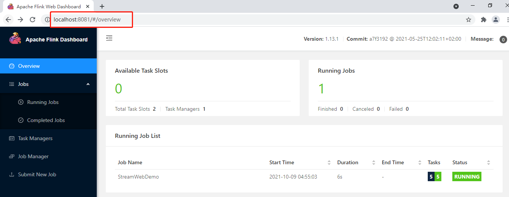

# Flink流批一体&API开发

## -I. ExecutionEnvironment创建方式

> 在Flink 流计算程序中，程序入口：流式执行环境`StreamExecutionEnvironment`，有三种创建方式。


- 第1种：`getExecutionEnvironment`方法，**自动依据当前环境，获取执行环境**


- 第2种：`createLocalEnvironment` 方法，获取本地执行环境，启动1个JVM，运行多个线程


> 无论是`getExecutionEnvironment`还是`createLocalEnvironment`方法在本地模式运行时，创建执行环境，随机生成Web UI界面端口号，可以使用方法：`createLocalEnvironmentWithWebUI`，指定某个端口号，默认为`8081`。


```java
StreamExecutionEnvironment env = StreamExecutionEnvironment.createLocalEnvironmentWithWebUI(new Configuration());
env.setParallelism(2);
```

运行Flink 流计算程序，打开监控页面：



- 第三种：`createRemoteEnvironment` 方法，指定**JobManager**地址，获取远程执行环境，提交应用到集群


> 案例代码演示，针对词频统计WordCount修改，不同方式创建流式执行环境：

```Java
package cn.itcast.flink.start;

import org.apache.flink.api.common.functions.FlatMapFunction;
import org.apache.flink.api.java.tuple.Tuple2;
import org.apache.flink.configuration.Configuration;
import org.apache.flink.streaming.api.datastream.DataStreamSource;
import org.apache.flink.streaming.api.datastream.SingleOutputStreamOperator;
import org.apache.flink.streaming.api.environment.StreamExecutionEnvironment;
import org.apache.flink.util.Collector;

public class WordCountDemo {

	public static void main(String[] args) throws Exception{
		// 1. 执行环境-env
		// TODO: 此种方式，依据运行环境，自动确定创建本地环境还是集群环境
		// StreamExecutionEnvironment env = StreamExecutionEnvironment.getExecutionEnvironment();

		// TODO: 创建本地执行环境，启动一个JVM进程，其中Task任务（SubTask子任务）
		// StreamExecutionEnvironment env = StreamExecutionEnvironment.createLocalEnvironment();

		// TODO: 创建本地执行环境，启动WEB UI界面，默认端口号：8081
		StreamExecutionEnvironment env = StreamExecutionEnvironment.createLocalEnvironmentWithWebUI(new Configuration());
		env.setParallelism(1);

		// 2. 数据源-source
		DataStreamSource<String> inputStream = env.socketTextStream("node1.itcast.cn", 9999);

		// 3. 数据转换-transformation
		SingleOutputStreamOperator<Tuple2<String, Integer>> resultStream = inputStream
			.filter(line -> null != line && line.trim().length() > 0)
			.flatMap(new FlatMapFunction<String, Tuple2<String, Integer>>() {
				@Override
				public void flatMap(String value, Collector<Tuple2<String, Integer>> out) throws Exception {
					String[] words = value.trim().split("\\s+");
					for (String word : words) {
						out.collect(Tuple2.of(word, 1));
					}
				}
			})
			.keyBy(tuple -> tuple.f0)
			.sum("f1");

		// 4. 数据接收器-sink
		resultStream.printToErr();

		// 5. 触发执行-execute
		env.execute("Flink Stream WordCount");
	}

}
```

## I. DataStream Operators


## II. DataStream Connector


## III. 批处理高级特性


## 附I.  Maven模块创建


## 附II. Redis Hash数据类型