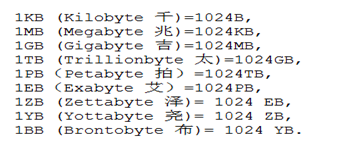
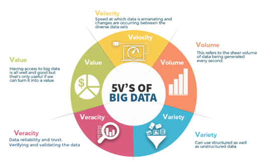

# Hadoop离线：大数据导论与Apache Zookeeper

## I. 大数据导论

1. ### 数据与数据分析

   >**数据(data)是事实或观察的结果,是对客观事务的逻辑归纳,是用于表示客观事物的未经加工的源氏素材**

   通过对客观事件进行计量和记录就会产生数据

   - 数据分析

     数据分析就是通过工具或者方法把隐藏在数据背后的规律和价值提取处理的过程

   - 数据分析的目的(在商业中)

     ```shell
     数据分析的结果给企业的决策提供支撑, 支持决策
     数据仓库的出现也是集成的数据分析平台, 分析的结果支撑决策
     ```

2. ### 数据分析作用和方向（商业领域）

   > 各行各业都可能需要站看数据分析, 我们重点关注商业领域
   >
   > A. 原因分析--对应历史数据
   >
   > B. 现状分析--对应当下数据
   >
   > C. 预测分析--结合数据预测未来

   - #### 离线分析(batch processing 批处理)

     ```shell
     分析已有的数据（历史数据），面向过去分析。
     在时间维度明显成批次性变化。 一周一分析（T+7), 一天一分析（T+1）
     ```

   - #### 实时分析(real time processing, streaming 流处理)

     ```bash
     分析实时产生的数据，面向当下分析
     所谓的实时是指从数据产生到分析到应用的时间间隔在秒级（spark streaming）和毫秒级（storm flink）
     ```

   - #### 机器学习(machine learning, ML)

     ```bash
     基于历史数据和当下产生的实时数据预测未来发生的事情。
     侧重于数学算法的运用。
     分类、聚类、关联、预测。
     ```

3. ### 数据分析的基本步骤

   1. #### 明确分析的目的和思路

      ```shell
      目的：分析方向、分析的主题、数据分析要解决什么问题
      
      思路：如何去开展数据分析，关键分析具有体系
      
      体系化也就是逻辑化：先分析什么、后分析什么，使各个分析点之间具有逻辑练习。
      
      需要营销、管理类理论进行支撑，称为数据分析方法论。偏向于战略层面从宏观角度指导。
      ```

   2. #### 数据收集

      ```shell
      企业常见数据源：
      1. 业务数据（RDBMS 关系型数据库，如MySQL、Oracle）
      
      2. 日志数据、日志文件（服务器日志、应用日志、用户行为日志）
      
      3. 爬虫数据
      
      4. 其他数据
      ```

   3. #### 数据预处理

      ```shell
      大数据青睐结构化数据
      
      所谓结构化数据指的是schema约束信息的数据，也就是易于程序处理解读的数据。
      
      半结构化数据（json，xml）
      
      经过数据预处理把数据变成干净规则统一整洁的结构化数据
      ```

   4. #### 数据分析

      利用技术和软件，基于指标开展分析

   5. #### 数据应用

      ```shell
      分析的结果可以用于：
      数据展现、数据可视化
      即席查询
      数据挖掘
      数据接口对外
      ```

4. ### 大数据时代

   - #### 概念

     数据，已经渗透到当今每一个行业和业务职能领域，成为重要的生产因素。人们对于海量数据的挖掘和运用，预示着新一波生产率增长和消费者盈余浪潮的到来。

   - #### 海量数据的挑战

     公开数据显示，互联网搜索巨头百度2013年拥有数据量接近EB级别。阿里、腾讯都声明自己存储的数据总量都达到了百PB以上。此外，电信、医疗、金融、公共安全、交通、气象等各个方面保存的数据量也都达到数十或者上百PB级别。全球数据量以每两年翻倍的速度增长,在2010年已经正式进入ZB时代，2020年全球数据总量达到44ZB。

          

     究竟怎么去存储庞大的数据，是企业面临的首要问题。传统的数据存储模式存储容量是有大小限制或者空间限制的，怎么去设计出一个可以支撑大量数据的存储方案是开展数据分析的首要前提。

     解决了海量数据的存储问题，接下来面临的海量数据的计算问题也是比较让人头疼，因为企业不仅追求可以计算，还会追求计算的速度、效率。

     以目前互联网行业产生的数据量级别，要处理这些数据，就需要一个更好、更便捷的分析计算方式了。传统的数据处理方式显然力不从心，而且效率也会非常低下。这正是传统数据分析领域面临的另一个挑战，如何去分析、计算海量数据。

     1. ##### 如何存储海量数据

     2. ##### 如何高效计算海量数据

   - #### 5V特征

     

     ##### Volume：数据量大，包括采集、存储和计算的量都非常大；

     ##### Variety：种类和来源多样化。包括结构化、半结构化和非结构化数据；

     ##### Value：数据价值密度相对较低，或者说是浪里淘沙却又弥足珍贵；

     ##### Velocity：数据增长速度快，处理速度也快，时效性要求高；

     ##### Veracity：数据的准确性和可信赖度，即数据的质量。

   - #### 大数据应用

     电商领域、传媒领域、金融领域、交通领域、电信领域、安防领域、医疗领域

5. ### 分布式与集群

   - 共同点：==__多台机器__==

   - 不同点：

     - 集群：每台机器上的服务是一样的
     - 分布式：每台机器上的服务、组件是不一样的

   - 如何存储海量数据：分布式存储

   - 如何计算海量数据：分布式计算

   - 如何区分“大数据”和“云计算”两个名词：

     ```shell
     大数据侧重于海量数据的分析
     
     云计算是侧重于硬件资源的虚拟机技术
     ```

   - 主从架构集群（master/slave架构）

     ```shell
     #指的是集群中的角色分类。分为两类：主角色，从角色。
     
     主角色：master(主宰; 主人; 有控制力的人)  、leader 、大哥
     从角色：slave(奴隶)                    、follower、小弟
     
     作用:主从角色各司其职，互相共同配合 对外提供完整的服务。
     
     对于主从架构，常见的是一主多从。也就是所谓的一个大哥带领多个小弟。
     ```

   - 准备架构集群（active/standby架构）

     ```shell
     #解决单点故障问题。 所谓的单点故障指的是一个服务当中某个组件出现故障，导致整体服务不可用。
     局部故障导致整体不可用。
     
     主角色： active（活跃的角色）
     备份角色：standby(备用物品; 后备人员)
     
     对于主备架构，常见的是一主一备。也可以一主多备，浪费资源。
     ```

## II. Apache Zookeeper

1. ### 概念介绍

   - zookeeper是一个分布式的==协调服务==软件（distributed ==**coordination**==）。

     ```
     分布式：多台机器的环境。
     
     协调服务：在分布式环境下，如何控制大家有序的去做某件事。
     	顺序
     	一致
     	共同
     	共享
     ```

   - zookeeper的本质：==分布式的小文件存储系统==

     - 存储系统：存储数据、存储文件   目录树结构
     - 小文件：上面存储的数据有大小限制  
     - 分布式：可以部署在多台机器上运行，对比单机来理解。
     - 问题：zk这个存储系统和我们常见的存储系统不一样。基于这些不一样产生了很多应用。

   - zookeeper是一个标准的==主从架构==集群。

     - 主角色  ==leader==

       ```
       事务性请求的唯一调度和处理者
       ```

     - 从角色 ==follower==

       ```
       处理非事务性操作  转发事务性操作给leader
       参与zk内部选举机制
       ```

     - 观察者角色 ==Observer==

       ```
       处理非事务性操作  转发事务性操作给leader
       不参与zk内部选举机制
       
       通俗话：是一群被剥夺政治权利终身的follower。
       ```

2. ### 全局数据一致性

   

   ```
   zk集群中每个服务器保存一份相同的数据副本，客户端无论连接到哪个服务器，展示的数据都是一致的，这是最重要的特征。
   ```

3. ### zk集群的搭建

   - #### zk集群在搭建部署的时候，通常选择==**2n+1**==奇数台。底层 Paxos 算法支持（过半成功）。

   - #### zk部署之前，保证服务器基础环境正常、==JDK成功安装==。

     - 服务器基础环境

       ```
       IP
       主机名
       hosts映射
       防火墙关闭
       时间同步
       ssh免密登录
       ```

     - JDK环境

       ```
       jdk1.8
       配置好环境变量
       ```

   - #### zk具体安装部署（选择node1安装 scp给其他节点）

     - ##### 安装包

       http://archive.apache.org/dist/

       ```
       zookeeper-3.4.6.tar.gz
       ```

     - ##### 上传解压重命名

       ```shell
       cd /export/server
       
       tar zxvf zookeeper-3.4.6.tar.gz
       mv zookeeper-3.4.6/ zookeeper
       
       ```

     - ##### 修改配置文件

       - ==**zoo.cfg**==

         ```shell
         #zk默认加载的配置文件是zoo.cfg 因此需要针对模板进行修改。保证名字正确。
         cd zookeeper/conf
         mv zoo_sample.cfg zoo.cfg
         
         vi zoo.cfg
         
         #修改
         dataDir=/export/data/zkdata
         #文件最后添加 2888心跳端口 3888选举端口
         server.1=node1:2888:3888
         server.2=node2:2888:3888
         server.3=node3:2888:3888
         ```

       - 扩展：心跳机制  

         - 分布式软件中从角色向主角色进行心跳 heartbeat
         - 目的：==报活==

       - ==myid==

         ```shell
         #在每台机器的dataDir指定的目录下创建一个文件 名字叫做myid
         #myid里面的数字就是该台机器上server编号。server.N  N的数字就是编号
         [root@node1 conf]# mkdir -p /export/data/zkdata
         [root@node1 conf]# echo 1 >/export/data/zkdata/myid
         ```

     - ##### 把安装包同步到其他节点上

     ```shell
       cd /export/server
     scp -r zookeeper/ node2:$PWD
       scp -r zookeeper/ node3:$PWD
     ```

     - ##### 创建其他机器上myid和datadir目录

       ```shell
       [root@node2 ~]# mkdir -p /export/data/zkdata
       [root@node2 ~]# echo 2 > /export/data/zkdata/myid 
       
       [root@node3 ~]# mkdir -p /export/data/zkdata
       [root@node3 ~]# echo 3 > /export/data/zkdata/myid
       ```

4. ### zk集群的启停、进程查看与日志查看

   zk集群的启动

   - 每台机器上单独启动服务

     ```shell
     #在哪个目录执行启动命令 默认启动日志就生成当前路径下 叫做zookeeper.out
     
     /export/server/zookeeper/bin/zkServer.sh  start|stop|status
     
     #3台机器启动完毕之后 可以使用status查看角色是否正常。
     #还可以使用jps命令查看zk进程是否启动。
     [root@node3 ~]# jps
     2034 Jps
     1980 QuorumPeerMain  #看我，我就是zk的java进程
     ```

   - 扩展：编写shell脚本 一键脚本启动。

     - 本质：在node1机器上执行shell脚本，由==shell程序通过ssh免密登录==到各个机器上帮助执行命令。

     - 一键关闭脚本

       ```shell
       [root@node1 ~]# vim stopZk.sh
         
       #!/bin/bash
       hosts=(node1 node2 node3)
       for host in ${hosts[*]}
       do
        ssh $host "/export/server/zookeeper/bin/zkServer.sh stop"
       done
       ```

     - 一键启动脚本

       ```shell
       [root@node1 ~]# vim startZk.sh
         
       #!/bin/bash
       hosts=(node1 node2 node3)
       for host in ${hosts[*]}
       do
        ssh $host "source /etc/profile;/export/server/zookeeper/bin/zkServer.sh start"
       done
       ```

     - 注意：关闭java进程时候 根据进程号 直接杀死即可就可以关闭。启动java进程的时候 需要JDK。

     - shell程序ssh登录的时候不会自动加载/etc/profile 需要shell程序中自己加载。

5. ### zk的数据模型

   

   ```properties
   永久节点（PERSISTENCE）
   临时节点（EPHEMERAL）
   永久节点序列化（PERSISTENCE_SEQUENTIAL）
   临时节点序列化（EPHEMERAL_SEQUENTIAL）
   ```

6. ### zk操作（shell命令行）

7. ### zk监听机制

8. ### zk典型应用场景

大数据导论


数据分析：用一些手段将数据进行处理后产生价值，寻找数据规律，帮助企业进行判断和决策

天气预报就是典型的数据分析得到结果指导百姓决策

数据分析作用：企业日常经营中主要有三大作用：现状分析、原因分析、预测分析

现状分析：分析当下数据，各个部分的构成占比、发展、变动

原因分析：分析过去数据，某一现状为什么发生，确定原因，作出调整优化

预测分析：结合数据预测未来发展趋势

离线分析：batch processing，批处理：面向历史，分析已有的数据，在时间维度明显呈批次性变化。一周一分析（T+7)，一天一分析（T+1），所以也叫做批处理

 实时分析：streaming，流处理分析实时产生的数据，指从数据产生到数据分析到数据应用的时间间隔很短，可细分秒级、毫秒级

双十一大屏、股票、广告推荐、

机器学习：侧重于数学算法的运用，如分类、聚类、关联、预测

数据分析六步骤：明确分析目的和思路，数据收集，数据处理，数据分析，数据展现，报告撰写

明确分析目的和思路：整个分析流程的起点，为数据的收集、处理及分析提供清晰的指引方向

数据收集：数据从无到有的过程（传感器收集气象数据，埋点收集用户行为数据）、数据传输搬运的过程（采集数据库数据到数据分析平台）

数据处理：应该称之为数据预处理，主要包括数据清洗（ETL抽取转换加载）、数据转化、数据提取、数据计算，数据预处理可以保证数据的一致性和有效性，让数据编程干净规整的结构化数据

数据分析：应用适当的分析方法及工具，对处理过的数据进行分析，提取有价值的信息，形成有效结论的过程；需要掌握各种数据分析方法，还要熟悉数据分析软件的操作；数据挖掘本质是一种高级的数据分析方法，侧重解决四类数据分析问题：分类、聚类、关联和预测，重点在寻找模式和规律

数据展现：数据可视化，指的是分析结果图表展示，数据可视化属于数据应用的一种，数据分析的结果不只有数据可视化，还可以继续数据挖掘，即席查询等

报告撰写：数据分析报告是对整个数据分析过程的一个总结与呈现；把数据分析的起因、过程、结果及建议完整的呈现出来，供决策者参考；需要有明确的结论，最好有建议或解决方案

一切围绕着数据，数据从哪里来，数据到哪里去，核心步骤：采集、处理、分析、应用

数据源、采集数据、存储数据、处理数据、数据分析、结果存储、数据可视化

大数据是指无法在一定时间范围内用常规软件工具进行捕捉、管理和处理的数据集合

5V'S OF BIG DATA: Velocity（速度快），Volume（数据体量大），Variety（种类、来源多样化），Veracity（数据质量），Value（低价值密度）

大数据应用场景：电商领域：精准广告投放、个性化推荐、大数据杀熟；传媒领域：精准营销、猜你喜欢、交互推荐；金融领域；交通领域；电信领域；安防领域；医疗领域

分布式：负载均衡

zookeeper：为分布式做协调服务的开源框架

协调服务：帮忙解决两者（或多方）之间的矛盾；协助调解；类似于红绿灯协调大家有序通过路口

zookeeper本质上是一个分布式的小文件存储系统

zk是典型主从架构集群

# zk全局数据一致性

zk集群中每个服务器保存一份相同的数据副本，客户端无论连接到哪个服务器，展示的数据都是一致的，只是最重要的特征

读操作为非事务性操作，主从角色都可以直接处理该操作，直接返回结果给客户端

写操作为事务性操作，从角色接收到写操作，内部转发个leader，由leader全局统一编号，顺序执行


## 永久节点，临时节点，永久序列化节点，临时序列化节点

-e：临时节点

-s：序列化

1. 客户端向服务端发送请求，建立session会话
2. 客户端可以对znode进行读写操作
3. 断开session会话

永久节点：当session会话断开的时候，这个节点不会被删除

临时节点：当session会话断开的时候，这个节点就会被删除


永久（临时）序列化节点：排序0000000001

临时节点不允许拥有子节点


znode由3部分组成：

​	stat：状态信息，描述Znode的版本，权限等信息

​	data：与该Znode关联的数据

​	children：该Znode下的子节点


# 监听机制：

客户端监听zk服务

监听zk目录树znode的变化情况（如znode增加删除了、节点数据变化了、子节点变化

监听实现步骤：

1. zk客户端设置监听，然后zk服务执行监听
2. 事件发生，满足条件触发监听
3. zk服务把监听的事件回调（callback）通知给客户端

监听设置的都是一些读操作


顺序锁