# Hive函数高阶应用及性能调优

## I. Hive函数高阶

### 1. UDTF之explode函数

#### 1.1. explode语法功能

Hive当中内置的一个非常著名的UDTF函数，名字叫做**explode函数**，中文戏称之为“爆炸函数”，可以"**炸开**"数据。

explode函数接收map或者array类型的数据作为参数，然后把参数中的每个元素炸开变成一行数据。一个元素一行。这样的效果正好满足于输入一行输出多行。

explode函数在关系型数据库中本身是不该出现的。

因为他的出现本身就是在操作不满足第一范式的数据（每个属性都不可再分）。本身已经违背了数据库的设计原理，但是在面向分析的数据库或者数据仓库中，这些规范可以发生改变。

```shell
explode(a) - separates the elements of array a into multiple rows, or the elements of a map into multiple rows and columns 
```


explode(array)将array列表里的每个元素生成一行；

explode(map)将map里的每一对元素作为一行，其中key为一列，value为一列；

一般情况下，explode函数可以直接使用即可，也可以根据需要结合**lateral view侧视图**使用。

#### 1.2. explode函数的使用

```sql
select explode(`array`(11,22,33)) as item;

select explode(`map`("id",10086,"name","zhangsan","age",18));
```


#### 1.3. 案例: NBA总冠军球队名单

##### 业务需求

数据"The_NBA_Championship.txt"关于部分年份的NBA总冠军球队名单:

```txt
Chicago Bulls,1991|1992|1993|1996|1997|1998
San Antonio Spurs,1999|2003|2005|2007|2014
Golden State Warriors,1947|1956|1975|2015
Boston Celtics,1957|1959|1960|1961|1962|1963|1964|1965|1966|1968|1969|1974|1976|1981|1984|1986|2008
L.A. Lakers,1949|1950|1952|1953|1954|1972|1980|1982|1985|1987|1988|2000|2001|2002|2009|2010
Miami Heat,2006|2012|2013
Philadelphia 76ers,1955|1967|1983
Detroit Pistons,1989|1990|2004
Houston Rockets,1994|1995
New York Knicks,1970|1973
```

第一个字段表示的是球队名称，第二个字段是获取总冠军的年份，**字段之间以，分割**；

获取总冠军**年份之间以|进行分割**。

需求：使用Hive建表映射成功数据，对数据拆分，要求拆分之后数据如下所示：


并且最好根据年份的倒序进行排序。

##### 代码实现

```sql
--step1:建表
create table the_nba_championship(
    team_name string,
    champion_year array<string>
) row format delimited
fields terminated by ','
collection items terminated by '|';

--step2:加载数据文件到表中
load data local inpath '/root/hivedata/The_NBA_Championship.txt' into table the_nba_championship;

--step3:验证
select *
from the_nba_championship;
```


使用explode函数:

```sql
--step4:使用explode函数对champion_year进行拆分 俗称炸开
select explode(champion_year) from the_nba_championship;

-- select team_name,explode(champion_year) from the_nba_championship;
```


##### explode使用限制

在select条件中，如果只有explode函数表达式，程序执行是没有任何问题的；

但是如果在select条件中，包含explode和其他字段，就会报错。错误信息为：

> org.apache.hadoop.hive.ql.parse.SemanticException:UDTF's are not supported outside the SELECT clause, nor nested in expressions

##### explode语法限制原因

1. explode函数属于UDTF函数, 即表生成函数

2. explode函数执行返回的结果可以理解为一张虚拟的表, 其数据来源于源表

3. 在select中只查询源表数据没有问题, 只查询explode生成的虚拟表数据也没问题

4. 但是不能在只查询源表的时候, 既想返回源表字段又想返回explode生成的虚拟表字段

5. 通俗点讲, 有两张表, 不能只查询一张表但是返回分别属于两张表的字段

6. 从SQL层面上来说应该对两张表进行关联查询

7. Hive专门提供了Lateral View侧视图, 专门用于搭配explode这样的UFTF函数, 以满足上述需求

   ```sql
   select a.team_name, b.year
   from the_nba_championship a lateral view explode(champion_year) b as year
   order by b.year desc;
   ```

   

### 2. Lateral View侧视图


#### 2.1. 概念

**Lateral View**是一种特殊的语法，主要用于**搭配UDTF类型功能的函数一起使用**，用于解决UDTF函数的一些查询限制的问题。

侧视图的原理是将UDTF的结果构建成一个类似于视图的表，然后将原表中的每一行和UDTF函数输出的每一行进行连接，生成一张新的虚拟表。这样就避免了UDTF的使用限制问题。使用lateral view时也可以对UDTF产生的记录设置字段名称，产生的字段可以用于group by、order by 、limit等语句中，**不需要再单独嵌套一层子查询**。

**一般只要使用UDTF，就会固定搭配lateral view使用。**

官方链接：<https://cwiki.apache.org/confluence/display/Hive/LanguageManual+LateralView>

#### 2.2 UDTF配合侧视图使用

针对上述NBA冠军球队年份排名案例，使用explode函数+lateral view侧视图，可以完美解决：

```sql
--lateral view侧视图基本语法如下
select …… from tabelA lateral view UDTF(xxx) 别名 as col1,col2,col3……;

select a.team_name ,b.year
from the_nba_championship a lateral view explode(champion_year) b as year

--根据年份倒序排序
select a.team_name ,b.year
from the_nba_championship a lateral view explode(champion_year) b as year
order by b.year desc;
```

### 3. 行列转换应用与实现

#### 3.1. 工作应用场景

统计得到每个小时的UV, PV, IP的个数


实际工作场景中经常需要实现对于Hive中的表进行行列转换操作，例如统计得到每个小时不同维度下的UV、PV、IP的个数，而现在为了构建可视化报表，得到每个小时的UV、PV的线图，观察访问趋势，我们需要构建如下的表结构：


在Hive中，我们可以通过函数来实现各种复杂的行列转换。

#### 3.2. 行转列: 多行转单列

##### 需求

- 原始数据表:

  

- 目标数据表:

  

##### concat

- 功能: 用于实现字符串拼接, 不可指定分隔符

- 语法:

  ```sql
  concat(element1,element2,element3……)
  ```

- 测试:

  ```sql
  select concat("it","cast","And","heima");
  +-----------------+
  | itcastAndheima  |
  +-----------------+
  ```

- 特点: 如果任意一个元素为null, 结果就为null

  ```sql
  select concat("it","cast","And",null);	-- null
  ```

##### concat_ws

- 功能: 用于实现字符串拼接, 可以指定分隔符

- 语法:

  ```sql
  concat_ws(SplitChar，element1，element2……)
  ```

- 测试:

  ```sql
  select concat_ws("-","itcast","And","heima");
  +-------------------+
  | itcast-And-heima  |
  +-------------------+
  ```

- 特点: 任意一个元素不为null, 结果就不为null

  ```sql
  select concat_ws("-","itcast","And",null);
  +-------------+
  | itcast-And  |
  +-------------+
  ```

##### collect_list

- 功能: 用于将一列中的多行合并为一行, 不进行去重

- 语法:

  ```sql
  collect_list（colName）
  ```

- 测试:

  ```sql
  select collect_list(col1) from row2col1;
  +----------------------------+
  | ["a","a","a","b","b","b"]  |
  +----------------------------+
  ```

##### concat_set

- 功能: 用于将一列中的多行合并为一行, 并进行去重

- 语法:

  ```sql
  collect_set（colName）
  ```

- 测试:

  ```sql
  select collect_set(col1) from row2col1;
  +------------+
  | ["b","a"]  |
  +------------+
  ```

##### 实现

- 创建原始数据表, 加载数据

  ```sql
  --建表
  create table row2col2(
     col1 string,
     col2 string,
     col3 int
  )row format delimited fields terminated by '\t';
  
  --加载数据到表中
  load data local inpath '/root/hivedata/r2c2.txt' into table row2col2;
  ```

- SQL实现转换

  ```sql
  select
    col1,
    col2,
    concat_ws(',', collect_list(cast(col3 as string))) as col3
  from
    row2col2
  group by
    col1, col2;
  ```

  

#### 3.3. 列转行: 单列转多行

##### 需求

- 原始数据表

  

- 目标结果表

  

##### explode

- 功能: 用于将一个集合或者数组中的每个元素展开, 将每个元素变成一行

- 语法:

  ```sql
  explode(Map | Array)
  ```

- 测试:

  ```sql
  select explode(split("a,b,c,d",","));
  ```

  

##### 实现

- 创建原始数据表, 加载数据

  ```sql
  --创建表
  create table col2row2(
     col1 string,
     col2 string,
     col3 string
  )row format delimited fields terminated by '\t';
  
  
  --加载数据
  load data local inpath '/root/hivedata/c2r2.txt' into table col2row2;
  ```

  

- SQL实现转换

  ```sql
  select
    col1,
    col2,
    lv.col3 as col3
  from
    col2row2
      lateral view
    explode(split(col3, ',')) lv as col3;
  ```

  

  

### 4. JSON数据处理

#### 4.1. 应用场景

JSON数据格式是数据存储及数据处理中最常见的结构化数据格式之一，很多场景下公司都会将数据以JSON格式存储在HDFS中，当构建数据仓库时，需要对JSON格式的数据进行处理和分析，那么就需要在Hive中对JSON格式的数据进行解析读取。

例如，当前我们JSON格式的数据如下：


每条数据都以JSON形式存在，每条数据中都包含4个字段，分别为**设备名称【device】、设备类型【deviceType】、信号强度【signal】和信号发送时间【time】，**现在我们需要将这四个字段解析出来，在Hive表中以每一列的形式存储，最终得到以下Hive表：


#### 4.2. 处理方式

Hive中为了实现JSON格式的数据解析，提供了两种解析JSON数据的方式，在实际工作场景下，可以根据不同数据，不同的需求来选择合适的方式对JSON格式数据进行处理。

- **方式一：使用JSON函数进行处理**

Hive中提供了两个专门用于解析JSON字符串的函数：**get_json_object、json_tuple**，这两个函数都可以实现将JSON数据中的每个字段独立解析出来，构建成表。

- **方式二：使用Hive内置的JSON Serde加载数据**

Hive中除了提供JSON的解析函数以外，还提供了一种专门用于**加载JSON文件的Serde**来实现对JSON文件中数据的解析，在创建表时指定Serde，加载文件到表中，会自动解析为对应的表格式。

#### 4.3. JSON函数: get_json_object

##### 功能

  用于解析JSON字符串，可以从JSON字符串中返回指定的某个对象列的值

##### 语法

- 语法

  ```sql
  get_json_object(json_txt, path) - Extract a json object from path
  ```

- 参数

  - 第一个参数：指定要解析的JSON字符串
  - 第二个参数：指定要返回的字段，通过**$.columnName**的方式来指定path

- 特点: 每次只能返回JSON对象中一列的值

##### 使用

- 创建表

  ```sql
  create table tb_json_test1 (json string);
  ```

- 加载数据

  ```sql
  load data local inpath '/root/hivedata/device.json' into table tb_json_test1;
  ```

- 查询数据

  ```sql
  select * from tb_json_test1;
  ```

- 获取设备名称字段

  ```sql
  select
         json,
         get_json_object(json,"$.device") as device
  from tb_json_test1;
  ```

- 获取设备名称及信号强度字段

  ```sql
  select json,
         get_json_object(json, "$.device") as device,
         get_json_object(json, "$.signal") as signal
  from tb_json_test1;
  ```

- 实现需求

  ```sql
  select get_json_object(json, "$.device") as device,
         get_json_object(json, "$.deviceType") as devicetype,
         get_json_object(json, "$.signal") as signal,
         get_json_object(json, "$.time") as stime
  from tb_json_test1;
  ```

#### 4.4. JSON函数: json_tuple

##### 功能

用于实现JSON字符串的解析, 可以通过指定多个参数来解析JSON返回多列的值

##### 语法

- 语法

  ```sql
  json_tuple(jsonStr, p1, p2, ..., pn) 
  like get_json_object, but it takes multiple names and return a tuple
  ```

- 参数

  - 第一个参数: 指定要解析的JSON字符串
  - 第二个参数: 指定要返回的第一个字段
  - ......
  - 第N+1个参数: 指定要返回的第N个字段

- 特点

  - 功能类似于get_json_object, 但是可以**调用一次返回多列的值**, 属于**UDTF**类型函数
  - 返回的每一列都是**字符串类型**
  - **一般搭配lateral view使用**

##### 使用

- 获取设备名称及信号强度字段

  ```sql
  select json_tuple(json, "device", "signal") as (device, signal)
  from tb_json_test1;
  ```

- 实现需求, 单独使用

  ```sql
  select json_tuple(json, "device", "deviceType", "signal", "time")
             as (device, deviceType, signal, stime)
  from tb_json_test1;
  ```

- 实现需求, 搭配侧视图

  ```sql
  select json, device, deviceType, signal, stime
  from tb_json_test1
  lateral view
  json_tuple(json, "device", "deviceType", "signal", "time") b
  as device, deviceType, signal, stime;
  ```

#### 4.5. JSON Serde

##### 功能

上述解析JSON的过程中是将数据作为一个JSON字符串加载到表中，再通过JSON解析函数对JSON字符串进行解析，灵活性比较高，但是对于如果整个文件就是一个JSON文件，在使用起来就相对比较麻烦。Hive中为了简化对于JSON文件的处理，内置了一种专门用于解析JSON文件的Serde解析器，**在创建表时，只要指定使用JSONSerde解析表的文件，就会自动将JSON文件中的每一列进行解析**。

##### 使用

- 创建表

  ```sql
  create table tb_json_test2(
      device string,
      deviceType string,
      signal double,
      `time` string
  )
  row format serde 'org.apache.hive.hcatalog.data.JsonSerDe'
  stored as TEXTFILE;
  ```

- 加载数据

  ```sql
  load data local inpath '/root/hivedata/device.json' into table tb_json_test2;
  ```

- 查询数据

  ```sql
  select *
  from tb_json_test2;
  ```

  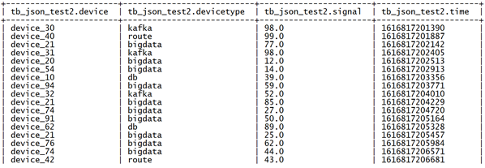

#### 4.6. 总结

不论是Hive中的JSON函数还是自带的JSON SerDe, 都可以实现对于JSON数据的解析, 工作中一般根据数据格式以及对应的需求来实现解析. 如果数据中每一行只有个别字段是JSON格式字符串, 就可以使用JSON函数来实现处理, 但是如果数据加载的文件整体就是JSON文件, 每一行数据就是一个JSON数据, 那么建议直接使用JSON SerDe来实现处理最为方便.

## II. Window functions窗口函数

### 1. 窗口函数概述

窗口函数（Window functions）是一种SQL函数，非常适合于数据分析，因此也叫做OLAP函数，其最大特点是：输入值是从SELECT语句的结果集中的一行或多行的“窗口”中获取的。你也可以理解为**窗口有大有小（行有多有少）**。

通过OVER子句，窗口函数与其他SQL函数有所区别。如果函数具有OVER子句，则它是窗口函数。如果它缺少OVER子句，则它是一个普通的聚合函数。

窗口函数可以简单地解释为类似于聚合函数的计算函数，但是通过GROUP BY子句组合的常规聚合会隐藏正在聚合的各个行，最终输出一行，**窗口函数聚合后还可以访问当中的各个行，并且可以将这些行中的某些属性添加到结果集中**。


为了更加直观感受窗口函数，我们通过sum聚合函数进行普通常规聚合和窗口聚合，一看效果。

```sql
----sum+group by普通常规聚合操作------------
select sum(salary) as total from employee group by dept;

----sum+窗口函数聚合操作------------
select id,name,deg,salary,dept,sum(salary) over(partition by dept) as total from employee;
```


### 2. 窗口函数语法

```sql
Function(arg1,..., argn) OVER ([PARTITION BY <...>] [ORDER BY <....>] [<window_expression>])

--其中Function(arg1,..., argn) 可以是下面分类中的任意一个
    --聚合函数：比如sum max avg等
    --排序函数：比如rank row_number等
    --分析函数：比如lead lag first_value等

--OVER [PARTITION BY <...>] 类似于group by 用于指定分组  每个分组你可以把它叫做窗口
--如果没有PARTITION BY 那么整张表的所有行就是一组

--[ORDER BY <....>]  用于指定每个分组内的数据排序规则 支持ASC、DESC

--[<window_expression>] 用于指定每个窗口中 操作的数据范围 默认是窗口中所有行
```

### 3. 案例: 网站用户页面浏览次数分析

在网站访问中, 经常使用cookie来标识不用的用户身份, 通过cookie可以追踪不同用户的页面访问情况, 有下面两份数据: 


字段含义：cookieid 、访问时间、pv数(页面浏览数)

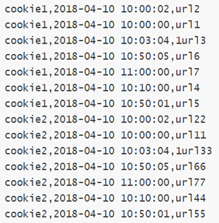
字段含义：cookieid、访问时间、访问页面url

在Hive中创建两张表，把数据加载进去用于窗口分析。

```sql
---建表并且加载数据
create table website_pv_info(
   cookieid string,
   createtime string,   --day
   pv int
) row format delimited
fields terminated by ',';

create table website_url_info (
    cookieid string,
    createtime string,  --访问时间
    url string       --访问页面
) row format delimited
fields terminated by ',';


load data local inpath '/root/hivedata/website_pv_info.txt' into table website_pv_info;
load data local inpath '/root/hivedata/website_url_info.txt' into table website_url_info;

select * from website_pv_info;
select * from website_url_info;
```

#### 3.1. 窗口聚合函数

##### 概述

- 所谓窗口聚合函数指的是sum、max、min、avg这样的聚合函数在窗口中的使用
- 这里以**sum()**函数为例，其他聚合函数使用类似
- 易错点：在没有使用window子句指定范围时，**默认是rows between还是range between需要搞清楚**。

```sql
-----窗口聚合函数的使用-----------
--1、求出每个用户总pv数  sum+group by普通常规聚合操作
select cookieid,sum(pv) as total_pv from website_pv_info group by cookieid;

--2、sum+窗口函数 总共有四种用法 注意是整体聚合 还是累积聚合
--sum(...) over( )对表所有行求和
--sum(...) over( order by ... ) 连续累积求和
--sum(...) over( partition by... ) 同组内所有行求和
--sum(...) over( partition by... order by ... ) 在每个分组内，连续累积求和

--需求：求出网站总的pv数 所有用户所有访问加起来
--sum(...) over( )对表所有行求和
select cookieid,createtime,pv,
       sum(pv) over() as total_pv
from website_pv_info;

--需求：求出每个用户总pv数
--sum(...) over( partition by... )，同组内所行求和
select cookieid,createtime,pv,
       sum(pv) over(partition by cookieid) as total_pv
from website_pv_info;

--需求：求出每个用户截止到当天，累积的总pv数
--sum(...) over( partition by... order by ... )，在每个分组内，连续累积求和
select cookieid,createtime,pv,
       sum(pv) over(partition by cookieid order by createtime) as current_total_pv
from website_pv_info;
```

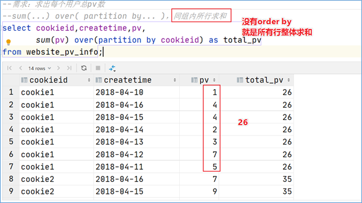

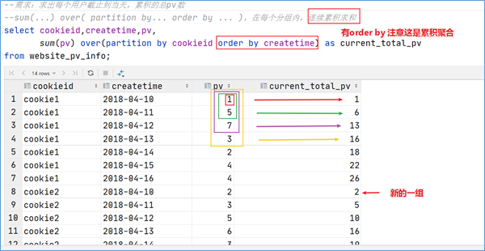

##### rows还是range

- 共同的前提是都没有手动指定window字句
- 有order by时, 默认是range, 首行到当前行
- 没有order by时, 默认是rows, 首行到最后一行

##### partition by影响

- partition by的语法功能类似于group by分组，有无partition by语法，影响是否分组；

  有的话，根据指定字段分组；没有的话，全表所有行是一组

  

##### order by影响

1. **没有order by**时，默认是**rows** **between**，首行到最后一行

   这里的“行”指的是物理意义上的行。

   

   ```sql
   --sum(...) over( )
   select cookieid,createtime,pv,
   sum(pv) over() as total_pv  --注意这里窗口函数是没有partition by 也就是没有分组  全表所有行
   from website_pv_info;
   --sum(...) over( partition by... )
   select cookieid,createtime,pv,
   sum(pv) over(partition by cookieid) as total_pv --注意这里有partition分组了，那就是组内所有行
   from website_pv_info;
   ```

   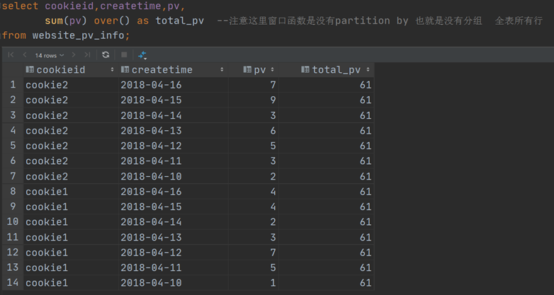

   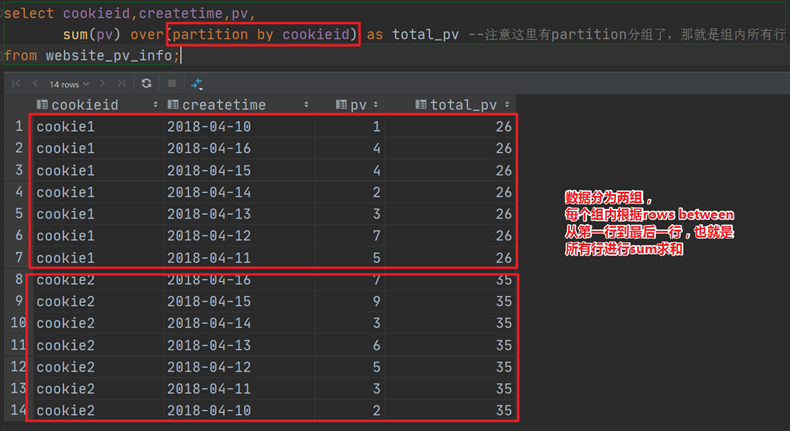

2. **有order by**时，默认是range between，首行到当前行

   这里的“行”指的是逻辑上的行，由order by字段的值来划分的范围。

   

   ```sql
   --sum(...) over( partition by... order by ... )
   select cookieid,createtime,pv,
   sum(pv) over(partition by cookieid order by createtime) as current_total_pv
   from website_pv_info;
   select cookieid,createtime,pv,
   sum(pv) over(partition by cookieid order by pv) as current_total_pvfrom website_pv_info;
   ```

   

   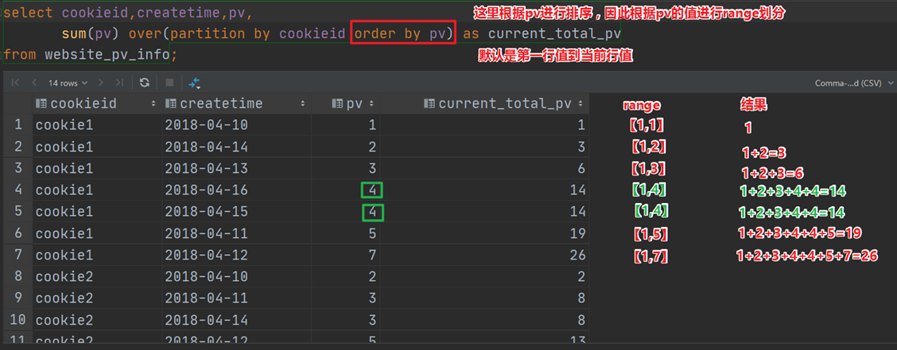

#### 3.2. 窗口表达式(window子句)

在**sum(...) over( partition by... order by ... )语法完整**的情况下，进行的累积聚合操作，默认累积聚合行为是：**从第一行聚合到当前行**。

Window expression窗口表达式给我们提供了一种控制行范围的能力，比如向前2行，向后3行。

语法如下：

```sql
unbounded 无边界
preceding 往前
following 往后
unbounded preceding 往前所有行，即初始行
n preceding 往前n行
unbounded following 往后所有行，即末尾行
n following 往后n行
current row 当前行

语法
(ROWS | RANGE) BETWEEN (UNBOUNDED | [num]) PRECEDING AND ([num] PRECEDING | CURRENT ROW | (UNBOUNDED | [num]) FOLLOWING)
(ROWS | RANGE) BETWEEN CURRENT ROW AND (CURRENT ROW | (UNBOUNDED | [num]) FOLLOWING)
(ROWS | RANGE) BETWEEN [num] FOLLOWING AND (UNBOUNDED | [num]) FOLLOWING
```

```sql
--第一行到当前行
select cookieid,createtime,pv,
       sum(pv) over(partition by cookieid order by createtime rows between unbounded preceding and current row) as pv2
from website_pv_info;

--向前3行至当前行
select cookieid,createtime,pv,
       sum(pv) over(partition by cookieid order by createtime rows between 3 preceding and current row) as pv4
from website_pv_info;

--向前3行 向后1行
select cookieid,createtime,pv,
       sum(pv) over(partition by cookieid order by createtime rows between 3 preceding and 1 following) as pv5
from website_pv_info;

--当前行至最后一行
select cookieid,createtime,pv,
       sum(pv) over(partition by cookieid order by createtime rows between current row and unbounded following) as pv6
from website_pv_info;

--第一行到最后一行 也就是分组内的所有行
select cookieid,createtime,pv,
       sum(pv) over(partition by cookieid order by createtime rows between unbounded preceding  and unbounded following) as pv6
from website_pv_info;
```

#### 3.3. 窗口排序函数

窗口排序函数用于给每个分组内的数据打上排序的标号。注意窗口排序函数不支持窗口表达式。总共有4个函数需要掌握：

**row_number**：在每个分组中，为每行分配一个从1开始的唯一序列号，递增，不考虑重复；12345

**rank**: 在每个分组中，为每行分配一个从1开始的序列号，考虑重复，挤占后续位置；12335

**dense_rank**: 在每个分组中，为每行分配一个从1开始的序列号，考虑重复，不挤占后续位置；12334

```sql
-----窗口排序函数
SELECT
    cookieid,
    createtime,
    pv,
    RANK() OVER(PARTITION BY cookieid ORDER BY pv desc) AS rn1,
    DENSE_RANK() OVER(PARTITION BY cookieid ORDER BY pv desc) AS rn2,
    ROW_NUMBER() OVER(PARTITION BY cookieid ORDER BY pv DESC) AS rn3
FROM website_pv_info
WHERE cookieid = 'cookie1';
```

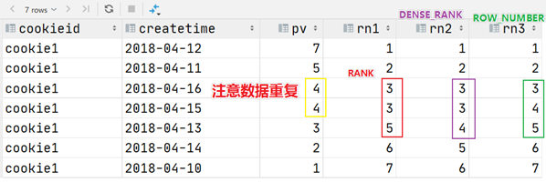

上述这三个函数用于分组TopN的场景非常适合。

```sql
--需求：找出每个用户访问pv最多的Top3 重复并列的不考虑
SELECT * from
(SELECT
    cookieid,
    createtime,
    pv,
    ROW_NUMBER() OVER(PARTITION BY cookieid ORDER BY pv DESC) AS seq
FROM website_pv_info) tmp where tmp.seq <4;
```

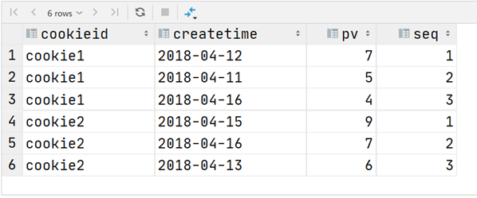

还有一个函数，叫做ntile函数，其功能为：将每个分组内的数据分为指定的若干个桶里（分为若干个部分），并且为每一个桶分配一个桶编号。

如果不能平均分配，则优先分配较小编号的桶，并且各个桶中能放的行数最多相差1。

有时会有这样的需求:如果数据排序后分为三部分，业务人员只关心其中的一部分，如何将这中间的三分之一数据拿出来呢?NTILE函数即可以满足。

```sql
--把每个分组内的数据分为3桶
SELECT
    cookieid,
    createtime,
    pv,
    NTILE(3) OVER(PARTITION BY cookieid ORDER BY createtime) AS rn2
FROM website_pv_info
ORDER BY cookieid,createtime;
```


```sql
--需求：统计每个用户pv数最多的前3分之1天。
--理解：将数据根据cookieid分 根据pv倒序排序 排序之后分为3个部分 取第一部分
SELECT * from
(SELECT
     cookieid,
     createtime,
     pv,
     NTILE(3) OVER(PARTITION BY cookieid ORDER BY pv DESC) AS rn
 FROM website_pv_info) tmp where rn =1;
```

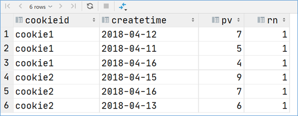

#### 3.4. 窗口分析函数

**LAG(col,n,DEFAULT)** 用于统计窗口内往上第n行值

第一个参数为列名，第二个参数为往上第n行（可选，默认为1），第三个参数为默认值（当往上第n行为NULL时候，取默认值，如不指定，则为NULL）；

**LEAD(col,n,DEFAULT)** 用于统计窗口内往下第n行值

第一个参数为列名，第二个参数为往下第n行（可选，默认为1），第三个参数为默认值（当往下第n行为NULL时候，取默认值，如不指定，则为NULL）；

**FIRST_VALUE** 取分组内排序后，截止到当前行，第一个值；

**LAST_VALUE** 取分组内排序后，截止到当前行，最后一个值；

```sql
-----------窗口分析函数----------
--LAG
SELECT cookieid,
       createtime,
       url,
       ROW_NUMBER() OVER(PARTITION BY cookieid ORDER BY createtime) AS rn,
       LAG(createtime,1,'1970-01-01 00:00:00') OVER(PARTITION BY cookieid ORDER BY createtime) AS last_1_time,
       LAG(createtime,2) OVER(PARTITION BY cookieid ORDER BY createtime) AS last_2_time
FROM website_url_info;


--LEAD
SELECT cookieid,
       createtime,
       url,
       ROW_NUMBER() OVER(PARTITION BY cookieid ORDER BY createtime) AS rn,
       LEAD(createtime,1,'1970-01-01 00:00:00') OVER(PARTITION BY cookieid ORDER BY createtime) AS next_1_time,
       LEAD(createtime,2) OVER(PARTITION BY cookieid ORDER BY createtime) AS next_2_time
FROM website_url_info;

--FIRST_VALUE
SELECT cookieid,
       createtime,
       url,
       ROW_NUMBER() OVER(PARTITION BY cookieid ORDER BY createtime) AS rn,
       FIRST_VALUE(url) OVER(PARTITION BY cookieid ORDER BY createtime) AS first1
FROM website_url_info;

--LAST_VALUE
SELECT cookieid,
       createtime,
       url,
       ROW_NUMBER() OVER(PARTITION BY cookieid ORDER BY createtime) AS rn,
       LAST_VALUE(url) OVER(PARTITION BY cookieid ORDER BY createtime) AS last1
FROM website_url_info;
```


## III. Hive数据存储格式

### 1. 列式存储和行式存储

逻辑表中的数据，最终需要落到磁盘上，以文件的形式存储，有两种常见的存储形式。行式存储和列式存储。


#### 1.1. 行式存储

##### 优点

相关数据是保存在一起, 比较符合面向对象的思维, 因为一行数据就是一条记录

这种存储格式比较方便进行insert/update操作

##### 缺点

如果查询只涉及某几个列, 它会把整行数据都读取出来, 不能跳过不必要的列读取. 如果数据量大则会影响性能

由于每一行中, 列的数据类型不一致, 导致不容易获得一个极高的压缩比, 空间利用率不高.

不是所有的列都适合作为索引

#### 1.2. 列式存储

##### 优点

查询时，只有涉及到的列才会被查询，不会把所有列都查询出来，即可以跳过不必要的列查询

高效的压缩率，不仅节省储存空间也节省计算内存和CPU

任何列都可以作为索引

##### 缺点

INSERT/UPDATE很麻烦或者不方便；

不适合扫描少量的数据

##### Hive支持的存储数的格式

==TEXTFILE==(行式存储), SEQUENCEFILE(行式存储), ==ORC==(列式存储), PARQUET(列式存储).

### 2. TEXTFILE格式

**默认格式**，数据不做压缩，磁盘开销大，数据解析开销大。可结合Gzip、Bzip2使用(系统自动检查，执行查询时自动解压)，但使用这种方式，**hive不会对数据进行切分**，从而**==无法==对数据进行并行操作**。

##### 优点

最简单的数据格式，可以直接查看

可以使用任意的分隔符进行分割

便于和其他工具共享数据

可以搭配压缩一起使用

##### 缺点

耗费存储空间，I/O性能较低

结合压缩时Hive不进行数据切分合并，不能进行并行操作，查询效率低

按行存储，读取列的性能差

##### 应用场景

适合于小量数据的存储查询

一般用于做第一层数据加载和测试使用

### 3. ORC格式

ORC的全称是(Optimized Row Columnar)，ORC文件格式是一种Hadoop生态圈中的列式存储格式，它的产生早在2013年初，最初产生自Apache Hive，用于降低Hadoop数据存储空间和加速Hive查询速度。它**并不是一个单纯的列式存储格式，仍然是首先根据行组分割整个表，在每一个行组内进行按列存储**。

优点如下：

ORC是列式存储，有多种文件压缩方式，并且有着很高的压缩比。

文件是可切分（Split）的。因此，在Hive中使用ORC作为表的文件存储格式，不仅节省HDFS存储资源，查询任务的输入数据量减少，使用的MapTask也就减少了。

ORC可以支持复杂的数据结构（比如Map等）。

==**ORC文件也是以二进制方式存储的，所以是不可以直接读取，ORC文件也是自解析的。**==

#### 3.1. 了解ORC结构

一个orc文件可以分为若干个Stripe，一个stripe可以分为三个部分：

​	indexData：某些列的索引数据

​	rowData :真正的数据存储

​	StripFooter：stripe的元数据信息


1）Index Data：一个轻量级的index，默认是每隔1W行做一个索引。这里做的索引只是记录某行的各字段在Row Data中的offset。

2）Row Data：存的是具体的数据，先取部分行，然后对这些行按列进行存储。对每个列进行了编码，分成多个Stream来存储。

3）Stripe Footer：存的是各个stripe的元数据信息。

每个文件有一个File Footer，这里面存的是每个Stripe的行数，每个Column的数据类型信息等；每个文件的尾部是一个PostScript，这里面记录了整个文件的压缩类型以及FileFooter的长度信息等。在读取文件时，会seek到文件尾部读PostScript，从里面解析到File Footer长度，再读FileFooter，从里面解析到各个Stripe信息，再读各个Stripe，即从后往前读。

### 4. PARQUET格式

#### 4.1. 了解PARQUET格式

Parquet文件的格式如下图所示：


上图展示了一个Parquet文件的内容，一个文件中可以存储多个行组，文件的首位都是该文件的Magic Code，用于校验它是否是一个Parquet文件，Footer length了文件元数据的大小，通过该值和文件长度可以计算出元数据的偏移量，文件的元数据中包括每一个行组的元数据信息和该文件存储数据的Schema信息。除了文件中每一个行组的元数据，每一页的开始都会存储该页的元数据，在Parquet中，有三种类型的页：数据页、字典页和索引页。数据页用于存储当前行组中该列的值，字典页存储该列值的编码字典，每一个列块中最多包含一个字典页，索引页用来存储当前行组下该列的索引，目前Parquet中还不支持索引页，但是在后面的版本中增加。

### 5. 文件格式存储对比

#### 5.1. TEXTFILE

创建表, 存储数据格式为TEXTFILE

```sql
create table log_text (
track_time string,
url string,
session_id string,
referer string,
ip string,
end_user_id string,
city_id string
)
ROW FORMAT DELIMITED FIELDS TERMINATED BY '\t'
STORED AS TEXTFILE ;
```

加载数据

```sql
load data local inpath '/root/hivedata/log.data' into table log_text ;
```

查看表中数据大小


#### 5.2. ORC

创建表, 存储数据格式为orc

```sql
create table log_orc(
track_time string,
url string,
session_id string,
referer string,
ip string,
end_user_id string,
city_id string
)
ROW FORMAT DELIMITED FIELDS TERMINATED BY '\t'
STORED AS orc;
```

加载数据

```sql
insert into table log_orc select * from log_text ;
```

查看表中数据大小

```shell
dfs -du -h /user/hive/warehouse/log_orc;
```


#### 5.3. PARQUET

创建表, 存储数据格式为parquet

```sql
create table log_parquet(
track_time string,
url string,
session_id string,
referer string,
ip string,
end_user_id string,
city_id string
)
ROW FORMAT DELIMITED FIELDS TERMINATED BY '\t'
STORED AS PARQUET ;	
```

加载数据

```sql
insert into table log_parquet select * from log_text ;
```

查看表中数据大小

```shell
dfs -du -h /user/hive/warehouse/log_parquet;
```


存储文件的压缩比总结：

**==ORC > Parquet > textFile==**

### 6. 存储文件查询速度对比

可以针对三张表，使用sql统计表数据个数。查看执行时间。

select count(*) from log_orc;

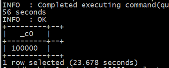

select count(*) from log_orc;


select count(*) from log_parquet;


### 7. 存储格式和压缩的整合

#### 7.1. 非压缩ORC文件


#### 7.2. Snappy压缩ORC文件


## IV. Hive数据压缩

### 1. 优缺点

##### 优点

1. 减少存储磁盘空间, 降低单节点的磁盘IO

2. 由于压缩后的数据占用的带宽更少, 因此可以加快数据在Hadoop集群流动的速度, 减少网络传输带宽

##### 缺点

​	需要花费额外的时间/CPU做压缩和解压缩计算

### 2. 压缩分析

首先说明mapreduce哪些过程可以设置压缩：需要分析处理的数据在进入map前可以压缩，然后解压处理，map处理完成后的输出可以压缩，这样可以减少网络I/O(reduce通常和map不在同一节点上)，reduce拷贝压缩的数据后进行解压，处理完成后可以压缩存储在hdfs上，以减少磁盘占用量。

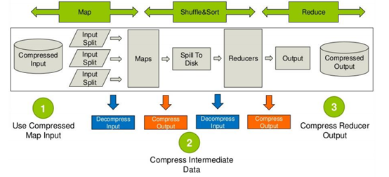

### 3. Hadoop中支持的压缩算法

| 压缩格式   | 压缩格式所在的类                           |
| ---------- | ------------------------------------------ |
| Zlib       | org.apache.hadoop.io.compress.DefaultCodec |
| Gzip       | org.apache.hadoop.io.compress.GzipCodec    |
| Bzip2      | org.apache.hadoop.io.compress.BZip2Codec   |
| ==Lzo==    | com.hadoop.compression.lzo.LzoCodec        |
| Lz4        | org.apache.hadoop.io.compress.Lz4Codec     |
| ==Snappy== | org.apache.hadoop.io.compress.SnappyCodec  |

### 4. Hive的压缩设置

#### 4.1. 开启Hive中间传输数据压缩功能

1. 开启hive中间传输数据压缩功能

   `set hive.exec.compress.intermediate=true;`

2. 开启mapreduce中map输出压缩功能

   `set mapreduce.map.output.compress=true;`

3. 设置mapreduce中map输出数据的压缩方式

   `set mapreduce.map.output.compress.codec=org.apache.hadoop.io.compress.SnappyCodec;`

#### 4.2. 开启Reduce输出阶段压缩

1. 开启hive最终输出数据压缩功能

   `set hive.exec.compress.output=true;`

2. 开启mapreduce最终输出数据压缩

   `set mapreduce.output.fileoutputformat.compress=true;`

3. 设置mapreduce最终数据输出压缩方式

   `set mapreduce.output.fileoutputformat.compress.codec = org.apache.hadoop.io.compress.SnappyCodec;`

4. 设置mapreduce最终数据输出压缩为块压缩

   `set mapreduce.output.fileoutputformat.compress.type=BLOCK;`

## V. Hive调优

### 1. Fetch抓取机制

Hive中对某些情况的查询可以不必使用MapReduce计算。例如：SELECT * FROM employees;在这种情况下，Hive可以简单地读取employee对应的存储目录下的文件，然后输出查询结果到控制台。

在hive-default.xml.template文件中hive.fetch.task.conversion默认是more，老版本hive默认是minimal，该属性修改为more以后，在**全局查找**、**字段查找**、**limit查找**等都不走mapreduce。

把hive.fetch.task.conversion设置成none，然后执行查询语句，都会执行mapreduce程序。

```sql
set hive.fetch.task.conversion=none;
select * from score;
select s_score from score;
select s_score from score limit 3;
```

把hive.fetch.task.conversion设置成more，然后执行查询语句，如下查询方式都不会执行mapreduce程序。

```sql
set hive.fetch.task.conversion=more;
select * from score;
select s_score from score;
select s_score from score limit 3;
```

### 2. mapreduce本地模式

mapreduce程序除了可以提交到yarn执行之外，还可以使用本地模拟环境运行，此时就不是分布式执行的程序，但是针对小文件小数据处理特别有效果。

用户可以通过设置hive.exec.mode.local.auto的值为true，来让Hive在适当的时候自动启动这个优化。

hive自动根据下面三个条件判断是否启动本地模式：

```shell
The total input size of the job is lower than:
 hive.exec.mode.local.auto.inputbytes.max (128MB by default)
The total number of map-tasks is less than:
 hive.exec.mode.local.auto.tasks.max (4 by default)
The total number of reduce tasks required is 1 or 0.
```

### 3. join查询的优化

多个表关联时，最好分拆成小段sql分段执行，避免一个大sql（无法控制中间Job）。

#### 3.1. map join

如果不指定MapJoin或者不符合MapJoin的条件，那么Hive解析器会将Join操作转换成Common Join，即：在Reduce阶段完成join。容易发生数据倾斜。可以用MapJoin把小表全部加载到内存在map端进行join，避免reducer处理。

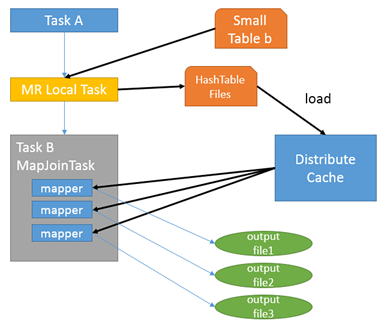

首先是Task A，它是一个Local Task（在客户端本地执行的Task），负责扫描小表b的数据，将其转换成一个HashTable的数据结构，并写入本地的文件中，之后将该文件加载到DistributeCache中。

接下来是Task B，该任务是一个没有Reduce的MR，启动MapTasks扫描大表a,在Map阶段，根据a的每一条记录去和DistributeCache中b表对应的HashTable关联，并直接输出结果。

由于MapJoin没有Reduce，所以由Map直接输出结果文件，有多少个Map Task，就有多少个结果文件。

map端join的参数设置：

开启mapjoin参数设置：

（1）设置自动选择mapjoin

set hive.auto.convert.join = true; 默认为true

（2）大表小表的阈值设置：

hive.auto.convert.join.noconditionaltask.size=10000000;

小表的输入文件大小的阈值（以字节为单位）;如果文件大小小于此阈值，它将尝试将common join转换为map join。

因此在实际使用中，只要根据业务把握住小表的阈值标准即可，hive会自动帮我们完成mapjoin，提高执行的效率。

#### 3.2. reduce join


#### 3.3. bucket join


#### 3.4. 大表join大表


#### 3.5. 大小表/小大表join


### 4. 数据倾斜优化

数据倾斜:

- 分布式计算中最常见的，最容易遇到的问题就是数据倾斜；

- 数据倾斜的现象是，当提交运行一个程序时，这个程序的大多数的Task都已经运行结束了，只有某一个Task一直在运行，迟迟不能结束，导致整体的进度卡在99%或者100%，这时候就可以判定程序出现了数据倾斜的问题。
- 风险: 程序执行时间过长, 出bug几率变大, 程序一直霸占资源

- 数据倾斜的原因：

  1. 数据分配不均衡
  2. 分区规则不合理: 学生表根据性别分区可能倾斜, 根据标号奇偶分则不会倾斜
  3. 业务影响导致数据改变, 本来不倾斜, 受到了影响

  

- 通用解决方案:

  1. 如果能提前预知数据倾斜, 针对倾斜的数据单独处理, 比如加硬件: 电商双十一之订单数据爆炸
  2. 针对倾斜的数据**打散**后**分步执行**

#### 4.1.

#### 4.2. 

#### 4.3. skew Join

##### 原理

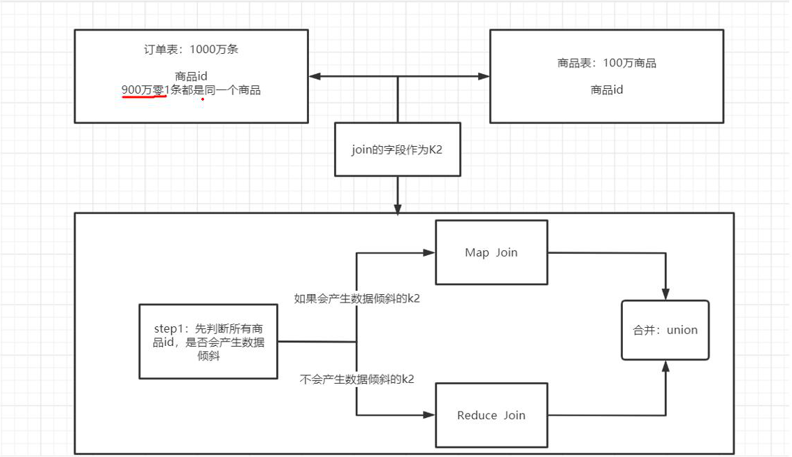

##### 配置

```sql
-- 开启运行过程中skewjoin
set hive.optimize.skewjoin=true;
-- 如果这个key的出现的次数超过这个范围
set hive.skewjoin.key=100000;
-- 在编译时判断是否会产生数据倾斜
set hive.optimize.skewjoin.compiletime=true;
-- 不合并，提升性能
set hive.optimize.union.remove=true;
-- 如果Hive的底层走的是MapReduce，必须开启这个属性，才能实现不合并
set mapreduce.input.fileinputformat.input.dir.recursive=true;
```

### 5. group by优化 - map端聚合

### 6. MapReduce引擎并行度调整

#### 6.1. maptask个数调整

##### 小文件场景

对已经存在的小文件做出的解决方案：

使用Hadoop achieve把小文件进行归档

重建表，建表时减少reduce的数量

通过参数调节，设置map数量（下面的API属于hadoop低版本的API）

```sql
//每个Map最大输入大小(这个值决定了合并后文件的数量)
set mapred.max.split.size=112345600;  
//一个节点上split的至少的大小(这个值决定了多个DataNode上的文件是否需要合并)
set mapred.min.split.size.per.node=112345600;
//一个交换机下split的至少的大小(这个值决定了多个交换机上的文件是否需要合并)  
set mapred.min.split.size.per.rack=112345600;
//执行Map前进行小文件合并
set hive.input.format=org.apache.hadoop.hive.ql.io.CombineHiveInputFormat;
```

##### 大文件场景

当input的文件都很大，任务逻辑复杂，map执行非常慢的时候，可以考虑增加Map数，来使得每个map处理的数据量减少，从而提高任务的执行效率。

如果表a只有一个文件，大小为120M，但包含几千万的记录，如果用1个map去完成这个任务，肯定是比较耗时的，这种情况下，我们要考虑将这一个文件合理的拆分成多个，这样就可以用多个map任务去完成。

```sql
set mapreduce.job.reduces =10;

create table a_1 as
select * from a
distribute by rand(123);
```

这样会将a表的记录，随机的分散到包含10个文件的a_1表中，再用a_1代替上面sql中的a表，则会用10个map任务去完成。

每个map任务处理大于12M（几百万记录）的数据，效率肯定会好很多。

#### 6.2. reducetask个数调整

总共受3个参数控制：

（1）每个Reduce处理的数据量默认是256MB

```
hive.exec.reducers.bytes.per.reducer=256123456
```

（2）每个任务最大的reduce数，默认为1009

```
hive.exec.reducers.max=1009
```

（3）mapreduce.job.reduces

**该值默认为-1，由hive自己根据任务情况进行判断。**

因此，可以手动设置每个job的Reduce个数

`set mapreduce.job.reduces = 8;`

用户设置的**不一定生效**，比如在进行order by的时候，为了保证全局排序，此时不管用户设置为几，在编译期间Hive都会将其设置为1，保证SQL逻辑正常实现。

reduce个数并不是越多越好

1）过多的启动和初始化reduce也会消耗时间和资源；

2）另外，有多少个reduce，就会有多少个输出文件，如果生成了很多个小文件，那么如果这些小文件作为下一个任务的输入，则也会出现小文件过多的问题；

在设置reduce个数的时候也需要考虑这两个原则：处理大数据量利用合适的reduce数；使单个reduce任务处理数据量大小要合适.

### 7. 执行计划 - explain(了解)

基本语法

`EXPLAIN [EXTENDED | DEPENDENCY | AUTHORIZATION] query`

案例实操

（1）查看下面这条语句的执行计划

```sql
explain select * from course;
explain select s_id ,avg(s_score) avgscore from score group by s_id;
```

（2）查看详细执行计划

```sql
explain extended select * from course;
explain extended select s_id ,avg(s_score) avgscore from score group by s_id;
```

### 8. 并行执行机制

Hive会将一个查询转化成一个或者多个阶段。这样的阶段可以是MapReduce阶段、抽样阶段、合并阶段、limit阶段。或者Hive执行过程中可能需要的其他阶段。

默认情况下，Hive一次只会执行一个阶段。不过，某个特定的job可能包含众多的阶段，而这些阶段可能并非完全互相依赖的，也就是说有些阶段是可以并行执行的，这样可能使得整个job的执行时间缩短。不过，如果有更多的阶段可以并行执行，那么job可能就越快完成。

通过设置参数hive.exec.parallel值为true，就可以开启并发执行。不过，在共享集群中，需要注意下，如果job中并行阶段增多，那么集群利用率就会增加。

`set hive.exec.parallel=true; `	//打开任务并行执行

`set hive.exec.parallel.thread.number=16;`	//同一个sql允许最大并行度，默认为8。

当然，得是在系统资源比较空闲的时候才有优势，否则，没资源，并行也起不来。

### 9. 严格模式(了解)

Hive提供了一个严格模式，可以防止用户执行那些可能意向不到的不好的影响的查询。

通过设置属性hive.mapred.mode值为默认是非严格模式nonstrict 。开启严格模式需要修改hive.mapred.mode值为strict，开启严格模式可以禁止3种类型的查询。

1）对于分区表，除非where语句中含有分区字段过滤条件来限制范围，否则不允许执行。换句话说，就是用户不允许扫描所有分区。进行这个限制的原因是，通常分区表都拥有非常大的数据集，而且数据增加迅速。没有进行分区限制的查询可能会消耗令人不可接受的巨大资源来处理这个表。

2）对于使用了order by语句的查询，要求必须使用limit语句。因为order by为了执行排序过程会将所有的结果数据分发到同一个Reducer中进行处理，强制要求用户增加这个LIMIT语句可以防止Reducer额外执行很长一段时间。

3）限制笛卡尔积的查询。对关系型数据库非常了解的用户可能期望在执行JOIN查询的时候不使用ON语句而是使用where语句，这样关系数据库的执行优化器就可以高效地将WHERE语句转化成那个ON语句。不幸的是，Hive并不会执行这种优化，因此，如果表足够大，那么这个查询就会出现不可控的情况。

### 10. 推测执行机制(了解)

在分布式集群环境下，因为程序Bug（包括Hadoop本身的bug），负载不均衡或者资源分布不均等原因，会造成同一个作业的多个任务之间运行速度不一致，有些任务的运行速度可能明显慢于其他任务（比如一个作业的某个任务进度只有50%，而其他所有任务已经运行完毕），则这些任务会拖慢作业的整体执行进度。为了避免这种情况发生，Hadoop采用了推测执行（Speculative Execution）机制，它根据一定的法则推测出“拖后腿”的任务，并为这样的任务启动一个备份任务，让该任务与原始任务同时处理同一份数据，并最终选用最先成功运行完成任务的计算结果作为最终结果。

hadoop中默认两个阶段都开启了推测执行机制。

hive本身也提供了配置项来控制reduce-side的推测执行：

```xml
<property>
    <name>hive.mapred.reduce.tasks.speculative.execution</name>
    <value>true</value>
</property>
```

关于调优推测执行机制，还很难给一个具体的建议。如果用户对于运行时的偏差非常敏感的话，那么可以将这些功能关闭掉。如果用户因为输入数据量很大而需要执行长时间的map或者Reduce task的话，那么启动推测执行造成的浪费是非常巨大。

 