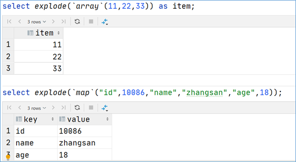

# Hive函数高阶应用及性能调优

## I. Hive函数高阶

### 1. UDTF之explode函数

#### 1.1. explode语法功能

Hive当中内置的一个非常著名的UDTF函数，名字叫做**explode函数**，中文戏称之为“爆炸函数”，可以炸开数据。

explode函数接收map或者array类型的数据作为参数，然后把参数中的每个元素炸开变成一行数据。一个元素一行。这样的效果正好满足于输入一行输出多行。

explode函数在关系型数据库中本身是不该出现的。

因为他的出现本身就是在操作不满足第一范式的数据（每个属性都不可再分）。本身已经违背了数据库的设计原理，但是在面向分析的数据库或者数据仓库中，这些规范可以发生改变。

```shell
explode(a) - separates the elements of array a into multiple rows, or the elements of a map into multiple rows and columns 
```


explode(array)将array列表里的每个元素生成一行；

explode(map)将map里的每一对元素作为一行，其中key为一列，value为一列；

一般情况下，explode函数可以直接使用即可，也可以根据需要结合lateral view侧视图使用。

#### 1.2. explode函数的使用

```sql
select explode(`array`(11,22,33)) as item;

select explode(`map`("id",10086,"name","zhangsan","age",18));
```



#### 1.3. 案例: NBA总冠军球队名单

### 2. Lateral View侧视图

#### 2.1. 概念

#### 2.2 UDTF配合侧视图使用

### 3. 行列转换应用与实现

#### 3.1. 工作应用场景

#### 3.2. 行转列: 多行转单列

#### 3.3. 列转行: 单列转多行

### 4. JSON数据处理

#### 4.1. 应用场景

#### 4.2. 处理方式

#### 4.3. JSON函数: get_json_object

#### 4.4. JSON函数: json_tuple

#### 4.5. JSON Serde

#### 4.6. 总结

## II. Windows functions窗口函数

### 1. 窗口函数概述

### 2. 窗口函数语法

### 3. 案例: 网站用户页面浏览次数分析

#### 3.1. 窗口聚合函数

#### 3.2. 窗口表达式

#### 3.3. 窗口排序函数

#### 3.4. 窗口分析函数

## III. Hive数据压缩

### 1. 优缺点

### 2. 压缩分析

### 3. Hadoop中支持的压缩算法

### 4. Hive的压缩设置

#### 4.1. 开启Hive中间传输数据压缩功能

#### 4.2. 开启Reduce输出阶段压缩

## IV. Hive数据存储格式

### 1. 列式存储和行式存储

#### 1.1. 行式存储

#### 1.2. 列式存储

### 2. TEXTFILE格式

### 3. ORC格式

#### 3.1. 了解ORC结构

### 4. PARQUET格式

#### 4.1. 了解PARQUET格式

### 5. 文件格式存储对比

#### 5.1. TEXTFILE

#### 5.2. ORC

#### 5.3. PARQUET

### 6. 存储文件查询速度对比

### 7. 存储格式和压缩的整合

#### 7.1. 非压缩ORC文件

#### 7.2. Snappy压缩ORC文件

## V. Hive调优

### 1. Fetch抓取机制

### 2. mapreduce本地模式

### 3. join查询的优化

#### 3.1. map side join

#### 3.2. 大表join小表

#### 3.3. 大小表/小大表join

### 4. group by优化 - map端聚合

### 5. MapReduce引擎并行度调整

#### 5.1. maptask个数调整

#### 5.2. reducetask个数调整

### 6. 执行计划 - explain(了解)

### 7. 并行执行机制

### 8. 严格模式

### 9. 推测执行机制


