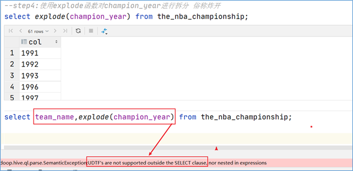
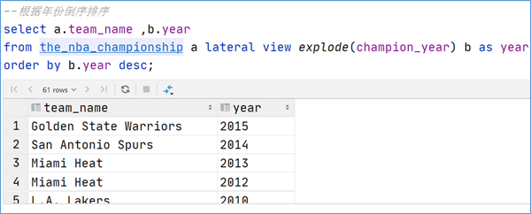

# Hive函数高阶应用及性能调优

## I. Hive函数高阶

### 1. UDTF之explode函数

#### 1.1. explode语法功能

Hive当中内置的一个非常著名的UDTF函数，名字叫做**explode函数**，中文戏称之为“爆炸函数”，可以炸开数据。

explode函数接收map或者array类型的数据作为参数，然后把参数中的每个元素炸开变成一行数据。一个元素一行。这样的效果正好满足于输入一行输出多行。

explode函数在关系型数据库中本身是不该出现的。

因为他的出现本身就是在操作不满足第一范式的数据（每个属性都不可再分）。本身已经违背了数据库的设计原理，但是在面向分析的数据库或者数据仓库中，这些规范可以发生改变。

```shell
explode(a) - separates the elements of array a into multiple rows, or the elements of a map into multiple rows and columns 
```


explode(array)将array列表里的每个元素生成一行；

explode(map)将map里的每一对元素作为一行，其中key为一列，value为一列；

一般情况下，explode函数可以直接使用即可，也可以根据需要结合lateral view侧视图使用。

#### 1.2. explode函数的使用

```sql
select explode(`array`(11,22,33)) as item;

select explode(`map`("id",10086,"name","zhangsan","age",18));
```


#### 1.3. 案例: NBA总冠军球队名单

##### 业务需求

数据"The_NBA_Championship.txt"关于部分年份的NBA总冠军球队名单:

```txt
Chicago Bulls,1991|1992|1993|1996|1997|1998
San Antonio Spurs,1999|2003|2005|2007|2014
Golden State Warriors,1947|1956|1975|2015
Boston Celtics,1957|1959|1960|1961|1962|1963|1964|1965|1966|1968|1969|1974|1976|1981|1984|1986|2008
L.A. Lakers,1949|1950|1952|1953|1954|1972|1980|1982|1985|1987|1988|2000|2001|2002|2009|2010
Miami Heat,2006|2012|2013
Philadelphia 76ers,1955|1967|1983
Detroit Pistons,1989|1990|2004
Houston Rockets,1994|1995
New York Knicks,1970|1973
```

第一个字段表示的是球队名称，第二个字段是获取总冠军的年份，字段之间以，分割；

获取总冠军**年份之间以|进行分割**。

需求：使用Hive建表映射成功数据，对数据拆分，要求拆分之后数据如下所示：


并且最好根据年份的倒序进行排序。

##### 代码实现

```sql
--step1:建表
create table the_nba_championship(
    team_name string,
    champion_year array<string>
) row format delimited
fields terminated by ','
collection items terminated by '|';

--step2:加载数据文件到表中
load data local inpath '/root/hivedata/The_NBA_Championship.txt' into table the_nba_championship;

--step3:验证
select *
from the_nba_championship;
```


使用explode函数:

```sql
--step4:使用explode函数对champion_year进行拆分 俗称炸开
select explode(champion_year) from the_nba_championship;

select team_name,explode(champion_year) from the_nba_championship;
```



##### explode使用限制

在select条件中，如果只有explode函数表达式，程序执行是没有任何问题的；

但是如果在select条件中，包含explode和其他字段，就会报错。错误信息为：

> org.apache.hadoop.hive.ql.parse.SemanticException:UDTF's are not supported outside the SELECT clause, nor nested in expressions

##### explode语法限制原因

1. explode函数属于UDTF函数, 即表生成函数

2. explode函数执行返回的结果可以理解为一张虚拟的表, 其数据来源于源表

3. 在select中只查询源表数据没有问题, 只查询explode生成的虚拟表数据也没问题

4. 但是不能在只查询源表的时候, 既想返回源表字段又想返回explode生成的虚拟表字段

5. 通俗点讲, 有两张表, 不能只查询一张表但是返回分别属于两张表的字段

6. 从SQL层面上来说应该对两张表进行关联查询

7. Hive专门提供了Lateral View侧视图, 专门用于搭配explode这样的UFTF函数, 以满足上述需求

   

### 2. Lateral View侧视图


#### 2.1. 概念

**Lateral View**是一种特殊的语法，主要用于**搭配UDTF类型功能的函数一起使用**，用于解决UDTF函数的一些查询限制的问题。

侧视图的原理是将UDTF的结果构建成一个类似于视图的表，然后将原表中的每一行和UDTF函数输出的每一行进行连接，生成一张新的虚拟表。这样就避免了UDTF的使用限制问题。使用lateral view时也可以对UDTF产生的记录设置字段名称，产生的字段可以用于group by、order by 、limit等语句中，不需要再单独嵌套一层子查询。

一般只要使用UDTF，就会固定搭配lateral view使用。

官方链接：<https://cwiki.apache.org/confluence/display/Hive/LanguageManual+LateralView>

#### 2.2 UDTF配合侧视图使用

针对上述NBA冠军球队年份排名案例，使用explode函数+lateral view侧视图，可以完美解决：

```sql
--lateral view侧视图基本语法如下
select …… from tabelA lateral view UDTF(xxx) 别名 as col1,col2,col3……;

select a.team_name ,b.year
from the_nba_championship a lateral view explode(champion_year) b as year

--根据年份倒序排序
select a.team_name ,b.year
from the_nba_championship a lateral view explode(champion_year) b as year
order by b.year desc;
```

### 3. 行列转换应用与实现

#### 3.1. 工作应用场景


#### 3.2. 行转列: 多行转单列

#### 3.3. 列转行: 单列转多行

### 4. JSON数据处理

#### 4.1. 应用场景

#### 4.2. 处理方式

#### 4.3. JSON函数: get_json_object

#### 4.4. JSON函数: json_tuple

#### 4.5. JSON Serde

#### 4.6. 总结

## II. Windows functions窗口函数

### 1. 窗口函数概述

### 2. 窗口函数语法

### 3. 案例: 网站用户页面浏览次数分析

#### 3.1. 窗口聚合函数

#### 3.2. 窗口表达式

#### 3.3. 窗口排序函数

#### 3.4. 窗口分析函数

## III. Hive数据压缩

### 1. 优缺点

### 2. 压缩分析

### 3. Hadoop中支持的压缩算法

### 4. Hive的压缩设置

#### 4.1. 开启Hive中间传输数据压缩功能

#### 4.2. 开启Reduce输出阶段压缩

## IV. Hive数据存储格式

### 1. 列式存储和行式存储

#### 1.1. 行式存储

#### 1.2. 列式存储

### 2. TEXTFILE格式

### 3. ORC格式

#### 3.1. 了解ORC结构

### 4. PARQUET格式

#### 4.1. 了解PARQUET格式

### 5. 文件格式存储对比

#### 5.1. TEXTFILE

#### 5.2. ORC

#### 5.3. PARQUET

### 6. 存储文件查询速度对比

### 7. 存储格式和压缩的整合

#### 7.1. 非压缩ORC文件

#### 7.2. Snappy压缩ORC文件

## V. Hive调优

### 1. Fetch抓取机制

### 2. mapreduce本地模式

### 3. join查询的优化

#### 3.1. map side join

#### 3.2. 大表join小表

#### 3.3. 大小表/小大表join

### 4. group by优化 - map端聚合

### 5. MapReduce引擎并行度调整

#### 5.1. maptask个数调整

#### 5.2. reducetask个数调整

### 6. 执行计划 - explain(了解)

### 7. 并行执行机制

### 8. 严格模式

### 9. 推测执行机制


