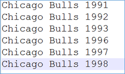
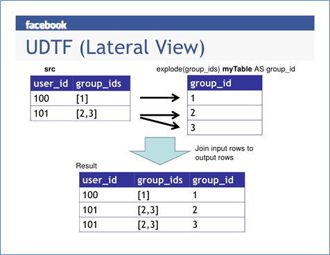

# Hive函数高阶应用及性能调优

## I. Hive函数高阶

### 1. UDTF之explode函数

#### 1.1. explode语法功能

Hive当中内置的一个非常著名的UDTF函数，名字叫做**explode函数**，中文戏称之为“爆炸函数”，可以炸开数据。

explode函数接收map或者array类型的数据作为参数，然后把参数中的每个元素炸开变成一行数据。一个元素一行。这样的效果正好满足于输入一行输出多行。

explode函数在关系型数据库中本身是不该出现的。

因为他的出现本身就是在操作不满足第一范式的数据（每个属性都不可再分）。本身已经违背了数据库的设计原理，但是在面向分析的数据库或者数据仓库中，这些规范可以发生改变。

```shell
explode(a) - separates the elements of array a into multiple rows, or the elements of a map into multiple rows and columns 
```


explode(array)将array列表里的每个元素生成一行；

explode(map)将map里的每一对元素作为一行，其中key为一列，value为一列；

一般情况下，explode函数可以直接使用即可，也可以根据需要结合lateral view侧视图使用。

#### 1.2. explode函数的使用

```sql
select explode(`array`(11,22,33)) as item;

select explode(`map`("id",10086,"name","zhangsan","age",18));
```


#### 1.3. 案例: NBA总冠军球队名单

##### 业务需求

数据"The_NBA_Championship.txt"关于部分年份的NBA总冠军球队名单:

```txt
Chicago Bulls,1991|1992|1993|1996|1997|1998
San Antonio Spurs,1999|2003|2005|2007|2014
Golden State Warriors,1947|1956|1975|2015
Boston Celtics,1957|1959|1960|1961|1962|1963|1964|1965|1966|1968|1969|1974|1976|1981|1984|1986|2008
L.A. Lakers,1949|1950|1952|1953|1954|1972|1980|1982|1985|1987|1988|2000|2001|2002|2009|2010
Miami Heat,2006|2012|2013
Philadelphia 76ers,1955|1967|1983
Detroit Pistons,1989|1990|2004
Houston Rockets,1994|1995
New York Knicks,1970|1973
```

第一个字段表示的是球队名称，第二个字段是获取总冠军的年份，字段之间以，分割；

获取总冠军**年份之间以|进行分割**。

需求：使用Hive建表映射成功数据，对数据拆分，要求拆分之后数据如下所示：



并且最好根据年份的倒序进行排序。

##### 代码实现

```sql
--step1:建表
create table the_nba_championship(
    team_name string,
    champion_year array<string>
) row format delimited
fields terminated by ','
collection items terminated by '|';

--step2:加载数据文件到表中
load data local inpath '/root/hivedata/The_NBA_Championship.txt' into table the_nba_championship;

--step3:验证
select *
from the_nba_championship;
```


使用explode函数:

```sql
--step4:使用explode函数对champion_year进行拆分 俗称炸开
select explode(champion_year) from the_nba_championship;

select team_name,explode(champion_year) from the_nba_championship;
```


##### explode使用限制

在select条件中，如果只有explode函数表达式，程序执行是没有任何问题的；

但是如果在select条件中，包含explode和其他字段，就会报错。错误信息为：

> org.apache.hadoop.hive.ql.parse.SemanticException:UDTF's are not supported outside the SELECT clause, nor nested in expressions

##### explode语法限制原因

1. explode函数属于UDTF函数, 即表生成函数

2. explode函数执行返回的结果可以理解为一张虚拟的表, 其数据来源于源表

3. 在select中只查询源表数据没有问题, 只查询explode生成的虚拟表数据也没问题

4. 但是不能在只查询源表的时候, 既想返回源表字段又想返回explode生成的虚拟表字段

5. 通俗点讲, 有两张表, 不能只查询一张表但是返回分别属于两张表的字段

6. 从SQL层面上来说应该对两张表进行关联查询

7. Hive专门提供了Lateral View侧视图, 专门用于搭配explode这样的UFTF函数, 以满足上述需求

   

### 2. Lateral View侧视图



#### 2.1. 概念

**Lateral View**是一种特殊的语法，主要用于**搭配UDTF类型功能的函数一起使用**，用于解决UDTF函数的一些查询限制的问题。

侧视图的原理是将UDTF的结果构建成一个类似于视图的表，然后将原表中的每一行和UDTF函数输出的每一行进行连接，生成一张新的虚拟表。这样就避免了UDTF的使用限制问题。使用lateral view时也可以对UDTF产生的记录设置字段名称，产生的字段可以用于group by、order by 、limit等语句中，不需要再单独嵌套一层子查询。

一般只要使用UDTF，就会固定搭配lateral view使用。

官方链接：<https://cwiki.apache.org/confluence/display/Hive/LanguageManual+LateralView>

#### 2.2 UDTF配合侧视图使用

针对上述NBA冠军球队年份排名案例，使用explode函数+lateral view侧视图，可以完美解决：

```sql
--lateral view侧视图基本语法如下
select …… from tabelA lateral view UDTF(xxx) 别名 as col1,col2,col3……;

select a.team_name ,b.year
from the_nba_championship a lateral view explode(champion_year) b as year

--根据年份倒序排序
select a.team_name ,b.year
from the_nba_championship a lateral view explode(champion_year) b as year
order by b.year desc;
```

### 3. 行列转换应用与实现

#### 3.1. 工作应用场景

实际工作场景中经常需要实现对于Hive中的表进行行列转换操作，例如统计得到每个小时不同维度下的UV、PV、IP的个数，而现在为了构建可视化报表，得到每个小时的UV、PV的线图，观察访问趋势，我们需要构建如下的表结构：


在Hive中，我们可以通过函数来实现各种复杂的行列转换。

#### 3.2. 行转列: 多行转单列

##### 需求

- 原始数据表:

  

- 目标数据表:

  

##### concat

- 功能: 用于实现字符串拼接, 不可指定分隔符

- 语法:

  ```sql
  concat(element1,element2,element3……)
  ```

- 测试:

  ```sql
  select concat("it","cast","And","heima");
  +-----------------+
  | itcastAndheima  |
  +-----------------+
  ```

- 特点: 如果任意一个元素为null, 结果就为null

  ```sql
  select concat("it","cast","And",null);
  ```

##### concat_ws

- 功能: 用于实现字符串拼接, 可以指定分隔符

- 语法:

  ```sql
  concat_ws(SplitChar，element1，element2……)
  ```

- 测试:

  ```sql
  select concat_ws("-","itcast","And","heima");
  +-------------------+
  | itcast-And-heima  |
  +-------------------+
  ```

- 特点: 任意一个元素不为null, 结果就不为null

  ```sql
  select concat_ws("-","itcast","And",null);
  +-------------+
  | itcast-And  |
  +-------------+
  ```

##### collect_list

- 功能: 用于将一列中的多行合并为一行, 不进行去重

- 语法:

  ```sql
  collect_list（colName）
  ```

- 测试:

  ```sql
  select collect_list(col1) from row2col1;
  +----------------------------+
  | ["a","a","a","b","b","b"]  |
  +----------------------------+
  ```

##### concat_set

- 功能: 用于将一列中的多行合并为一行, 并进行去重

- 语法:

  ```sql
  collect_set（colName）
  ```

- 测试:

  ```sql
  select collect_set(col1) from row2col1;
  +------------+
  | ["b","a"]  |
  +------------+
  ```

##### 实现

- 创建原始数据表, 加载数据

  ```sql
  --建表
  create table row2col2(
     col1 string,
     col2 string,
     col3 int
  )row format delimited fields terminated by '\t';
  
  --加载数据到表中
  load data local inpath '/root/hivedata/r2c2.txt' into table row2col2;
  ```

- SQL实现转换

  ```sql
  select
    col1,
    col2,
    concat_ws(',', collect_list(cast(col3 as string))) as col3
  from
    row2col2
  group by
    col1, col2;
  ```

  

#### 3.3. 列转行: 单列转多行

##### 需求

- 原始数据表

  

- 目标结果表

  

##### explode

- 功能: 用于将一个集合或者数组中的每个元素展开, 将每个元素变成一行

- 语法:

  ```sql
  explode(Map | Array)
  ```

- 测试:

  ```sql
  select explode(split("a,b,c,d",","));
  ```

  

##### 实现

- 创建原始数据表, 加载数据

  ```sql
  --创建表
  create table col2row2(
     col1 string,
     col2 string,
     col3 string
  )row format delimited fields terminated by '\t';
  
  
  --加载数据
  load data local inpath '/root/hivedata/c2r2.txt' into table col2row2;
  ```

- SQL实现转换

  ```sql
  select
    col1,
    col2,
    lv.col3 as col3
  from
    col2row2
      lateral view
    explode(split(col3, ',')) lv as col3;
  ```

  

  

### 4. JSON数据处理

#### 4.1. 应用场景

JSON数据格式是数据存储及数据处理中最常见的结构化数据格式之一，很多场景下公司都会将数据以JSON格式存储在HDFS中，当构建数据仓库时，需要对JSON格式的数据进行处理和分析，那么就需要在Hive中对JSON格式的数据进行解析读取。

例如，当前我们JSON格式的数据如下：


每条数据都以JSON形式存在，每条数据中都包含4个字段，分别为**设备名称【device】、设备类型【deviceType】、信号强度【signal】和信号发送时间【time】，**现在我们需要将这四个字段解析出来，在Hive表中以每一列的形式存储，最终得到以下Hive表：


#### 4.2. 处理方式

Hive中为了实现JSON格式的数据解析，提供了两种解析JSON数据的方式，在实际工作场景下，可以根据不同数据，不同的需求来选择合适的方式对JSON格式数据进行处理。

- **方式一：使用JSON函数进行处理**

Hive中提供了两个专门用于解析JSON字符串的函数：**get_json_object、json_tuple**，这两个函数都可以实现将JSON数据中的每个字段独立解析出来，构建成表。

- **方式二：使用Hive内置的JSON Serde加载数据**

Hive中除了提供JSON的解析函数以外，还提供了一种专门用于**加载JSON文件的Serde**来实现对JSON文件中数据的解析，在创建表时指定Serde，加载文件到表中，会自动解析为对应的表格式。

#### 4.3. JSON函数: get_json_object

##### 功能

  用于解析JSON字符串，可以从JSON字符串中返回指定的某个对象列的值

##### 语法

- 语法

  ```sql
  get_json_object(json_txt, path) - Extract a json object from path
  ```

- 参数

  - 第一个参数：指定要解析的JSON字符串
  -  第二个参数：指定要返回的字段，通过**$.columnName**的方式来指定path

- 特点: 每次只能返回JSON对象中一列的值

##### 使用

- 创建表

  

- 加载数据

  

- 查询数据

  

- 获取设备名称字段

  

- 获取设备名称及信号强度字段

  

- 实现需求

  

#### 4.4. JSON函数: json_tuple


#### 4.5. JSON Serde


#### 4.6. 总结


## II. Window functions窗口函数

### 1. 窗口函数概述

窗口函数（Window functions）是一种SQL函数，非常适合于数据分析，因此也叫做OLAP函数，其最大特点是：输入值是从SELECT语句的结果集中的一行或多行的“窗口”中获取的。你也可以理解为窗口有大有小（行有多有少）。

通过OVER子句，窗口函数与其他SQL函数有所区别。如果函数具有OVER子句，则它是窗口函数。如果它缺少OVER子句，则它是一个普通的聚合函数。

窗口函数可以简单地解释为类似于聚合函数的计算函数，但是通过GROUP BY子句组合的常规聚合会隐藏正在聚合的各个行，最终输出一行，**窗口函数聚合后还可以访问当中的各个行，并且可以将这些行中的某些属性添加到结果集中**。


为了更加直观感受窗口函数，我们通过sum聚合函数进行普通常规聚合和窗口聚合，一看效果。

```sql
----sum+group by普通常规聚合操作------------
select sum(salary) as total from employee group by dept;

----sum+窗口函数聚合操作------------
select id,name,deg,salary,dept,sum(salary) over(partition by dept) as total from employee;
```


### 2. 窗口函数语法

### 3. 案例: 网站用户页面浏览次数分析

#### 3.1. 窗口聚合函数

#### 3.2. 窗口表达式

#### 3.3. 窗口排序函数

#### 3.4. 窗口分析函数

LAG(col,n,DEFAULT) 用于统计窗口内往上第n行值

第一个参数为列名，第二个参数为往上第n行（可选，默认为1），第三个参数为默认值（当往上第n行为NULL时候，取默认值，如不指定，则为NULL）；

LEAD(col,n,DEFAULT) 用于统计窗口内往下第n行值

第一个参数为列名，第二个参数为往下第n行（可选，默认为1），第三个参数为默认值（当往下第n行为NULL时候，取默认值，如不指定，则为NULL）；

FIRST_VALUE 取分组内排序后，截止到当前行，第一个值；

LAST_VALUE取分组内排序后，截止到当前行，最后一个值；

```sql
-----------窗口分析函数----------
--LAG
SELECT cookieid,
       createtime,
       url,
       ROW_NUMBER() OVER(PARTITION BY cookieid ORDER BY createtime) AS rn,
       LAG(createtime,1,'1970-01-01 00:00:00') OVER(PARTITION BY cookieid ORDER BY createtime) AS last_1_time,
       LAG(createtime,2) OVER(PARTITION BY cookieid ORDER BY createtime) AS last_2_time
FROM website_url_info;


--LEAD
SELECT cookieid,
       createtime,
       url,
       ROW_NUMBER() OVER(PARTITION BY cookieid ORDER BY createtime) AS rn,
       LEAD(createtime,1,'1970-01-01 00:00:00') OVER(PARTITION BY cookieid ORDER BY createtime) AS next_1_time,
       LEAD(createtime,2) OVER(PARTITION BY cookieid ORDER BY createtime) AS next_2_time
FROM website_url_info;

--FIRST_VALUE
SELECT cookieid,
       createtime,
       url,
       ROW_NUMBER() OVER(PARTITION BY cookieid ORDER BY createtime) AS rn,
       FIRST_VALUE(url) OVER(PARTITION BY cookieid ORDER BY createtime) AS first1
FROM website_url_info;

--LAST_VALUE
SELECT cookieid,
       createtime,
       url,
       ROW_NUMBER() OVER(PARTITION BY cookieid ORDER BY createtime) AS rn,
       LAST_VALUE(url) OVER(PARTITION BY cookieid ORDER BY createtime) AS last1
FROM website_url_info;
```


## III. Hive数据压缩

### 1. 优缺点

优点: 

1. 减少存储磁盘空间, 降低单节点的磁盘IO

2. 由于压缩后的数据占用的带宽更少, 因此可以加快数据在Hadoop集群流动的速度, 减少网络传输带宽

缺点

需要花费额外的时间/CPU做压缩和解压缩计算

### 2. 压缩分析

首先说明mapreduce哪些过程可以设置压缩：需要分析处理的数据在进入map前可以压缩，然后解压处理，map处理完成后的输出可以压缩，这样可以减少网络I/O(reduce通常和map不在同一节点上)，reduce拷贝压缩的数据后进行解压，处理完成后可以压缩存储在hdfs上，以减少磁盘占用量。


### 3. Hadoop中支持的压缩算法

| 压缩格式 | 压缩格式所在的类                           |
| -------- | ------------------------------------------ |
| Zlib     | org.apache.hadoop.io.compress.DefaultCodec |
| Gzip     | org.apache.hadoop.io.compress.GzipCodec    |
| Bzip2    | org.apache.hadoop.io.compress.BZip2Codec   |
| Lzo      | com.hadoop.compression.lzo.LzoCodec        |
| Lz4      | org.apache.hadoop.io.compress.Lz4Codec     |
| Snappy   | org.apache.hadoop.io.compress.SnappyCodec  |

### 4. Hive的压缩设置

#### 4.1. 开启Hive中间传输数据压缩功能

1. 开启hive中间传输数据压缩功能

   `set hive.exec.compress.intermediate=true;`

2. 开启mapreduce中map输出压缩功能

   `set mapreduce.map.output.compress=true;`

3. 设置mapreduce中map输出数据的压缩方式

   `set mapreduce.map.output.compress.codec=org.apache.hadoop.io.compress.SnappyCodec;`

#### 4.2. 开启Reduce输出阶段压缩

1. 开启hive最终输出数据压缩功能

   `set hive.exec.compress.output=true;`

2. 开启mapreduce最终输出数据压缩

   `set mapreduce.output.fileoutputformat.compress=true;`

3. 设置mapreduce最终数据输出压缩方式

   `set mapreduce.output.fileoutputformat.compress.codec = org.apache.hadoop.io.compress.SnappyCodec;`

4. 设置mapreduce最终数据输出压缩为块压缩

   `set mapreduce.output.fileoutputformat.compress.type=BLOCK;`

## IV. Hive数据存储格式

### 1. 列式存储和行式存储

逻辑表中的数据，最终需要落到磁盘上，以文件的形式存储，有两种常见的存储形式。行式存储和列式存储。


#### 1.1. 行式存储

##### 优点

相关数据是保存在一起, 比较符合面向对象的思维, 因为一行数据就是一条记录

这种存储格式比较方便进行insert/update操作

##### 缺点

如果查询只涉及某几个列, 它会把整行数据都读取出来, 不能跳过不必要的列读取. 如果数据量大则会影响性能

由于每一行中, 列的数据类型不一致, 导致不容易获得一个极高的压缩比, 空间利用率不高.

不是所有的列都适合作为索引

#### 1.2. 列式存储

##### 优点

查询时，只有涉及到的列才会被查询，不会把所有列都查询出来，即可以跳过不必要的列查询

高效的压缩率，不仅节省储存空间也节省计算内存和CPU

任何列都可以作为索引

##### 缺点

INSERT/UPDATE很麻烦或者不方便；

不适合扫描小量的数据


**Hive支持的存储数的格式主要有: ==TEXTFILE==(行式存储), SEQUENCEFILE(行式存储), ==ORC==(列式存储), PARQUET(列式存储).**

### 2. TEXTFILE格式

**默认格式**，数据不做压缩，磁盘开销大，数据解析开销大。可结合Gzip、Bzip2使用(系统自动检查，执行查询时自动解压)，但使用这种方式，**hive不会对数据进行切分**，从而**==无法==对数据进行并行操作**。

### 3. ORC格式

ORC的全称是(Optimized Row Columnar)，ORC文件格式是一种Hadoop生态圈中的列式存储格式，它的产生早在2013年初，最初产生自Apache Hive，用于降低Hadoop数据存储空间和加速Hive查询速度。它**并不是一个单纯的列式存储格式，仍然是首先根据行组分割整个表，在每一个行组内进行按列存储**。

优点如下：

ORC是列式存储，有多种文件压缩方式，并且有着很高的压缩比。

文件是可切分（Split）的。因此，在Hive中使用ORC作为表的文件存储格式，不仅节省HDFS存储资源，查询任务的输入数据量减少，使用的MapTask也就减少了。

ORC可以支持复杂的数据结构（比如Map等）。

==**ORC文件也是以二进制方式存储的，所以是不可以直接读取，ORC文件也是自解析的。**==

#### 3.1. 了解ORC结构

一个orc文件可以分为若干个Stripe，一个stripe可以分为三个部分：

​	indexData：某些列的索引数据

​	rowData :真正的数据存储

​	StripFooter：stripe的元数据信息

### 4. PARQUET格式

#### 4.1. 了解PARQUET格式

### 5. 文件格式存储对比

#### 5.1. TEXTFILE

#### 5.2. ORC

#### 5.3. PARQUET

### 6. 存储文件查询速度对比

### 7. 存储格式和压缩的整合

#### 7.1. 非压缩ORC文件

#### 7.2. Snappy压缩ORC文件

## V. Hive调优

### 1. Fetch抓取机制

### 2. mapreduce本地模式

### 3. join查询的优化

#### 3.1. map side join

#### 3.2. 大表join小表

#### 3.3. 大小表/小大表join

### 4. group by优化 - map端聚合

### 5. MapReduce引擎并行度调整

#### 5.1. maptask个数调整

#### 5.2. reducetask个数调整

### 6. 执行计划 - explain(了解)

### 7. 并行执行机制

### 8. 严格模式

### 9. 推测执行机制


