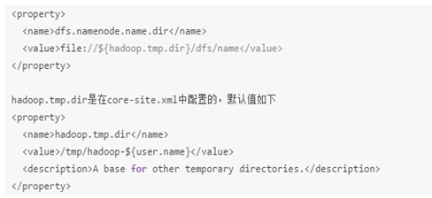

## I. HDFS其他功能

1. ### 不同集群之间的数据复制

   ##### 在我们实际工作当中，极有可能会遇到将测试集群的数据拷贝到生产环境集群，或者将生产环境集群的数据拷贝到测试集群，那么就需要我们在多个集群之间进行数据的远程拷贝，hadoop自带也有命令可以帮我们实现这个功能。

   1. #### 集群内布文件拷贝scp

      ```shell
      cd /export/softwares/
      scp -r jdk-8u141-linux-x64.tar.gz root@node2:/export/
      ```

   2. #### 跨集群之间的数据拷贝distcp

      ##### 用法：

      ```shell
      #同一个集群内 复制操作
      hadoop fs -cp /zookeeper.out /itcast
      
      #跨集群复制操作
      hadoop distcp hdfs://node1:8020/1.txt  hdfs:node5:8020/itcast
      ```

2. ### Archive档案的使用

   ​	HDFS并不擅长存储小文件，因为每个文件最少一个block，每个block的元数据都会在NameNode占用内存，如果存在大量的小文件，它们会吃掉NameNode节点的大量内存。

   ​	Hadoop Archives可以有效的处理以上问题，它可以把多个文件归档成为一个文件，归档成一个文件后还可以透明的访问每一个文件。

   1. #### 如何创建Archive

      Usage:

      ```shell
      hadoop archive -archiveName name -p <parent> <src>* <dest>
      ```

      ​           -archiveName 指要创建的存档的名称。扩展名应该是*.har。 

      ​           -p 指定文件档案文件src的相对路径。

      比如：

      ```shell
      -p /foo/bar a/b/c e/f/g
      ```

      这里的/foo/bar是a/b/c与e/f/g的父路径，所以完整路径为/foo/bar/a/b/c与/foo/bar/e/f/g。

      例如：如果你只想存档一个目录/input下的所有文件:

      ```shell
      hadoop archive -archiveName test.har -p /input  /outputdir
      ```

      这样就会在/outputdir目录下创建一个名为test.har的存档文件。

      

      

   2. #### 如何查看Archive

      ```shell
      hadoop fs -ls /outputdit/test/har
      ```

      

      ​	这里可以看到har文件包括：两个索引文件，多个part文件（本例只有一个）以及一个标识成功与否的文件。part文件是多个原文件的集合，根据index文件去找到原文件。

      ​	例如上述的三个小文件1.txt 2.txt 3.txt内容分别为1，2，3。进行archive操作之后，三个小文件就归档到test.har里的part-0一个文件里。

      

      

      ​	archive作为文件系统层暴露给外界。所以所有的fs shell命令都能在archive上运行，但是要使用不同的URI。Hadoop Archives的URI是：

      ​	har://scheme-hostname:port/archivepath/fileinarchive   

      ​	scheme-hostname格式为hdfs-域名:端口，如果没有提供scheme-hostname，它会使用默认的文件系统。这种情况下URI是这种形式：

      ​	har:///archivepath/fileinarchive   

      ​	如果用har uri去访问的话，索引、标识等文件就会隐藏起来，只显示创建档案之前的原文件：

      

      

      

   3. #### 如何解压Archive

      按顺序解压存档（串行）：

      Hadoop fs -cp har:///user/zoo/foo.har/dir1  hdfs:/user/zoo/newdir

      要并行解压存档，请使用DistCp：

      hadoop distcp har:///user/zoo/foo.har/dir1  hdfs:/user/zoo/newdir

   4. #### Archive注意事项

      1. Hadoop archives是特殊的档案格式。一个Hadoop archive对应一个文件系统目录。Hadoop archive的扩展名是*.har；

      2. 创建archives本质是运行一个Map/Reduce任务，所以应该在Hadoop集群上运行创建档案的命令； 

      3. 创建archive文件要消耗和原文件一样多的硬盘空间；

      4. archive文件不支持压缩，尽管archive文件看起来像已经被压缩过；

      5. archive文件一旦创建就无法改变，要修改的话，需要创建新的archive文件。事实上，一般不会再对存档后的文件进行修改，因为它们是定期存档的，比如每周或每日；

      6. 当创建archive时，源文件不会被更改或删除

## II. HDFS元数据管理机制

1. ### 元数据管理概述

   HDFS元数据，按类型分，主要包括以下几个部分： 

   1、文件、目录自身的属性信息，例如文件名，目录名，修改信息等。 

   2、文件记录的信息的存储相关的信息，例如存储块信息，分块情况，副本个数等。 

   3、记录HDFS的Datanode的信息，用于DataNode的管理。

   按形式分为内存元数据和元数据文件两种，分别存在**内存**和**磁盘**上。

   HDFS磁盘上元数据文件分为两类，用于持久化存储：

   **fsimage 镜像文件**：是元数据的一个持久化的检查点，包含Hadoop文件系统中的所有目录和文件元数据信息，但不包含文件块位置的信息。文件块位置信息只存储在内存中，是在 datanode加入集群的时候，namenode询问datanode得到的，并且间断的更新。

   **Edits 编辑日志**：存放的是Hadoop文件系统的所有更改操作（文件创建，删除或修改）的日志，文件系统客户端执行的更改操作首先会被记录到edits文件中。

   fsimage和edits文件都是经过序列化的，在NameNode启动的时候，它会将fsimage文件中的内容加载到内存中，之后再执行edits文件中的各项操作，使得内存中的元数据和实际的同步，存在内存中的元数据支持客户端的读操作，也是最完整的元数据。

   当客户端对HDFS中的文件进行新增或者修改操作，操作记录首先被记入edits日志文件中，当客户端操作成功后，相应的元数据会更新到内存元数据中。因为fsimage文件一般都很大（GB级别的很常见），如果所有的更新操作都往fsimage文件中添加，这样会导致系统运行的十分缓慢。

   HDFS这种设计实现着手于：一是内存中数据更新、查询快，极大缩短了操作响应时间；二是内存中元数据丢失风险颇高（断电等），因此辅佐元数据镜像文件（fsimage）+编辑日志文件（edits）的备份机制进行确保元数据的安全。

   **NameNode维护整个文件系统元数据**。因此，元数据的准确管理，影响着HDFS提供文件存储服务的能力。

2. ### 元数据目录相关文件

   在Hadoop的HDFS首次部署好配置文件之后，并不能马上启动使用，而是先要对文件系统进行格式化。需要在NameNode（NN）节点上进行如下的操作：

   $HADOOP_HOME/bin/hdfs namenode –format

   在这里要注意两个概念，一个是文件系统，此时的文件系统在物理上还不存在；二就是此处的格式化并不是指传统意义上的本地磁盘格式化，而是一些清除与准备工作。

   格式化完成之后，将会在$dfs.namenode.name.dir/current目录下创建如下的文件结构，这个目录也正是namenode元数据相关的文件目录：

   

   其中的dfs.namenode.name.dir是在hdfs-site.xml文件中配置的，默认值如下：

   

   dfs.namenode.name.dir属性可以配置多个目录，各个目录存储的文件结构和内容都完全一样，相当于备份，这样做的好处是当其中一个目录损坏了，也不会影响到Hadoop的元数据，特别是当其中一个目录是NFS（网络文件系统Network File System，NFS）之上，即使你这台机器损坏了，元数据也得到保存。

   下面对$dfs.namenode.name.dir/current/目录下的文件进行解释。

   **VERSION** 

   namespaceID=934548976

   clusterID=CID-cdff7d73-93cd-4783-9399-0a22e6dce196

   cTime=0

   storageType=NAME_NODE

   blockpoolID=BP-893790215-192.168.24.72-1383809616115

   layoutVersion=-47

   namespaceID/clusterID/blockpoolID 这些都是HDFS集群的唯一标识符。标识符被用来防止DataNodes意外注册到另一个集群中的namenode上。这些标识在联邦（federation）部署中特别重要。联邦模式下，会有多个NameNode独立工作。每个的NameNode提供唯一的命名空间（namespaceID），并管理一组唯一的文件块池（blockpoolID）。clusterID将整个集群结合在一起作为单个逻辑单元，在集群中的所有节点上都是一样的。

   storageType说明这个文件存储的是什么进程的数据结构信息（如果是DataNode，storageType=DATA_NODE）；

   cTime NameNode存储系统创建时间，首次格式化文件系统这个属性是0，当文件系统升级之后，该值会更新到升级之后的时间戳；

   layoutVersion表示HDFS永久性数据结构的版本信息，是一个负整数。

   补充说明：

   *格式化集群的时候，可以指定集群的cluster_id，但是不能与环境中其他集群有冲突。如果没有提供cluster_id，则会自动生成一个唯一的ClusterID。*

   *$HADOOP_HOME/bin/hdfs namenode -format -clusterId <cluster_id>*

   **seen_txid**

   $dfs.namenode.name.dir/current/seen_txid非常重要，是存放transactionId的文件，format之后是0，它代表的是namenode里面的edits_*文件的尾数，namenode重启的时候，会按照seen_txid的数字，循序从头跑edits_0000001~到seen_txid的数字。所以当你的hdfs发生异常重启的时候，一定要比对seen_txid内的数字是不是你edits最后的尾数。

   **Fsimage & edits**

   $dfs.namenode.name.dir/current

   目录下在format的同时也会生成fsimage和edits文件，及其对应的md5校验文件。

3. ### Fsimage、Edits

   1. #### 概述

      **fsimage**文件其实是Hadoop文件系统元数据的一个永久性的检查点，其中包含Hadoop文件系统中的所有目录和文件idnode的序列化信息；

      fsimage包含Hadoop文件系统中的所有目录和文件idnode的序列化信息；对于文件来说，包含的信息有修改时间、访问时间、块大小和组成一个文件块信息等；而对于目录来说，包含的信息主要有修改时间、访问控制权限等信息。

       

      **edits**文件存放的是Hadoop文件系统的所有更新操作的路径，文件系统客户端执行的所以写操作首先会被记录到edits文件中。

      NameNode

      起来之后，

      HDFS

      中的更新操作会重新写到

      edits

      文件中

      ，因为

      fsimage

      文件一般都很大（

      GB

      级别的很常见），如果所有的更新操作都往

      fsimage

      文件中添加，这样会导致系统运行的十分缓慢，但是如果往

      edits

      文件里面写就不会这样，每次执行写操作之后，且在向客户端发送成功代码之前，

      edits

      文件都需要同步更新。如果一个文件比较大，使得写操作需要向多台机器进行操作，只有当所有的写操作都执行完成之后，写操作才会返回成功，这样的好处是任何的操作都不会因为机器的故障而导致元数据的不同步。

   2. #### 内容查看

      fsimage、edits两个文件中的内容使用普通文本编辑器是无法直接查看的，幸运的是hadoop为此准备了专门的工具用于查看文件的内容，这些工具分别为**oev**和**oiv**，可以使用hdfs调用执行。

      oev是offline edits viewer（离线edits查看器）的缩写，该工具只操作文件因而并不需要hadoop集群处于运行状态。

         hdfs oev   -i edits_0000000000000000081-0000000000000000089 -o edits.xml   

      -i,--inputFile <arg>   

      -o,--outputFile <arg>  Name of output file.

      在输出文件中，每个

      RECORD

      记录了一次操作, 示例如下：

      

      oiv是offline image viewer的缩写，用于将fsimage文件的内容转储到指定文件中以便于阅读，该工具还提供了只读的WebHDFS API以允许离线分析和检查hadoop集群的命名空间。oiv在处理非常大的fsimage文件时是相当快的，如果该工具不能够处理fsimage，它会直接退出。该工具不具备向后兼容性，比如使用hadoop-2.4版本的oiv不能处理hadoop-2.3版本的fsimage，只能使用hadoop-2.3版本的oiv。同oev一样，就像它的名称所提示的（offline），oiv也不需要hadoop集群处于运行状态。

      ​	hdfs oiv   -i fsimage_0000000000000000115 -p XML -o fsimage.xml

      

## III. Secondary NameNode

1. ### Checkpoint

   1. #### Checkpoint详细步骤

   2. #### Checkpoint触发条件

## IV. HDFS安全模式

1. ### 安全模式概述

   安全模式是HDFS所处的一种特殊状态，在这种状态下，文件系统只接受读数据请求，而不接受删除、修改等变更请求，是一种保护机制，用于保证集群中的数据块的安全性。

   在NameNode主节点启动时，HDFS首先进入安全模式，集群会开始检查数据块的完整性。DataNode在启动的时候会向namenode汇报可用的block信息，当整个系统达到安全标准时，HDFS自动离开安全模式。

   假设我们设置的副本数（即参数dfs.replication）是5，那么在Datanode上就应该有5个副本存在，假设只存在3个副本，那么比例就是3/5=0.6。在配置文件hdfs-default.xml中定义了一个最小的副本的副本率（即参数dfs.namenode.safemode.threshold-pct）0.999。

   我们的副本率0.6明显小于0.99，因此系统会自动的复制副本到其他的DataNode,使得副本率不小于0.999.如果系统中有8个副本，超过我们设定的5个副本，那么系统也会删除多余的3个副本。

   如果HDFS处于安全模式下，不允许HDFS客户端进行任何修改文件的操作, 包括上传文件，删除文件，重命名，创建文件夹,修改副本数等操作。

2. ### 安全模式配置

   与安全模式相关主要配置在hdfs-site.xml文件中，主要有下面几个属性:

   dfs.namenode.replication.min: 每个数据块最小副本数量，默认为1. 在上传文件时，达到最小副本数，就认为上传是成功的。

   dfs.namenode.safemode.threshold-pct: 达到最小副本数的数据块的百分比。默认为0.999f。当小于这个比例，那就将系统切换成安全模式，对数据块进行复制；当大于该比例时，就离开安全模式，说明系统有足够的数据块副本数，可以对外提供服务。小于等于0意味不进入安全模式，大于1意味一直处于安全模式。

   dfs.namenode.safemode.min.datanodes: 离开安全模式的最小可用datanode数量要求，默认为0.也就是即使所有datanode都不可用，仍然可以离开安全模式。

   dfs.namenode.safemode.extension: 当集群可用block比例，可用datanode都达到要求之后，如果在extension配置的时间段之后依然能满足要求，此时集群才离开安全模式。单位为毫秒，默认为30000.也就是当满足条件并且能够维持30秒之后，离开安全模式。 这个配置主要是对集群稳定程度做进一步的确认。避免达到要求后马上又不符合安全标准。

   总结一下，要离开安全模式，需要满足以下条件： 

   1）达到副本数量要求的block比例满足要求； 

   2）可用的datanode节点数满足配置的数量要求； 

   3） 1、2 两个条件满足后维持的时间达到配置的要求

3. ### 安全模式命令

   手动进入安全模式

      hdfs dfsadmin -safemode enter   

   手动进入安全模式对于集群维护或者升级的时候非常有用，因为这时候HDFS上的数据是只读的。手动退出安全模式可以用下面命令：

      hdfs dfsadmin -safemode leave   

   如果你想获取到集群是否处于安全模式，可以用下面的命令获取：

      hdfs dfsadmin -safemode get

