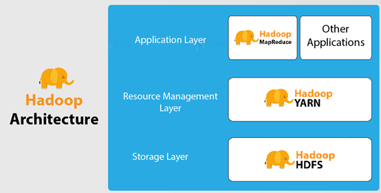
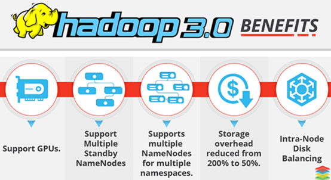
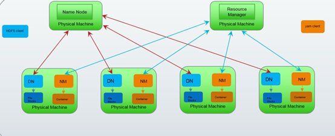

# Apache Hadoop

## I. Apache Hadoop

1. ### Hadoop介绍

   Hadoop是Apache旗下一个用Java实现的开源软件框架，是一个开发和运行处理大规模数据的软件平台。允许使用简单的编程模型在==**大量计算机集群**==上对大型数据集进行==**分布式处理**==。

   Hadoop的核心组件有：

   ##### 	HDFS（分布式文件系统）：解决海量数据存储

   ##### 	YARN（作业调度和集群资源管理的框架）：解决资源任务调度

   ##### 	MAPREDUCE（分布式运算编程框架）：解决海量数据计算

   

   广义上说，Hadoop也指==**Hadoop生态圈**==：

   

   当下的Hadoop已经成长为一个庞大的体系，随着生态系统的成长，新出现的项目越来越多，其中不乏一些非Apache主管的项目，这些项目对HADOOP是很好的补充或者更高层的抽象。

2. ### Hadoop发展简史

   ​	Hadoop是Apache Lucene创始人 Doug Cutting 创建的。最早起源于Nutch，它是Lucene的子项目。Nutch的设计目标是构建一个大型的全网搜索引擎，包括网页抓取、索引、查询等功能，但随着抓取网页数量的增加，遇到了严重的可扩展性问题：如何解决数十亿网页的存储和索引问题。

   ​	2003年Google发表了一篇论文为该问题提供了可行的解决方案。论文中描述的是谷歌的产品架构，该架构称为：谷歌分布式文件系统（GFS）,可以解决他们在网页爬取和索引过程中产生的超大文件的存储需求。

   ​	2004年 Google发表论文向全世界介绍了谷歌版的MapReduce系统。

   ​	同时期，Nutch的开发人员完成了相应的开源实现HDFS和MAPREDUCE，并从Nutch中剥离成为独立项目HADOOP，到2008年1月，HADOOP成为Apache顶级项目，迎来了它的快速发展期。

   ​	2006年Google发表了论文是关于BigTable的，这促使了后来的Hbase的发展。

   ​	因此，Hadoop及其生态圈的发展离不开Google的贡献。

3. ### Hadoop特性优点

   Scalable扩容能力：Hadoop是在可用的计算机集群间分配数据并完成计算任务的，这些集群可以方便地扩展到数以千计的节点中。

   Economical经济（成本低）：Hadoop通过普通廉价的及其组成服务器集群来分发以及处理数据，所以成本很低。

   Efficient效率高：通过并发数据，Hadoop可以在节点之间动态并行地移动数据，所以速度非常快。

   Reliable可靠性高：能自动维护数据的多份复制，并且在任务失败后能自动地重新部署（redeploy）计算任务，所以Hadoop的按位存储和处理数据的能力值得人们信赖。

4. ### Hadoop国内外应用

   ​	不管是国内还是国外，Hadoop最受青睐的行业是互联网领域，可以说互联网公司是hadoop的主要使用力量。

   ​	国外来说，Yahoo、Facebook、IBM等公司都大量使用hadoop集群来支撑业务。比如：

   ​		Yahoo的Hadoop应用在支持广告系统、用户行为分析、支持Web搜索等。

   ​		Facebook主要使用Hadoop存储内部日志与多维数据，并以此作为报告、分析和机器学习的数据源。

   ​		国内来说，BAT领头的互联网公司是当仁不让的Hadoop使用者、维护者。比如Ali云梯（14年国内最大Hadoop集群）、百度的日志分析平台、推荐引擎系统等。

   

   ​	国内其他非互联网领域也有不少hadoop的应用，比如：

   ​		金融行业： 个人征信分析

   ​		证券行业： 投资模型分析

   ​		交通行业： 车辆、路况监控分析

   ​		电信行业： 用户上网行为分析

   ​	总之：hadoop并不会跟某种具体的行业或者某个具体的业务挂钩，它只是一种用来做海量数据分析处理的工具。

## II. Hadoop集群搭建

1. ### 发行版本

   Hadoop发行版本分为开源**社区版**和**商业版**。

   社区版是指由Apache软件基金会维护的版本，是官方维护的版本体系。

   <https://hadoop.apache.org/>

   

   商业版Hadoop是指由第三方商业公司在社区版Hadoop基础上进行了一些修改、整合以及各个服务组件兼容性测试而发行的版本，比较著名的有**cloudera的CDH**、mapR、hortonWorks等。

   <https://www.cloudera.com/products/open-source/apache-hadoop/key-cdh-components.html>

   

   Hadoop的版本很特殊，是由多条分支并行的发展着。大的来看分为3个大的系列版本：1.x、2.x、3.x。

   Hadoop1.0由一个分布式文件系统HDFS和一个离线计算框架MapReduce组成。架构落后，已经淘汰。

   Hadoop 2.0则包含一个分布式文件系统HDFS，一个资源管理系统YARN和一个离线计算框架MapReduce。相比于Hadoop1.0，Hadoop 2.0功能更加强大，且具有更好的扩展性、性能，并支持多种计算框架。

   
        Hadoop 3.0相比之前的Hadoop 2.0有一系列的功能增强。目前已经趋于稳定，可能生态圈的某些组件还没有升级、整合完善。

   

   课程中使用的是：Apache Hadoop 3.3.0。

2. ### 集群简介

   HADOOP集群具体来说包含两个集群：HDFS集群和YARN集群，两者逻辑上分离，但物理上常在一起。

   HDFS集群负责海量数据的存储，集群中的角色主要有：

   NameNode、DataNode、SecondaryNameNode

   YARN集群负责海量数据运算时的资源调度，集群中的角色主要有：

   ResourceManager、NodeManager

   

   那mapreduce是什么呢？它其实是一个分布式运算编程框架，是应用程序开发包，由用户按照编程规范进行程序开发，后打包运行在HDFS集群上，并且受到YARN集群的资源调度管理。

   Hadoop部署方式分三种，Standalone mode（独立模式）、Pseudo-Distributed mode（伪分布式模式）、Cluster mode（群集模式），其中前两种都是在单机部署。

   独立模式又称为单机模式，仅1个机器运行1个java进程，主要用于调试。

   伪分布模式也是在1个机器上运行HDFS的NameNode和DataNode、YARN的 ResourceManger和NodeManager，但分别启动单独的java进程，主要用于调试。

   集群模式主要用于生产环境部署。会使用N台主机组成一个Hadoop集群。这种部署模式下，主节点和从节点会分开部署在不同的机器上。

   我们以3节点为例进行搭建，角色分配如下：

   node1	NameNode（NN)	DataNode(DN)	ResourceManager(RM)

   node2	DataNode	NodeManager(NM)	SecondaryNameNode(SN)

   node3	DataNode	NodeManager

3. ### 服务器基础环境准备

   1. #### 配置好各虚拟机的网络（采用NAT联网模式）

   2. #### 修改各个虚拟机主机名

   > `vi /etc/hostname

   

   > node1.itcast.cn    

   3. #### 修改主机名和IP的映射关系

   > vi /etc/hosts

   

   > 192.168.227.251     node1.itcast.cn node1
   >
   > 192.168.227.252     node2.itcast.cn node2
   >
   > 192.168.227.253     node3.itcast.cn node3

   4. #### 关闭防火墙

      > \#查看防火墙状态
      >
      > systemctl status firewalld.service
      >
      > \#关闭防火墙
      >
      > systemctl stop firewalld.service
      >
      > \#关闭防火墙开机启动
      >
      > systemctl disable firewalld.service

   5. #### 配置ssh免登陆(配置node1-->node1,node2,node3)

      > \#node1生成ssh免登陆密钥
      >
      > ssh-keygen -t rsa （一直回车）
      >
      > #执行完这个命令后，会生成两个文件id_rsa（私钥）、id_rsa.pub（公钥）
      >
      > #将公钥拷贝到要免密登陆的目标机器上
      >
      > ssh-copy-id node1
      >
      > ssh-copy-id node2
      >
      > ssh-copy-id node3

   6. #### 同步集群时间

      > yum install ntpdate

      

      > ntpdate cn.pool.ntp.org

4. ### JDK环境安装

   1. 上传jdk

      > jdk-8u65-linux-x64.tar.gz

   2. 解压jdk

      > tar -zxvf jdk-8u65-linux-x64.tar.gz -C /export/server

   3. 将java添加到环境变量中

      > vim /etc/profile
      >
      > \#在文件最后添加
      >
      > export JAVA_HOME=/export/server/jdk1.8.0_65
      >
      > export PATH=$PATH:$JAVA_HOME/bin
      >
      > export CLASSPATH=.:$JAVA_HOME/lib/dt.jar:$JAVA_HOME/lib/tools.jar
      >
      > 
      >
      > \#刷新配置
      >
      > source /etc/profile

5. ### Hadoop重新编译

   ​	Hadoop官方一般都给出了对应版本安装包，一般情况下是不需要自己进行编译的，但是由于官方编译好的hadoop的安装包没有提供带C程序访问的接口，所以在使用本地库（**本地库可以用来做压缩，以及支持C程序等等**）的时候就会出问题，因此生产环境中，一般会重新编译。

   ​	此外，作为开源软件，针对源码进行修改某些属性，之后也需要重编译。

   ​	可以使用课程提供编译好的安装包。

6. ### Hadoop安装包目录结构

   解压hadoop-3.3.0-Centos7-64-with-snappy.tar.gz，目录结构如下：

   **bin**：Hadoop最基本的管理脚本和使用脚本的目录，这些脚本是sbin目录下管理脚本的基础实现，用户可以直接使用这些脚本管理和使用Hadoop。

   **etc**：Hadoop配置文件所在的目录，包括core-site,xml、hdfs-site.xml、mapred-site.xml等从Hadoop1.0继承而来的配置文件和yarn-site.xml等Hadoop2.0新增的配置文件。

   **include**：对外提供的编程库头文件（具体动态库和静态库在lib目录中），这些头文件均是用C++定义的，通常用于C++程序访问HDFS或者编写MapReduce程序。

   **lib**：该目录包含了Hadoop对外提供的编程动态库和静态库，与include目录中的头文件结合使用。

   **libexec**：各个服务对用的shell配置文件所在的目录，可用于配置日志输出、启动参数（比如JVM参数）等基本信息。

   **sbin**：Hadoop管理脚本所在的目录，主要包含HDFS和YARN中各类服务的启动/关闭脚本。

   **share**：Hadoop各个模块编译后的jar包所在的目录，官方自带示例。

7. ### Hadoop配置文件修改

   1. #### hadoop-env.sh

      ```shell
      export JAVA_HOME=/export/server/jdk1.8.0_241
      
      export HDFS_NAMENODE_USER=root
      export HDFS_DATANODE_USER=root
      export HDFS_SECONDARYNAMENODE_USER=root
      export YARN_RESOURCEMANAGER_USER=root
      export YARN_NODEMANAGER_USER=root 
      ```

   2. #### core-site.xml

      ```xml
      <configuration>
      	<!-- 设置默认使用的文件系统 Hadoop支持file、HDFS、GFS、ali|Amazon云等文件系统 -->
      	<property>
      		<name>fs.defaultFS</name>
      		<value>hdfs://node1:8020</value>
      	</property>
      
      	<!-- 设置Hadoop本地保存数据路径 -->
      	<property>
      		<name>hadoop.tmp.dir</name>
      		<value>/export/data/hadoop-3.3.0</value>
      	</property>
      
      	<!-- 设置HDFS web UI用户身份 -->
      	<property>
      		<name>hadoop.http.staticuser.user</name>
      		<value>root</value>
      	</property>
      
      	<!-- 整合hive 用户代理设置 -->
      	<property>
      		<name>hadoop.proxyuser.root.hosts</name>
      		<value>*</value>
      	</property>
      
      	<property>
      		<name>hadoop.proxyuser.root.groups</name>
      		<value>*</value>
      	</property>
      
      	<property>
      		<name>fs.trash.interval</name>
      		<value>1440</value>
      	</property>
      </configuration>
      ```

   3. #### hdfs-site.xml

      ```xml
      <configuration>
      	<!-- 设置SNN进程运行机器位置信息 -->
      	<property>
      		<name>dfs.namenode.secondary.http-address</name>
      		<value>node2:9868</value>
      	</property>
      </configuration>
      ```

   4. #### mapred-site.xml

      ```xml
      <configuration>
      	<!-- 设置MR程序默认运行模式： yarn集群模式 local本地模式 -->
      	<property>
      	  <name>mapreduce.framework.name</name>
      	  <value>yarn</value>
      	</property>
      
      	<!-- MR程序历史服务器端地址 -->
      	<property>
      	  <name>mapreduce.jobhistory.address</name>
      	  <value>node1:10020</value>
      	</property>
      	 
      	<!-- 历史服务器web端地址 -->
      	<property>
      	  <name>mapreduce.jobhistory.webapp.address</name>
      	  <value>node1:19888</value>
      	</property>
      
      	<property>
      	  <name>yarn.app.mapreduce.am.env</name>
      	  <value>HADOOP_MAPRED_HOME=${HADOOP_HOME}</value>
      	</property>
      
      	<property>
      	  <name>mapreduce.map.env</name>
      	  <value>HADOOP_MAPRED_HOME=${HADOOP_HOME}</value>
      	</property>
      
      	<property>
      	  <name>mapreduce.reduce.env</name>
      	  <value>HADOOP_MAPRED_HOME=${HADOOP_HOME}</value>
      	</property>
      </configuration>
      ```

   5. #### yarn-site.xml

      ```xml
      <configuration>
      	<!-- 设置YARN集群主角色运行机器位置 -->
      	<property>
      		<name>yarn.resourcemanager.hostname</name>
      		<value>node1</value>
      	</property>
      
      	<property>
      		<name>yarn.nodemanager.aux-services</name>
      		<value>mapreduce_shuffle</value>
      	</property>
      
      	<!-- 是否将对容器实施物理内存限制 -->
      	<property>
      		<name>yarn.nodemanager.pmem-check-enabled</name>
      		<value>false</value>
      	</property>
      
      	<!-- 是否将对容器实施虚拟内存限制。 -->
      	<property>
      		<name>yarn.nodemanager.vmem-check-enabled</name>
      		<value>false</value>
      	</property>
      
      	<!-- 开启日志聚集 -->
      	<property>
      	  <name>yarn.log-aggregation-enable</name>
      	  <value>true</value>
      	</property>
      
      	<!-- 设置yarn历史服务器地址 -->
      	<property>
      		<name>yarn.log.server.url</name>
      		<value>http://node1:19888/jobhistory/logs</value>
      	</property>
      
      	<!-- 保存的时间7天 -->
      	<property>
      	  <name>yarn.log-aggregation.retain-seconds</name>
      	  <value>604800</value>
      	</property>
      </configuration>
      ```

   6. #### workers

      ```shell
      node1
      node2
      node3
      ```

8. ### scp同步安装包

   ```shell
   cd /export/server
   
   scp -r hadoop-3.3.0 root@node2:$PWD
   scp -r hadoop-3.3.0 root@node3:$PWD
   ```

9. ### Hadoop环境变量

   ```shell
   vim /etc/proflie
   
   export HADOOP_HOME=/export/server/hadoop-3.3.0
   export PATH=$PATH:$HADOOP_HOME/bin:$HADOOP_HOME/sbin
   :wq
   
   scp profile root@node2:$PWD
   scp profile root@node3:$PWD
   
   source /etc/profile
   ```

## III. Hadoop集群启动、初体验

1. ### 启动方式

   要启动Hadoop集群，需要启动HDFS和YARN两个集群

   **首次启动HDFS时，要对其进行格式化操作**，本质上是一些清理和准备工作，因为此时的HDFS在物理上还是不存在的。

   ```shell
   hadoop namenode -format
   ```

   1. #### 单节点逐个启动

      在主节点上使用以下命令启动HDFS NameNode：

      ```shell
      $HADOOP_HOME/bin/hdfs --daemon start namenode
      ```

      在每个从节点上使用以下命令启动HDFS DataNode：

      ```shell
      $HADOOP_HOME/bin/hdfs --daemon start datanode
      ```

      在node2上使用以下命令启动HDFS SecondaryNameNode：

      ```shell
      $HADOOP_HOME/bin/hdfs --daemon start secondarynamenode
      ```

      在主节点上使用以下命令启动YARN ResourceManager：

      ```shell
      $HADOOP_HOME/bin/yarn --daemon start resourcemanager
      ```

      在每个从节点上使用以下命令启动YARN nodemanager：

      ```shell
      $HADOOP_HOME/bin/yarn --daemon start nodemanager
      ```

      如果想要停止某个节点上某个角色，只需要把命令中的**start**改为**stop**即可。

   2. #### 脚本一键启动

      ​	如果配置了etc/hadoop/workers和ssh免密登录，则可以使用程序脚本启动所有Hadoop两个集群的相关进程，在主节点所设定的机器上执行。

      ```shell
      $HADOOP_HOME/sbin/start-dfs.sh
      $HADOOP_HOME/sbin/start-yarn.sh
      
      $HADOOP_HOME/sbin/stop-dfs.sh
      $HADOOP_HOME/sbin/stop-yarn.sh
      ```

2. ### 集群web-ui

   一旦Hadoop集群启动并运行，可以通过web-ui进行集群查看，如下所述：

   - HDFS集群：http://node1:9870/
   - YARN集群：http://node1:8088/

   

   

3. ### Hadoop初体验

   1. #### HDFS使用

      

   2. #### 运行MapReduce程序

      

## IV. MapReduce jobHistory

1. ### 修改mapred-site.xml

   

2. ### 分发配置到其他机器

   

3. ### 启动jobHistoryServer服务进程

   

4. ### 页面访问jobhistoryserver

   

## V. HDFS的垃圾桶机制

1. ### 垃圾桶机制解析

   

2. ### 垃圾桶机制配置

   

3. ### 垃圾桶机制验证

   