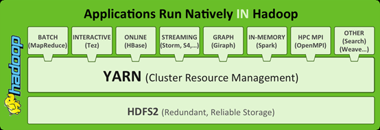
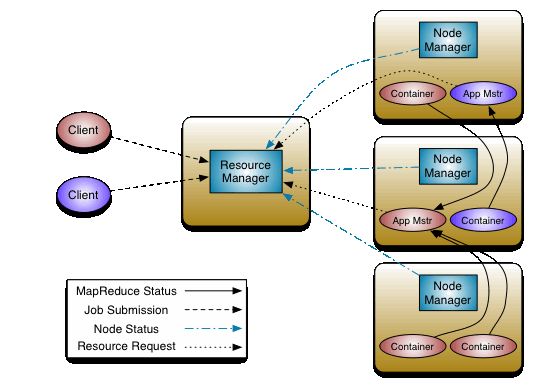
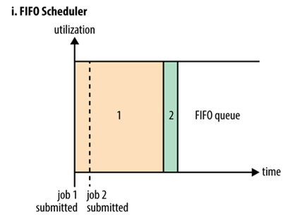

## I. Shuffle机制

**map阶段处理的数据如何传递给reduce阶段**，是MapReduce框架中最关键的一个流程，这个流程就叫**shuffle**。

shuffle: 洗牌、发牌——（核心机制：**数据分区，排序，合并**）。

shuffle是Mapreduce的核心，它分布在Mapreduce的map阶段和reduce阶段。一般把从**Map产生输出开始到Reduce取得数据作为输入之前的过程称作shuffle**。

Map阶段Shuffle: 

1. Collect阶段：将MapTask的结果输出到默认大小为100M的**环形缓冲区**，保存的是key/value，Partition分区信息等。

2. Spill阶段：当**内存**中的数据量达到一定的阀值的时候，就会将数据写入**本地磁盘**，在将数据写入磁盘之前需要对数据进行一次排序的操作，如果配置了combiner，还会将有相同分区号和key的数据进行排序。 

3. Merge阶段：把所有溢出的临时文件进行一次合并操作，以确保一个MapTask最终只产生一个中间数据文件。

Reduce阶段Shuffle:

4. Copy阶段： ReduceTask启动Fetcher线程到已经完成MapTask的节点上复制一份属于自己的数据，这些数据默认会保存在**内存**的缓冲区中，当内存的缓冲区达到一定的阀值的时候，就会将数据写到**磁盘**之上。

5. Merge阶段：在ReduceTask远程复制数据的同时，会在后台开启两个线程对**内存**到**本地**的数据文件进行合并操作。

6. Sort阶段：在对数据进行合并的同时，会进行排序操作，由于MapTask阶段已经对数据进行了局部的排序，ReduceTask只需保证Copy的数据的最终整体有效性即可。

Shuffle中的缓冲区大小会影响到mapreduce程序的执行效率，原则上说，缓冲区越大，磁盘io的次数越少，执行速度就越快, **Shuffle中频繁涉及数据在内存, 磁盘之间的多次往复**

### MR的弊端: 1. Shuffle过程繁琐; 2. 磁盘内存间反复横跳; 3. 业务复杂, 一个MR处理不完, 只能创建多个MR串行处理.

## II. Apache Hadoop YARN

### Yet Another Resource Negotiator, 一种新的Hadoop通用资源管理器

1. ### YARN通俗介绍

   

   YARN是一个**通用**资源管理系统和**调度**平台，可为上层应用提供统一的**资源管理**和**调度**，它的引入为集群在**利用率、资源统一管理和数据共享等方面**带来了巨大好处。

   可以把yarn理解为相当于一个分布式的操作系统平台，而mapreduce等运算程序则相当于运行于操作系统之上的应用程序，Yarn为这些程序提供运算所需的资源（内存、cpu）。

   - yarn并不清楚用户提交的程序的运行机制

   - yarn只提供运算资源的调度（用户程序向yarn申请资源，yarn就负责分配资源）

   - yarn中的主管角色叫ResourceManager

   - yarn中具体提供运算资源的角色叫NodeManager

   - yarn与运行的用户程序**完全解耦**，意味着yarn上可以运行各种类型的分布式运算程序，比如**mapreduce、storm，spark，tez**……

   - **spark**、**storm**等运算框架都可以整合在yarn上运行，只要他们各自的框架中有符合yarn规范的资源请求机制即可

   YARN成为一个通用的资源调度平台.企业中以前存在的各种运算集群都可以整合在一个物理集群上，提高资源利用率，方便数据共享

2. ### YARN基本架构

   

   YARN是一个资源管理、任务调度的框架，主要包含三大模块：ResourceManager（RM）、NodeManager（NM）、ApplicationMaster（AM）。

   **ResourceManager**负责所有资源的监控、分配和管理；

   **ApplicationMaster**负责每一个具体应用程序的调度和协调；

   **NodeManager**负责每一个节点的维护。

   对于所有的applications，RM拥有绝对的控制权和对资源的分配权。而每个AM则会和RM协商资源，同时和NodeManager通信来执行和监控task

3. ### YARN三大组件

   1. #### ResourceManager

      - ResourceManager负责整个集群的资源管理和分配，是一个全局的资源管理系统。
      - NodeManager以心跳的方式向ResourceManager汇报资源使用情况（目前主要是CPU和内存的使用情况）。RM只接受NM的资源回报信息，对于具体的资源处理则交给NM自己处理
      - YARN Scheduler根据application的请求为其分配资源，不负责application job的监控、追踪、运行状态反馈、启动等工作

   2. #### NodeManager

      - NodeManager是每个节点上的资源和任务管理器，它是管理这台机器的代理，负责该节点程序的运行，以及该节点资源的管理和监控。YARN集群每个节点都运行一个NodeManager
      - NodeManager定时向ResourceManager汇报本节点资源（CPU、内存）的使用情况和Container的运行状态。当ResourceManager宕机时NodeManager自动连接RM备用节点
      - NodeManager接收并处理来自ApplicationMaster的Container启动、停止等各种请求

   3. #### ApplicationMaster

      - 用户提交的每个应用程序均包含一个ApplicationMaster，它可以运行在ResourceManager以外的机器上

      - 负责与RM调度器协商以获取资源（用Container表示）

      - 将得到的任务进一步分配给内部的任务(资源的二次分配)

      - 与NM通信以启动/停止任务

      - 监控所有任务运行状态，并在任务运行失败时重新为任务申请资源以重启任务。

      - 当前YARN自带了两个ApplicationMaster实现，一个是用于演示AM编写方法的实例程序DistributedShell，它可以申请一定数目的Container以并行运行一个Shell命令或者Shell脚本；另一个是运行MapReduce应用程序的AM—MRAppMaster。

        **注**：RM只负责监控AM，并在AM运行失败时候启动它。RM不负责AM内部任务的容错，任务的容错由AM完成。

4. ### YARN运行流程

   - client向RM提交应用程序，其中包括启动该应用的ApplicationMaster的必须信息，例如ApplicationMaster程序、启动ApplicationMaster的命令、用户程序等。

   - ResourceManager启动一个container用于运行ApplicationMaster。

   - 启动中的ApplicationMaster向ResourceManager注册自己，启动成功后与RM保持心跳。

   - ApplicationMaster向ResourceManager发送请求，申请相应数目的container。

   - ResourceManager返回ApplicationMaster的申请的containers信息。申请成功的container，由ApplicationMaster进行初始化。container的启动信息初始化后，AM与对应的NodeManager通信，要求NM启动container。AM与NM保持心跳，从而对NM上运行的任务进行监控和管理。

   - container运行期间，ApplicationMaster对container进行监控。container通过RPC协议向对应的AM汇报自己的进度和状态等信息。

   - 应用运行期间，client直接与AM通信获取应用的状态、进度更新等信息。

   - 应用运行结束后，ApplicationMaster向ResourceManager注销自己，并允许属于它的container被收回。

   

5. ### YARN调度器Scheduler

   理想情况下，我们应用对Yarn资源的请求应该立刻得到满足，但现实情况资源往往是有限的，特别是在一个很繁忙的集群，一个应用资源的请求经常需要等待一段时间才能的到相应的资源。在**Yarn中，负责给应用分配资源的就是Scheduler**。其实调度本身就是一个难题，很难找到一个完美的策略可以解决所有的应用场景。为此，Yarn提供了多种调度器和可配置的策略供我们选择。

   在Yarn中有三种调度器可以选择：**FIFO Scheduler**，**Capacity Scheduler**，**Fair Scheduler**。

   1. #### FIFO Scheduler

      **FIFO** Scheduler把应用按提交的顺序排成一个队列，这是一个**先进先出**队列，在进行资源分配的时候，先给队列中最头上的应用进行分配资源，待最头上的应用需求满足后再给下一个分配，以此类推。

      

      FIFO Scheduler是最简单也是最容易理解的调度器，也不需要任何配置，但它并不适用于共享集群。大的应用可能会占用所有集群资源，这就导致其它应用被阻塞。在共享集群中，更适合采用Capacity Scheduler或Fair Scheduler，这两个调度器都允许大任务和小任务在提交的同时获得一定的系统资源

   2. #### Capacity Scheduler

      

   3. #### Fair Scheduler

      

   4. #### 示例: Capacity调度器配置使用

      

## III. Hadoop High Availability(HA)

1. ### NameNode HA

   1. #### NameNode HA

      

   2. #### Failover Controller

      

2. ### YARN HA

   

3. ### Hadoop HA集群的搭建

   

