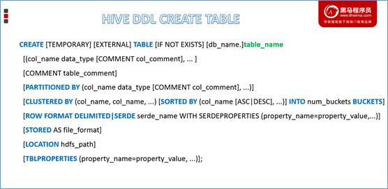
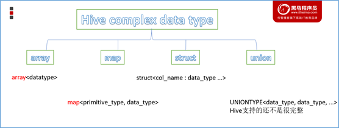
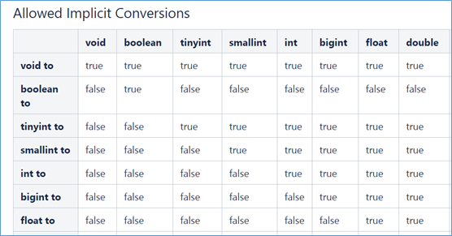
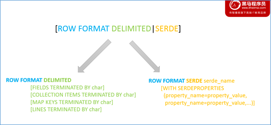
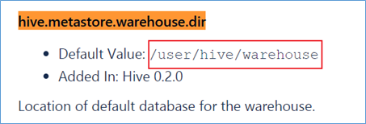
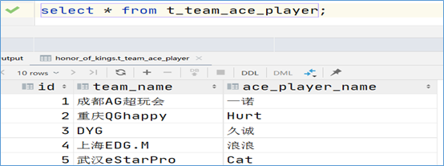
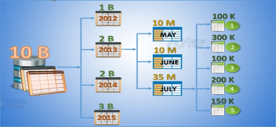
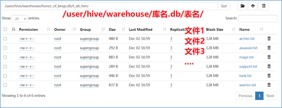

# Hive SQL- DDL, DML语法

## I. HQL数据定义语言(DDL)概述

### 1. DDL语法的作用

数据定义语言 (Data Definition Language, DDL)，是SQL语言集中对数据库内部的对象结构进行创建，删除，修改等的操作语言，这些数据库对象包括database（schema）、table、view、index等。核心语法由**CREATE**、**ALTER**与**DROP**三个所组成。DDL并不涉及表内部数据的操作。

在某些上下文中，该术语也称为数据描述语言，因为它描述了数据库表中的字段和记录。

```sql
create table uits
(id integer,
name char(20),
semester integer,
year integer);
```

### 2. Hive中DDL使用

Hive SQL（HQL）与SQL的语法大同小异，基本上是相通的，学过SQL的使用者可以无痛使用Hive SQL。只不过在学习HQL语法的时候，特别要注意Hive自己特有的语法知识点，比如partition相关的DDL操作。

基于Hive的设计、使用特点，**HQL中create语法（尤其create table）将是学习掌握DDL语法的重中之重**。可以说建表是否成功直接影响数据文件是否映射成功，进而影响后续是否可以基于SQL分析数据。通俗点说，没有表，表没有数据，你分析什么呢？

选择正确的方向,往往比盲目努力重要。

## II. Hive DDL建表基础

### 1. 完整建表语法树



> **蓝色**字体是建表语法的关键字，用于指定某些功能。

> **[ ]**中括号的语法表示可选。

> **|**表示使用的时候，左右语法二选一。

> 建表语句中的语法顺序要和上述语法规则保持一致。

### 2. Hive数据类型详解

#### 2.1. 整体概述

​	Hive中的数据类型指的是Hive表中的列字段类型。Hive数据类型整体分为两个类别：**原生数据类型**（primitive data type）和**复杂数据类型**（complex data type）。

​	原生数据类型包括：数值类型、时间类型、字符串类型、杂项数据类型；

​	复杂数据类型包括：array数组、map映射、struct结构、union联合体。


​	Hive的数据类型: 

 		1. 英文字母大小写不敏感
 		2. 除SQL数据类型外, 还支持Java数据类型, 比如String
 		3. int和string是使用最多的数据类型, 大多数函数都支持
 		4. 复杂数据类型的使用通常需要和分隔符指定语法配合使用
 		5. 如果定义的数据类型和文件不一致, hive会尝试隐式转换, 但是不保证成功

#### 2.2. 原生数据类型

Hive支持的原生数据类型如下图所示：


其中标注的数据类型是使用较多的，详细的描述请查询语法手册：

<https://cwiki.apache.org/confluence/display/Hive/LanguageManual+Types>

#### 2.3. 复杂数据类型

Hive支持的复杂数据类型如下图所示：



其中标注的数据类型是使用较多的，详细的描述请查询语法手册：

<https://cwiki.apache.org/confluence/display/Hive/LanguageManual+Types>

#### 2.4. 数据类型隐式, 显示转换

与SQL类似，HQL支持隐式和显式类型转换。 

原生类型从窄类型到宽类型的转换称为隐式转换，反之，则不允许。 

下表描述了类型之间允许的隐式转换：



<https://cwiki.apache.org/confluence/display/Hive/LanguageManual+Types>

显式类型转换使用CAST函数。

例如，CAST（'100'as INT）会将100字符串转换为100整数值。 如果强制转换失败，例如CAST（'INT'as INT），该函数返回NULL。


### 3. Hive读写文件机制

#### 3.1. SerDe是什么

SerDe是Serializer、Deserializer的简称，目的是用于序列化和反序列化。序列化是对象转化为字节码的过程；而反序列化是字节码转换为对象的过程。

Hive使用SerDe（和FileFormat）读取和写入行对象。


需要注意的是，“key”部分在读取时会被忽略，而在写入时key始终是常数。基本上**行对象存储在“value”中**。

可以通过desc formatted tablename查看表的相关SerDe信息。默认如下：


#### 3.2. Hive读写文件流程

**Hive读取文件机制**：首先调用InputFormat（默认TextInputFormat），返回一条一条kv键值对记录（默认是一行对应一条记录）。然后调用SerDe（默认LazySimpleSerDe）的Deserializer，将一条记录中的value根据分隔符切分为各个字段。

**Hive写文件机制**：将Row写入文件时，首先调用SerDe（默认LazySimpleSerDe）的Serializer将对象转换成字节序列，然后调用OutputFormat将数据写入HDFS文件中。

#### 3.3. SerDe相关语法

在Hive的建表语句中，和SerDe相关的语法为：



其中ROW FORMAT是语法关键字，DELIMITED和SERDE二选其一。

如果使用delimited表示使用默认的LazySimpleSerDe类来处理数据。如果数据文件格式比较特殊可以使用ROW FORMAT SERDE serde_name指定其他的Serde类来处理数据,甚至支持用户自定义SerDe类。

#### 3.4. LazySimpleSerDe分隔符指定

LazySimpleSerDe是Hive默认的序列化类，包含4种子语法，分别用于指定**字段之间**、**集合元素之间**、**map映射 kv之间**、**换行**的分隔符号。在建表的时候可以根据数据的特点灵活搭配使用。


#### 3.5. 默认分隔符

hive建表时如果没有row
format语法。此时**字段之间默认的分割符是'\001'**，是一种特殊的字符，使用的是ascii编码的值，键盘是打不出来的。


在vim编辑器中，连续按下Ctrl+v/Ctrl+a即可输入'\001' ，显示**^A**


在一些文本编辑器中将以SOH的形式显示：


### 4. Hive数据存储路径

#### 4.1. 默认存储路径

Hive表默认存储路径是由${HIVE_HOME}/conf/hive-site.xml配置文件的hive.metastore.warehouse.dir属性指定。默认值是：/user/hive/warehouse。



在该路径下，文件将根据所属的库、表，有规律的存储在对应的文件夹下。


#### 4.2. 指定存储路径

在Hive建表的时候，可以通过**location语法来更改数据在HDFS上的存储路径**，使得建表加载数据更加灵活方便。

语法：

```sql
LOCATION '<hdfs_location>'
```

对于已经生成好的数据文件，使用location指定路径将会很方便。

### 5. 案例: 王者荣耀

#### 5.1. 原生数据类型案例

文件archer.txt中记录了手游《王者荣耀》射手的相关信息，内容如下所示，其中字段之间分隔符为制表符\t,要求在Hive中建表映射成功该文件。

```shell
1	后羿	5986	1784	396	336	remotely	archer
2	马可波罗	5584	200	362	344	remotely	archer
3	鲁班七号	5989	1756	400	323	remotely	archer
4	李元芳	5725	1770	396	340	remotely	archer
5	孙尚香	6014	1756	411	346	remotely	archer
6	黄忠	5898	1784	403	319	remotely	archer
7	狄仁杰	5710	1770	376	338	remotely	archer
8	虞姬	5669	1770	407	329	remotely	archer
9	成吉思汗	5799	1742	394	329	remotely	archer
10	百里守约	5611	1784	410	329	remotely	archer	assassin
```

字段含义：id、name（英雄名称）、hp_max（最大生命）、mp_max（最大法力）、attack_max（最高物攻）、defense_max（最大物防）、attack_range（攻击范围）、role_main（主要定位）、role_assist（次要定位）。

分析一下：字段都是基本类型，字段的顺序需要注意一下。字段之间的分隔符是制表符，需要使用row format语法进行指定。

**建表语句**: 

```sql
--创建数据库并切换使用
create database itcast;
use itcast;

--ddl create table
create table t_archer(
    id int comment "ID",
    name string comment "英雄名称",
    hp_max int comment "最大生命",
    mp_max int comment "最大法力",
    attack_max int comment "最高物攻",
    defense_max int comment "最大物防",
    attack_range string comment "攻击范围",
    role_main string comment "主要定位",
    role_assist string comment "次要定位"
) comment "王者荣耀射手信息"
row format delimited fields terminated by "\t";
```

建表成功之后，在Hive的默认存储路径下就生成了表对应的文件夹，把archer.txt文件上传到对应的表文件夹下。

```shell
hadoop fs -put archer.txt  /user/hive/warehouse/honor_of_kings.db/t_archer
```

执行查询操作，可以看出数据已经映射成功。


#### 5.2. 复杂数据类型案例

文件hot_hero_skin_price.txt中记录了手游《王者荣耀》热门英雄的相关皮肤价格信息，内容如下,要求在Hive中建表映射成功该文件。

```shell
1,孙悟空,53,西部大镖客:288-大圣娶亲:888-全息碎片:0-至尊宝:888-地狱火:1688
2,鲁班七号,54,木偶奇遇记:288-福禄兄弟:288-黑桃队长:60-电玩小子:2288-星空梦想:0
3,后裔,53,精灵王:288-阿尔法小队:588-辉光之辰:888-黄金射手座:1688-如梦令:1314
4,铠,52,龙域领主:288-曙光守护者:1776
5,韩信,52,飞衡:1788-逐梦之影:888-白龙吟:1188-教廷特使:0-街头霸王:888
```

字段：id、name（英雄名称）、win_rate（胜率）、skin_price（皮肤及价格）

分析一下：前3个字段原生数据类型、最后一个字段复杂类型map。需要指定字段之间分隔符、集合元素之间分隔符、map kv之间分隔符。

**建表语句**：

```sql
create table t_hot_hero_skin_price(
    id int,
    name string,
    win_rate int,
    skin_price map<string,int>
)
row format delimited
fields terminated by ','
collection items terminated by '-'
map keys terminated by ':' ;
```

建表成功后，把hot_hero_skin_price.txt文件上传到对应的表文件夹下。

```shell
hadoop fs -put hot_hero_skin_price.txt /user/hive/warehouse/honor_of_kings.db/t_hot_hero_skin_price
```

执行查询操作，可以看出数据已经映射成功。


#### 5.3. 默认分隔符案例

文件team_ace_player.txt中记录了手游《王者荣耀》主要战队内最受欢迎的王牌选手信息，内容如下,要求在Hive中建表映射成功该文件。


字段：id、team_name（战队名称）、ace_player_name（王牌选手名字）

分析一下：数据都是原生数据类型，且字段之间分隔符是\001，因此在建表的时候可以省去row format语句，因为hive默认的分隔符就是\001。

**建表语句**：

```sql
create table t_team_ace_player(
    id int,
    team_name string,
    ace_player_name string
);
```

建表成功后，把team_ace_player.txt文件上传到对应的表文件夹下。

```shell
hadoop fs -put team_ace_player.txt /user/hive/warehouse/honor_of_kings.db/t_team_ace_player
```

执行查询操作，可以看出数据已经映射成功。



## III. Hive DDL建表高阶

### 1. Hive内, 外部表

#### 1.1. 什么是内部表

**内部表（Internal table）**也称为被Hive拥有和管理的托管表（Managed table）。默认情况下创建的表就是内部表，Hive拥有该表的结构和文件。换句话说，Hive完全管理表（元数据和数据）的生命周期，类似于RDBMS中的表。

当删除内部表时，它会删除数据以及表的元数据。

```sql
create table student(
    num int,
    name string,
    sex string,
    age int,
    dept string) 
row format delimited 
fields terminated by ',';
```

#### 1.2. 什么是外部表

**外部表（External table）**中的数据不是Hive拥有或管理的，只管理表元数据的生命周期。要创建一个外部表，需要使用EXTERNAL语法关键字。

删除外部表只会删除元数据，而不会删除实际数据。在Hive外部仍然可以访问实际数据。

而且外部表更为方便的是可以搭配location语法指定数据的路径。

```sql
create external table student_ext(
    num int,
    name string,
    sex string,
    age int,
    dept string)
row format delimited
fields terminated by ','
location '/stu';
```

#### 1.3. 内部表, 外部表差异

无论内部表还是外部表，Hive都在Hive Metastore中管理表定义及其分区信息。删除内部表会从Metastore中删除表元数据，还会从HDFS中删除其所有数据/文件。

**删除外部表，只会从Metastore中删除表的元数据**，并保持HDFS位置中的实际数据不变。


#### 1.4. 如何选择内部表, 外部表

当需要通过Hive完全管理控制表的整个生命周期时，请使用内部表。

当文件已经存在或位于远程位置时，请使用外部表，因为即使删除表，文件也会被保留。

### 2. Hive分区表

#### 2.1. 分区表的引入与产生背景

现有6份数据文件，分别记录了《王者荣耀》中6种位置的英雄相关信息。现要求通过建立一张表**t_all_hero**，把6份文件同时映射加载。

```sql
create table t_all_hero(
    id int,
    name string,
    hp_max int,
    mp_max int,
    attack_max int,
    defense_max int,
    attack_range string,
    role_main string,
    role_assist string
)
row format delimited
fields terminated by "\t";
```

加载数据文件到HDFS指定路径下：


现要求查询role_main主要定位是射手并且hp_max最大生命大于6000的有几个，sql语句如下：

```sql
select count(*) from t_all_hero where role_main="archer" and hp_max >6000;
```

where语句的背后需要进行全表扫描才能过滤出结果，对于hive来说需要扫描表下面的每一个文件。如果数据文件特别多的话，效率很慢也没必要。本需求中，只需要扫描archer.txt文件即可，需要优化可以加快查询，减少全表扫描.

#### 2.2. 分区表的概念与创建

当Hive表对应的数据量大、文件多时，为了避免查询时全表扫描数据，Hive支持根据用户指定的字段进行分区，分区的字段可以是日期、地域、种类等具有标识意义的字段。比如把一整年的数据根据月份划分12个月（12个分区），后续就可以查询指定月份分区的数据，尽可能避免了全表扫描查询。



分区表建表语法:

```sql
CREATE TABLE table_name (column1 data_type, column2 data_type) PARTITIONED BY (partition1 data_type, partition2 data_type,….);
```

针对《王者荣耀》英雄数据，重新创建一张分区表**t_all_hero_part**，以role角色作为分区字段。

```sql
create table t_all_hero_part(
       id int,
       name string,
       hp_max int,
       mp_max int,
       attack_max int,
       defense_max int,
       attack_range string,
       role_main string,
       role_assist string
) partitioned by (role string)
row format delimited
fields terminated by "\t";
```

需要注意：**分区字段不能是表中已经存在的字段**，因为分区字段最终也会以虚拟字段的形式显示在表结构上。


#### 2.3. 分区表数据加载--静态分区(手动分区)

所谓**静态分区**指的是分区的字段值是由用户在加载数据的时候手动指定的。

语法如下：

```sql
load data [local] inpath ' ' into table tablename partition(分区字段='分区值'...);
```

Local表示数据是位于本地文件系统还是HDFS文件系统。关于load语句后续详细展开讲解。

静态加载数据操作如下，文件都位于Hive服务器所在机器本地文件系统上。


```sql
load data local inpath '/root/hivedata/archer.txt' into table t_all_hero_part partition(role='sheshou');
load data local inpath '/root/hivedata/assassin.txt' into table t_all_hero_part partition(role='cike');
load data local inpath '/root/hivedata/mage.txt' into table t_all_hero_part partition(role='fashi');
load data local inpath '/root/hivedata/support.txt' into table t_all_hero_part partition(role='fuzhu');
load data local inpath '/root/hivedata/tank.txt' into table t_all_hero_part partition(role='tanke');
load data local inpath '/root/hivedata/warrior.txt' into table t_all_hero_part partition(role='zhanshi');
```

#### 2.4. 分区表数据加载--动态分区

往hive分区表中插入加载数据时，如果需要创建的分区很多，则需要复制粘贴修改很多sql去执行，效率低。因为hive是批处理系统，所以hive提供了一个动态分区功能，其可以基于查询参数的位置去推断分区的名称，从而建立分区。

所谓**动态分区**指的是分区的字段值是基于查询结果自动推断出来的。核心语法就是insert+select。

启用hive动态分区，需要在hive会话中设置两个参数：

> **set hive.exec.dynamic.partition=true;**
>
> **set hive.exec.dynamic.partition.mode=nonstrict;**

第一个参数表示开启动态分区功能，第二个参数指定动态分区的模式。分为nonstick非严格模式和strict严格模式。strict严格模式要求至少有一个分区为静态分区。

创建一张新的分区表**t_all_hero_part_dynamic**:

```sql
create table t_all_hero_part_dynamic(
         id int,
         name string,
         hp_max int,
         mp_max int,
         attack_max int,
         defense_max int,
         attack_range string,
         role_main string,
         role_assist string
) partitioned by (role string)
row format delimited
fields terminated by "\t";
```

执行动态分区插入

```sql
insert into table t_all_hero_part_dynamic partition(role) select tmp.*,tmp.role_main from t_all_hero tmp;
```

动态分区插入时，分区值是根据查询返回字段位置自动推断的。

#### 2.5. 分区表的本质

外表上看起来分区表好像没多大变化，只不过多了一个分区字段。实际上在底层管理数据的方式发生了改变。这里直接去HDFS查看区别。

非分区表：**t_all_hero**



分区表：**t_all_hero_part**


分区的概念提供了一种将Hive表数据分离为多个文件/目录的方法。**不同分区对应着不同的文件夹，同一分区的数据存储在同一个文件夹下**。只需要根据分区值找到对应的文件夹，扫描本分区下的文件即可，避免全表数据扫描。

#### 2.6. 分区表的使用

分区表的使用重点在于：

一、建表时根据业务场景设置合适的分区字段。比如日期、地域、类别等；

二、查询的时候尽量先使用where进行分区过滤，查询指定分区的数据，避免全表扫描。

比如：查询英雄主要定位是射手并且最大生命大于6000的个数。使用分区表查询和使用非分区表进行查询，SQL如下：

```sql
--非分区表 全表扫描过滤查询
select count(*) from t_all_hero where role_main="archer" and hp_max >6000;
--分区表 先基于分区过滤 再查询
select count(*) from t_all_hero_part where role="sheshou" and hp_max >6000;
```

#### 2.7. 分区表的注意事项

1. 分区表不是建表的必要语法规则, 是一种**优化手段**表, 可选
2. **分区字段不能是表中已有的字段, 不能重复**
3. 分区字段是**虚拟字段**, 其数据并不存储在底层的文件中
4. 分区字段值的确定来自于用户价值数据手动指定(**静态分区**)或者根据查询结果自动推断(**动态分区**)
5. Hive支持**多重分区**, 在分区的基础上继续分区, 划分更加细的粒度

#### 2.8. 多重分区表

通过建表语句中关于分区的相关语法可以发现，Hive支持多个分区字段：PARTITIONED BY (partition1 data_type, partition2 data_type,….)。

多重分区下，**分区之间是一种递进关系，可以理解为在前一个分区的基础上继续分区**。从HDFS的角度来看就是**文件夹下继续划分子文件夹**。比如：把全国人口数据首先根据省进行分区，然后根据市进行划分，如果你需要甚至可以继续根据区县再划分，此时就是3分区表。

```sql
--单分区表，按省份分区
create table t_user_province (id int, name string,age int) partitioned by (province string);

--双分区表，按省份和市分区
create table t_user_province_city (id int, name string,age int) partitioned by (province string, city string);

--三分区表，按省份、市、县分区
create table t_user_province_city_county (id int, name string,age int) partitioned by (province string, city string,county string);
```

多分区表的数据插入和查询使用

```sql
load data local inpath '文件路径' into table t_user_province partition(province='shanghai');

load data local inpath '文件路径' into table t_user_province_city_county partition(province='zhejiang',city='hangzhou',county='xiaoshan');

select * from t_user_province_city_county where province='zhejiang' and city='hangzhou';
```


### 3. Hive分桶表

#### 3.1. 分桶表的概念


#### 3.2. 分桶表的语法


#### 3.3. 分桶表的创建


#### 3.4. 分桶表的数据加载


#### 3.5. 分桶表的使用好处


## IV. Hive DDL其他语法

### 1. Database|schema(数据库) DDL操作

#### 1.1. create database


#### 1.2. describe database


#### 1.3. use database


#### 1.4. drop database


#### 1.5 alter database


### 2. Table(表) DDL操作

#### 2.1. describe table


#### 2.2. drop table


#### 2.3. truncate table


#### 2.4. alter table


### 3. Partition(分区) DDL操作

#### 3.1. add partition


#### 3.2. rename partition


#### 3.3. delete partition


#### 3.4. msck partition


#### 3.5. alter partition


## V. Hive Show显示语法


## VI. HQL数据操作语言(DML)

### 1. DML-Load加载数据

#### 1.1. 背景


#### 1.2. Load语法


#### 1.3. 案例: Load加载数据到Hive表


### 2. DML-Insert插入数据

#### 2.1. 背景: RDBMS中insert使用(insert+values)


#### 2.2. insert+select


#### 2.3. multiple inserts 多重插入


#### 2.4. dynamic partition insert 动态分区插入


#### 2.5. insert+directory 导出数据

