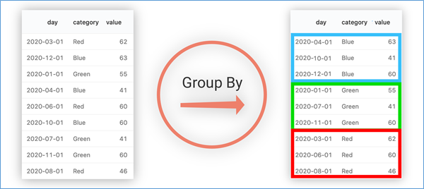

# Apache Hive DQL及其他

## I. HQL数据查询(DQL)语句

### 1. 基础查询

#### 1.1. 语法树

```sql
[WITH CommonTableExpression (, CommonTableExpression)*] 
SELECT [ALL | DISTINCT] select_expr, select_expr, ...
  FROM table_reference
  [WHERE where_condition]
  [GROUP BY col_list]
  [ORDER BY col_list]
  [CLUSTER BY col_list
    | [DISTRIBUTE BY col_list] [SORT BY col_list]
  ]
 [LIMIT [offset,] rows]
```

table_reference指示查询的输入。它可以是普通物理表，视图，join查询结果或子查询结果。

表名和列名不区分大小写。

#### 1.2. 案例: 美国Covid-19新冠select查询

在附件资料中有一份数据文件"us-covid19-counties.dat"，里面记录了2021-01-28美国各个县累计新冠确诊病例数和累计死亡病例数。

在Hive中创建表，加载该文件到表中：

```sql
--step1:创建普通表t_usa_covid19
drop table t_usa_covid19;
CREATE TABLE  t_usa_covid19(
       count_date string,
       county string,
       state string,
       fips int,
       cases int,
       deaths int)
row format delimited fields terminated by ",";
--将源数据load加载到t_usa_covid19表对应的路径下
load data local inpath '/root/hivedata/us-covid19-counties.dat' into table t_usa_covid19;

--step2:创建一张分区表 基于count_date日期,state州进行分区
CREATE TABLE itcast.t_usa_covid19_p(
     county string,
     fips int,
     cases int,
     deaths int)
partitioned by(count_date string,state string)
row format delimited fields terminated by ",";

--step3:使用动态分区插入将数据导入t_usa_covid19_p中
set hive.exec.dynamic.partition.mode = nonstrict;

insert into table t_usa_covid19_p partition (count_date,state)
select county,fips,cases,deaths,count_date,state from t_usa_covid19;
```


#### 1.3. select_expr

```sql
--select_expr
--查询所有字段或者指定字段
select * from t_usa_covid19_p;
select county, cases, deaths from t_usa_covid19_p;

--查询匹配正则表达式的所有字段
SET hive.support.quoted.identifiers = none; --带反引号的名称被解释为正则表达式
select `^c.*` from t_usa_covid19_p;
--查询当前数据库
select current_database(); --省去from关键字
--查询使用函数
select count(county) from t_usa_covid19_p;
```

#### 1.4. all/distinct

ALL和DISTINCT选项指定是否应返回重复的行。如果没有给出这些选项，则默认值为ALL（返回所有匹配的行）。DISTINCT指定从结果集中删除重复的行。

```sql
--ALL DISTINCT
--返回所有匹配的行
select state
from t_usa_covid19_p;
--相当于
select all state
from t_usa_covid19_p;
--返回所有匹配的行 去除重复的结果
select distinct state
from t_usa_covid19_p;
--多个字段distinct 整体去重
select distinct county,state from t_usa_covid19_p;
```

#### 1.5. where

WHERE条件是一个布尔表达式。在WHERE表达式中，您可以使用Hive支持的任何函数和运算符，但聚合函数除外。

从Hive 0.13开始，WHERE子句支持某些类型的子查询。

```sql
select * from t_usa_covid19_p where state ="California" and deaths > 1000;
select * from t_usa_covid19_p where 1 > 2;  -- 1 > 2 返回false
select * from t_usa_covid19_p where 1 = 1;  -- 1 = 1 返回true

--where条件中使用函数 找出州名字母超过10个
select * from t_usa_covid19_p where length(state) >10 ;

--WHERE子句支持子查询
SELECT *
FROM A
WHERE A.a IN (SELECT foo FROM B);

--where条件中不能使用聚合函数
--报错 SemanticException:Not yet supported place for UDAF 'sum'
select state,sum(deaths)
from t_usa_covid19_p where sum(deaths) >100 group by state;
```

**聚合函数要使用它的前提是结果集已经确定。而where子句还处于“确定”结果集的过程中，因而不能使用聚合函数**

#### 1.6. 分区查询, 分区裁剪

通常，SELECT查询将扫描整个表（所谓的全表扫描）。如果使用PARTITIONED BY子句创建的分区表，则在查询时可以指定分区查询，减少全表扫描，也叫做分区裁剪。

所谓分区裁剪指的是：对分区表进行查询时，会检查WHERE子句或JOIN中的ON子句中是否存在对分区字段的过滤，如果存在，则仅访问查询符合条件的分区，即裁剪掉没必要访问的分区。

```sql
--找出来自加州，累计死亡人数大于1000的县 state字段就是分区字段 进行分区裁剪 避免全表扫描
select * from t_usa_covid19_p where state ="California" and deaths > 1000;

--多分区裁剪
select * from t_usa_covid19_p where count_date = "2021-01-28" and state ="California" and deaths > 1000;
```

#### 1.7. group by

GROUP BY 语句用于结合聚合函数，根据一个或多个列对结果集进行分组。需要注意的是，出现在GROUP BY中select_expr的字段：**要么是GROUP BY分组的字段；要么是被聚合函数应用的字段。**原因很简单，避免出现一个字段多个值的歧义。

分组字段出现select_expr中，一定没有歧义，因为就是基于该字段分组的，同一组中必相同；被聚合函数应用的字段，也没歧义，因为聚合函数的本质就是多进一出，最终返回一个结果。



如上图所示，基于category进行分组，相同颜色的分在同一组中。

在select_expr中，如果出现category字段，则没有问题，因为同一组中category值一样，但是返回day就有问题了，day的结果不一样。

下面针对t_usa_covid19_p进行演示：

```sql
--根据state州进行分组

--SemanticException:Expression not in GROUP BY key 'deaths'
--deaths不是分组字段 报错
--state是分组字段 可以直接出现在select_expr中
select state,deaths
from t_usa_covid19_p where count_date = "2021-01-28" group by state;

--被聚合函数应用
select state,count(deaths)
from t_usa_covid19_p where count_date = "2021-01-28" group by state;

```

#### 1.8. having

在SQL中增加HAVING子句原因是，WHERE关键字无法与聚合函数一起使用。

HAVING子句可以让我们筛选分组后的各组数据,并且可以在Having中使用聚合函数，因为此时where，group by已经执行结束，结果集已经确定。

```sql
--having
--统计死亡病例数大于10000的州
--where语句中不能使用聚合函数 语法报错
select state,sum(deaths)
from t_usa_covid19_p
where count_date = "2021-01-28" and sum(deaths) >10000 group by state;

--先where分组前过滤（此处是分区裁剪），再进行group by分组（含聚合）， 分组后每个分组结果集确定 再使用having过滤
select state,sum(deaths)
from t_usa_covid19_p
where count_date = "2021-01-28"
group by state
having sum(deaths) > 10000;

--这样写更好 即在group by的时候聚合函数已经作用得出结果 having直接引用结果过滤 不需要再单独计算一次了
select state,sum(deaths) as cnts
from t_usa_covid19_p
where count_date = "2021-01-28"
group by state
having cnts> 10000;
```

having与where的区别:

having是在分组后对数据进行过滤

where是在分组前对数据进行过滤

having后面可以使用聚合函数

where后面不可以使用聚合

#### 1.9 limit

LIMIT子句可用于约束SELECT语句返回的行数。

LIMIT接受一个或两个数字参数，这两个参数都必须是非负整数常量。

第一个参数指定要返回的第一行的偏移量（从 Hive 2.0.0开始），第二个参数指定要返回的最大行数。当给出单个参数时，它代表最大行数，并且偏移量默认为0。

```sql
--limit
--没有限制返回2021.1.28 加州的所有记录
select * from t_usa_covid19_p
where count_date = "2021-01-28"
and state ="California";

--返回结果集的前5条
select * from t_usa_covid19_p
where count_date = "2021-01-28"
  and state ="California"
limit 5;

--返回结果集从第3行开始 共3行
select * from t_usa_covid19_p
where count_date = "2021-01-28"
  and state ="California"
limit 2,3; --注意 第一个参数偏移量是从0开始的
```

#### 1.10. Hive SQL查询执行顺序

```sql
SELECT [ALL | DISTINCT] select_expr, select_expr, ...
  FROM table_reference
  [WHERE where_condition]
  [GROUP BY col_list]
  [ORDER BY col_list]
  [CLUSTER BY col_list
    | [DISTRIBUTE BY col_list] [SORT BY col_list]
  ]
 [LIMIT [offset,] rows]
```

在查询过程中执行顺序：**from>where>group（含聚合）>having>order>select**。

所以聚合语句(sum,min,max,avg,count)要比having子句优先执行，而where子句在查询过程中执行优先级别优先于聚合语句(sum,min,max,avg,count)。

结合下面SQL感受一下：

```sql
select state,sum(deaths) as cnts
from t_usa_covid19_p
where count_date = "2021-01-28"
group by state
having cnts> 10000;
```

### 2. 高阶查询

#### 2.1. sort/order/cluster/distributed by

##### order by

##### cluster by

##### distribute by + sort by

##### 总结

#### 2.2. union联合查询


#### 2.3. Common Table Expressions(CTE)


## II. HQL join连接查询

### 1. join概念回顾


### 2. Hive join语法

#### 2.1. 规则树


#### 2.2. 语法丰富


### 3. join查询数据环境准备


### 4. Hive inner join


### 5. Hive left join


### 6. Hive right join


### 7. Hive full outer join


### 8. Hive left semi join


### 9. Hive cross join


### 10 Hive join使用注意事项


## III. Hive参数配置

### 1. CLIs and Commands客户端和命令

#### 1.1. Hive CLI


#### 1.2. Beeline CLI


### 2. Configuration Properties配置属性

#### 2.1. 配置属性概述


#### 2.2. 修改配置属性方式


## IV. Hive内置运算符

### 1. 关系运算符


### 2. 算术运算符


### 3. 逻辑运算符


## V. Hive函数入门

### 1. 函数概述


### 2. 函数分类概述


### 3. 内置函数分类


### 4. 用户自定义函数分类

#### 4.1. UDF普通函数


#### 4.2. UDAF聚合函数


#### 4.3. UDTF表生成函数

