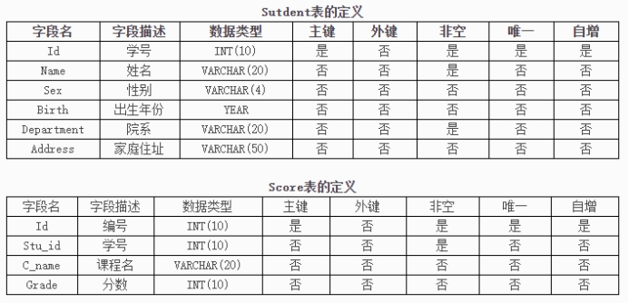
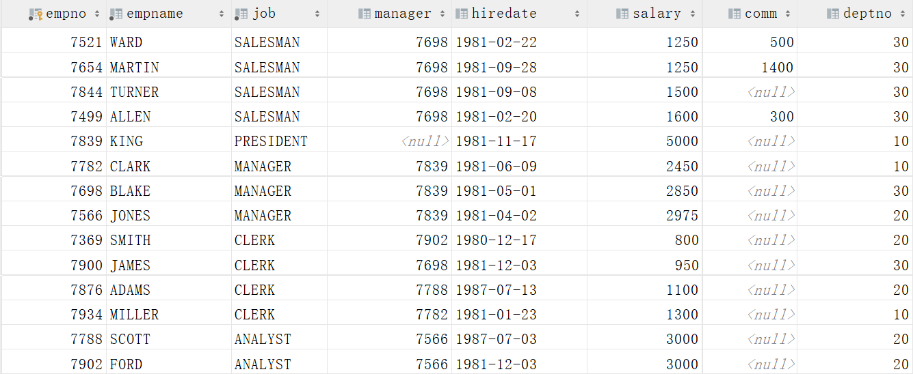
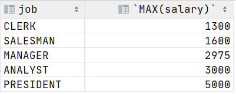
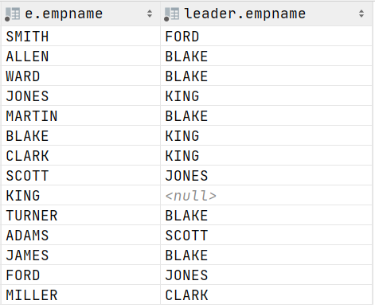

[TOC]

## Day02-MySQL基础

### 今日课程学习目标

```
常握 DQL数据查询语言：排序查询、聚合函数、分组查询、分页查询
熟悉 表之间的 3 种关联关系
熟悉 外键约束的定义及其作用
常握 多表的关联查询操作：内连接、左连接、右连接、全连接、自连接
```

### 今日课程内容大纲

```shell
# 1. DQL数据查询语言【重点】
	排序查询
	聚合函数
	分组查询
	分页查询
# 2. 多表关联查询【重点】
	表之间的3种关联关系：一对多、一对一、多对多
	外键约束
	连接查询：内连接、左连接、右连接、全连接、自连接
```

### 基础概念题

#### 1. 选择题

**题干：**MySQL对查询结果进行升序排序的关键字是( ) 

- [ ] ASC
- [ ] DESC
- [ ] LIMIT
- [ ] ORDER


**题干：**emp表是员工信息表，其中salary是员工薪水，deptno是员工所在的部门，

​      SELECT  SUM(salary)  FROM  emp GROUP BY  deptno;  的意思是（D ）

- [ ] 求每个部门中的工资
- [ ] 求每个部门中工资的大小
- [ ] 求每个部门中工资的总和
- [ ] 求每个部门中工资的个数


#### 2. 简答题

**题干：**简单表之间的3种关系，并分别举例

**参考答案**：

```bash
# 你的答案

```


### SQL 操作题

#### 1. 练习1

1）创建一个名为 **itcast_demo** 的数据库，在该数据库中创建一个名为 **t_user** 的表，表中字段：**用户ID、性别、用户名、密码**

> 建表要求如下：
>
> * 用户ID为主键且自动增长
> * 性别是固定长度的字符类型，长度为4
> * 用户名和密码是长度不固定字符串类型，最大长度为20

**参考答案**：

```mysql
# 你的答案

```

2）向 **t_user** 表中插入以下数据

| 性别 | 用户名   | 密码   |
| ---- | -------- | ------ |
| 男   | zhangsan | 123123 |
| 女   | lisi     | 000000 |
| 男   | wangwu   | 000000 |

**参考答案**：

```sql
# 你的答案

```

3）编写SQL语句查询所有的性别为 男 的用户名

**参考答案**：

~~~mysql
# 你的答案

~~~

4）统计男、女的人数

**参考答案**：

~~~mysql
# 你的答案

~~~

#### 2. 练习2

根据题目要求，完成以下SQL语句的编写：

 

现有两张表的定义如上图，请根据要求写入对应的SQL：

1）创建一个数据库：**db_student**，如果数据库已存在不能报错

**参考答案**：

 ~~~mysql
# 你的答案

 ~~~

2）根据图中两张表的定义，在**db_student** 中创建两张表

 ~~~mysql
# 你的答案

 ~~~

3）将以下信息插入student表

```sql
901  张老大   男  1985  计算机系    北京市海淀区  
902  张老二   男  1986  中文系     北京市昌平区  
903  张三    女  1990  中文系     湖南省永州市  
904  李四    男  1990  英语系     辽宁省阜新市  
905  王五    女  1991  英语系     福建省厦门市  
906  王六    男  1988  计算机系    湖南省衡阳市
```

**参考答案**：

~~~mysql
# 你的答案

~~~

4）将以下信息插入score表

```sql
901   计算机   98
901   英语    80
902   计算机   65
902   中文    88
903   中文    95
904   计算机   70
904   英语    92
905   英语    94
906   计算机   90
906   英语    85
```

**参考答案**：

```sql
# 你的答案

```

5）从student表中查询每个院系有多少人


**参考答案**：

```sql
# 你的答案

```

6）从score表中查询每个科目的最高分

 

```sql
# 你的答案

```

7）从score表中计算每个考试科目的平均分

 

**参考答案**：

```sql
# 你的答案

```

8）从score表中将计算机考试成绩按从高到低进行排序


**参考答案**：

```sql
# 你的答案

```

#### 3. 练习3

根据题目要求完成以下题目

**emp：员工信息表**

| 列名     | 含义         | 类型        | 约束 |
| -------- | ------------ | ----------- | ---- |
| empno    | 员工编号     | int         | 主键 |
| empname  | 员工姓名     | varchar(10) | 非空 |
| job      | 员工工作     | varchar(10) | 非空 |
| manager  | 员工领导编号 | int         |      |
| hiredate | 入职日期     | date        |      |
| salary   | 工资         | double      |      |
| comm     | 奖金         | double      |      |
| deptno   | 部门编号     | int         |      |

**dept表：部门信息表**

| 列名   | 含义     | 类型        | 约束 |
| ------ | -------- | ----------- | ---- |
| deptno | 部门编号 | int         | 主键 |
| dname  | 部门名称 | varchar(20) | 非空 |
| loc    | 部门地址 | varchar(20) |      |

**salgrade表：工资等级表**

| 列名  | 含义     | 类型   | 约束 |
| ----- | -------- | ------ | ---- |
| grade | 工资等级 | int    | 主键 |
| losal | 最低薪资 | double |      |
| hisal | 最高薪资 | double |      |

1）请创建数据库db_emp，如果已存在不能报错

**参考答案**：

```sql
# 你的答案

```

2）请根据以上表的定义，在db_emp中创建emp和dept表，salgrade表

**参考答案**：

 ~~~mysql
# 你的答案

 ~~~

3）执行下面的 SQL 语句，添加测试数据

```sql
INSERT INTO emp VALUES (7369, 'SMITH', 'CLERK', 7902, '1980-12-17', 800, NULL, 20);
INSERT INTO emp VALUES (7499, 'ALLEN', 'SALESMAN', 7698, '1981-02-20', 1600, 300, 30);
INSERT INTO emp VALUES (7521, 'WARD', 'SALESMAN', 7698, '1981-02-22', 1250, 500, 30);
INSERT INTO emp VALUES (7566, 'JONES', 'MANAGER', 7839, '1981-04-02', 2975, NULL, 20);
INSERT INTO emp VALUES (7654, 'MARTIN', 'SALESMAN', 7698, '1981-09-28', 1250, 1400, 30);
INSERT INTO emp VALUES (7698, 'BLAKE', 'MANAGER', 7839, '1981-05-01', 2850, NULL, 30);
INSERT INTO emp VALUES (7782, 'CLARK', 'MANAGER', 7839, '1981-06-09', 2450, NULL, 10);
INSERT INTO emp VALUES (7788, 'SCOTT', 'ANALYST', 7566, '1987-07-03', 3000, NULL, 20);
INSERT INTO emp VALUES (7839, 'KING', 'PRESIDENT', NULL, '1981-11-17', 5000, NULL, 10);
INSERT INTO emp VALUES (7844, 'TURNER', 'SALESMAN', 7698, '1981-09-08', 1500, NULL, 30);
INSERT INTO emp VALUES (7876, 'ADAMS', 'CLERK', 7788, '1987-07-13', 1100, NULL, 20);
INSERT INTO emp VALUES (7900, 'JAMES', 'CLERK', 7698, '1981-12-03', 950, NULL, 30);
INSERT INTO emp VALUES (7902, 'FORD', 'ANALYST', 7566, '1981-12-03', 3000, NULL, 20);
INSERT INTO emp VALUES (7934, 'MILLER', 'CLERK', 7782, '1981-01-23', 1300, NULL, 10);

INSERT INTO dept VALUES (10, 'ACCOUNTING', 'NEW YORK');
INSERT INTO dept VALUES (20, 'RESEARCH', 'DALLAS');
INSERT INTO dept VALUES (30, 'SALES', 'CHICAGO');
INSERT INTO dept VALUES (40, 'OPERATIONS', 'BOSTON');


INSERT INTO salgrade VALUES (1, 700, 1200);
INSERT INTO salgrade VALUES (2, 1200, 1400);
INSERT INTO salgrade VALUES (3, 1400, 2000);
INSERT INTO salgrade VALUES (4, 2000, 3000);
INSERT INTO salgrade VALUES (5, 3000, 19999);
```

4）查询员工的信息，并按工作降序排序，如果工作相同按照工资升序排序



**参考答案**：

```sql
# 你的答案

```

5）查询每个工作岗位的员工人数并按照人数降序排序

 

**参考答案**：

```sql
# 你的答案

```

6）查询每个工作岗位的最高薪资

 

 ~~~mysql
# 你的答案

 ~~~

7）查询所有员工的信息及所在部门名称


**参考答案**：

~~~mysql
# 你的答案

~~~

8）列出所有员工的姓名及其直接上级的姓名(**自关联，将一张表当做多张表使用**)



**参考答案**： 

~~~mysql
# 你的答案

~~~
