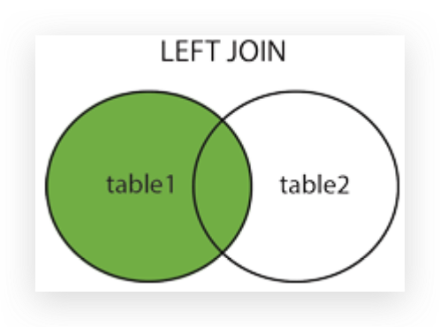

## I. DQL数据查询语言

1. ### 排序查询

    ##### ASC: 升序(默认) | DESC: 降序

    ```mysql
    -- 1. DQL-排序操作
    -- 语法：SELECT * FROM 表名 ORDER BY 列1 ASC|DESC, 列2 ASC|DESC, ...
    
    -- 示例1：将所有的商品查询出来之后，根据价格进行降序排列
    SELECT * FROM product ORDER BY price DESC;
    
    -- 示例2：将所有商品查询出来后根据价格降序排列，如果价格相同，根据category_id升序排列
    SELECT * FROM product ORDER BY price DESC, category_id;
    ```

2. ### 聚合函数

    > - ##### 聚合函数的计算会忽略NULL值

    ```mysql
    -- 2. DQL-聚合操作
    # COUNT(col)：表示求指定列的总记录数
    # MAX(col)：表示求指定列的最大值
    # MIN(col)：表示求指定列的最小值
    # SUM(col)：表示求指定列的和
    # AVG(col)：表示求指定列的平均值
    # 注意：聚合函数的计算会忽略 NULL 值
    
    -- 示例1：求当前商品一共有多少件
    SELECT COUNT(pid) FROM product;
    
    -- 示例2：查询当前有多少条category_id不为空的记录
    SELECT COUNT(category_id) FROM product;
    
    -- 示例3：求当前商品价格大于600的商品有多少件
    SELECT COUNT(pid) FROM product WHERE price > 600;
    
    -- 示例4：求 category_id='c001'的所有商品的价格最大值
    SELECT MAX(price) FROM product WHERE category_id = 'c001';
    
    -- 示例5：求 category_id='c002' 的所有商品的价格最小值
    SELECT MIN(price) FROM product WHERE  category_id = 'c002';
    
    -- 示例6：求所有 category_id='c002' 的商品的价格总和
    SELECT SUM(price) FROM product WHERE category_id = 'c002';
    
    -- 示例7：求所有商品的平均价格
    SELECT AVG(price) FROM product;
    
    -- 示例8：求所有商品的平均价格与价格最大值的差值
    SELECT MAX(price) - AVG(price) FROM product;
    ```

3. ### 分组查询

    ##### 分组查询就是将查询结果按照指定字段进行分组, 指定字段数据值相同的分为一组

    ##### 语法:

    ```mysql
    SELECT
    	分组字段...,
    	聚合函数(字段)...
    FROM 表名
    GROUP BY 分组字段1, 分组字段2...
    HAVING 条件表达式: 用来过滤分组后的数据
    ```

    - GROUP BY: 按照指定列的值对数据进行分组
    - 分组后, 可以查询每一组的分组字段, 或对每组的指定列进行聚合操作
    - HAVING条件表达式: 用来过滤分组之后的数据

    #### HAVING和WHERE的区别:

    ​	HAVING是在分组后对数据进行过滤, WHERE是在分组前对数据进行过滤

    ​	HAVING后面可以使用聚合函数(统计函数), WHERE后面不可以使用聚合函数

    > ##### 分组聚合操作时, SELECT之后只能查询分组字段和聚合函数, 查询其他会报错

    ```mysql
    -- 3. DQL-分组操作
    # 语法
    # SELECT
    #     分组字段...,
    #     聚合函数(字段)...
    # FROM 表名
    # GROUP BY 分组字段1, 分组字段2...
    # HAVING 条件表达式;
    
    -- 示例1：分组后查看表中有哪些category_id
    SELECT
        category_id
    FROM product
    GROUP BY category_id;
    
    -- 示例2：查看每类商品的最大价格
    SELECT
        category_id,
        MAX(price)
    FROM product
    GROUP BY category_id;
    
    -- 查看每类商品的最大价格和平均价格
    SELECT
        category_id,
        MAX(price),
        AVG(price)
    FROM product
    GROUP BY category_id;
    
    -- 示例3：将所有商品按组分类，获取每组的平均价格大于600的所有分组
    SELECT
        category_id,
        AVG(price)
    FROM product
    GROUP BY category_id
    HAVING AVG(price) > 600;
    
    -- 示例4：统计各个分类商品的个数，且只显示个数大于1的信息
    SELECT
        category_id,
        COUNT(pid)
    FROM product
    GROUP BY category_id
    HAVING COUNT(pid) > 1;
    ```

4. ### 分页查询

    语法:

    ```mysql
    SELECT
    	字段列表
    FROM 表名
    LIMIT M, N
    ```

    其中,

    ​	M: 表示开始行索引, 默认是0, 代表从下标M的位置开始分页

    ​	N: 表示查询条数, 即提取多少条数据

    ```mysql
    -- 4. DQL-分页查询
    # 语法：SELECT 字段列表 FROM 表名 LIMIT M, N
    # M表示开始行索引，默认是0，代表从下标M的位置开始分页
    # N表示查询条数，即提取多少条数据
    
    -- 示例1：获取 product 表中的第一条记录
    SELECT * FROM product LIMIT 0, 1;
    
    -- 示例2：获取 product 表中下标为2记录开始的2条记录
    SELECT * FROM product LIMIT 2, 2;
    
    
    -- 示例3：获取当前产品中，类别为'c002'的产品里，价格最低的2件商品
    SELECT
        *
    FROM product
    WHERE category_id = 'c002'
    ORDER BY price
    LIMIT 0, 2;
    
    -- 示例4：当分页展示的数据不存在时，不报错，只不过查询不到任何数据
    SELECT
        *
    FROM product
    WHERE category_id = 'c002'
    ORDER BY price
    LIMIT 25, 2;
    ```

## II. 多表关联查询

1. ### 表之间的3种关联关系: 一对多, 一对一, 多对多

    - #### 一对多: A表的一行记录对应B表的多行记录, 反过来B表的一行记录只对应A表的一行记录

    

    - #### 一对一: A表的一行记录只对应B表的一行记录, 反过来B表的一行记录也只对应A表的一行记录

    

    - #### 多对多: A表的一行记录对应B表的多行记录, 反过来B表的一行记录也对应A表的多行记录

    

    ```bash
    部门表和员工表: 一对多
    用户表和收货地址表: 一对多
    客户表和产品表: 多对多
    个人信息表和身份证表: 一对一
    ```

2. ### 外键约束(foreign key)

    #### 假设有两张表A和B, B表的某列引用了A表的`主键列`, 则B表的这一列称为B表的`外键列`, 其中A表称为`主表`, B表称为`从表`.

    > ##### 在一对多关联关系建表时, 在从表(多方)创建一个字段, 字段作为外键指向主表(一方)的主键

    #### 外键约束语法示例:

    ```mysql
    -- 2. 外键约束
    -- 假设有两张表A和B，B表的某列引用了A表的主键列，则B表的这一列称为B表的外键列(Foreign Key)，其中A表称为主表，B表称为从表
    
    -- 在一对多关联关系建表时，在从表(多方)创建一个字段，字段作为外键指向主表(一方)的主键
    
    -- 外键约束语法：
    -- CONSTRAINT FOREIGN KEY (外键字段) REFERENCES 主表名(主键)
    
    -- 示例1：新建分类表 category 和 商品表 product
    
    # 创建分类表
    CREATE TABLE category (
        cid   VARCHAR(32) PRIMARY KEY, # 分类id
        cname VARCHAR(100) # 分类名称
    );
    
    DESC category;
    
    # 商品表
    CREATE TABLE products (
        pid         VARCHAR(32) PRIMARY KEY,
        pname       VARCHAR(40),
        price       DOUBLE,
        category_id VARCHAR(32),
        # CONSTRAINT 约束
        # REFERENCES 引用
        CONSTRAINT FOREIGN KEY (category_id) REFERENCES category (cid) # 添加外键约束
    );
    
    DESC products;
    
    -- 外键约束的作用
    -- 1）保证插入数据的准确性
    -- 2）保存删除数据的完整性
    
    -- 示例2：从表数据的插入
    INSERT INTO category (cid, cname) VALUES('c001', '服装');
    
    INSERT INTO products (pid, pname) VALUES('p001', '土豆'); -- 从表添加数据时，若不指定外键，外键默认为NULL
    
    INSERT INTO products (pid, pname, category_id) VALUES('p002', '夹克', 'c001');
    
    INSERT INTO products (pid, pname, category_id) VALUES('p003', '坦克', 'c002'); -- 从表中外键的值在主表主键中必须有对应的值
    
    -- 示例3：主表数据的删除
    DELETE FROM category WHERE cid = 'c001'; -- 主表的主键值被从表外键引用之后，主表中对应的记录不能被删除
    
    DELETE FROM products WHERE pid = 'p002';
    DELETE FROM category WHERE cid = 'c001';
    
    -- 查看表的约束
    SHOW CREATE TABLE products;
    -- 删除外键约束
    ALTER TABLE products DROP FOREIGN KEY products_ibfk_1;
    ```

    ##### 外键约束的作用: 

    ##### 	保证插入数据的准确性: 从表插入记录时所指定的外键必须在主表中有该主键存在, 若未指定则默认为NULL.

    ##### 	保证删除数据的完整性: 若从表中有外键引用主表主键, 则该主键不能被删除.

    ##### 外键约束的缺点:

    - ##### 平添开发难度

    - ##### 降低增删改性能

    #### 实际开发中, 很少使用外键约束, 而是从代码层面保持表之间的关系

    #### 外键其他操作:

    ```mysql
    -- 查看表的约束
    SHOW CREATE TABLE 表名;
    -- 删除外键约束
    ALTER TABLE 表名 DROP FOREIGN KEY 外键约束名;
    ```

    `SHOW CREATE TABLE products`:

    

3. ### 多表关联查询 - 关联查询:

    #### 测试数据: 

    ```mysql
    -- 建表添加测试数据
    
    # 创建hero表
    CREATE TABLE hero (
        hid       INT PRIMARY KEY,
        hname     VARCHAR(255),
        kongfu_id INT
    );
    
    # 创建kongfu表
    CREATE TABLE kongfu (
        kid   INT PRIMARY KEY,
        kname VARCHAR(255)
    );
    
    # 插入hero数据
    INSERT INTO
        hero
    VALUES
        (1, '鸠摩智', 9),
        (3, '乔峰', 1),
        (4, '虚竹', 4),
        (5, '段誉', 12);
    
    # 插入kongfu数据
    INSERT INTO
        kongfu
    VALUES
        (1, '降龙十八掌'),
        (2, '乾坤大挪移'),
        (3, '猴子偷桃'),
        (4, '天山折梅手');
    ```

    

    - #### 内连接: INNER JOIN 简写为 JOIN

        - ##### 也称为等值连接, 返回两张表的交集

        - ##### 左右两表关联时, 满足关联条件的数据, 才会出现在最终的关联结果中

        

        ```mysql
        -- 示例1：查询所有英雄所对应的功夫名称，如果没有则不显示(内连接)
        SELECT
        	hname, kid, kname
        FROM hero
        INNER JOIN kongfu
        ON hero.kongfu_id = kongfu.kid;
        ```

        

    - #### 左外连接(左连接): LEFT OUTER JOIN, 简写为LEFT JOIN

        - ##### 左表不能和右表关联的数据 + 交集部分

        - ##### 右表侧不能和左表关联的部分自动填充为NULL

        

        ```mysql
        
        ```

        

    - #### 右外连接(右连接): RIGHT OUTER JOIN, 简写为RIGHT JOIN

        - ##### 右表不能和左表关联的数据 + 交集部分

        - ##### 左表侧不能和右表关联的部分自动填充为NULL

        

        ```mysql
        
        ```

        

    - #### 全外连接(全连接): FULL OUTER JOIN, 简写为 FULL JOIN

        > ##### 注意: MySQL中不支持全连接, 需要通过将左连接和右连接结果利用UNION关键字组合实现全连接的效果

        - ##### 左侧 + 交集部分 + 右则

        - ##### 左右两表不能相互关联的数据也都会出现，对应侧自动填充为NULL

        

        ```mysql
        
        ```

        

4. ### 多表关联查询 - 自关联查询:

    #### 进行关联时, 左表和右表是同一个表叫自关联.

    > ##### 注意: 自关联时, 需要给表起别名.

    ```mysql
    
    ```

    