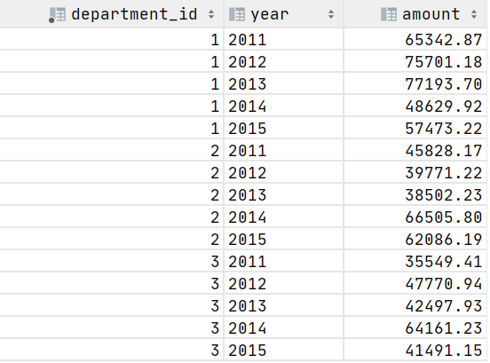

[TOC]

## Day03-MySQL基础

### 今日课程学习目标

```
常握 SQL查询时使用AS关键字起别名
常握 SQL子查询的使用
掌握 窗口函数的基础用法
掌握 PARTITION BY分区操作
掌握 排序函数的使用(产生排名)
掌握 自定义window frame操作
```

### 今日课程内容大纲

```shell
# 1. 子查询【重点】
	AS 起别名
	子查询操作
# 2. 窗口函数【重点】
	窗口函数简介
	窗口函数基础用法：OVER关键字
	PARTITION BY分区
	排序函数：产生排名
	自定义window frame
```

### 基础概念题

#### 1. 简答题

**题干：**简述窗口函数-排序函数中RANK()、DENSE_RANK()、ROW_NUMBER()的区别？

**参考答案**：

```bash
- `RANK()`：产生的排名序号 ，有并列的情况出现时序号不连续
- `DENSE_RANK()` ：产生的排序序号是连续的，有并列的情况出现时序号会重复
- `ROW_NUMBER()` ：返回连续唯一的行号，排名序号不会重复
```


### SQL 操作题

#### 1. 练习1

根据题目要求完成以下题目

**emp：员工信息表**

| 列名     | 含义         | 类型        | 约束 |
| -------- | ------------ | ----------- | ---- |
| empno    | 员工编号     | int         | 主键 |
| empname  | 员工姓名     | varchar(10) | 非空 |
| job      | 员工工作     | varchar(10) | 非空 |
| manager  | 员工领导编号 | int         |      |
| hiredate | 入职日期     | date        |      |
| salary   | 工资         | double      |      |
| comm     | 奖金         | double      |      |
| deptno   | 部门编号     | int         |      |

**dept表：部门信息表**

| 列名   | 含义     | 类型        | 约束 |
| ------ | -------- | ----------- | ---- |
| deptno | 部门编号 | int         | 主键 |
| dname  | 部门名称 | varchar(20) | 非空 |
| loc    | 部门地址 | varchar(20) |      |

**salgrade表：工资等级表**

| 列名  | 含义     | 类型   | 约束 |
| ----- | -------- | ------ | ---- |
| grade | 工资等级 | int    | 主键 |
| losal | 最低薪资 | double |      |
| hisal | 最高薪资 | double |      |

1）查询销售部(SALES)所有员工的姓名【利用子查询】


**参考答案**：

```sql
SELECT
    *
FROM emp
WHERE deptno = (SELECT deptno FROM dept WHERE dname = 'SALES');
```

2）查询工资高于平均工资的员工信息【利用子查询】


**参考答案**：

```sql
SELECT
    *
FROM emp
WHERE salary > (SELECT AVG(salary) FROM emp);
```

3）查询每个人的工资和平均工资的差值【分别利用子查询和窗口函数实现】


**参考答案**：

```sql
-- 子查询实现
SELECT
    *,
    (SELECT AVG(salary) FROM emp) AS `avg_salary`,
    salary - (SELECT AVG(salary) FROM emp) AS `difference`
FROM emp;

-- 窗口函数实现
SELECT
    *,
    AVG(salary) OVER() AS `avg_salary`,
    salary - AVG(salary) OVER() AS `difference`
FROM emp;
```

4）计算不同部门的员工工资和该部门平均工资的差值【窗口函数实现】


**参考答案**：

```sql
SELECT
    *,
    AVG(salary) OVER(PARTITION BY deptno) AS `dept_avg_salary`,
    salary - AVG(salary) OVER(PARTITION BY deptno) AS `difference`
FROM emp;
```

5）将所有员工按照工资从高到底进行排序，要求排名序号连续和重复【窗口函数实现】


**参考答案**：

```sql
SELECT
    *,
    DENSE_RANK() OVER (ORDER BY salary DESC) AS `dense_rank`
FROM emp;
```

6）查询每个部门薪资最高的员工信息【窗口函数实现】


**参考答案**：

```sql
-- 子查询结合排序函数
SELECT
    empno,
    empname,
    job,
    hiredate,
    salary,
    deptno
FROM (
    SELECT
        *,
        DENSE_RANK() OVER (
            PARTITION BY deptno
            ORDER BY salary DESC
        ) AS `dense_rank`
    FROM emp
) e
WHERE `dense_rank` = 1;

-- CTE公用表表达式结果排序函数
WITH ranking AS (
    SELECT
        *,
        DENSE_RANK() OVER (
            PARTITION BY deptno
            ORDER BY salary DESC
        ) AS `dense_rank`
    FROM emp
)
SELECT
    empno,
    empname,
    job,
    hiredate,
    salary,
    deptno
FROM ranking
WHERE `dense_rank` = 1;
```

#### 2. 练习2

先介绍一下数据，**revenue(部门营收表)**：

- `department_id`：部门ID
- `year`：年份 
- `amount`：营收金额



1）题目1

> 需求：统计id 为2的部门的营收情况
>
> 查询结果字段：
>
> * department_id、year、amount(当年营收)、sum每三年收入总额（当前年份加上前两年）


**参考答案**：

```sql
SELECT
  department_id,
  year,
  amount,
  SUM(amount) OVER(
    ORDER BY year
    -- 如果排序列类型不是数字和日期差值类型，RANGE不支持n PRECEDING或n FOLLOWING
    RANGE BETWEEN 2 PRECEDING AND CURRENT ROW -- 简写：ROWS 2 PRECEDING
  ) AS `sum`
FROM revenue
WHERE department_id = 2;
```

2）题目2

> 需求：统计id为1的部门，每年的移动平均营收
>
> 查询结果字段：
>
> * department_id、year、amount、avg移动平均营收 (按年排序，统计当前年份之前的所有年份的收入平均值)


**参考答案**：

```mysql
SELECT
  department_id,
  year,
  amount,
  AVG(amount) OVER(
      ORDER BY year
      ROWS BETWEEN UNBOUNDED PRECEDING AND CURRENT ROW -- 简写：ROWS UNBOUNDED PRECEDING
  ) AS `avg`
FROM revenue
WHERE department_id = 1;
```


