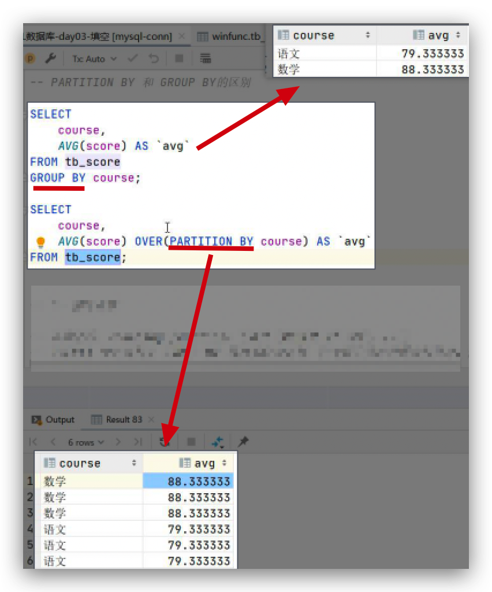

## I. 子查询

1. ### AS起别名

    - #### 给字段起别名

    ```mysql
    -- 示例1：查询每个分类的商品数量
    SELECT
           category_id,
           COUNT(*) product_count
    FROM products
    GROUP BY category_id;
    
    -- 注意: 别名和关键字同名时, 别名两侧要加反引号
    SELECT category_id, COUNT(*) `desc`
    FROM products
    GROUP BY category_id;
    ```

    - #### 给表起别名

    ```mysql
    -- 示例2：查询每个分类名称所对应的商品数量(没有商品的分类的也要显示)
    SELECT
    c.cname, COUNT(*) product_count
    FROM
    category c
    LEFT JOIN products p
    ON c.cid = p.category_id
    GROUP BY c.cname;
    ```

    > ##### 可以给所有别名两端都加反引号``, 确保不会报错

2. ### 子查询操作

    > #####  在一个SELECT语句中, 嵌入了另外一个SELECT语句, 那么被嵌入的SELECT语句称为子查询语句, 外部的SELECT语句称为主查询

    #### 主查询和子查询的关系:

     1. 子查询嵌入到主查询中

     2. ##### 子查询是辅助主查询的, 要么充当条件, 要么充当数据源, 要么充当查询字段

     3. 子查询是可以独立存在的, 是一条完整的SELECT语句

    - ##### 充当条件

    ```mysql
    -- 示例1：查询当前商品大于平均价格的商品
    SELECT pname, price
    FROM products
    WHERE price > (
        SELECT AVG(price)
        FROM products
    );
    
    -- 示例2：获取所有商品中，平均价格大于800的分类的全部商品
    SELECT *
    FROM products
    WHERE category_id IN (
        SELECT category_id
        FROM products
        GROUP BY category_id
        HAVING AVG(price) > 800
    );
    
    -- 示例3：获取所有商品中价格最高的商品(价格最高的商品不只一个)
    -- STEP1. 查询商品最高价格
    SELECT pname,
           price
    FROM products
    WHERE price = (SELECT MAX(price) FROM products);
    ```

    - ##### 充当数据源: 子查询必须起别名

    ```mysql
    -- 示例4：查询不同类型商品的平均价格
    -- 查询结果字段：
    --  category_id(分类id)、cname(分类名称)、avg(分类商品平均价格)
    SELECT category_id `分类id`,
           cname       `分类名称`,
           `avg`       `分类商品平均价格`
    FROM (
             SELECT category_id,
                    AVG(price) `avg`
             FROM products
             GROUP BY category_id
         ) `a`
             JOIN category `b`
                  ON a.category_id = b.cid;   
    ```

    - ##### 充当查询字段

    ```mysql
    -- 示例5：针对 students 表的数据，计算每个同学的Score分数和整体平均分数的差值
    SELECT ID                                        `学生ID`,
           Name                                      `学生姓名`,
           (SELECT AVG(Score) FROM students)         `平均分`,
           Score - (SELECT AVG(Score) FROM students) `差值`
    FROM students;
    ```

## II. 窗口函数(面试高频考点)

1. ### 窗口函数简介

    窗口函数时MySQL8.0后加入的功能, 之前需要通过定义临时变量和大量的自查询才能完成的工作, 使用窗口函数实现起来更加简洁高效.

    ```mysql
    
    ```

    优点:

     - 简单
     - 快速
     - 多功能性

2. ### 窗口函数基础用法: OVER关键字

    ```mysql
    -- 基础语法
    <window function> OVER(...)
    ```

    `<window function>`表示使用的窗口函数, 窗口函数可以使聚合函数或者其他函数

    ##### `OVER(…)`的作用就是设置每行数据关联的窗口数据范围, `OVER()`时, 每行关联的数据都是整张表的数据.

    ```mysql
    SELECT
    	*,
    	AVG(Score) OVER() AS `avg`,
    	Score - AVG(Score) OVER() AS `difference`
    FROM students;
    ```

    典型应用场景:

    1. 计算每个值和整体平均值的差值

    ```mysql
    -- 示例1
    # 需求：计算每个学生的 Score 分数和所有学生整体平均分的差值。
    # 查询结果字段：
    #   ID、Name、Gender、Score、AVG_Score(学生整体平均分)、difference(每位学生分数和整体平均分的差值)
    SELECT ID,
           Name,
           Gender,
           Score,
           -- OVER()：表示每行关联的窗口数据范围都是整张表的数据
           -- AVG(Score)：表示处理每行数据时，应用 AVG 对每行关联的窗口数据中的 Score 求平均
           AVG(Score) OVER () AS `AVG_Score`,
           Score - AVG(Score) OVER() AS `difference`
    FROM students;
    ```

    2. 计算每个值占整体之和的占比

    ```mysql
    -- 典型应用场景2：计算每个值占整体之和的占比
    
    # 需求：计算每个学生的Score分数占所有学生分数之和的百分比
    # 查询结果字段：
    #   ID、Name、Gender、Score、sum(所有学生分数之和)、ratio(每位学生分数占所有学生分数之和的百分比)
    SELECT ID,
           Name,
           Gender,
           Score,
           -- OVER()：表示每行关联的窗口数据范围都是整张表的数据
           -- AVG(Score)：表示处理每行数据时，应用 AVG 对每行关联的窗口数据中的 Score 求平均
           SUM(Score) OVER () AS `SUM`,
           Score * 100 / SUM(Score) OVER() AS `ratio`
    FROM students;
    ```

3. ### PARTITION BY分区

    ```mysql
    -- 基础语法
    <window function> OVER(PARTITION BY 列名, ...)
    ```

    - `PARTITION BY 列名, ...`: 按照指定的列对整张表的数据进行分区
    - 分区之后, 在处理每行数据时, `<window function>`是作用在该行数据关联的分区上, 不再是整张表上

    ```mysql
    -- 示例1
    -- 需求：计算每个学生的 Score 分数和同性别学生平均分的差值
    -- 查询结果字段：
    --  ID、Name、Gender、Score、Avg(同性别学生的平均分)、difference(每位学生分数和同性别学生平均分的差值)
    SELECT ID,
           Name,
           Gender,
           Score,
           -- PARTITION BY Gender：按照性别对整张表的数据进行分区，此处会分成2个区
           -- AVG(Score)：处理每行数据时，应用 AVG 对该行关联分区数据中的 Score 求平均
           AVG(Score) OVER (PARTITION BY Gender) AS `分性别学生平均分`,
           Score - AVG(Score) OVER (PARTITION BY Gender) `与同性别学生平均分的差值`
    FROM students;
    
    -- 示例2
    -- 需求：计算每人各科分数与对应科目最高分的占比
    -- 查询结果字段：
    --  name、course、score、max(对应科目最高分数)、ratio(每人各科分数与对应科目最高分的占比)
    SELECT Name,
           course,
           Score,
           MAX(Score) OVER (PARTITION BY course) AS      `各科最高分`,
           Score / MAX(Score) OVER (PARTITION BY course) `与对应科目最高分的占比`
    FROM tb_score;
    ```

    `PARTITION BY`和`GROUP BY`的区别:

    GROUP BY为多进一处, 去重; PARTITION BY多进多出

    

4. ### 排序函数: 产生排名

    

5. ### 自定义window frame