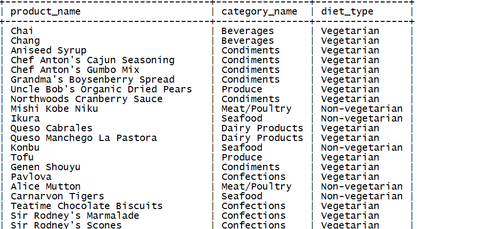
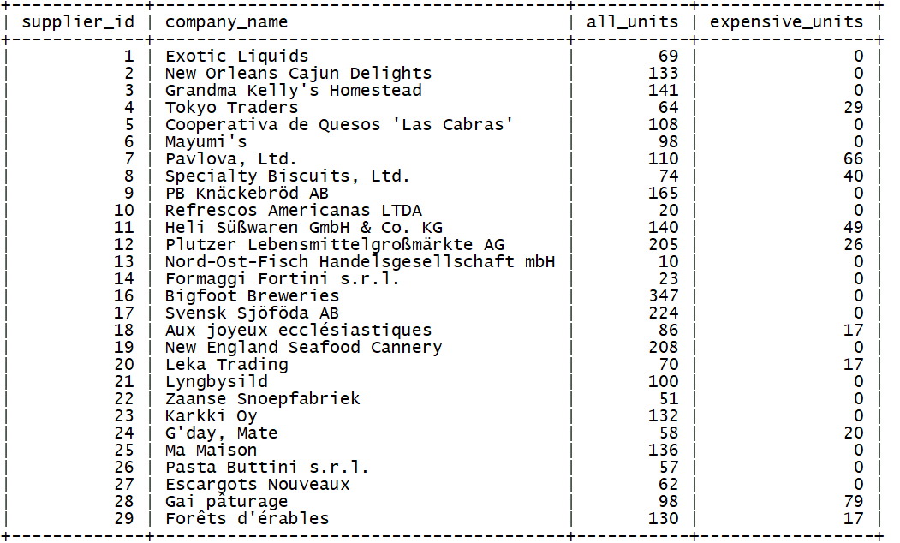
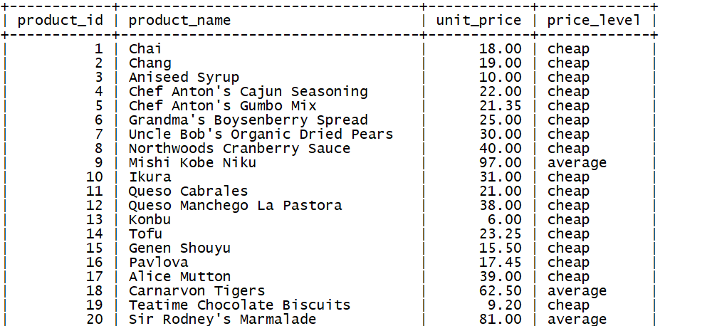

[TOC]

## Day04-MySQL基础

### 今日课程学习目标

```
熟悉 SQL语句的执行顺序
常握 不能使用窗口函数的3种情况
常握 GROUP BY和窗口函数配合使用
掌握 GROUP BY分组操作的2个注意点
掌握 COUNT() 计数统计的3个注意点
常握 SQL查询中CASE WHEN语法的使用
```

### 今日课程内容大纲

```shell
# 1. 窗口函数避坑指南
	SQL语句的执行顺序
	不能使用窗口函数的情况
		- 情况1：不能在 WHRER 子句中使用窗口函数
		- 情况2：不能在 HAVING 子句中使用窗口函数
		- 情况3：不能在 GROUP BY子句中使用窗口函数
	能够使用窗口函数的情况
		- 可以在SELECT和ORDER BY中使用窗口函数
	GROUP BY和窗口函数配合使用【难点】
# 2. 报表案例
	 Northwind 数据集介绍
	 SQL数据汇总操作
	 	-- 多表连接
	 	-- 带有时间限制的报表
	 	-- GROUP BY分组操作注意点
	 	-- COUNT() 计数统计注意点
	 CASE WHEN 语法
```

### 基础概念题

#### 1. 选择题

**题干**：在进行SQL查询时，以下那个语句中可以使用窗口函数（）

- [ ] WHERE
- [ ] HAVING
- [ ] GROUP BY
- [x] SELECT

### SQL 操作题

#### 1. 窗口函数避坑指南

> 注意：利用课上 winfunc 数据库中的 auction 表进行查询，完成如下练习。

1）练习1

> 需求：找到浏览次数低于平均浏览次数的拍卖
>
> 查询结果字段：
>
> * id(拍卖ID)、country(国家)、views(浏览次数)

```mysql
# 你的答案
SELECT id, country, views
FROM (
         SELECT id,
                country,
                views,
                AVG(views) OVER () `avg_views`
         FROM auction
     ) c
WHERE views < avg_views;
```


2）练习2

> 需求：将所有的拍卖数据按照底价从高到低排序，平均分成6组，查询每组的最大、最小和平均底价，并将所有数据按照组别排序(升序)
>
> 查询结果字段：
>
> * group_no(分组编号)、max_ask_price(该组最高低价)、min_ask_price(该组最小低价)、avg_ask_price(该组平均低价)

```mysql
# 你的答案
SELECT group_no          `分组编号`,
       MAX(asking_price) `该组最高底价`,
       MIN(asking_price) `该组最低底价`,
       AVG(asking_price) `该组平均底价`
FROM (
         SELECT asking_price,
                NTILE(6) over (ORDER BY asking_price DESC) `group_no`
         FROM auction
     ) c
GROUP BY group_no
ORDER BY group_no;
```


3）练习3

> 需求：按照商品类别分组，返回如下信息
>
> 查询结果字段：
>
> * category_id(分组)，max(计算每种商品起拍价的最高价格)，avg(平均最高价格)

```mysql
# 你的答案
SELECT category_id `商品类别`,
       MAX(asking_price) `最高起拍价`,
       AVG(MAX(asking_price)) OVER () `平均最高起拍价`
FROM auction
GROUP BY category_id;
```


4）练习4

> 需求：按拍卖结束日期分组，计算每组平均浏览量，并按平均浏览量对所有组排名返回行号(连续不重复)
>
> 查询结果字段：
>
> * ended(拍卖结束日期)、avg(平均浏览量)、row_number(行号)

```mysql
# 你的答案
SELECT ended `拍卖结束日期`,
       AVG(views) `平均浏览量`,
       DENSE_RANK() OVER (ORDER BY AVG(views) DESC) `行号`
FROM auction
GROUP BY ended;
```


#### 2. SQL数据汇总操作

> 注意：利用课上 northwind 数据库中的表进行查询，完成如下练习。

1）练习1

> 需求：查询订单编号为10248的相关信息，返回如下结果
>
> 查询结果字段：
>
> * product_name(商品名称)、unit_price(购买单价)、quantity(购买数量)、supplier_name(供应商公司名称)

```mysql
# 你的答案
SELECT p.product_name `商品名称`,
       oi.unit_price `购买单价`,
       oi.quantity `购买数量`,
       s.company_name `供应商公司名称`
FROM order_items oi
LEFT JOIN products p on oi.product_id = p.product_id
LEFT JOIN suppliers s on p.supplier_id = s.supplier_id
WHERE oi.order_id = 10248;
```

2）练习2

> 需求：查询每件商品的详细信息，返回如下结果
>
> 查询结果字段：
>
> * product_name(商品名称)、company_name(供应商公司名称)、category_name(商品类别名称)、unit_price(商品销售单价)、quantity_per_unit(每单位商品数量)

```mysql
# 你的答案
SELECT p.product_name `商品名称`,
       s.company_name `供应商公司名称`,
       c.category_id `商品类别名称`,
       p.unit_price `商品销售单价`,
       p.quantity_per_unit `每单位商品数量`
FROM products p
JOIN suppliers s on p.supplier_id = s.supplier_id
JOIN categories c on p.category_id = c.category_id;
```

3）练习3

> 需求：统计2013年入职的员工数量
>
> 查询结果字段：
>
> * number_of_employees(2013年入职的员工数量)

```mysql
# 你的答案
SELECT COUNT(*) `2013年入职员工数量`
FROM employees
WHERE YEAR(hire_date) = 2013;
```

4）练习4

> 需求：统计每个供应商供应的商品种类数量
>
> 查询结果字段：
>
> * supplier_id(供应商ID)、company_name(供应商公司名称)、products_count(商品种类数量)

```mysql
# 你的答案
SELECT s.supplier_id `供应商ID`,
       company_name `供应商公司名称`,
       COUNT(DISTINCT category_id) `商品种类数量`
FROM products p
JOIN suppliers s on p.supplier_id = s.supplier_id
GROUP BY s.supplier_id;
```

5）练习5

> 需求：统计ID为10250的订单的总价（折扣前）
>
> 查询结果字段：
>
> * order_id(订单ID)、discounted_total_price(订单总价-折扣前)

```mysql
# 你的答案
SELECT o.order_id `订单ID`,
       SUM(oi.unit_price * oi.quantity) `订单总价-折扣前`
FROM orders o
JOIN order_items oi on o.order_id = oi.order_id
WHERE o.order_id = 10250;
```

6）练习6

> 需求：统计每个员工处理的订单总数
>
> 查询结果字段：
>
> * employee_id(员工ID)、first_name和last_name(员工的姓和名)、orders_count(该员工处理的订单总数)

```mysql
# 你的答案
SELECT e.employee_id     `员工ID`,
       first_name        `名`,
       last_name         `姓`,
       COUNT(o.order_id) `处理订单总数`
FROM employees e
         JOIN orders o on e.employee_id = o.employee_id
GROUP BY e.employee_id, first_name, last_name;
```

7）练习7

> 需求：统计每个类别中的库存商品总价值
>
> 提示：计算库存商品总价：`SUM(unit_price * units_in_stock)`
>
> 查询结果字段：
>
> * category_id(商品分类ID)、category_name(商品类别名称)、category_total_value(该分类库存商品总价值)

```mysql
# 你的答案
SELECT p.category_id `商品分类ID`,
       c.category_name `商品类别名称`,
       SUM(unit_price * units_in_stock) `库存商品总价值`
FROM products p
join categories c on p.category_id = c.category_id
GROUP BY p.category_id, c.category_name;
```

8）练习8

> 需求：统计每个客户的下订单数
>
> 查询结果字段：
>
> * customer_id(客户ID)、company_name(客户公司名称)、orders_count(客户下单数)

```mysql
# 你的答案
SELECT c.customer_id `客户ID`,
       c.company_name,
       COUNT(o.order_id)
FROM customers c
JOIN orders o on c.customer_id = o.customer_id
GROUP BY c.customer_id, c.company_name;
```

9）练习9

> 需求：统计客户总数和带有传真号码的客户数量
>
> 提示：
>
> * fax为NULL，表示无传真号码
>
> 查询结果字段：
>
> * all_customers_count(客户总数)、customers_with_fax_count(带有传真号码的客户数量)

```mysql
# 你的答案
SELECT COUNT(*) `客户总数`,
       COUNT(fax) `带有传真号码的客户数量`
FROM customers;

```

10）练习10

> 需求：查找每个供应商提供的产品总数，确保供应商全部出现在统计结果中，包括没有提供任何产品的供应商
>
> 查询结果字段：
>
> * company_name(供应商公司名称)、products_count(提供的产品数量)

```mysql
# 你的答案
SELECT s.company_name `供应商公司名称`,
       COUNT(product_id) `提供的产品数量`
FROM products
RIGHT JOIN suppliers s on products.supplier_id = s.supplier_id
GROUP BY s.supplier_id, s.company_name;
```

11）练习11

> 需求：统计运往法国的所有订单中有多少种不同的产品
>
> 查询结果字段：
>
> * distinct_products(不同产品数)

```mysql
# 你的答案
SELECT COUNT(DISTINCT product_id) `不同产品数`
FROM orders o
JOIN order_items oi on o.order_id = oi.order_id
WHERE ship_country = 'France';
```

12）练习12

> 需求：统计有关供应商的相关信息，返回如下结果
>
> 查询结果字段：
>
> * all_suppliers(供应商总数)、suppliers_region_assigned(分配了地区的供应商数量)、unique_supplier_regions(多少个不同的区域)

```mysql
# 你的答案
SELECT COUNT(*) `供应商总数`,
       COUNT(region) `分配了地区的供应商数量`,
       COUNT(DISTINCT region) `多少个不同的区域`
FROM suppliers;
```

13）练习13

> 需求：统计2016年7月5日至2016年7月31日间，每位员工处理的所有订单的总金额(折扣前)，并且按订单总金额从高到低排序
>
> 查询结果字段：
>
> * first_name和last_name(员工姓和名)、sum_orders(订单总金额)

```mysql
# 你的答案
SELECT e.first_name,
       e.last_name,
       SUM(unit_price * quantity) `订单总金额`
FROM employees e
         JOIN orders o on e.employee_id = o.employee_id
         JOIN order_items oi on o.order_id = oi.order_id
WHERE order_date >= '2016-07-05'
  AND order_date < '2016-08-01'
GROUP BY e.employee_id, e.first_name, e.last_name
ORDER BY '订单总金额' DESC;
```

#### 3. CASE WHEN 操作

> 注意：利用课上 northwind 数据库中的表进行查询，完成如下练习。

1）练习1

> 需求： 创建一个报表，统计员工的经验水平，经验水平统计规则如下：
>
> *  2014年1月1日以后雇用的员工，显示 'junior'
> *  在2013年1月1日之后至2014年1月1日之前雇用的员工，显示 'middle'
> *  2013年1月1日或之前雇用的员工，显示 'senior'

```mysql
# 你的答案
SELECT first_name,
       last_name,
       hire_date,
       CASE
           WHEN hire_date > '2014-01-01' THEN 'junior'
           WHEN hire_date > '2013-01-01' THEN 'middle'
           WHEN hire_date <= '2013-01-01' THEN 'senior'
           END AS `experience`
FROM employees;
```


2）练习2

> 需求：创建报表将所有商品划分为素食和非素食两类
>
> 查询结果字段：
>
> * product_name(商品名称)、category_name(商品类别名称)、diet_type(膳食类型)
>
> 膳食类型分类规则：
>
> * 商品类别字段的值为 `'Meat/Poultry'` 和 `'Seafood'` 是非素食，显示 'Non-vegetarian'
> * 其他商品类别是素食，显示 'vegetarian'

```mysql
# 你的答案
SELECT
  product_name,
  category_name,
  CASE
    WHEN category_name IN ('Meat/Poultry', 'Seafood') THEN 'Non-vegetarian'
    ELSE 'Vegetarian'
  END AS `diet_type`
FROM categories c
JOIN products p
ON c.category_id = p.category_id;
```



3）练习3

> 需求：创建一个简单的报表来统计员工的年龄情况，将年龄分为2组，并统计这2组各自的员工数量
>
> 查询结果字段：
>
> * age_group(年龄分组)、employee_count(员工数量)
>
> 年龄分组规则：
>
> * 生日大于1980年1月1日为 'Young'，其余为 'Old'

```mysql
# 你的答案
SELECT CASE
           WHEN birth_date > '1980-01-01' THEN 'Young'
           ELSE 'Old'
           END  AS `age_group`,
       COUNT(*) AS `employee_count`
FROM employees
GROUP BY age_group;
```


4）练习4

> 需求：统计客户的 contact_title 字段值为 'Owner' 和非 'Owner' 的客户数量
>
> 查询结果字段：
>
> * represented_by_owner(Owner客户数量)、not_represented_by_owner(非Owner客户数量)

```mysql
# 你的答案
SELECT COUNT(CASE
                 WHEN contact_title = 'Owner' THEN customer_id
    END)        AS `represented_by_owner`,
       COUNT(CASE
                 WHEN contact_title != 'Owner' THEN customer_id
           END) AS `not_represented_by_owner`
FROM customers;
```


5）练习5

> 需求：创建报表，统计不同类别的商品中，库存量>30的商品数量和库存量<=30的商品数量
>
> 查询结果字段：
>
> * category_name(商品类别名称)、high_availability(库存>30的商品数量)、low_availability(库存量<=30的商品数量) 

```mysql
# 你的答案
SELECT c.category_name,
       COUNT(CASE
                 WHEN units_in_stock > 30 THEN product_id
           END) AS `high_availability`,
       COUNT(CASE
                 WHEN units_in_stock <= 30 THEN product_id
           END) AS `low_availability`
FROM products p
         JOIN categories c
              ON p.category_id = c.category_id
GROUP BY c.category_id, c.category_name;
```


6）练习6

> 需求：创建报表统计运输到法国的的订单中，打折和未打折的订单商品数量
>
> 查询结果字段：
>
> * full_price(未打折订单数量)、discounted_price(打折订单数量)
>
> 注意：使用 SUM 配置 CASE WHEN 实现

```mysql
# 你的答案
SELECT SUM(CASE
               WHEN discount = 0 THEN 1
    END)        AS `full_price`,
       SUM(CASE
               WHEN discount != 0 THEN 1
           END) AS `discounted_price`
FROM orders o
         JOIN order_items oi
              ON o.order_id = oi.order_id
WHERE ship_country = 'France';
```


7）练习7

> 需求：输出报表，统计不同供应商供应商品的总库存量，以及高价值商品的库存量（单价超过40定义为高价值）
>
> 查询结果字段：
>
> * supplier_id(供应商ID)、company_name(供应商公司名称)、all_units(该供应商供应商品的总库存)、expensive_units(该供应商供应的高价值商品的库存 )

```mysql
# 你的答案
SELECT s.supplier_id,
       s.company_name,
       SUM(units_in_stock) AS `all_units`,
       SUM(IF(unit_price > 40.0, units_in_stock, 0)) AS `expensive_units`
FROM products p
         JOIN suppliers s
              ON p.supplier_id = s.supplier_id
GROUP BY s.supplier_id, s.company_name;
```



8）练习8

> 需求：创建报表来为每种商品添加价格标签，贵、中等、便宜
>
> 查询结果字段：
>
> * product_id(商品ID)、product_name(商品名称)、unit_price(商品价格)、price_level(价格标签)
>
> 价格标签规则：
>
> * 单价高于100的商品：'expensive'
> * 单价高于40但不超过100的商品：'average'
> * 单价低于40的商品：'cheap'

```mysql
# 你的答案
SELECT product_id,
       product_name,
       unit_price,
       CASE
           WHEN unit_price > 100 THEN 'expensive'
           WHEN unit_price > 40 THEN 'average'
           ELSE 'cheap'
           END AS price_level
FROM products;
```



9）练习9

> 需求：统计订单运费>40.0、40<=订单运费<80.0、订单运费>=80.0的订单数
>
> 查询结果字段：
>
> * low_freight(运费<40的订单数)、avg_freight(40.0<运费<=80.0的订单数)、high_freight(运费>=80.0的订单数)

```mysql
# 你的答案
SELECT COUNT(CASE
                 WHEN freight >= 80.0 THEN order_id
    END)        AS `high_freight`,
       COUNT(CASE
                 WHEN freight < 40.0 THEN order_id
           END) AS `low_freight`,
       COUNT(CASE
                 WHEN freight >= 40.0 AND freight < 80.0 THEN order_id
           END) AS `avg_freight`
FROM orders;
```


