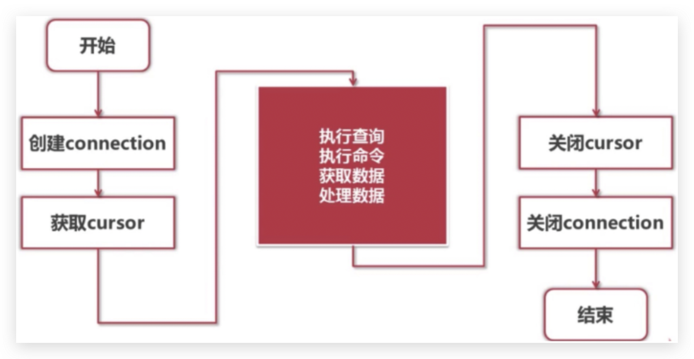

## I. MySQL常用内置函数

1. ### 时间日期函数

    - ##### 获取当前时间的函数

    ```mysql
    -- 1. 获取当前时间
    
    -- 获取当前datetime类型的时间
    SELECT NOW();
    
    -- 获取当前date类型的时间
    SELECT CURRENT_DATE();
    
    -- 获取当前time类型的时间
    SELECT CURRENT_TIME();
    
    -- 获取当前操作系统时间
    SELECT SYSDATE();
    
    -- NOW()和SYSDATE()对比: NOW不变, SYSDATE动态变化
    SELECT NOW(), SLEEP(2), NOW();
    SELECT SYSDATE(), SLEEP(2), SYSDATE();
    ```

    - ##### 计算时间差的相关函数

    ```mysql
    -- 2. 计算时间差
    
    -- 计算指定间隔的时间日期
    SELECT DATE_ADD('2007-9-27', INTERVAL 90 DAY );
    
    -- 示例：获取当前时间3个小时以前的时间
    SELECT DATE_ADD(NOW(), INTERVAL -3 HOUR);
    
    -- 计算两个时间日期之间的天数差
    SELECT DATEDIFF('2021-03-22 09:00:00', '2018-03-20 07:00:00');
    
    -- 计算两个时间日期之间的时间差(自定义时间单位)
    SELECT TIMESTAMPDIFF(MONTH, '2021-03-22 09:00:00', '2018-03-20 07:00:00');
    
    -- 示例：使用TIMESTAMPDIFF函数计算当前时间距离1989年3月9日有多少天
    SELECT TIMESTAMPDIFF(DAY, '1989-03-09', NOW());
    ```

    - ##### 获取年月日的函数

    ```mysql
    -- 3. 提取时间日期中的年月日
    
    -- 获取当前日期中的年份
    SELECT YEAR(NOW());
    
    -- 获取2021-10-02 09:00中月份
    SELECT MONTH('2021-10-02 09:00');
    
    -- 获取时间日期中的日
    SELECT DAY('2021-10-02 09:00');
    
    -- 提取时间日期中的时分秒
    -- 分别运行下面的SQL语句
    SELECT HOUR('2021-10-02 09:01:30');
    SELECT MINUTE('2021-10-02 09:01:30');
    SELECT SECOND('2021-10-02 09:01:30');
    
    -- 计算时间日期是星期几(0是周一，1是周二，依次类推)'
    SELECT WEEKDAY('2021-12-03');
    ```

    - ##### 时间转换函数

    ```mysql
    -- 4. 时间日期转换
    
    -- 时间格式化(时间转字符串)
    SELECT DATE_FORMAT(NOW(),'%Y-%m-%d %H:%i:%s');
    SELECT DATE_FORMAT(NOW(),'%Y-%m-%d %H:%i');
    SELECT DATE_FORMAT(NOW(),'%Y年%m月%d日 %H时%i分%s秒');
    
    -- 字符串转时间
    SELECT STR_TO_DATE('2021-01-20 16:01:45', '%Y-%m-%d %H:%i:%s');
    SELECT STR_TO_DATE('2021-01-20 16:01:45', '%Y-%m-%d');
    
    -- 时间或字符串转时间戳
    -- 时间戳是一个数字，代表距1970-01-01 00:00:00的秒数(UTC时区,与数据库配置时的时区有关)
    SELECT UNIX_TIMESTAMP(NOW());
    select UNIX_TIMESTAMP('2012-12-20');
    
    -- 时间戳转字符串
    select FROM_UNIXTIME(1355932800, '%Y-%m-%d');
    ```

    重点函数: NOW(), DATE_ADD(), DATEDIFF(), YEAR(), MONTH(), DAY()

2. ### 字符串函数

    - 大小写转换, 反转

    ```mysql
    -- 1. 大小写转换
    -- 转换为小写
    SELECT LOWER('Hello World!');
    
    -- 转换为大写
    SELECT UPPER('Hello World!');
    
    -- 2. 字符串反转
    SELECT REVERSE('123456');
    ```

    - 字符串拼接, 局部替换

    ```mysql
    -- 3. 字符串拼接
    -- 多个相同字符串拼接
    SELECT REPEAT('象飞田', 3);
    
    -- 字符串拼接
    SELECT CONCAT('马走日', '象飞田');
    SELECT CONCAT(10.15, '%');
    
    -- 指定分隔符拼接字符串
    SELECT CONCAT_WS('^_^', '马走日', '象飞田');
    
    -- 4. 字符串替换
    SELECT REPLACE('赢赢赢士角炮巡河车赢', '赢', '');
    SELECT REPLACE('赢赢赢士角炮巡河车赢', '赢', '输');
    ```

    - 获取子串, 截取, 计算字符个数

    ```mysql
    -- 5. 字符串截取
    -- SUBSTR(str, n, m)：从 str 字符串的第 n 个字符(注意：n不是下标)往后截取 m 个字符，返回子串；m可省略，表示截取到末尾。
    SELECT SUBSTR('五七炮屏风马', 3, 1);
    SELECT SUBSTR('五七炮屏风马', 4);
    SELECT SUBSTRING('五七炮屏风马', 4, 3); -- SUBSTRING与SUBSTR相同
    
    
    -- 从左或右截取n个字符
    SELECT LEFT('仙人指路，急进中兵', 4);
    SELECT RIGHT('仙人指路，急进中兵', 4);
    
    -- 5. 字符串长度和存储大小
    
    SELECT CHAR_LENGTH('仙人指路，急进中兵');
    SELECT LENGTH('仙人指路，急进中兵'); -- utf8编码格式一个中文占3个字节
    ```

3. ### 数学函数

    ```mysql
    -- ROUND(X, n)：对 X 进行四舍五入，保留 n 位小数，默认n为0
    SELECT ROUND(1.6);
    SELECT ROUND(1.333, 2);
    SELECT ROUND(2.689, 2);
    
    -- FORMAT(X, n)：对 X 进行四舍五入，保留 n 位小数，以##,###,###.###格式显示
    SELECT FORMAT(1001.6, 2);
    SELECT FORMAT(123456.333, 2);
    SELECT FORMAT(234567.689, 2);
    
    -- FLOOR(x)：向下取整
    SELECT FLOOR(-1.5);
    
    -- CEIL(X)：向上取整
    SELECT CEIL(2.1);
    
    -- GREATEST(expr1, expr2, expr3, ...)：返回列表中的最大值
    SELECT GREATEST(3, 12, 34, 8, 25);
    
    -- LEAST(expr1, expr2, expr3, ...)：返回列表中的最小值
    SELECT LEAST(3, 12, 34, 8, 25);
    ```

## II. 事务vs索引

1. ### 事务

    **事务应用场景**: 一组SQL操作, 同时成功或同时失败, 比如: 转账

    ##### 转账基本流程: 

    1. 开启事务
    2. 减少转出账户余额
    3. 增加转入账户余额
    4. 提交事务

    ##### 事务四大特性: ACID

    - **Atomicity原子性**: 原子是最小单位, 说明事务是一个整体, 不会部分成功部分失败
    - **Consistency一致性**: 事务保存数据库总一个一致性状态转移到另一个一致性状态
    - **Isolation隔离性**: 一个事务提交之前对另一个事务是不可见的
    - **Durability持久性**: 事务一旦提交, 结果便会被永久保存 

    ##### 常见的存储引擎: 

    - InnoDB: 默认存储引擎, 支持事务操作
    - MyISAM: 不支持事务, 优势是访问速度快

    ```mysql
    
    -- 2. 数据库的存储引擎
    
    -- 查看 MySQL 数据库支持的存储引擎
    SHOW ENGINES;
    
    -- 查出建表语句
    USE winfunc;
    SHOW CREATE TABLE students;
    
    -- 修改表的存储引擎
    alter table students engine = 'MyISAM';
    ```

    ##### 事务使用步骤:

    1. 开启事务: `begin`或`start transaction`
        - MySQL数据库默认采用自动提交模式, 如果没有显式地开启一个事务, 那么每条SQL语句都会被当做一个事务执行提交的操作
        - 变更数据在提交前会保存到MySQL服务端的缓存文件中
    2. 事务中的SQL操作
    3. 结束事务: `commit`或`rolback`
        - 提交: 将缓存中的数据提交到物理表中, 完成数据更新
        - 回滚: 放弃本地缓存数据, 回到开始事务前的状态

    ##### 事务使用示例:

    提交订单:

    1. 减少库存
    2. 保存订单记录
    3. 保存订单明细

2. ### 索引

    索引在MySQL中也叫做"键", 相当于一本书前面的目录, 能加快数据查询速度

    **索引应用场景**: 数据量较大时, 提高根据某些字段查询数据的效率

    **索引命令**: 

    ```mysql
    -- 应用场景:
    -- 当数据库中数据量很大时，查找数据会变得很慢，我们就可以通过索引来提高数据库的查询效率。
    
    -- 1. 索引的基本操作
    SHOW INDEX FROM products;
    ALTER TABLE products ADD INDEX 索引名 (列名, ...);
    ALTER TABLE products DROP INDEX 索引名;
    ```

    ##### 索引性能验证:

    ```mysql
    -- 创建测试表
    CREATE DATABASE python CHARSET=utf8;
    USE python;
    CREATE TABLE test_index(title VARCHAR(10));
    ```

    ```python
    # 添加测试数据
    # 导入pymysql拓展包
    import pymysql
    
    
    def main():
        # 创建数据库连接对象
        conn = pymysql.connect(host='localhost',
                               port=3306,
                               database='python',
                               user='root',
                               password='123456')
        cursor = conn.cursor()
        for i in range(100000):
            cursor.execute("INSERT INTO test_index VALUES('py-%d')" % i)
        conn.commit()
    
    
    if __name__ == '__main__':
        main()
    ```

    ```mysql
    -- 添加索引前后对比
    # 开启SQL执行时间检测
    SET PROFILING = 1;
    # 查找第10万条数据'py-99999'
    SELECT * FROM test_index WHERE title='py-99999';
    # 查看SQL执行的时间
    SHOW PROFILES;
    
    # 给title字段创建索引
    ALTER TABLE test_index ADD INDEX (title);
    # 再次执行SQL查询语句
    SELECT * FROM test_index WHERE title='py-99999';
    # 再次查看SQL执行的时间
    SHOW PROFILES;
    ```

    ##### 联合索引和使用的最左原则:

    - 联合索引又叫复合索引, 即一个索引覆盖表中两个或多个字段, 一般用在多个字段一起查询的时候.
    - 联合索引能够减少磁盘空间开销, 因为每创建一个索引, 其实就是创建了一个索引文件, 会增加磁盘的开销.

    ```mysql
    -- 3. 联合索引
    
    -- 联合索引又叫复合索引，即一个索引覆盖表中两个或者多个字段，一般用在多个字段一起查询的时候。
    -- 好处：减少磁盘空间开销，因为每创建一个索引，其实就是创建了一个索引文件，那么会增加磁盘空间的开销。
    
    CREATE TABLE teacher
    (
        id   INT NOT NULL PRIMARY KEY AUTO_INCREMENT,
        name VARCHAR(10),
        age  INT
    );
    
    # 创建联合索引
    ALTER TABLE teacher
        ADD INDEX (name, age);
    
    -- 使用的最左原则
    -- 在使用联合索引的查询数据时候一定要保证联合索引的最左侧字段出现在查询条件里面，否则联合索引失效
    
    # 下面的查询使用到了联合索引
    # 示例1：这里使用了联合索引的name部分
    select *
    from stu
    where name = '张三';
    # 示例2：这里完整的使用联合索引，包括 name 和 age 部分
    select *
    from stu
    where name = '李四'
      and age = 10;
    # 下面的查询没有使用到联合索引
    # 示例3： 因为联合索引里面没有这个组合，只有【name】和【name age】这两种组合
    select *
    from stu
    where age = 10;
    ```

    > ##### 联合索引的最左原则: 在使用联合索引查询数据时一定要保证联合索引的最左侧字段出现在查询条件里, 否则联合索引失效

    ##### 索引缺点: 创建索引会耗费时间, 并且占用磁盘空间, 数据越多, 占用空间越多

    ##### 使用原则: 

    1. 不要滥用索引, 只针对经常查询的字段建立索引
    2. 数据量小不使用索引(100000+)
    3. 在一个字段上面相同值比较多时不要建立索引, 比如性别

## III. PyMySQL模块

1. ### 模块简介

    > ```python
    > pip install pymysql==1.0.2
    > ```

    ##### 操作步骤: 

    > ##### 导入模块 —> 创建连接 —> 创建游标 —> 执行SQL —> 关闭游标 —> 关闭连接

    

    创建连接: `conn = pymysql.connect(参数列表)`

    获取cursor: `cursor = conn.cursor()`

    执行SQL: `num = cursor.execute(SQL语句)`, 返回值为受影响的数据行数, 增删改则需要`conn.commit()`

    关闭cursor: `cursor.close()`

    关闭connection: `conn.close()`

    ```python
    # 导入pymysql拓展包
    import pymysql
    
    
    def main():
        # 创建数据库连接对象
        conn = pymysql.connect(host='localhost',
                               port=3306,
                               database='python',
                               user='root',
                               password='123456')
        # 创建cursor游标
        cursor = conn.cursor()
        for i in range(100000):
            # 执行SQL语句
            cursor.execute("INSERT INTO test_index VALUES('py-%d')" % i)
        # 增删改则需要从连接提交commit
        conn.commit()
        # 关闭cursor游标
        cursor.close()
        # 关闭conn连接
        conn.close()
    ```

2. ### 查询操作

    #### cursor游标对象中有三个方法，用于获取 SQL 查询的结果：

    - ##### fetchall()：获取查询的所有结果，返回值为tuple元祖类型【嵌套元祖】

    - ##### fetchone()：每次获取查询结果中的一条记录，返回值为tuple元祖类型【简单元祖】

    - ##### fetchmany(num)：每次获取查询结果中的num条记录，返回值为tuple元祖类型【嵌套元祖】

    > ##### 同一个游标, 查到哪就继续往下查, 所以执行完fetchall之后再执行fetchone则获取不到内容, 返回None, fetchmany(2)返回空元组

    ```mysql
    import pymysql
    
    conn = pymysql.connect(host='localhost',
                           port=3306,
                           user='root',
                           password='123456',
                           database='winfunc',
                           charset='utf8')
    
    cursor = conn.cursor()
    
    sql = 'SELECT * FROM students'
    
    row_count = cursor.execute(sql)
    print(f'SQL语句执行影响的行数: {row_count}')
    
    fetch_all = cursor.fetchall()
    print(fetch_all)
    
    fetch_one = cursor.fetchone()
    print(fetch_one)
    
    fetch_many = cursor.fetchmany(2)
    print(fetch_many)
    
    cursor.close()
    conn.close()
    ```

3. ### 增删改操作

    PyMySQL 在对 MySQL 数据库进行操作时，当遇到非查询(即：**增、删、改**)操作时，自动开启一个默认事务，后续的 SQL 操作都在这个事务中，在操作完成之后，如果要结果生效，需要手动进行事务的commit 提交，否则结果被撤销，即自动进行了事务的 rollback 操作

    ```python
    import pymysql
    
    conn = pymysql.connect(host='localhost',
                           port=3306,
                           user='root',
                           password='123456',
                           database='winfunc',
                           charset='utf8')
    
    cursor = conn.cursor()
    
    sql = 'INSERT INTO students VALUES (8, "LILEI", "Female", 100)'
    # 自动开启事务
    row_count = cursor.execute(sql)
    print(f'SQL语句执行影响的行数: {row_count}')
    
    sql = 'SELECT * FROM students'
    row_count = cursor.execute(sql)
    print(f'SQL语句执行影响的行数: {row_count}')
    
    
    fetch_all = cursor.fetchall()
    print(fetch_all)
    
    # 事务提交
    conn.commit()
    cursor.close()
    conn.close()
    ```

    ```python
    # 开启一个事务
    conn.begin()
    
    # 进行事务的提交操作, 事务操作结果永久生效
    conn.commit()
    
    # 进行事务的回滚操作, 事务操作结果被撤销
    conn.rollback()
    ```

    

    

