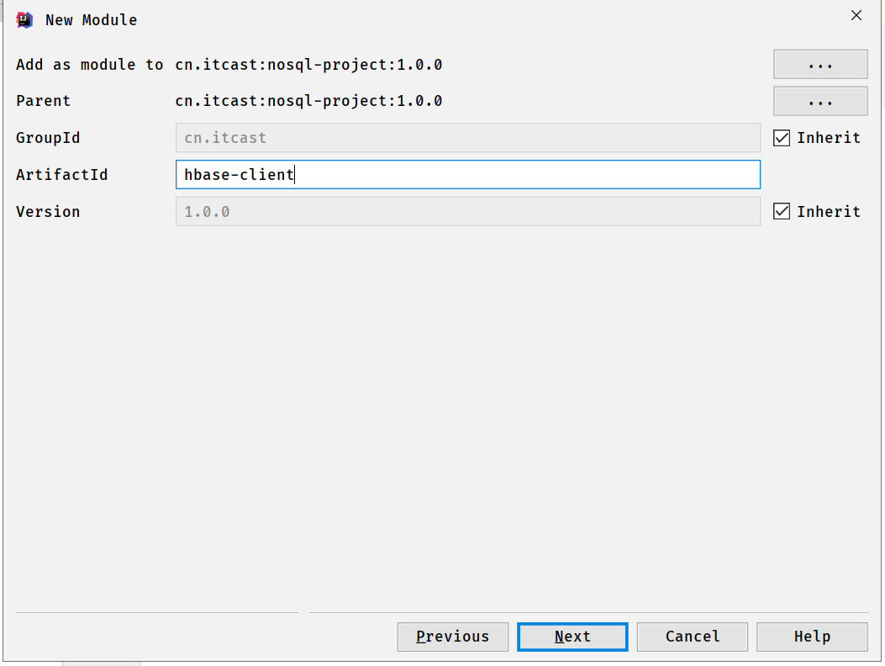

# HBase CRUD

## I. HBase命令行操作

> HBase 数据库提供命令行：hbase shell，对数据库进行DDL、DML及管理操作。

```ini
[root@node1 ~]# hbase shell
```


> 命令行输入命令：`help` ，显示支持命令，可以查看帮助。 


### 1. NameSpace DDL

> HBase中命名空间：**namespace**，支持命令如下所示


**列举所有Namespace**

命令：`list_namespace`，类似MySQL：**show databases**

```ini
list_namespace
```


**列举某个NameSpace中的表**

命令：`list_namespace_tables`，类似MySQL：**show tables  in dbname**

- 语法

  ```shell
  list_namespace_tables 'Namespace的名称'
  ```

- 示例

  ```shell
  list_namespace_tables 'hbase'
  ```


**创建NameSpace**

命令：`create_namespace`，类似MySQL：**create database  dbname**

- 语法

  ```ini
  create_namespace 'Namespace的名称'
  ```

- 示例

  ```shell
  create_namespace 'heima'
  
  create_namespace 'ITCAST'
  ```


**删除NameSpace**

命令：`drop_namespace`，**只能删除空命名空间**，如果命名空间中存在表，不允许删除

- 语法：

  ```
  drop_namespace 'Namespace的名称'
  ```

- 示例

```ini
drop_namespace 'ITCAST'
```

### 2. Table DDL

> 表Table的管理命令：创建表、删除表、修改表，启用和停用表等

```ini
Group name: ddl
Commands: alter, alter_async, alter_status, clone_table_schema, create, describe, disable, disable_all, drop, drop_all, enable, enable_all, exists, get_table, is_disabled, is_enabled, list, list_regions, locate_region, show_filters
```

**列举所有用户表**

命令：`list`，类似MySQL：**show tables**

```
list
```


**创建表**

命令：`create`，类似MySQL：**表名 + 列的信息【名称和类型】**

- [必须指定表名 + 至少一个列族]()

- 语法

  ```shell
  #表示在ns1的namespace中创建一张表t1,这张表有一个列族叫f1，这个列族中的所有列可以存储5个版本的值
  create 'ns1:t1', {NAME => 'f1', VERSIONS => 5}
  
  #在default的namespace中创建一张表t1,这张表有三个列族，f1,f2,f3，每个列族的属性都是默认的
  create 't1', 'f1', 'f2', 'f3'
  ```

- 示例

  ```shell
  # 创建表，可以更改列族的属性
  
    create 't1', {NAME => 'cf1'}, {NAME => 'cf2', VERSIONS => 3}
  
  # 创建表，不需要更改列族属性
  
    create 'heima:t2', 'cf1', 'cf2',' cf3' 
  
    create 'users', 'info'
  ```

**查看某个表信息**

命令：`desc`，类似MySQL ：**desc  tbname**

- 语法

  ```ini
  desc '表名'
  ```

- 示例

  ```ini
  desc 't1'
  ```

  

**判断存在某个表是否存储**

命令：`exists`

- 语法

  ```ini
  exists '表名'
  ```

- 示例

  ```ini
  exists 't1'
  ```

  

**表的禁用和启用**

命令：`disable /  enable`

- 功能

  - HBase为了**避免修改或者删除表，影响这张表正在对外提供读写服务**
  - [规定约束：修改或者删除表时，必须先禁用表，表示这张表暂时不能对外提供服务]()
  - 如果是删除：禁用以后删除
  - 如果是修改：先禁用，然后修改，修改完成以后启用

- 语法

  ```ini
  disable '表名'
  enable '表名'
  ```

- 示例

  ```ini
  # 禁用表
  disable 't1'
  
  # 启用表
  enable 't1'
  ```

**删除某个表**

命令：`drop`，类似MySQL：**drop table tbname**

- 语法

  ```ini
  drop '表名'
  ```

- 示例

  ```ini
  drop 't1'
  ```

- 注意

  如果要对表进行删除，必须**先禁用表，再删除表**


### 3. DML put

> 掌握HBase插入更新的数据命令**put**的使用

- **功能**

  插入  /  更新数据【某一行的某一列】

- **语法**

  ```ini
  # 表名+rowkey+列族+列+值
  put 'ns:tbname', 'rowkey', 'cf:col', 'value'
  ```

- **示例**

  ```ini
  create 'people', 'info'
  ```

  ```sql
  put 'people', '1001', 'info:name', 'laoda'
  put 'people', '1001', 'info:age', '25'
  put 'people', '1001', 'info:gender', 'male'
  put 'people', '1001', 'info:address', 'shanghai'
  
  put 'people', '1002','info:name', 'laoer'
  put 'people', '1002','info:address', 'beijing'
  
  put 'people', '1003','info:name', 'laosan'
  put 'people', '1003','info:age', '20'
  
  -- 扫描表数据
  scan "people"
  ```

- **注意**

  - put时如果不存在，就插入，如果存在就更新

    ```ini
    put 'people', '1003', 'info:name', '老三'
    put 'people', '1003', 'info:addr', '北京'
    
    scan 'people'
    ```

    

- **观察结果**

  

- HBase表数据：[按照Rowkey构建字典有序]()

  - 排序规则：
    - **先依据RowKey升序，再按照列簇CF升序，最后列名Column升序**
  - 底层存储也是KV结构：每一列就是一条KV数据
    - ==K：Rowkey + 列族 + 列 + 时间【降序】==
    - ==V：值==
  - ==没有更新和删除==：**通过插入来代替的，做了标记不再显示**

### 4. DML get

> 掌握HBase查询的数据命令get的使用

- 功能：**读取某个Rowkey的数据**

  - 优点：Get是HBase中**查询数据最快的方式**，并不是最常用的方式
  - 缺点：get命令最多**只能返回一个rowkey的数据**，根据Rowkey进行检索数据

- 语法

  ```ini
  get	表名	rowkey	[列族,列]
  
  get 'ns:tbname','rowkey'
  get 'ns:tbname','rowkey',[cf]
  get 'ns:tbname','rowkey',[cf:col]
  ```

- 示例

  ```ini
  # 获取RowKey所有列数据
  get 'people','1001'
  
  # 获取指定列簇中所有列数据
  get 'people','1001', 'info'
  
  # 获取指定列名称数据
  get 'people','1001', 'info:name'
  ```


### 5. DML scan

> 掌握HBase的查询数据命令scan的使用

- 功能：**根据条件匹配读取多个Rowkey的数据**

- 语法

  ```shell
  #读取整张表的所有数据，一般不用
  scan 'tbname'
  
  #根据条件查询：工作中主要使用的场景， 用到最多
  scan 'tbname', {Filter} 
  ```

- 示例

  - 全表扫描，生产环境不要使用

  ```ini
  scan 'people'
  ```

  

  - 全表扫描，指定条目数，类似MySQL中limit

  ```ini
  scan 'people', {LIMIT => 2}
  ```

  

  - rowkey前缀过滤器，在HBase数据查询中，使用最多

  ```ini
  scan 'people', {ROWPREFIXFILTER => '1001'}
  
  scan 'people', {ROWPREFIXFILTER => '100'}
  ```

  

  - rowkey范围过滤器

  ```ini
  # STARTROW：从某个rowkey开始，包含，闭区间
  # STOPROW：到某个rowkey结束，不包含，开区间
  scan 'people', {STARTROW=>'1001'}
  
  scan 'people', {STARTROW=>'1001', STOPROW=>'1003'}
  ```

  

> 面试题：HBase数据库数据查询方式有哪些？？

- 1、get查询，依据具体RowKey直接查询数据，[查询速度最快]()
- 2、Scan全部扫描查询，[性能最差，几乎不建议使用]()
- 3、Scan范围查询，过滤器查询，[前缀匹配查询，设置查询RowKey范围]()

## II. HBase Java API


## 附录: 注意事项及拓展内容

### 1. 服务启动停止命令

> 查看集群所有机器启动Java服务进程命令：`jpsall.sh`

- 上传脚本

```ini
[root@node1 ~]# cd /export/server/jdk/bin/

[root@node1 bin]# rz

[root@node1 bin]# chmod u+x jpsall.sh
```

- 测试脚本

------

```ini
[root@node1 ~]# jpsall.sh 
====================== node1.itcast.cn ====================
2108 Jps
====================== node2.itcast.cn ====================
2188 Jps
====================== node3.itcast.cn ====================
2230 Jps
```

> Zookeeper集群一键启动和停止命令：`start-zk.sh` 和 `stop-zk.sh`

- 上传脚本

```ini
[root@node1 ~]# cd /export/server/zookeeper/bin

[root@node1 bin]# rz

[root@node1 bin]# chmod u+x start-zk.sh 

[root@node1 bin]# chmod u+x stop-zk.sh 
```

- 测试脚本

```ini
[root@node1 ~]# start-zk.sh 
JMX enabled by default
Using config: /export/server/zookeeper/bin/../conf/zoo.cfg
Starting zookeeper ... STARTED
node1.itcast.cn starting...............................
JMX enabled by default
Using config: /export/server/zookeeper/bin/../conf/zoo.cfg
Starting zookeeper ... STARTED
node2.itcast.cn starting...............................
JMX enabled by default
Using config: /export/server/zookeeper/bin/../conf/zoo.cfg
Starting zookeeper ... STARTED
node3.itcast.cn starting...............................
```

### 2. HBase Maven依赖

创建Maven Module模块

------



向pom文件添加依赖

------

```xml
    <repositories>
        <repository>
            <id>aliyun</id>
            <url>http://maven.aliyun.com/nexus/content/groups/public/</url>
        </repository>
    </repositories>

    <dependencies>
        <dependency>
            <groupId>org.apache.hbase</groupId>
            <artifactId>hbase-client</artifactId>
            <version>2.1.2</version>
        </dependency>
        <dependency>
            <groupId>commons-io</groupId>
            <artifactId>commons-io</artifactId>
            <version>2.6</version>
        </dependency>
        <!-- JUnit 4 依赖 -->
        <dependency>
            <groupId>junit</groupId>
            <artifactId>junit</artifactId>
            <version>4.13</version>
        </dependency>
    </dependencies>

    <build>
        <plugins>
            <plugin>
                <groupId>org.apache.maven.plugins</groupId>
                <artifactId>maven-compiler-plugin</artifactId>
                <version>3.0</version>
                <configuration>
                    <source>1.8</source>
                    <target>1.8</target>
                    <encoding>UTF-8</encoding>
                </configuration>
            </plugin>
        </plugins>
    </build>
```

