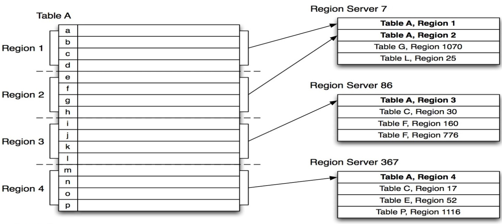
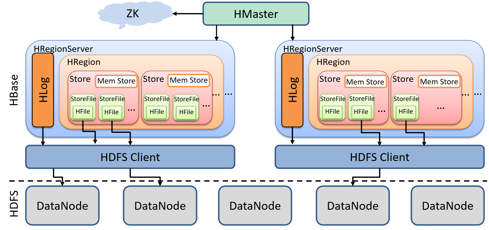
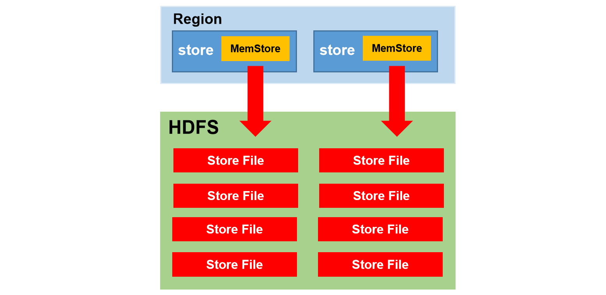
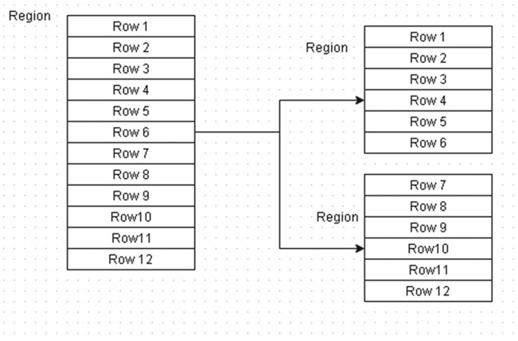

# HBase存储原理与优化

## I. HBase存储原理

### 1. Table、Region、RS

> **问题**：客户端操作的是表，数据最终存在RegionServer中，表和RegionServer的关系是什么？

- **Table：是一个逻辑对象**，物理上不存在，供用户实现逻辑操作，存储在元数据的一个概念

  - 数据写入表以后的物理存储：分区Region

  2. 一张表会有多个分区Region，每个分区存储在不同的机器上
  3. 默认每张表只有1个Region分区

- **Region：Hbase中数据`负载均衡`的最小单元**

  - 类似于HDFS中Block,用于实现Hbase中分布式

- 就是分区的概念，每张表都可以划分为多个Region，实现分布式存储，默认一张表只有一个分区

  3. 每个Region由一台RegionServer所管理，Region存储在RegionServer
  4. 一台RegionServer可以管理多个Region

  

- **RegionServer：是一个物理对象**，Hbase中的一个进程，管理一台机器的存储

  - 类似于HDFS中DataNode或者Kafka中的Broker

- 一个Regionserver可以管理多个Region

  - 一个Region只能被一个RegionServer所管理

  

> 创建表后，打开HBase WEB UI页面，查看表的分区Region信息


```ini
# t1,,1636172386242.9acd323bdbd17d77edda298c2dfaf32f.
    表的名称：
        t1
  Region管理数据起始RowKey
        如果是表的第1个Region，值为空
    时间戳
        Long类型数值，表示的是Region被RS管理时间（上线online时间）
    Region唯一标识符
        字符串，随机生成的
```

> 总结：HBase中Table与Region、RegionServer三者之间的关系是什么？

```ini
# Table：提供用户读写的逻辑概念
 
# Region：分区的概念
	一张表可以划分为多个分区
	每个分区都被某一台Regionserver所管理
 
# RegionServer：真正存储数据的物理概念
```


### 2. Region划分规则

> **问题**：一张表划分为多个Region，划分的规则是什么？写一条数据到表中，这条数据会写入哪个Region，分配规则是什么？

- **回顾HDFS和Redis划分规则**

  ```ini
  # 1. HDFS：划分分区的规则，按照大小划分
  	文件按照每128M划分一个Block
  	
  # 2. Redis：将0 ~ 16383划分成多个段，每个小的集群分配一个段的内容
  	CRC16（K） & 16383
  ```

- **HBase分区划分规则**：**范围划分【根据Rowkey范围】**

  ```ini
  # 1. 任何一个Region都会对应一个范围
    	如果只有一个Region，范围：-oo  ~  +oo
  	
  # 2. 范围划分：从整个-oo ~  +oo区间上进行范围划分
  
  #3. 每个分区都会有一个范围：根据Rowkey属于哪个范围就写入哪个分区
  	[startKey,stopKey)	 -> 前闭后开区间
  	
  默认：一张表创建时，只有一个Region，范围：-oo  ~ +oo
  ```


- 自定义：创建表时，指定有多少个分区，每个分区的范围

  ```ini
  创建一张表，有2个分区Region
  	create 't3', 'f1', SPLITS => ['50']
  分区范围
    	region0：-oo ~  50
    	region1：50  ~ +oo
  ```

- 数据分配的规则：**==根据Rowkey属于哪个范围就写入哪个分区==**

```ini
# 举个栗子：创建一张表，有4个分区Region，20,40,60
  	create 'itcast:t3', {SPLITS => [20, 40, 60]}
  	
# 规则：前闭后开
	region0：-oo ~ 20
	region1：20   ~ 40
	region2：40   ~ 60
	region3：60  ~ +oo

# 写入数据的rowkey：
	# 比较是按照ASCII码比较的，不是数值比较
	# 比较规则：ASCII码逐位比较
    A1234：region3
    c6789：region3
    00000001：region0
    2：region0
    99999999：region3
	
```

> 创建表后，打开HBase WEB UI页面，查看表的分区Region信息

```ini
# 1. 默认只有1个分区

# 2. 注意：随着数据越来越多，达到阈值，这个分区会自动分裂为两个分裂
```


```ini
# 3. 手动创建多个分区
create 'itcast:t3','cf',SPLITS => ['20', '40', '60', '80']
```


```ini
# 4. 写入数据
put 'itcast:t3','0300000','cf:name','laoda'
put 'itcast:t3','7890000','cf:name','laoer'
```


### 3. Region内部结构

> **问题**：数据在Region的内部是如何存储的？

```ini
put tbname, rowkey, cf:col, value

# tbname：决定了这张表的数据最终要读写哪些分区
# rowkey：决定了具体读写哪个分区
# cf：决定具体写入哪个Store
```

- Region：对整张表的数据划分，按照范围划分，实现分布式存储     


```ini
# Store：
    对分区的数据进行划分，按照列族划分，一个列族对应一个Store
    不同列族的数据写入不同的Store中，实现了按照列族将列进行分组
    根据用户查询时指定的列族，可以快速的读取对应的store

# MemStore：
    每个Store都有一个: 内存存储区域
    数据写入memstore就直接返回

# StoreFile：
    每个Store中可能有0个或者多个StoreFile文件
    逻辑上：Store
    物理上：HDFS，HFILE【二进制文件】
```

> **问题：Hbase的数据在HDFS中是如何存储的？**

- 整个Hbase在HDFS中的存储目录

  ```properties
  hbase.rootdir=hdfs://node1.itcast.cn:8020/hbase
  ```

  

  - NameSpace：目录结构


- Table：目录结构

  

- Region：目录结构

  

- Store/ColumnFamily：目录结构

  

- StoreFile

  

  - 如果HDFS上没有storefile文件，可以通过flush，手动将表中的数据从内存刷写到HDFS中

    ```
    flush 'itcast:t3'    
    ```

> Region的内部存储结构是什么样的？

```ini
# 1. NS:Table|RegionServer：整个Hbase数据划分

# 2. Region：划分表的数据，按照Rowkey范围划分
      - Store：划分分区数据，按照列族划分
        - MemStore：物理内存存储
        - StoreFile：物理磁盘存储
          - 逻辑：Store
          - 物理：HDFS[HFile]
```



### 4. Store内部原理: MemStore Flush

> Hbase利用Flush实现**将内存数据溢写到HDFS**，保持内存中不断存储最新的数据。



- **将内存memstore中的数据溢写到HDFS中变成磁盘文件storefile【HFILE】**
  - 关闭集群：自动Flush
  - 参数配置：自动触发机制

- 自动触发机制：HBase 2.0之前参数

  ```properties
  #region的memstore的触发
  #判断如果某个region中的某个memstore达到这个阈值，那么触发flush，flush这个region的所有memstore
  hbase.hregion.memstore.flush.size=128M
  
  #region的触发级别：如果没有memstore达到128，但是所有memstore的大小加在一起大于等于128*4
  #触发整个region的flush
  hbase.hregion.memstore.block.multiplier=4
  
  #regionserver的触发级别：所有region所占用的memstore达到阈值，就会触发整个regionserver中memstore的溢写
  #从memstore占用最多的Regin开始flush
  hbase.regionserver.global.memstore.size=0.4 --RegionServer中Memstore的总大小
  
  #低于水位后停止
  hbase.regionserver.global.memstore.size.upper.limit=0.99
  hbase.regionserver.global.memstore.size.lower.limit = 0.4*0.95 =0.38
  ```

- 自动触发机制：HBase 2.0之后

  ```properties
  #设置了一个flush的最小阈值
  #memstore的判断发生了改变：max("hbase.hregion.memstore.flush.size / column_family_number",hbase.hregion.percolumnfamilyflush.size.lower.bound.min)
  #如果memstore高于上面这个结果，就会被flush，如果低于这个值，就不flush，如果整个region所有的memstore都低于，全部flush
  #水位线 = max（128 / 列族个数,16）,列族一般给3个 ~ 42M
  #如果memstore的空间大于42,就flush，如果小于就不flush；如果都小于，全部flush
  
  举例：3个列族，3个memstore,90/30/30   90会被Flush
  
  举例：3个列族，3个memstore,30/30/30   全部flush
  
  hbase.hregion.percolumnfamilyflush.size.lower.bound.min=16M
  ```

  ```ini
  # 2.x中多了一种机制：In-Memory-compact,如果开启了【不为none】，会在内存中对需要flush的数据进行合并
  #合并后再进行flush，将多个小文件在内存中合并后再flush
    hbase.hregion.compacting.memstore.type=None|basic|eager|adaptive
  ```

> **注意**：工作中一般进行手动Flush

- 原因：避免大量的Memstore将大量的数据同时Flush到HDFS上，占用大量的内存和磁盘的IO带宽，会影响业务

- 解决：手动触发，定期执行

  ```shell
  hbase> flush 'TABLENAME'
  hbase> flush 'REGIONNAME'
  hbase> flush 'ENCODED_REGIONNAME'
  hbase> flush 'REGION_SERVER_NAME'
  ```

- 封装一个文件，通过`hbase shell filepath`来定期的运行这个脚本

### 5. Store 内部原理: StoreFile Compaction

> Hbase通过**Compaction**实现**将零散的有序数据合并为整体有序大文件，提高对HDFS数据的查询性能**

- **功能**：什么是Compaction？

  ```ini
  # 将多个单独有序StoreFile文件进行合并，合并为整体有序的大文件，加快读取速度
      file1: 1 2 3 4 5
      file2: 6 7 9
      file3: 1 8 10
  
  # 每个文件都读取，可能读取无效的数据
  	file：1 1 2 3 4 5 6 7 8 9 10
  ```

- **版本功能**

  ```ini
  # 2.0版本之前，只有StoreFile文件的合并
    磁盘中合并：minor compaction、major compaction
    
  # 2.0版本开始，内存中的数据也可以先合并后Flush
    内存中合并：In-memory compaction
    磁盘中合并：minor compaction、major compaction
  ```

> HBase 2.0之前Compaction，分为Minor Compaction和Major Compaction。


- **minor compaction**：轻量级

  - 功能：将最早生成的几个小的StoreFile文件进行合并，成为一个大文件，不定期触发

  - 特点

    - 只实现将多个小的StoreFile合并成一个相对较大的StoreFile，占用的资源不多
    - 不会将标记为更新或者删除的数据进行处理

  - 属性

    ```ini
    hbase.hstore.compaction.min=3
    ```

- **major compaction**：重量级合并

  - 功能：将**整个Store**中所有StoreFile进行合并为一个StoreFile文件，整体有序的一个大文件

  - 特点

    - 将所有文件进行合并，构建整体有序
    - 合并过程中会进行**清理过期和标记为删除的数据**
    - 资源消耗比较大

  - 参数配置

    ```ini
    hbase.hregion.majorcompaction=7天
    ```

> HBase 2.0开始，新增：**In-memory compaction**。

- 原理：将当前写入的数据划分segment【数据段】

  - 当数据不断写入MemStore，划分不同的segment，最终变成storefile文件

- 如果开启内存合并，先将第一个segment放入一个队列中，与其他的segment进行合并

  - 合并以后的结果再进行flush

- 内存中合并的方式

  ```properties
  hbase.hregion.compacting.memstore.type=None|basic|eager|adaptive
  
  none：不开启，不合并
  ```

- basic（基础型）

  ```shell
  Basic compaction策略不清理多余的数据版本，无需对cell的内存进行考核
  	basic适用于所有大量写模式
  ```

- eager（饥渴型）

  ```
  eager compaction会过滤重复的数据，清理多余的版本，这会带来额外的开销
  	eager模式主要针对数据大量过期淘汰的场景，例如：购物车、消息队列等
  ```

- **adaptive（适应型）**

  ```
  adaptive compaction根据数据的重复情况来决定是否使用eager策略
  	找出cell个数最多的一个，然后计算一个比例，如果比例超出阈值，则使用eager策略，否则使用basic策略
  ```

> 在工作中要避免**自动触发major compaction**，影响业务，所以禁用自动进行major compaction。

```ini
hbase.hregion.majorcompaction=0
```

- 在不影响业务的时候，手动处理，每天在业务不繁忙的时候，调度工具实现手动进行`major_compact`

  ```shell
  Run major compaction on passed table or pass a region row
            to major compact an individual region. To compact a single
            column family within a region specify the region name
            followed by the column family name.
            Examples:
            
            Compact all regions in a table:
            hbase> major_compact 't1'
            hbase> major_compact 'ns1:t1'
            
            Compact an entire region:
            hbase> major_compact 'r1'
            
            Compact a single column family within a region:
            hbase> major_compact 'r1', 'c1'
            
            Compact a single column family within a table:
            hbase> major_compact 't1', 'c1'
            
            Compact table with type "MOB"
            hbase> major_compact 't1', nil, 'MOB'
            
            Compact a column family using "MOB" type within a table
            hbase> major_compact 't1', 'c1', 'MOB'
  ```

### 6. Region Split

> HBase通过Region Split策略来保证一个Region存储的数据量不会过大，通过**分裂实现分摊负载，避免热点**，降低故障率。



> 什么是Split分裂机制？

- 为了避免一个Region存储的数据过多，提供了Region分裂机制
- 实现将一个Region分裂为两个Region
- 由RegionServer实现Region的分裂，得到两个新的Region(Region下线)
- 由Master负责将两个新的Region分配到Regionserver上（Region上线

> 相关参数配置

- region阈值

```ini
hbase.hregion.max.filesize=10GB
```

- 0.94之前：判断region中是否有一个storefile文件是否达到阈值，如果达到，就分裂

```ini
hbase.regionserver.region.split.policy=org.apache.hadoop.hbase.regionserver.ConstantSizeRegionSplitPolicy
```

- 0.94开始：如果region个数在**0 ` 100**之间

```ini
# 规则：Math.min(getDesiredMaxFileSize(),initialSize * tableRegionsCount * tableRegionsCount * tableRegionsCount)
# initialSize = 128 X 2
# min(10GB, 256 x region个数的3次方)
hbase.regionserver.region.split.policy=org.apache.hadoop.hbase.regionserver.IncreasingToUpperBoundRegionSplitPolicy
```

- 2.x开始

```properties
# 规则：return tableRegionsCount  1  ? this.initialSize : getDesiredMaxFileSize();
# 判断region个数是否为1，如果为1，就按照256分，如果不为1，就按照10GB来分
hbase.regionserver.region.split.policy=org.apache.hadoop.hbase.regionserver.SteppingSplitPolicy
```

> **注意**：工作作中避免自动触发，影响集群读写，建议关闭

```properties
hbase.regionserver.region.split.policy=org.apache.hadoop.hbase.regionserver.DisabledRegionSplitPolicy
```

- 手动操作

  ```shell
  split 'tableName'
  split 'namespace:tableName'
  split 'regionName' # format: 'tableName,startKey,id'
  split 'tableName', 'splitKey'
  split 'regionName', 'splitKey'
  ```

### 7. 元数据表hbase:meta


> 当执行一条Put操作，数据是如何写入Hbase表或执行一条Get操作，如何从HBase表读取数据？

```ini
# 写入数据
	put 表名 rowkey 列族:列 值

# 读取数据
	get 表名 rowkey
```


- step1：根据**表名**获取这张表对应的**所有Region的信息**
  - 整个Hbase的所有Regionserver中有很多个Region：100
  - 先根据表名找到这张表有哪些region：5
- step2：根据**Rowkey**判断具体写入哪个Region
  - 知道表的所有region
  - 根据rowkey属于哪个**region范围**，来确定具体写入哪个region
- step3：将put操作提交给这个**Region所在的RegionServer**
  - 获取这个Region所在的RegionServer地址
- step4：RegionServer将数据写入Region根据**列族**判断写入**哪个Store**
- step5：将数据写入**MemStore**中

> 读写HBase表数据，3个思考题：

- 问题1：如何知道这张表对应的region有哪些？
- 问题2：如何知道每个Region的范围的？
- 问题3：如何知道Region所在的RegionServer地址的？

> HBase自带的两张系统表

- **hbase:namespace**：存储HBase中所有namespace的信息

  

- **hbase:meta**：存储表的元数据


> `hbase:meta`表结构

- Rowkey：每张表每个Region的名称

  ```ini
  itcast:t3,20,1632627488682.fba4b18252cfa72e48ffe99cc63f7604
  表名,startKey,时间，唯一id
  ```


- HBase中每张表的每个region对应元数据表中的一个Rowkey

  ```ini
  # info:regioninfo
  	STARTKEY => 'eeeeeeee', ENDKEY => ''
  	
  # info:server
  	column=info:server, timestamp=1651559521977, value=node2.itcast.cn:16020 
  ```

> 根据表名读取meta表，基于rowkey的前缀匹配，获取这张表的所有region信息

- 第一点： 系统表【`hbase:meta`】只有1个Region
- 第二点：Region所在RegionServer地址信息，被保存到Zookeeper上


[所以读写HBase表数据时，创建连接Connection时，指定依赖Zookeper集群地址。]()

### 8. 数据写入流程

> **Hbase写入数据的整体流程**

- **step1：获取表的元数据**

  - ==先连接zk，从zk获取meta表所在的regionserver==

  - 根据查询的表名读取meta表，获取这张表的所有region的信息

    ```ini
    meta表是一张表，数据存储在一个region，这个region存在某个regionserver上
    ```

  - 怎么知道meta表的regionserver在哪？

    - 这个地址记录在ZK中

      

    - 得到这张表的所有region的范围和地址

- **step2：找到对应的Region**

  - 根据Rowkey和所有region的范围，来匹配具体写入哪个region
  - 获取这个region所在的regionserver的地址

- **step3：写入数据**

  - 请求对应的regionserver

  - regionserver根据提交的region的名称和数据来操作对应的region

  - 根据列族来判断具体写入哪个store

    ```ini
    # 1.先写WAL：write ahead log
    	为了避免内存数据丢失，所有数据写入内存之前会
    	先记录这个内存操作
    
    # 2. 然后写这个Store的Memstore中
    ```


> [思考：hbase的region没有选择副本机制来保证安全，如果RegionServer故障，Master发现故障，怎么保证数据可用性？]()

- step1：Master会根据元数据将这台RegionServe中的Region恢复到别的机器上

- step2：怎么实现数据恢复？

  ```ini
  # 1. Memstore：WAL进行恢复
  	WAL记录在HDFS上
  
  # 2. StoreFile：HDFS有副本机制
  ```

### 9. 数据读取流程

> **Hbase数据读取整体流程**

- **step1：获取元数据**

  - 客户端请求Zookeeper，获取meta表所在的regionserver的地址
  - 读取meta表的数据
  - **注意：客户端会缓存meta表的数据，只有第一次会连接ZK，读取meta表的数据，缓存会定期失效，要重新缓存**
  - 避免每次请求都要先连接zk，再读取meta表

- **step2：找到对应的Region**

  - 根据meta表中的元数据，找到表对应的region
  - 根据region的范围和读取的Rowkey，判断需要读取具体哪一个Region
  - 根据region的Regionserver的地址，请求对应的RegionServer

- **step3：读取数据**

  - **先查询memstore**

  - 如果开启了缓存，**就读BlockCache**

    - 如果缓存中没有，也读取storefile，从storefile读取完成以后，放入缓存中

  - 如果没有开启缓存**，就读取StoreFile**

  - 第一次查询

    ```ini
     memstore
     storefile：如果开启了缓存，就将这次从storefile中读取的数据放入缓存BlockCache
    ```

  - 第二次查询

    ```ini
    memstore：写缓存
    blockCache：读缓存
    storefile：二进制
    ```

  

## II. HBase优化

### 1. Rowkey设计

> HBase 性能问题：[在某个时间段内，大量的读写请求全部集中在某个Region中，导致这台RegionServer的负载比较高，其他的Region和RegionServer比较空闲。]()

- **问题**：这台RegionServer故障的概率就会增加，整体性能降低，效率比较差

- **原因**：本质上的原因，[数据分配不均衡]()

  ```ini
  # 1. 情况一：如果这张表只有一个分区
  	所有数据都存储在一个分区中，这个分区要响应所有读写请求，出现了热点
  	
  # 2. 情况二：如果这张表有多个分区，而且写入时Rowkey是连续的
  	一张表有5个分区
  		region0：-oo  20
          region1：20   40
          region2：40   60
          region3: 60    80
          region4: 80    +oo
      
      批量写入数据：
          000001：region0
          000002：region0
          ……
          199999：region0
      # 都写入了同一个region0分区
  		200000：region1
  		200001：region1
  		……
  		399999：region1    	
      
  # 3. 情况三：Region范围不合理
  	Region：3个分区
  	    region0：-oo ~ 30
          region1：30  ~ 70
          region2:70 ~ +oo
          
      # Rowkey：字母开头，所有数据都写入了region2
  ```

> 创建HBase表时，指定一张表拥有多个Region分区，不要使用默认分区：1个分区。

- **划分的目标**：划分**多个分区**，实现**分布式并行读写**，将无穷区间划分为几段，将数据存储在不同分区中，实现分区的负载均衡

- **划分的规则**：**==Rowkey或者Rowkey的前缀来划分==**

- 方式一：指定分隔段，实现预分区

  - 前提：先设计rowkey

  ```shell
  create 'htb1', 'info', SPLITS => ['10', '20', '30', '40']
  
  #将每个分割的段写在文件中，一行一个
  create 'htb2', 'info', SPLITS_FILE => 'splits.txt'
  
  splits.txt：
  10
  20
  30
  40
  ```

- 方式二：指定Region个数，自动进行Hash划分：==字母和数字的组合==

  ```shell
  #你的rowkey的前缀是数字和字母的组合 
  create 'htb2', 'info', {NUMREGIONS => 5, SPLITALGO => 'HexStringSplit'}
  ```

  

- 方式三：Java API

  ```java
  HBASEAdmin admin = conn.getAdmin
  admin.create(表的描述器对象, byte[][] splitsKey)
  ```

> **根据不同业务需求，来合理的设计rowkey，实现高性能的数据存储**

- **唯一原则**：Rowkey必须具有唯一性，不能重复，一个Rowkey唯一标识一条数据

- **业务原则**：Rowkey的设计必须贴合业务的需求，一般选择**最常用的查询条件作为rowkey的前缀**

- **组合原则**：将更多的经常作为的查询条件的列放入Rowkey中，可以满足更多的条件查询可以走索引查询

- **散列原则**：为了避免出现热点问题，需要将数据的rowkey生成规则构建散列的rowkey

  - **方案一：更换不是连续的字段作为前缀，例如用户id**
  - **方案二：反转**，一般用于时间作为前缀，查询时候必须将数据反转再查询

  - ==方案三：加盐（Salt）==，本质对数据进行编码，生成数字加字母组合的结果

- **长度原则**：在满足业务需求情况下，rowkey越短越好，一般建议Rowkey的长度小**于100字节**

  - 原因：rowkey越长，比较性能越差，rowkey在底层的存储是冗余的
  - 如果rowkey超过了100字节，将一个长的rowkey，编码为8位，16位，32位

```ini
HBase中RowKey设计（表的设计）
	实际业务需求为例：
		全省交通卡口流量数据，每天数据增量1500万条左右
-----------------------------------------------------------------------
RowKey设计原则：
	1) 业务性（满足大多数据查询需求）、
		依据【车牌号码】查询车流量数据（行驶数据），加上时间范围过滤查询
		查询一：前缀匹配
			苏A-7D8E7
			所有车流量数据
		查询二：前缀匹配
			苏A-7D8E7 + 【20220501】
			查询某一条车流量数据
		查询三：前缀范围
			苏A-7D8E7 + [20220401  ~ 20220501)
			查询某个时间范围（比如4月份）内数据
		查询四：
			很少此类型查询
			依据卡口查询车流量

	
	2) 唯一性（避免rowkey相同，数据被覆盖）、
	
	3) 热点性（写入数据时，分散写入不同Region）

CREATE 'ROAD_TRAFFIC_FLOW', 'INFO', {SPLIT => ['rk1', 'rk2', 'rk3', 'rk4']}
	表中有5个Region分区

RowKey值
	业务性：
		cphm  +  datetime 

	唯一性：
		套牌车，很有可能出现：在同一时刻，恰好驶过不同路口，记录流量数据
		cphm  +  datetime  +  qkbh（卡口编号）

	热点性：
		reverse(cphm)  +  datetime  +  qkbh

	如果插入数据
		put 'ROAD_TRAFFIC_FLOW', '7E8D7-A苏_20220501091013445_B019999999', 'INFO:CPHM', '苏A-7D8E7'
-----------------------------------------------------------------------
```

### 2. 内存与表优化

> **优化一**：RegionServer内存分配

- RegionServer堆内存：100%


- **MemStore**：写缓存

  ```ini
  hbase.regionserver.global.memstore.size = 0.4
  ```

  - 如果存多了，Flush到HDFS

- **BlockCache**：读缓存

  ```ini
  hfile.block.cache.size = 0.4
  ```

  - **LRU淘汰算法**，将最近最少被使用的数据从缓存中剔除

- 读多写少，降低MEMStore比例

- 读少写多，降低BlockCache比例

> **优化二**：压缩机制，对于大量数据的压缩存储，提高性能

- 本质：Hbase的压缩源自于Hadoop对于压缩的支持

- 检查Hadoop支持的压缩类型

  - `hadoop checknative`

- 需要将Hadoop的本地库配置到Hbase中

  - 关闭Hbase的服务，配置Hbase的压缩本地库： `lib/native/Linux-amd64-64`

  ```ini
  cd /export/server/hbase/
  
  mkdir -p lib/native
  ```

  - 将Hadoop的压缩本地库创建一个软链接到Hbase的`lib/native`目录下

  ```ini
  ln -s /export/server/hadoop/lib/native /export/server/hbase/lib/native/Linux-amd64-64
  ```

  - 启动Hbase服务

  ```
  start-hbase.sh
  
  hbase shell
  ```

- 创建表

  ```ini
  create 't1_snappy', {NAME=>'info', COMPRESSION => 'SNAPPY'}
  
  put 't1_snappy',' 001', 'info:name','laoda'
  ```

> **优化三**：布隆过滤，在写入数据时，建立布隆索引;读取数据时，根据布隆索引加快数据的检索

- **功能**：什么是布隆过滤器？
  - 列族的一个属性，用于**数据查询时对数据的过滤**
  - 列族属性：`BLOOMFILTER => NONE | 'ROW' | ROWCOL`
    - NONE ：不开启布隆过滤器
- **ROW：行级布隆过滤**
  - 生成StoreFile文件时，会将这个文件中有哪些Rowkey的数据记录在文件的头部
  - 当读取StoreFile文件时，会从文件头部获取这个StoreFile中的所有rowkey，自动判断是否包含需要的rowkey，如果包含就读取这个文件，如果不包含就不读这个文件
- **ROWCOL**：行列级布隆过滤
  - 生成StoreFile文件时，会将这个文件中有哪些Rowkey的以及对应的列族和列的信息数据记录在文件的头部
  - 当读取StoreFile文件时，会从文件头部或者这个StoreFile中的所有rowkey以及列的信息，自动判断是否包含需要的rowkey以及列，如果包含就读取这个文件，如果不包含就不读这个文件