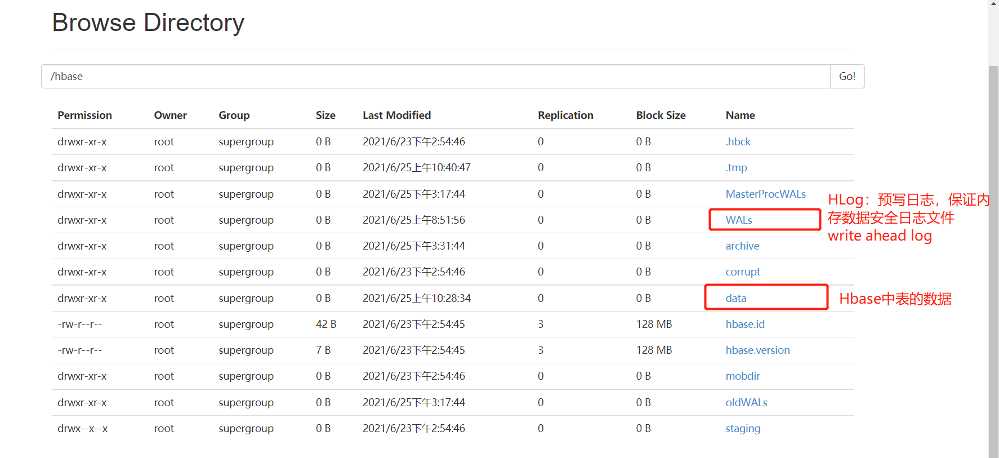

# HBase存储原理与优化

## I. HBase存储原理

### 1. Table、Region、RS

> **问题**：客户端操作的是表，数据最终存在RegionServer中，表和RegionServer的关系是什么？

- **Table：是一个逻辑对象**，物理上不存在，供用户实现逻辑操作，存储在元数据的一个概念

  - 数据写入表以后的物理存储：分区Region

  2. 一张表会有多个分区Region，每个分区存储在不同的机器上
  3. 默认每张表只有1个Region分区

- **Region：Hbase中数据`负载均衡`的最小单元**

  - 类似于HDFS中Block,用于实现Hbase中分布式

- 就是分区的概念，每张表都可以划分为多个Region，实现分布式存储，默认一张表只有一个分区

  3. 每个Region由一台RegionServer所管理，Region存储在RegionServer
  4. 一台RegionServer可以管理多个Region

  

- **RegionServer：是一个物理对象**，Hbase中的一个进程，管理一台机器的存储

  - 类似于HDFS中DataNode或者Kafka中的Broker

- 一个Regionserver可以管理多个Region

  - 一个Region只能被一个RegionServer所管理

  

> 创建表后，打开HBase WEB UI页面，查看表的分区Region信息


```ini
# t1,,1636172386242.9acd323bdbd17d77edda298c2dfaf32f.
    表的名称：
        t1
  Region管理数据起始RowKey
        如果是表的第1个Region，值为空
    时间戳
        Long类型数值，表示的是Region被RS管理时间（上线online时间）
    Region唯一标识符
        字符串，随机生成的
```

> 总结：HBase中Table与Region、RegionServer三者之间的关系是什么？

```ini
# Table：提供用户读写的逻辑概念
 
# Region：分区的概念
	一张表可以划分为多个分区
	每个分区都被某一台Regionserver所管理
 
# RegionServer：真正存储数据的物理概念
```


### 2. Region划分规则

> **问题**：一张表划分为多个Region，划分的规则是什么？写一条数据到表中，这条数据会写入哪个Region，分配规则是什么？

- **回顾HDFS和Redis划分规则**

  ```ini
  # 1. HDFS：划分分区的规则，按照大小划分
  	文件按照每128M划分一个Block
  	
  # 2. Redis：将0 ~ 16383划分成多个段，每个小的集群分配一个段的内容
  	CRC16（K） & 16383
  ```

- **HBase分区划分规则**：**范围划分【根据Rowkey范围】**

  ```ini
  # 1. 任何一个Region都会对应一个范围
    	如果只有一个Region，范围：-oo  ~  +oo
  	
  # 2. 范围划分：从整个-oo ~  +oo区间上进行范围划分
  
  #3. 每个分区都会有一个范围：根据Rowkey属于哪个范围就写入哪个分区
  	[startKey,stopKey)	 -> 前闭后开区间
  	
  默认：一张表创建时，只有一个Region，范围：-oo  ~ +oo
  ```


- 自定义：创建表时，指定有多少个分区，每个分区的范围

  ```ini
  创建一张表，有2个分区Region
  	create 't3', 'f1', SPLITS => ['50']
  分区范围
    	region0：-oo ~  50
    	region1：50  ~ +oo
  ```

- 数据分配的规则：**==根据Rowkey属于哪个范围就写入哪个分区==**

```ini
# 举个栗子：创建一张表，有4个分区Region，20,40,60
  	create 'itcast:t3', {SPLITS => [20, 40, 60]}
  	
# 规则：前闭后开
	region0：-oo ~ 20
	region1：20   ~ 40
	region2：40   ~ 60
	region3：60  ~ +oo

# 写入数据的rowkey：
	# 比较是按照ASCII码比较的，不是数值比较
	# 比较规则：ASCII码逐位比较
    A1234：region3
    c6789：region3
    00000001：region0
    2：region0
    99999999：region3
	
```

> 创建表后，打开HBase WEB UI页面，查看表的分区Region信息

```ini
# 1. 默认只有1个分区

# 2. 注意：随着数据越来越多，达到阈值，这个分区会自动分裂为两个分裂
```


```ini
# 3. 手动创建多个分区
create 'itcast:t3','cf',SPLITS => ['20', '40', '60', '80']
```


```ini
# 4. 写入数据
put 'itcast:t3','0300000','cf:name','laoda'
put 'itcast:t3','7890000','cf:name','laoer'
```


### 3. Region内部结构

> **问题**：数据在Region的内部是如何存储的？

```ini
put tbname, rowkey, cf:col, value

# tbname：决定了这张表的数据最终要读写哪些分区
# rowkey：决定了具体读写哪个分区
# cf：决定具体写入哪个Store
```

- Region：对整张表的数据划分，按照范围划分，实现分布式存储     


```ini
# Store：
    对分区的数据进行划分，按照列族划分，一个列族对应一个Store
    不同列族的数据写入不同的Store中，实现了按照列族将列进行分组
    根据用户查询时指定的列族，可以快速的读取对应的store

# MemStore：
    每个Store都有一个: 内存存储区域
    数据写入memstore就直接返回

# StoreFile：
    每个Store中可能有0个或者多个StoreFile文件
    逻辑上：Store
    物理上：HDFS，HFILE【二进制文件】
```

> **问题：Hbase的数据在HDFS中是如何存储的？**

- 整个Hbase在HDFS中的存储目录

  ```properties
  hbase.rootdir=hdfs://node1.itcast.cn:8020/hbase
  ```

  

  - NameSpace：目录结构


- Table：目录结构

  

- Region：目录结构

  

- Store/ColumnFamily：目录结构

  

- StoreFile

  

  - 如果HDFS上没有storefile文件，可以通过flush，手动将表中的数据从内存刷写到HDFS中

    ```
    flush 'itcast:t3'    
    ```

> Region的内部存储结构是什么样的？

```ini
# 1. NS:Table|RegionServer：整个Hbase数据划分

# 2. Region：划分表的数据，按照Rowkey范围划分
      - Store：划分分区数据，按照列族划分
        - MemStore：物理内存存储
        - StoreFile：物理磁盘存储
          - 逻辑：Store
          - 物理：HDFS[HFile]
```


