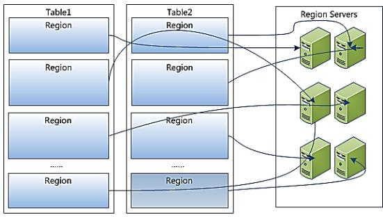

# HBase存储原理与优化

### 1. Table、Region、RS

> **问题**：客户端操作的是表，数据最终存在RegionServer中，表和RegionServer的关系是什么？

- **Table：是一个逻辑对象**，物理上不存在，供用户实现逻辑操作，存储在元数据的一个概念

  - 数据写入表以后的物理存储：分区Region

  2. 一张表会有多个分区Region，每个分区存储在不同的机器上
  3. 默认每张表只有1个Region分区

- **Region：Hbase中数据`负载均衡`的最小单元**

  - 类似于HDFS中Block,用于实现Hbase中分布式

- 就是分区的概念，每张表都可以划分为多个Region，实现分布式存储，默认一张表只有一个分区	

  3. 每个Region由一台RegionServer所管理，Region存储在RegionServer
  4. 一台RegionServer可以管理多个Region

  

- **RegionServer：是一个物理对象**，Hbase中的一个进程，管理一台机器的存储

  - 类似于HDFS中DataNode或者Kafka中的Broker

- 一个Regionserver可以管理多个Region

  - 一个Region只能被一个RegionServer所管理

  

> 创建表后，打开HBase WEB UI页面，查看表的分区Region信息


```ini
# t1,,1636172386242.9acd323bdbd17d77edda298c2dfaf32f.
    表的名称：
        t1
  Region管理数据起始RowKey
        如果是表的第1个Region，值为空
    时间戳
        Long类型数值，表示的是Region被RS管理时间（上线online时间）
    Region唯一标识符
        字符串，随机生成的
```

> 总结：HBase中Table与Region、RegionServer三者之间的关系是什么？

```ini
# Table：提供用户读写的逻辑概念
 
# Region：分区的概念
	一张表可以划分为多个分区
	每个分区都被某一台Regionserver所管理
 
# RegionServer：真正存储数据的物理概念
```

