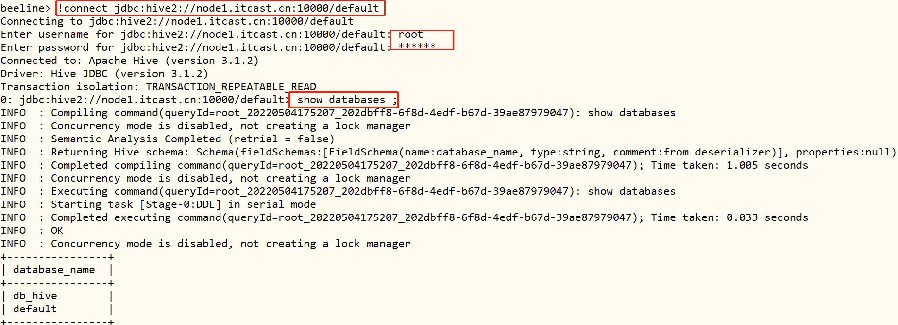

# HBase on Hive&Phoenix

Apache Phoenix是构建在HBase上的一个SQL层，能让我们用**标准的JDBC API**s而不是HBase客户端APIs来**创建表，插入数据和对HBase数据进行查询**。


Phoenix完全使用Java编写，**作为HBase内嵌的JDBC驱动**，Phoenix查询引擎会==将SQL查询转换为一个或多个HBase扫描Scan，并编排执行以生成标准的JDBC结果集==。

```ini
官网：http://phoenix.apache.org/
```

## I. HBase与Hive集成

### 1. SQL on HBase

> 使用HBase 数据库存储数据和查询数据时，遇到问题：

- HBase是按列存储NoSQL，不支持SQL，开发接口不方便大部分用户使用，怎么办？
- 大数据开发：==HBase 命令、HBase Java API==
- Java开发【JDBC】、数据分析师【SQL】：怎么用HBase？

> **需要一个工具能让HBase支持SQL，支持JDBC方式对HBase进行处理**

- SQL：结构化查询语言

- HBase 数据结构是否能实现基于SQL的查询操作？

  - 普通表数据：按行操作

    ```ini
     id      name        age     sex     addr
     001     zhangsan    18      null    shanghai
     002     lisi        20      female  null
     003     wangwu      null    male    beijing
     ……
    ```

  - HBase数据：按列操作

    ```ini
     rowkey       	info:id   info:name   info:age   info:sex   info:addr
     zhangsan_001    001      zhangsan      18          null      shanghai
     lisi_002        002      lisi          20          female    null
     wangwu_003      003      wangwu        null        male      beijing
     ……
    ```

- 可以==基于HBase 数据构建结构化的数据形式==，使用SQL进行分析处理

> **具体实现方式：**[集成Hive，集成Impala，使用Phoenix框架]()

- 将HBase表中每一行对应的所有列构建一张完整的结构化表
  - 如果这一行没有这一列，就补null
- 集成框架：
  - Hive：通过MapReduce来实现
  - Impala：基于内存分布式计算实现
  - Phoenix：通过HBase API封装实现的

### 2. Hive on HBase

> **实现Hive与HBase  集成，使用Hive SQL对HBase  的数据进行处理**

```ini
# HBase【itcast:t1】
	构建一个映射关系：数据存储在Hbase
	scan 'itcast:t1'
	
# Hive【itcast.t1】
	用户可以通过SQL操作Hive中表
	select * from itcast.t1
```

> **在Hive中对HBase关联的Hive表执行SQL语句，底层通过Hadoop中的Input和Output对HBase表进行处理**


> HBase 集成Hive优缺点：

- 优点：**支持完善的SQL语句**，可以实现各种复杂SQL的数据处理及计算，通过分布式计算程序实现，对大数据量的数据处理比较友好
- 缺点：**不支持二级索引**，数据量不是特别大的情况下，性能一般

> **实现Hive on HBase 配置**

- 1、修改`hive-site.xml`

  Hive通过SQL访问HBase ，就是HBase 的客户端，就要连接zookeeper

  ```shell
  vim /export/server/hive/conf/hive-site.xml
  ```

  ```xml
  <property>
        <name>hive.zookeeper.quorum</name>
        <value>node1.itcast.cn,node2.itcast.cn,node3.itcast.cn</value>
    </property>
    <property>
        <name>hbase.zookeeper.quorum</name>
        <value>node1.itcast.cn,node2.itcast.cn,node3.itcast.cn</value>
    </property>
    <property>
        <name>hive.server2.enable.doAs</name>
        <value>false</value>
    </property>
  ```

- 2、修改`hive-env.sh`

  ```ini
  # Set HBASE_HOME
  export HBASE_HOME=/export/server/hbase
  ```

- 3、同步集群

  ```ini
  scp /export/server/hive/conf/hive-site.xml node2.itcast.cn:/export/server/hive/conf/
  scp /export/server/hive/conf/hive-env.sh node2.itcast.cn:/export/server/hive/conf/
  
  scp /export/server/hive/conf/hive-site.xml node3.itcast.cn:/export/server/hive/conf/
  scp /export/server/hive/conf/hive-env.sh node3.itcast.cn:/export/server/hive/conf/
  ```

- 4、启动HDFS、ZK、HBase

  ```ini
  start-zk.sh
  
  start-dfs.sh
  
  start-hbase.sh
  ```

- 5、启动Hive和YARN

  ```shell
  #启动YARN
  start-yarn.sh
  
  #先启动metastore服务
  start-metastore.sh
  #然后启动hiveserver
  start-hiveserver2.sh
  
  #然后启动beeline
  /export/server/hive/bin/beeline
  !connect jdbc:hive2://node1.itcast.cn:10000
  root 123456
  ```

  

> **实现Hive on HBase 的测试**

- **如果HBase 中表已存在，只能创建外部表**

  ```sql
  --创建测试数据库
  create database db_hbase;
  use db_hbase;
  
  --创建测试表
  create external table db_hbase.bank_records(
  key string,
  code string,
  money  string,
  pay_account string,
  pay_channel string,
  pay_comments string,
  pay_name string,
  pay_way string,
  rec_account string,
  rec_bank_name string,
  rec_name string,
  status string,
  ts string
  )  
  stored by 'org.apache.hadoop.hive.hbase.HBaseStorageHandler'  
  with serdeproperties("hbase.columns.mapping" = ":key,info:code,info:money,info:pay_account,info:pay_channel,info:pay_comments,info:pay_name,info:pay_way,info:rec_account,info:rec_bank_name,info:rec_name,info:status,info:timestamp") 
  tblproperties("hbase.table.name" = "default:bank_records");
  ```

- 查询

  ```SQL
  SELECT * FROM db_hbase.bank_records LIMIT 10 ;
    
  SELECT rec_bank_name, COUNT(*) AS total FROM db_hbase.bank_records GROUP BY rec_bank_name ORDER BY total DESC;
  ```

> **注意**

- Hive中的只是关联表，并没有数据，数据存储在HBase 表中
- 在Hive中创建HBase 的关联表，关联成功后，使用SQL通过MapReduce处理关联表
- 如果HBase 中表已存在，只能建外部表，使用**:key**来表示**rowkey**
- Hive中与HBase 关联的表，**不能使用load写入数据**，只能使用insert，通过MR读写数据

## II. Phoenix快速使用

### 1. 框架介绍


### 2. 安装配置


### 3. DDL操作


### 4. 视图View


### 5. 数据CRUD


### 6. 表预分区


### 7. JDBC Client


## III. Phoenix二级索引

### 1. 功能概述


### 2. 全局索引


### 3. 覆盖索引


### 4. 本地索引


## 附录

### Phoenix Maven依赖