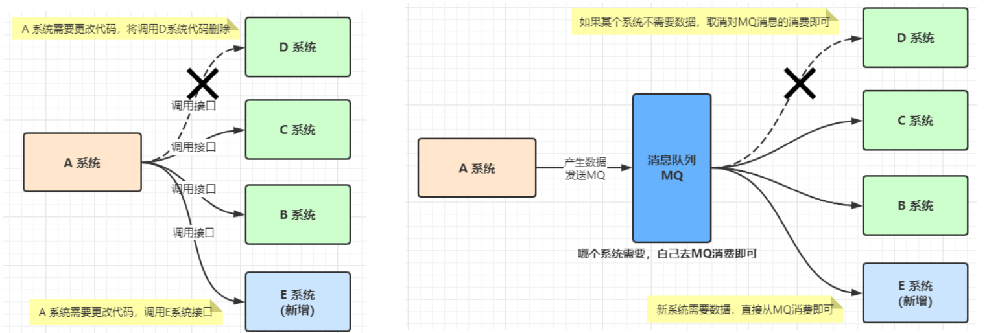
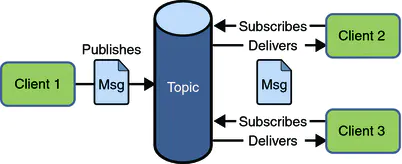
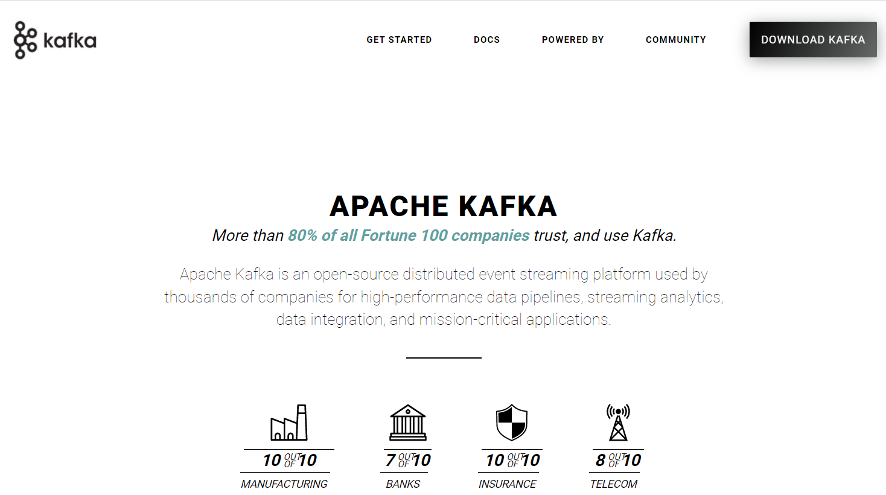

# 分布式消息队列Kafka

## I. Kafka基本概念

### 1. 消息队列

> **消息队列（Message Queue）**，经常缩写为MQ，从字面上来理解，消息队列是一种==用来存储消息的队列==。

#### 什么是消息队列

- 队列是一种**先进先出**的数据结构。

- 消息队列可以简单理解为：**把要传输的数据放在队列中**。
  - 概念一：把数据放到消息队列叫做**生产者（Producer）**
  - 概念二：从消息队列里边取数据叫做**消费者（Consumer）**

#### 消息队列好处

- 第一点、**系统解耦**

  - 使用 MQ，==A 系统产生一条数据，发送到 MQ== 里面去，哪个系统需要数据自己去 MQ 里面消费。如果新系统需要数据，直接从 MQ 里消费即可；如果某个系统不需要这条数据了，就取消对 MQ 消息的消费即可。

  

- 第二点、**异步处理**

  - 电商网站中，新的用户注册时，需要将用户的信息保存到数据库中，同时还需要额外发送注册的邮件通知、以及短信注册码给用户。
  - 使用消息队列来进行异步处理，从而实现快速响应。

  

- 第三点、**流量削峰**

  - 电商秒杀活动时，使用消息队列缓冲数据，增大吞吐量

  

- 第四点、**日志处理**

  - 实时计算场景中将数据缓存到消息队列中，解决大量日志传输的问题。

  

[总结：消息队列MQ用于实现两个系统之间或者两个模块之间传递消息数据时，实现数据缓存。]()

#### 消息传递模式

> 消息队列的两种模式：P2P（Point to Point ：点对点）,Publish/Subscribe（Pub/Sub：发布订阅）

- 消息传递：**点对点模式**

  - 数据只能被一个消费者使用，消费成功以后数据就会被删除，**无法实现消费数据的共享**

  

- 消息传递：订阅发布模式

  - 多个发布者将消息发送到队列，系统将这些消息传递给多个订阅者，类似于微信公众号

### 2. Kafka功能

Kafka的诞生，是为了**解决Linkedin的数据管道**问题，起初Linkedin采用ActiveMQ来进行数据交换，大约是在2010年前后，那时的ActiveMQ还远远无法满足Linkedin对数据传递系统的要求，经常由于**各种缺陷而导致消息阻塞或者服务无法正常访问**，为了能够解决这个问题，Linkedin决定研发自己的消息传递系统，当时Linkedin的首席架构师jay kreps便开始组织团队进行消息传递系统的研发。

官网：https://kafka.apache.org/

> Kafka是一个**分布式的基于发布/订阅模式的消息队列（Message Queue）**，主要应用于**大数据实时处理**领域。

- **发布订阅**：消息的发布者不会将消息直接发送给特定订阅者，而是**将发布的消息分为不同的类别**，订阅者**只接收感兴趣的消息**。
- Kafka 最新定义：Kafka 是一个开源的**分布式事件流式平台（Event Streaming Platform）**，被数千家公司用于高性能**数据管道、流分析、数据集成和关键人物应用**。

> Apache Kafka 分布式消息队列**特点**

- **高性能**：对数据进行实时读写
- **高并发**：分布式并行读写
  - **高吞吐**：使用分布式磁盘存储
  - **高可靠**：分布式主从架构
  - **高安全性**：数据安全保障机制
- **高灵活性**：根据需求，随意添加生产者和消费者

> Kafka在大数据中专门用于实现**实时的数据**缓冲存储，实现**大数据实时流式计算**。

### 3. 架构组件

> **Kafka中的Producer、Broker、Consumer概念**

- **Broker**：Kafka是一个分布式集群，多台机器构成，每台Kafka的节点就是一个Broker
  - 类比为HDFS中从节点：DataNode

- **Producer**：生产者
  - 负责将数据写入Kafka中，==Kafka写入数据的客户端==
  - Kafka的每条数据格式：`KV`格式，其中**V才是真正写入的数据**，K决定数据写到队列中哪个位置

- **Consumer：消费者**
  - 负责从Kafka中消费数据，==Kafka读取数据的客户端==
  - 消费数据：主要消费的数据是`V`，在实际项目中V的数据类型为`字符串`，往往是`JSON字符串`。

- **Consumer Group**：==**Kafka中必须以消费者组的形式从Kafka中消费数据**==
  - 消费者组（group id）到Kafka消费数据
  - **任何一个消费者必须属于某一个消费者组**
  - 一个消费者组中可以有多个消费者：**多个消费者共同并行消费数据，提高消费性能**
    - **消费者组中多个消费者消费的数据是不一样的**
    - **整个消费者组中所有消费者消费的数据加在一起是一份完整的数据**

### 4. Topic存储

> 5. 集群架构

## II. Kafka快速上手

### 1. 安装部署

### 2. Topic操作

### 3. 生产消费

### 4. Kafka Tool

## III. Kafka API开发

### 1. 环境准备

### 2. 生产者API

### 3. 消费者API

## 附录

### 1. Kafka启停脚本

### 2. Kafka Maven依赖

