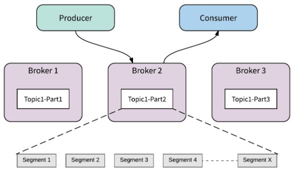

# Kafka存储原理, 生产者与消费者

## I. Kafka存储原理

### 1. 存储结构

> Apache Kafka 集群架构：


- Broker：物理存储节点，用于存储Kafka中Topic队列的每个分区数据
- Producer：生产者，向Topic队列中写入数据
- Consumer：消费者，从Topic队列中读取数据
- Topic：缓冲队列，用于区分不同数据的的存储
- Partition：Topic 对应子队列，一个topic可以设置为多个partition
  - 每个分区存储在Broker节点
  - 名称构成：**Topic名称+partition分区编号**

> Producer把日志信息推送（push）到Broker节点上，然后Consumer（可以是写入到hdfs或者其他的一些应用）再从Broker拉取（pull）信息。


> 每个topic又可分为几个不同的partition，每一个partition实际上都是一个有序的，不可变的消息序列，producer发送到broker的消息会写入到相应的partition目录下，每个partition都会有一个有序的id（`offset`），这个offset确定这个消息在partition中的具体位置。


> 每个分区partition存储时，有多个**segment** 文件组成：



- Segment：分区段，每个分区的数据存储在1个或者多个Segment中，每个Segment由一对文件组成
  - `.log`：数据文件，以log日志形式存储
  - `.index`：索引文件，方便快速查询检索
  - `.timeindex`：时间索引文件


> 总结：Kafka中每个队列Topic，分为多个分区Partition，每个分区数据存储时有多个Segment。


### 2. 写入流程

> **生产者Producer向Topic队列中发送数据【写入流程】：**

- **step1**：生产者生产每一条数据，将数据**放入一个batch批次**中，如果batch满了或者达到一定的时间，提交写入请求
- 批次大小：`batch.size`
  - 发送消息前等待时间：`linger.ms`

- **step2**：生产者根据规则确定写入分区Partition，获取对应的元数据，将请求提交给leader副本所在的Broker

  - 一个Topic的分区Partition会有多个副本，**只向写leader副本**

  - 从元数据中获取当前这个分区对应的leader副本的位置，提交写入请求

  - Kafka 元数据存储在ZK中

    

- **step3**：数据先写入Broker的**PageCache【操作系统级别内存】**

  - Kafka使用**内存机制**来实现数据的快速的读写
  - 选用了操作系统自带的缓存区域：`PageCache`
  - ==由操作系统来管理所有内存，即使Kafka Broker故障，数据依旧存在PageCache中==

- **step4**：操作系统后台，自动将**页缓存PageCache**中的数据SYNC同步到磁盘文件中：**最新Segment的中.log**

  - Kafka通过操作系统内存刷新调用机制来实现：内存存储容量 + 时间
  - **顺序写磁盘**：不断将每一条数据追加到.log文件中

- **step5**：其他的Follower 副本到Leader 副本中同步数据

### 3. 读取流程

> Kafka中队列Topic每个分区Partition数据存储在磁盘上，分为很多Segment片段，包含数据文件和索引数据。
>
> - `.log`：存储真正的数据
> - `.index`：存储对应的.log文件的索引

- **Segment的划分规则**：满足任何一个条件都会划分segment

  - 按照时间周期生成

    ```properties
    #如果达到7天，重新生成一个新的Segment
    log.roll.hours = 168
    ```

  - 按照文件大小生成

    ```properties
    #如果一个Segment存储达到1G，就构建一个新的Segment
    log.segment.bytes = 1073741824  
    ```

- **Segment文件的命名规则**

  - 以**当前文件存储的最小offset**来命名的

    ```
    00000000000000000000.log			offset : 0 ~ 2344
    00000000000000000000.index
    
    00000000000000002345.log			offset : 2345 ~ 6788
    00000000000000002345.index
    
    00000000000000006789.log			offset : 6789 ~
    00000000000000006789.index
    ```

- **索引内容**

  - 第一列：此条数据在`.log`文件中的位置，编号（序号），从1开始

  - 第二列：此条数据在`.log`文件中的物理偏移量，从0开始

    ```
    文件中的第几条,数据在这个文件中的物理位置
    1,0				--表示log文件中的第1条，在文件中的位置是第0个字节开始
    
    3,497			--表示这个文件中的第3条，在文件中的位置是第497个字节开始
    ```


- 什么时候生成一条索引？

  - `.log`日志文件中数据每隔多久在`.index`文件添加一条索引

  ```properties
  #.log文件每增加4096字节，在.index中增加一条索引
  log.index.interval.bytes=4096
  ```

> **消费者Consumer从Topic队列中拉取数据【读取流程】：**

- **step1**：消费者根据**Topic、Partition、Offset**提交给Kafka请求读取数据
- **step2**：Kafka根据元数据信息，找到对应分区Partition对应的Leader副本节点
- **step3**：请求Leader副本所在的Broker，**先读PageCache**，通过**零拷贝机制**【Zero Copy】读取PageCache
  - 实现零磁盘读写
  - 直接将内存数据发送到网络端口，实现传输
- **step4**：如果PageCache中没有，读取Segment文件段，先根据offset找到要读取的Segment
  - 先根据offset和segment文件段名称定位这个offset在哪个segment文件段中
- **step5**：将.log文件对应的.index文件加载到内存中，根据.index中索引的信息找到Offset在.log文件中的最近位置
- **step6**：读取.log，根据索引读取对应Offset的数据

> 面试题：向Kafka中写入数据和读取数据，为什么很快？

- Kafka为什么写入很快？
  - [PageCahce + 顺序写]()
- Kafka为什么读取和快？
  - [PageCache + 零拷贝]()
  - [index索引机制 + offset]()

知乎文档：https://zhuanlan.zhihu.com/p/183808742

### 4. 数据清理

> Kafka消息队列Topic主要用于数据缓存，不需要永久性的存储数据，如何将过期数据进行清理？

- **属性配置**

  ```properties
  #开启清理
  log.cleaner.enable = true
  #清理规则
  log.cleanup.policy = delete | compact
  ```

- **清理规则：delete**

  - **基于存活时间规则：**

    ```properties
    log.retention.ms
    log.retention.minutes
    log.retention.hours=168/7天
    ```

  - **基于文件大小规则**

    ```properties
    #删除文件阈值，如果整个数据文件大小，超过阈值的一个segment大小，将会删除最老的segment,-1表示不使用这种规则
    log.retention.bytes = -1
    ```

  - **基于offset消费规则**

    - 功能：将明确已经消费的offset的数据删除

    - 如何判断已经消费到什么位置

      - step1：编写一个文件`offset.json`

        ```json
        {
          "partitions":[
             {"topic": "bigdata", "partition": 0,"offset": 2000},
             {"topic": "bigdata", "partition": 1,"offset": 2000}
           ],
           "version":1
        }
        ```

      - step2：指定标记这个位置

        ```shell
        kafka-delete-records.sh \
        --bootstrap-server node1.itcast.cn:9092,node2.itcast.cn:9092,node3.itcast.cn:9092 \
        --offset-json-file offset.json 
        ```

- **清理规则：compact**

  - 也称为压缩，==将重复的更新数据的老版本删除，保留新版本，要求每条数据必须要有Key，根据Key来判断是否重复==

  

### 5. 分区副本概念: AR, ISR, OSR

> **问题**：Kafka中的分区数据如何保证数据安全？

- **分区副本机制**：每个kafka中分区都可以构建多个副本，相同分区的副本存储在不同的节点上

  - 为了**保证数据安全和写的性能**：分区有多个副本角色
  - leader副本：对外提供==读写数据==
  - follower副本：==与Leader同步数据==，如果leader故障，选举一个新的leader
  - 选举leader副本：Kafka主节点Controller实现

  

- **AR：All - Replicas**（`Assigned Replicas`）

  - 所有副本：**一个分区在所有节点上的副本**

    ```ini
    Partition: 0   Replicas: 1,0 
    ```

- **ISR：In - Sync - Replicas**

  - ==可用副本==：所有正在与Leader同步的Follower副本

    ```ini
    Partition: 0    Leader: 1       Replicas: 1,0   Isr: 1,0
    ```

  - 列表中：按照优先级排列【Controller根据副本同步状态以及Broker健康状态】，越靠前越会成为leader

  - 如果leader故障，是从ISR列表中选择新的leader

- **OSR：Out - Sync  - Replicas**

  - ==不可用副本==：与Leader副本的同步差距很大，成为一个OSR列表的不可用副本

  - 原因：**网路故障等外部环境因素，某个副本与Leader副本的数据差异性很大**

  - 判断是否是一个OSR副本？

    - 0.9之前：时间和数据差异

      ```ini
      replica.lag.time.max.ms = 10000   # 可用副本的同步超时时间
      replica.lag.max.messages = 4000   # 可用副本的同步记录差，该参数在0.9以后被删除
      ```

    - 0.9以后：只按照时间来判断

      ```ini
      replica.lag.time.max.ms = 10000   # 可用副本的同步超时时间
      ```

> **小结**：Kafka中的分区数据如何保证数据安全：[分区副本机制]()

```ini
AR：所有副本
ISR：可用副本
OSR：不可用副本
AR = ISR + OSR
```


### 6. 数据同步概念: HW, LEO, LSO

> **Topic队列分区Partition副本同步过中的概念：HW、LEO和LSO。**

- 什么是HW、LEO？

  ```ini
  # HW：High Watermark的缩写，俗称高水位
  	标识一个特定的消息偏移量（offset），消费者只能拉取到这个offset之前的消息。
  	HW = 当前这个分区所有副本同步的最低位置 + 1
  		消费者能消费到的最大位置
  
  
  # LEO：Log End Offset 缩写
  	标识当前日志文件中下一条待写入消息的offset
  	LEO = 当前每个副本已经写入数据的最新位置 + 1
  
  ```

  

  ```ini
  # 假设topic 分区有3个副本
  	Leader：0 1 2 3 4 5 6 7 8 
  		LEO：9
  	Follower1: 0  1 2  3 4 5
  		LEO：6
  	Follower2：0  1  2  3  4  5 6
  		LEO = 7
  	HW = 6
  	
  
  # 分区HW高水位 =  所有副本中LEO最小值
      low_watermark：最低消费的offset
      high_watermark：最高消费的offset
  ```


- **数据写入Leader及同步过程**

  

- step1、数据写入分区的Leader副本


```ini
leader：LEO = 5 
follower1：LEO = 3
follower2：LEO = 3
```

- step2：Follower到Leader副本中同步数据

  

```ini
  leader：LEO = 5 
  follower1：LEO = 5
  follower2：LEO = 4
```

- step3：所有的副本都成功写入了消息3和消息4，整个分区的HW和LEO都变为5，因此消费者可以消费到offset为4的消息。


```ini
leader：LEO = 5 
follower1：LEO = 5
follower2：LEO = 5
  
HW = LEO = 5
```

### 7. 可视化工具: Kafka Eagle


## II. Kafka Producer

### 1. ACK机制


### 2. 分区规则


### 3. 自定义分区器


### 4. 事务幂等性


## III. Kafka Consumer

### 1. 消费分配策略


### 2. 消费Offset


### 3. 消费Topic


### 4. 消费语义


## 附录: Kafka集群常用配置

