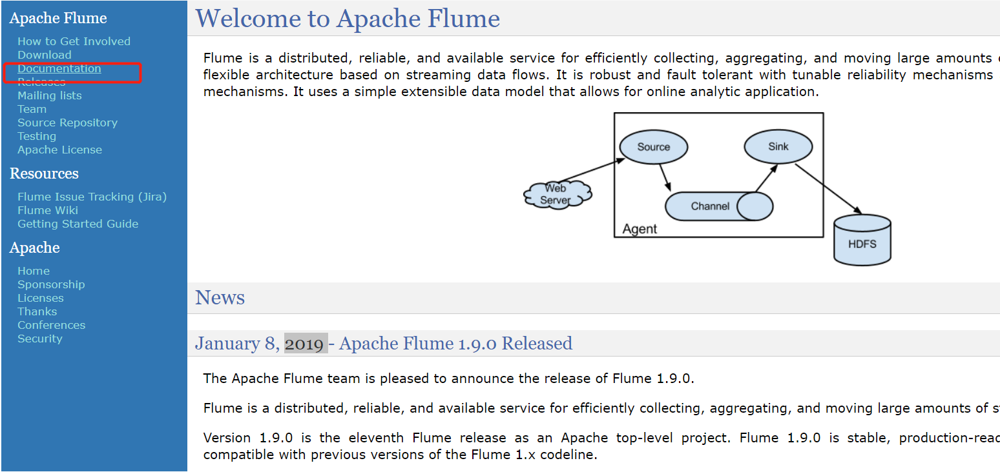
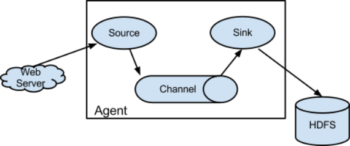
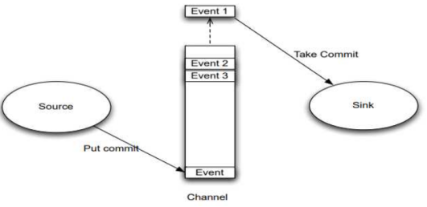
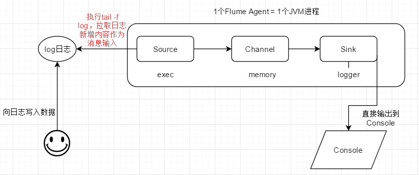
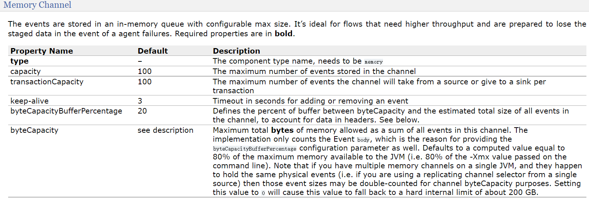
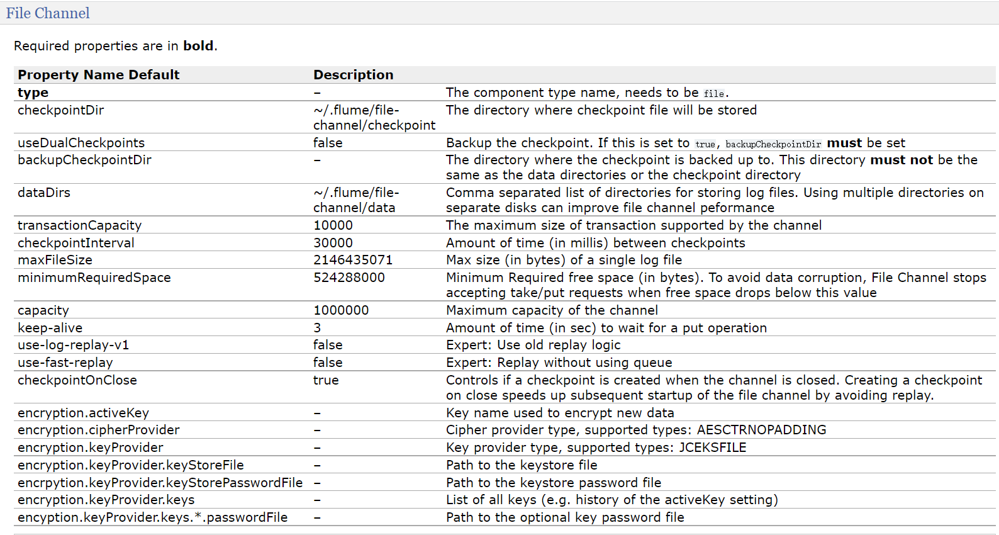
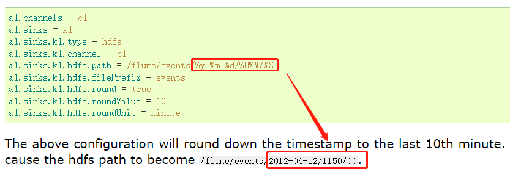
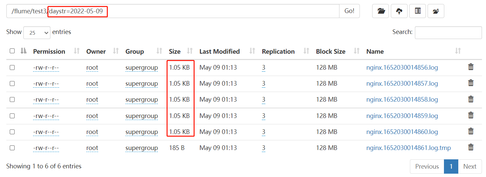

# 实时日志采集及综合案例

## I. Flume快速上手



### 1. 功能概述

> Aapche Flume是由Cloudera提供的一个高可用的，高可靠的，分布式的海量日志采集、聚合和传输的软件，网址：<http://flume.apache.org/>


> Apache Flume的核心是**把数据从数据源(source)收集过来，再将收集到的数据送到指定的目的地(sink)**。为了保证输送的过程一定成功，在送到目的地(sink)之前，会**先缓存数据(channel)**，待数据真正到达目的地(sink)后，flume在删除自己缓存的数据。



- 当前Flume有两个版本：Flume 0.9X版本的统称Flume OG（original generation）和Flume1.X版本的统称Flume NG（next generation）。
- 由于Flume NG经过核心组件、核心配置以及代码架构重构，与Flume OG有很大不同。改动的另一原因是将Flume纳入 apache 旗下，Cloudera Flume 改名为 Apache Flume。

> Flume系统中核心的角色是**agent**，agent本身是**一个Java进程**，一般运行在日志收集节点。


每一个agent相当于一个数据传递员，内部有三个组件：

- **Source**：采集源，用于跟数据源对接，以获取数据；
- **Sink**：下沉地，采集数据的传送目的，用于往下一级agent或者往最终存储系统传递数据；
- **Channel**：agent内部的数据传输通道，用于从source将数据传递到sink；

> 在整个数据的传输的过程中，流动的是**event**，它是Flume内部数据传输的最基本单元。



[event将传输的数据进行封装，如果是文本文件，通常是一行记录，event也是事务的基本单位。]()event从source，流向channel，再到sink，本身为一个字节数组，并可携带headers(头信息)信息。**event代表着一个数据的最小完整单元，从外部数据源来，向外部的目的地去。**


[一个完整的event包括：event headers、event body，其中event body是flume收集到的日记记录。]()

> Flume 应用场景：

- 场景一：实时数据采集
- 场景二：数据量很大，实时的小部分小部分的采集，节省时间

```ini
# 美团的Flume设计架构
https://tech.meituan.com/2013/12/09/meituan-flume-log-system-architecture-and-design.html
```

### 2. 安装部署

> Apache Flume 的安装非常简单，直接解压，然后配置JDK环境变量即可。

- 1、上传安装包，node1机器上安装

  ```ini
  cd /export/software/
  rz
  ```

  

- 2、解压安装

  ```shell
  tar -zxf apache-flume-1.9.0-bin.tar.gz -C /export/server/
  
  cd /export/server
  ln -s apache-flume-1.9.0-bin flume
  
  chown -R root:root flume/
  ```

- 3、修改Flume环境变量

  ```shell
  cd /export/server/flume/conf/
  mv flume-env.sh.template flume-env.sh
  vim flume-env.sh 
  ```

  ```ini
  # 修改22行
  export JAVA_HOME=/export/server/jdk
  # 修改34行
  export HADOOP_HOME=/export/server/hadoop
  ```

- 4、集成HDFS，拷贝HDFS配置文件

  ```shell
  cp /export/server/hadoop/etc/hadoop/core-site.xml /export/server/hadoop/etc/hadoop/hdfs-site.xml /export/server/flume/conf/
  ```

  

- 5、删除Flume自带的guava包，替换成Hadoop的

  ```ini
  # 删除低版本jar包
  rm -rf /export/server/flume/lib/guava-11.0.2.jar
  
  # 拷贝高版本jar包
  cp /export/server/hadoop/share/hadoop/common/lib/guava-27.0-jre.jar /export/server/flume/lib/
  ```

> Flume Agent开发步骤：编写Agent配置文件和启动运行Agent程序。


- **step1：编写Agent配置文件**
  - 在配置文件中定义Agent，定义这个agent的名称，定义agent的三个基本组件
  - Source是什么？
    - 决定程序**从哪里采集数据**
    - https://flume.apache.org/releases/content/1.7.0/FlumeUserGuide.html#flume-sources
  - Channel是什么？
    - 决定程序**将采集到的数据缓存在什么地方**
    - https://flume.apache.org/releases/content/1.7.0/FlumeUserGuide.html#flume-channels
  - Sink是什么？
    - 决定程序**将数据发送到什么地方**
    - https://flume.apache.org/releases/content/1.7.0/FlumeUserGuide.html#flume-sinks 

- **step2：运行Agent程序**

  - 用法

    ```ini
    Usage:  flume-ng <command> [options]...
    ```

  - 使用

    ```ini
    flume-ng agent  -c Flume配置文件目录 -f 指定运行的文件 -n 运行的Agent的名称
    ```

  - 案例

    ```ini
    flume-ng agent -n xx_name -c /export/server/flume/conf -f xxx.properties
    ```

### 3. 入门案例

> **需求**：采集Hive的日志，临时缓存在内存中，将日志写入Flume的日志中并打印在命令行



- **source**：Exec Source
  - 功能：[通过执行一条Linux命令来实现数据动态采集]()
  - 固定搭配`tail -F`命令来使用，实现数据增量采集
  - 动态监听单个文件的数据采集
  - 文档：https://flume.apache.org/releases/content/1.9.0/FlumeUserGuide.html#exec-source
- **channel**：memory channel，
  - 将数据缓存在内存中
  - 文档：https://flume.apache.org/releases/content/1.9.0/FlumeUserGuide.html#memory-channel
- **sink**：Logger Sink
  - 将数据日志打印控制台
  - 文档：https://flume.apache.org/releases/content/1.9.0/FlumeUserGuide.html#logger-sink

> 开发Flume Agent配置文件，并运行Agent程序，实时采集数据。

- 1、创建Agent配置文件

  ```ini
  touch /export/server/flume/conf/exec-mem-log.properties
  ```

- 2、配置Agent组成，指定source、channel和sink

  ```ini
  vim /export/server/flume/conf/exec-mem-log.properties
  ```

  ```properties
  # The configuration file needs to define the sources, 
  # the channels and the sinks.
  # Sources, channels and sinks are defined per a1, 
  
  # in this case called 'a1'
  
  #define the agent
  a1.sources = s1
  a1.channels = c1
  a1.sinks = k1
  
  #define the source
  a1.sources.s1.type = exec
  a1.sources.s1.command = tail -f /export/server/flume/datas/test.log
  
  #define the channel
  a1.channels.c1.type = memory
  a1.channels.c1.capacity = 10000
  
  #define the sink
  a1.sinks.k1.type = logger
  
  #bond
  a1.sources.s1.channels = c1
  a1.sinks.k1.channel = c1
  ```

- 3、启动Hive服务，运行SQL，产生日志

  ```ini
  # 创建数据目录
  mkdir -p /export/server/flume/datas
  
  # 创建日志文件
  touch /export/server/flume/datas/test.log
  
  # 追加数据
  echo "111111111" >> /export/server/flume/datas/test.log
  echo "222222222" >> /export/server/flume/datas/test.log
  echo "333333333" >> /export/server/flume/datas/test.log
  echo "444444444" >> /export/server/flume/datas/test.log
  ```

- 4、运行Agent程序，参数：`-Dflume.root.logger=INFO,console`，让Flume的日志打印在命令行

```ini
/export/server/flume/bin/flume-ng agent -n a1 \
-c /export/server/flume/conf/ \
-f /export/server/flume/conf/exec-mem-log.properties \
-Dflume.root.logger=INFO,console
```

- 5、查看控制台打印数据


### 4. Taildir Source

> **需求**：当前日志文件是一天一个，需要每天将数据实时采集到HDFS上，如何采集呢？

```ini
/nginx/logs/
	2022-05-01.log
    2022-05-02.log
    ……
    2022-05-10.log
```

> **问题**：能不能exec source进行采集？

- 不能，`exec`只能监听采集单个文件
- `Taildir Source`：从**Apache Flume1.7**版本开始支持，**==动态监听采集多个文件==**
- 文档：https://flume.apache.org/releases/content/1.9.0/FlumeUserGuide.html#taildir-source

```ini
TailDir Soucre
	监控文件、监控目录
	1. Tail，在Unix系统中，实时读取文件最后内容
		tail -F xxx.log
	
	2. Dir
		监控某个目录，当目录中有文件出现时，立即读取文件数据	
```

> **业务实现**：让Flume动态监听一个文件和一个目录下的所有文件

- 1、数据准备

  存储元数据目录

  ```ini
  mkdir -p /export/server/flume/datas/position
  ```

  创建监控目录和文件

  ```shell
  # 监控目录
  mkdir -p /export/server/flume/datas/nginx
   
  # 监控文件
  touch /export/server/flume/datas/logs.data
  ```

- -2、开发Agent配置文件

  创建文件

  ```ini
  touch /export/server/flume/conf/tail-mem-log.properties
  ```

    编辑文件

  ```ini
  vim /export/server/flume/conf/tail-mem-log.properties
  ```

  ```ini
    # define sourceName/channelName/sinkName for the agent 
    a1.sources = s1
    a1.channels = c1
    a1.sinks = k1
    
    # define the s1
    a1.sources.s1.type = TAILDIR
    #指定一个元数据记录文件
    a1.sources.s1.positionFile = /export/server/flume/datas/position/taildir_position.json
    #将所有需要监控的数据源变成一个组，这个组内有两个数据源
    a1.sources.s1.filegroups = f1 f2
    #指定了f1是谁：监控一个文件
    a1.sources.s1.filegroups.f1 = /export/server/flume/datas/logs.data
    #指定f2是谁：监控一个目录下的所有文件
    a1.sources.s1.filegroups.f2 = /export/server/flume/datas/nginx/.*
    
    # define the c1
    a1.channels.c1.type = memory
    a1.channels.c1.capacity = 1000
    a1.channels.c1.transactionCapacity = 100
    
    # define the k1
    a1.sinks.k1.type = logger
    
    # source、channel、sink bond
    a1.sources.s1.channels = c1
    a1.sinks.k1.channel = c1 
  ```

- 3、Agent程序运行

  ```ini
  /export/server/flume/bin/flume-ng agent -n a1 \
  -c /export/server/flume/conf/ \
  -f /export/server/flume/conf/tail-mem-log.properties \
  -Dflume.root.logger=INFO,console
  ```

- 4、测试数据

  ```ini
  # 日志文件追加数据
  echo "AAAAAAA" >> /export/server/flume/datas/logs.data
  echo "BBBBBBB" >> /export/server/flume/datas/logs.data
  echo "CCCCCCC" >> /export/server/flume/datas/logs.data
  
  # 目录写入文件
  echo "hello flume" >> /export/server/flume/datas/nginx/1.log
  echo "hello kafka" >> /export/server/flume/datas/nginx/2.log
  echo "hello hbase" >> /export/server/flume/datas/nginx/3.log
  ```

  

- 5、元数据文件的功能：`/export/server/flume/datas/position/taildir_position.json`

  - 问题：**如果Flume程序故障，重启Flume程序，已经被采集过的数据还要不要采集**？

  - 需求：不需要，不能导致数据重复

  - 功能：记录Flume所监听的每个文件已经被采集的位置

    ```
    [
    	{"inode":1051122,"pos":24,"file":"/export/server/flume/datas/logs.data"},
    	{"inode":71384940,"pos":12,"file":"/export/server/flume/datas/nginx/1.log"},
    	{"inode":71384941,"pos":12,"file":"/export/server/flume/datas/nginx/2.log"},
    	{"inode":71384942,"pos":12,"file":"/export/server/flume/datas/nginx/3.log"}
    ]
    ```

> **补充**：工作中可能会见到其他的source

- **Kafka Source**：
  - 监听读取Kafka数据
  - 文档：https://flume.apache.org/releases/content/1.9.0/FlumeUserGuide.html#kafka-source
- **Spooldir Source**：
  - 监控一个目录，只要这个目录中产生一个文件，就会全量采集一个文件
  - 文档：https://flume.apache.org/releases/content/1.9.0/FlumeUserGuide.html#spooling-directory-source
  - 缺点：不能动态监控文件，被采集的文件是不能发生变化的

### 5. Channel缓存


> **在Flume中，编写Agent，最常见使用Channel缓存：Memory内存和File文件**，负责临时缓存数据。

- **Memory Channel**：将数据缓存在内存中

  - 特点：==读写快、容量小、安全性较差==
  - 文档：https://flume.apache.org/releases/content/1.9.0/FlumeUserGuide.html#memory-channel

  

  - 应用：**小数据量的高性能的传输**

- **File Channel**：将数据缓存在文件中

  - 特点：==读写相对慢、容量大、安全性较高==
  - 文档：https://flume.apache.org/releases/content/1.9.0/FlumeUserGuide.html#file-channel

  

  - 应用：**数据量大，读写性能要求不高的场景下**

### 6. HDFS Sink

```
在Flume中，日志数据实时采集时，常用Sink接收器：
	1. HDFS sink
		将采集数据Event写入到HDFS文件系统文件中
		
	2. Kafka Sink
		将采集数据Event写入到Kafka Topic中
```

> **将Flume采集的数据写入HDFS**，使用Sink为：**HDFS Sink**

- 文档：https://flume.apache.org/releases/content/1.9.0/FlumeUserGuide.html#hdfs-sink

- Demo 案例

  ```ini
  a1.channels = c1
  a1.sinks = k1
  a1.sinks.k1.type = hdfs
  a1.sinks.k1.channel = c1
  a1.sinks.k1.hdfs.path = /flume/events/%y-%m-%d/%H%M/%S
  a1.sinks.k1.hdfs.filePrefix = events-
  a1.sinks.k1.hdfs.round = true
  a1.sinks.k1.hdfs.roundValue = 10
  a1.sinks.k1.hdfs.roundUnit = minute
  ```

#### 写入HDFS

- 1、创建Agent 配置文件

```ini
touch /export/server/flume/conf/hdfs-mem-log.properties
```

- 2、开发配置文件内容

  ```ini
  vim /export/server/flume/conf/hdfs-mem-log.properties
  ```

  ```ini
  # The configuration file needs to define the sources, 
  # the channels and the sinks.
  # Sources, channels and sinks are defined per a1, 
  # in this case called 'a1'
  
  
  #定义当前的agent的名称，以及对应source、channel、sink的名字
  a1.sources = s1
  a1.channels = c1
  a1.sinks = k1
  
  #定义s1:从哪读数据，读谁
  a1.sources.s1.type = exec
  a1.sources.s1.command = tail -f /export/server/flume/datas/test.log
  
  #定义c1:缓存在什么地方
  a1.channels.c1.type = memory
  a1.channels.c1.capacity = 1000
  
  
  #定义k1:将数据发送给谁
  a1.sinks.k1.type = hdfs
  a1.sinks.k1.hdfs.path = hdfs://node1.itcast.cn:8020/flume/test1
  #指定生成的文件的前缀
  a1.sinks.k1.hdfs.filePrefix = nginx
  #指定生成的文件的后缀
  a1.sinks.k1.hdfs.fileSuffix = .log
  #指定写入HDFS的文件的类型：普通的文件
  a1.sinks.k1.hdfs.fileType = DataStream 
  
  #s1将数据给哪个channel
  a1.sources.s1.channels = c1
  #k1从哪个channel中取数据
  a1.sinks.k1.channel = c1
  ```

- 3、启动Agent服务

```ini
/export/server/flume/bin/flume-ng agent -n a1 \
-c /export/server/flume/conf/ \
-f /export/server/flume/conf/hdfs-mem-log.properties \
-Dflume.root.logger=INFO,console
```

- 4、测试数据

  ```ini
  echo "1................................" >> /export/server/flume/datas/test.log
  echo "2................................" >> /export/server/flume/datas/test.log
  echo "3................................" >> /export/server/flume/datas/test.log
  echo "4................................" >> /export/server/flume/datas/test.log
  echo "5................................" >> /export/server/flume/datas/test.log
  echo "6................................" >> /export/server/flume/datas/test.log
  echo "7................................" >> /export/server/flume/datas/test.log
  echo "8................................" >> /export/server/flume/datas/test.log
  echo "9................................" >> /export/server/flume/datas/test.log
  ```

- 5、查看HDFS目录中文件

  

#### 文件大小

> Flume默认写入HDFS上会产生很多小文件，都在1KB左右，不利用HDFS存储

- **解决**：指定文件大小

```ini
# hdfs.rollInterval：
	按照时间间隔生成文件
	
# hdfs.rollSize：
	指定HDFS生成的文件大小
	
# hdfs.rollCount：
	按照event个数生成文件
```

- 1、复制Agent配置文件

  ```ini
  cp /export/server/flume/conf/hdfs-mem-log.properties /export/server/flume/conf/hdfs-mem-size.properties
  ```

- 2、修改文件内容

  ```ini
  vim /export/server/flume/conf/hdfs-mem-size.properties
  ```

  ```ini
  # The configuration file needs to define the sources, 
  # the channels and the sinks.
  # Sources, channels and sinks are defined per a1, 
  # in this case called 'a1'
  
  
  #定义当前的agent的名称，以及对应source、channel、sink的名字
  a1.sources = s1
  a1.channels = c1
  a1.sinks = k1
  
  #定义s1:从哪读数据，读谁
  a1.sources.s1.type = exec
  a1.sources.s1.command = tail -f /export/server/flume/datas/test.log
  
  #定义c1:缓存在什么地方
  a1.channels.c1.type = memory
  a1.channels.c1.capacity = 1000
  
  #定义k1:将数据发送给谁
  a1.sinks.k1.type = hdfs
  a1.sinks.k1.hdfs.path = hdfs://node1.itcast.cn:8020/flume/test2
  #指定生成的文件的前缀
  a1.sinks.k1.hdfs.filePrefix = nginx
  #指定生成的文件的后缀
  a1.sinks.k1.hdfs.fileSuffix = .log
  #指定写入HDFS的文件的类型：普通的文件
  a1.sinks.k1.hdfs.fileType = DataStream 
  #指定按照时间生成文件，一般关闭
  a1.sinks.k1.hdfs.rollInterval = 0
  #指定文件大小生成文件，一般120 ~ 125M对应的字节数
  a1.sinks.k1.hdfs.rollSize = 1024
  #指定event个数生成文件，一般关闭
  a1.sinks.k1.hdfs.rollCount = 0
  
  #s1将数据给哪个channel
  a1.sources.s1.channels = c1
  #k1从哪个channel中取数据
  a1.sinks.k1.channel = c1
  ```

- 3、启动Agent服务

```ini
/export/server/flume/bin/flume-ng agent -n a1 \
-c /export/server/flume/conf/ \
-f /export/server/flume/conf/hdfs-mem-size.properties \
-Dflume.root.logger=INFO,console
```

- 4、测试数据

  ```ini
  echo "A................................" >> /export/server/flume/datas/test.log
  echo "B................................" >> /export/server/flume/datas/test.log
  echo "C................................" >> /export/server/flume/datas/test.log
  echo "D................................" >> /export/server/flume/datas/test.log
  echo "E................................" >> /export/server/flume/datas/test.log
  echo "F................................" >> /export/server/flume/datas/test.log
  echo "X................................" >> /export/server/flume/datas/test.log
  echo "F................................" >> /export/server/flume/datas/test.log
  echo "Z................................" >> /export/server/flume/datas/test.log
  ```

- 5、查看HDFS目录中文件


#### 分区目录

> 问题：如何实现分区存储，每天一个或者每小时一个目录？

```ini
/flume/test3/
	daystr=2022-05-01/nginx.log
	daystr=2022-05-02/nginx.log
```

- 解决：**添加时间标记目录**



```ini
 For all of the time related escape sequences, a header with the key “timestamp” must exist among the headers of the event (unless hdfs.useLocalTimeStamp is set to true). 
```

- 1、复制Agent配置文件

  ```ini
  cp /export/server/flume/conf/hdfs-mem-size.properties /export/server/flume/conf/hdfs-mem-partition.properties
  ```

- 2、修改文件内容

  ```ini
  vim /export/server/flume/conf/hdfs-mem-partition.properties
  ```

  ```ini
  # The configuration file needs to define the sources, 
  # the channels and the sinks.
  # Sources, channels and sinks are defined per a1, 
  # in this case called 'a1'
  
  
  #定义当前的agent的名称，以及对应source、channel、sink的名字
  a1.sources = s1
  a1.channels = c1
  a1.sinks = k1
  
  #定义s1:从哪读数据，读谁
  a1.sources.s1.type = exec
  a1.sources.s1.command = tail -f /export/server/flume/datas/test.log
  
  #定义c1:缓存在什么地方
  a1.channels.c1.type = memory
  a1.channels.c1.capacity = 1000
  
  #定义k1:将数据发送给谁
  a1.sinks.k1.type = hdfs
  a1.sinks.k1.hdfs.path = hdfs://node1.itcast.cn:8020/flume/test3/daystr=%Y-%m-%d
  a1.sinks.k1.hdfs.useLocalTimeStamp = true
  #指定生成的文件的前缀
  a1.sinks.k1.hdfs.filePrefix = nginx
  #指定生成的文件的后缀
  a1.sinks.k1.hdfs.fileSuffix = .log
  #指定写入HDFS的文件的类型：普通的文件
  a1.sinks.k1.hdfs.fileType = DataStream 
  #指定按照时间生成文件，一般关闭
  a1.sinks.k1.hdfs.rollInterval = 0
  #指定文件大小生成文件，一般120 ~ 125M对应的字节数
  a1.sinks.k1.hdfs.rollSize = 1024
  #指定event个数生成文件，一般关闭
  a1.sinks.k1.hdfs.rollCount = 0
  
  #s1将数据给哪个channel
  a1.sources.s1.channels = c1
  #k1从哪个channel中取数据
  a1.sinks.k1.channel = c1
  ```

- 3、启动Agent服务

```ini
/export/server/flume/bin/flume-ng agent -n a1 \
-c /export/server/flume/conf/ \
-f /export/server/flume/conf/hdfs-mem-partition.properties \
-Dflume.root.logger=INFO,console
```

- 4、测试数据

  ```ini
  echo "A123................................" >> /export/server/flume/datas/test.log
  echo "B123................................" >> /export/server/flume/datas/test.log
  echo "C123................................" >> /export/server/flume/datas/test.log
  echo "D123................................" >> /export/server/flume/datas/test.log
  echo "E123................................" >> /export/server/flume/datas/test.log
  echo "F123................................" >> /export/server/flume/datas/test.log
  echo "X123................................" >> /export/server/flume/datas/test.log
  echo "F123................................" >> /export/server/flume/datas/test.log
  echo "Z123................................" >> /export/server/flume/datas/test.log
  ```

- 5、查看HDFS目录中文件



## II. 陌陌综合案例

### 1.  业务需求


### 2. 实时采集日志


### 3. 实时存储HBase


### 4. Hive离线分析


### 5. Phoenix即席查询


## 附录:

### 1. 案例Maven依赖


### 2. 完整代码


