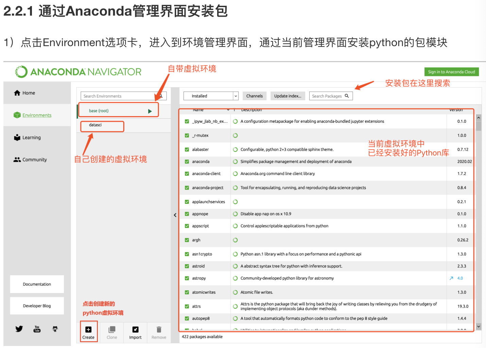
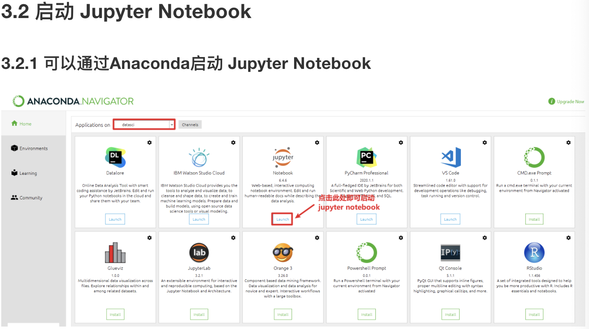
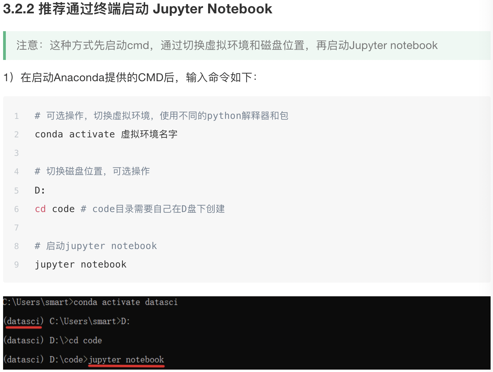
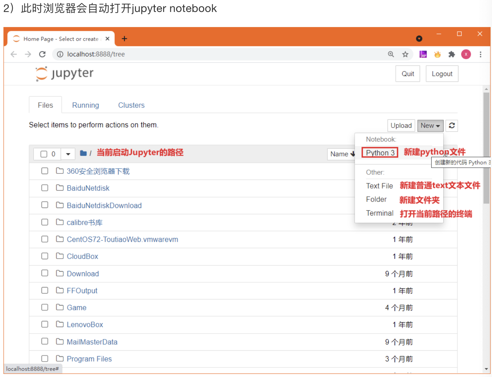
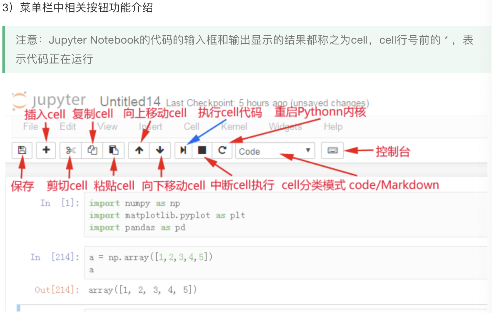
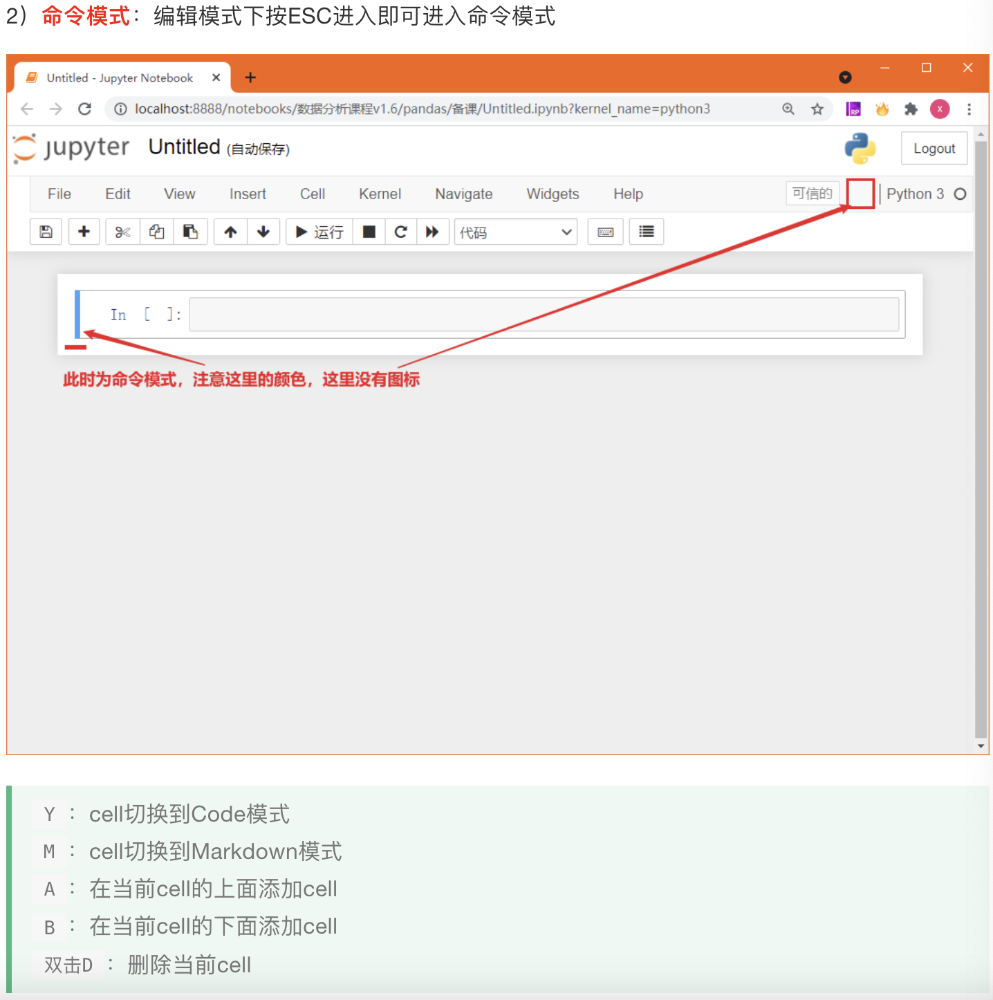
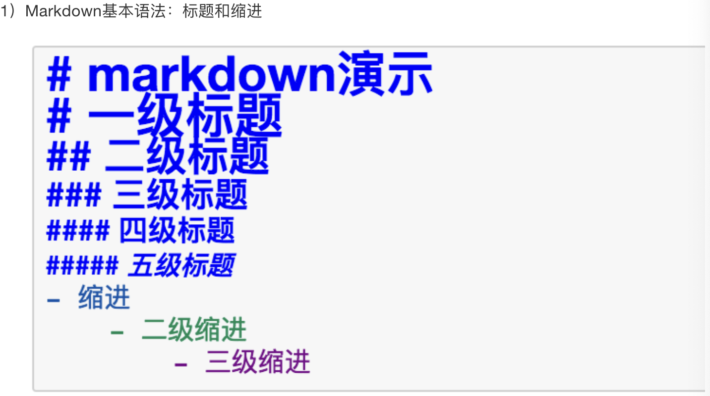

# Pandas

## I. Python数据开发简介

- ### Python在数据开发领域的优势

    - 语言简单易学, 书写代码简单快捷
    - 同时在数据分析及大数据领域有海量的功能强大的开源库, 并持续更新
        - pandas: 数据清洗, 数据处理, 数据分析
        - Sklearn: 机器学习, 统计分析
        - PySpark
        - PyFlink
        - Matplotlib, Seaborn, Pyecharts: 数据可视化
        - ...

- ### 学习Pandas的原因

    - 数据分析开源库, 是商业和工程领域最流行的结构化数据工具集, 用于数据清洗, 处理以及分析
    - Pandas和PySpark很多功能都类似, 学会Pandas之后再学习PySpark就更加简单快速
    - Pandas在数据处理上有独特的优势
        - 底层基于Numpy构建, 运行速度快
        - 有专门处理缺失数据的API
        - 强大而灵活的分组, 聚合, 转换功能

- ### 其他常用Python库介绍

    

## II. 数据开发环境搭建

- ### Anaconda介绍

    

- ### Anaconda安装

    <https://www.anaconda.com/products/individual>

    具体面向百度

- ### Anaconda使用

    - 虚拟环境:

        > 不同的python项目, 可能使用了各个不同的python的包, 模块;
        >
        > 不同的python项目, 可能使用了相同的python包, 模块, 但版本不同;
        >
        > 不同的python项目, 甚至使用的python版本都不同

    不同项目代码的运行, 使用保存在不同路径下的python和各自的包模块; 不同的python解释器和包模块就称之为虚拟环境

    

    > **虚拟环境的本质，就是在你电脑里安装了多个Python解释器（可执行程序），每个Python解释器又关联了很多个包、模块；项目代码在运行时，是使用特定路径下的那个Python解释器来执行**

    - Anaconda添加国内镜像源(加速下载)

        - 打开命令行

            ```shell
            # Anaconda 添加国内清华镜像源
            conda config --add channels https://mirrors.tuna.tsinghua.edu.cn/anaconda/pkgs/free/
            # 让配置马上生效
            conda config --set show_channel_urls yes
            ```

    - 创建虚拟环境:

        - 通过界面创建

        - 通过命令行创建

            ```shell
            conda create -n 虚拟环境名字 python=3.8  # 创建虚拟环境 python=3.8 指定python版本
            conda activate 虚拟环境名字 # 进入虚拟环境
            conda deactivate # 退出当前虚拟环境
            conda remove -n 虚拟环境名字 --all  # 删除虚拟环境
            
            # 示例：
            # 1）创建一个名为 datasci 的 python3.8 虚拟环境
            conda create -n datasci python=3.8
            
            # 2）切换到 datasci python虚拟环境中
            conda activate datasci
            
            # 3）退出当前所在 python虚拟环境
            conda deactivate
            ```

- ### Anaconda的包管理功能

    

    - 通过anaconda提供的CMD工具进行python包的安装

        ```shell
        # 切换到自己的虚拟环境
        conda activate datasci
        
        conda install 包名字
        或者
        pip install 包名字
        
        # 阿里云：https://mirrors.aliyun.com/pypi/simple/
        # 豆瓣：https://pypi.douban.com/simple/
        # 清华大学：https://pypi.tuna.tsinghua.edu.cn/simple/
        # 中国科学技术大学 http://pypi.mirrors.ustc.edu.cn/simple/
        
        pip install 包名 -i https://pypi.tuna.tsinghua.edu.cn/simple/  # 通过清华大学镜像安装
        ```

    - 安装Pandas包

        ```shell
        # 安装 Pandas 扩展包
        pip install pandas==1.1.1 -i https://pypi.tuna.tsinghua.edu.cn/simple/
        ```

- ### Jupyter Notebook的使用

    

    

    

    

    - jupyter notebook的功能拓展

        ```shell
        # 进入到虚拟环境中
        conda activate 虚拟环境名字
        # 安装 jupyter_contrib_nbextensions
        pip install jupyter_contrib_nbextensions -i https://pypi.tuna.tsinghua.edu.cn/simple/
        # jupyter notebook安装插件
        jupyter contrib nbextension install --user --skip-running-check
        # 安装 pep8 扩展包
        pip install autopep8==1.5.7 -i https://pypi.tuna.tsinghua.edu.cn/simple/
        ```

    

    - Jupyter Notebook的界面

    

    

    - Jupyter Notebook常用快捷键

    

    

    

- ### Jupyter Notebook中使用Markdown

    > 注意：在命令模式中，按M即可进入到Markdown编辑模式，使用Markdown语法可以在代码间穿插格式化的文本作为说明文字或笔记。

    

    

## III. Pandas快速入门


## IV. Series和DataFrame


