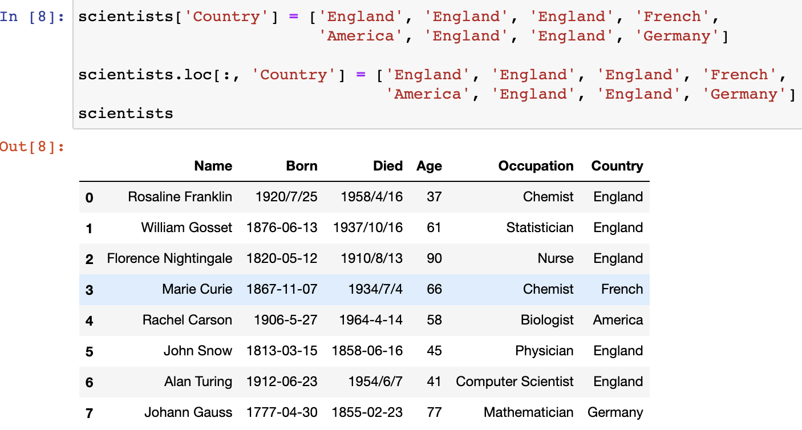
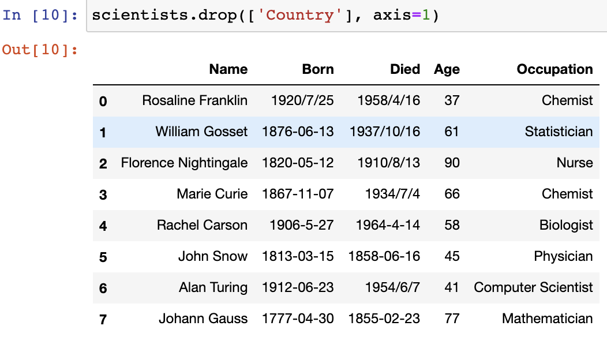

# I. DataFrame增删改

1. ## DataFrame行操作

    1. ### 添加行

        > ##### 注意：添加行时，会返回新的 DataFrame。

        **基本格式**：

        | 方法               | 说明                                                     |
        | ------------------ | -------------------------------------------------------- |
        | `df.append(other)` | 向 DataFrame 末尾添加 other 新行数据，返回新的 DataFrame |

        1）加载 `scientists.csv` 数据集

        ```python
        scientists = pd.read_csv('./data/scientists.csv')
        scientists
        ```

        2）示例：在 `scientists` 数据末尾添加一行新数据

        ```python
        # 准备新行数据
        new_series = pd.Series(['LuoGeng Hua', '1910-11-12', '1985-06-12', 75, 'Mathematician'], 
                               index=['Name', 'Born', 'Died', 'Age', 'Occupation'])
        scientists.append(new_series, ignore_index=True)
        ```

        

    2. ### 修改行

        > ##### 注意：修改行时，是直接对原始 DataFrame 进行修改。

        **基本格式**：

        | 方式                                       | 说明                           |
        | ------------------------------------------ | ------------------------------ |
        | `df.loc[['行标签', ...],['列标签', ...]]`  | 修改行标签对应行的对应列的数据 |
        | `df.iloc[['行位置', ...],['列位置', ...]]` | 修改行位置对应行的对应列的数据 |

         1）示例：修改行标签为 4 的行的所有数据

        ```python
        scientists.loc[4] = ['Rachel Carson', '1907-5-27', '1964-4-14', 56, 'Biologist']
        scientists
        ```

        

        2）示例：修改行标签为 4 的行的 Born 和 Age 列的数据

        ```python
        scientists.loc[4, ['Born', 'Age']] = ['1906-5-27', 58]
        scientists
        ```

        

        3）示例：修改行标签为 6 的行的 Born 列的数据为 `1912-06-23`

        ```python
        scientists.loc[6, 'Born'] = '1912-06-23'
        scientists
        ```

        

    3. ### 删除行

        > ##### 注意：删除行时，会返回新的 DataFrame。

          **基本格式**：

        | 方式                       | 说明                                       |
        | -------------------------- | ------------------------------------------ |
        | `df.drop(['行标签', ...])` | 删除行标签对应行的数据，返回新的 DataFrame |

        1）示例：删除行标签为 1 和 3 的行

        ```python
        scientists.drop([1, 3])
        ```

        

2. ## DataFrame列操作

    1. ### 新增列/修改列

        > ##### 注意：添加列/修改列时，是直接对原始 DataFrame 进行修改。

        **基本格式**：

        | 方式                     | 说明                                                         |
        | ------------------------ | ------------------------------------------------------------ |
        | `df['列标签']=新列`      | 1）如果 DataFrame 中不存在对应的列，则在 DataFrame 最右侧增加新列 2）如果 DataFrame 中存在对应的列，则修改 DataFrame 中该列的数据 |
        | `df.loc[:, 列标签]=新列` | 1）如果 DataFrame 中不存在对应的列，则在 DataFrame 最右侧增加新列 2）如果 DataFrame 中存在对应的列，则修改 DataFrame 中该列的数据 |

        1）示例：给 `scientists` 数据增加一个 `Country` 列

        ```python
        scientists['Country'] = ['England', 'England', 'England', 'French', 
                                 'America', 'England', 'England', 'Germany']
        或
        scientists.loc[:, 'Country'] = ['England', 'England', 'England', 'French', 
                                        'America', 'England', 'England', 'Germany']
        scientists
        ```

        

        2）示例：修改 `scientists` 数据中 `Country` 列的数据

        ```python
        scientists['Country'] = ['england', 'england', 'england', 'french', 
                                 'america', 'england', 'england', 'germany']
        
        或
        scientists.loc[:, 'Country'] = ['england', 'england', 'england', 'french', 
                                        'america', 'england', 'england', 'germany']
        scientists
        ```

        

    2. ### 删除列

        > ##### 注意：删除列时，会返回新的 DataFrame。

        **基本格式**：

        | 方式                               | 说明                                       |
        | ---------------------------------- | ------------------------------------------ |
        | `df.drop(['列标签', ...], axis=1)` | 删除列标签对应的列数据，返回新的 DataFrame |

        1）示例：删除 `scientists` 数据中 `Country` 列的数据

        ```python
        scientists.drop(['Country'], axis=1)
        ```

        

# II. DataFrame查询

1. ## DataFrame条件查询操作

      **基本格式**：

    | 方式                                 | 说明                            |
    | ------------------------------------ | ------------------------------- |
    | `df.loc[条件...]` `或` `df[条件...]` | 获取 DataFrame 中满足条件的数据 |
    | `df.query('条件...')`                | 获取 DataFrame 中满足条件的数据 |

    > ##### 注意：loc 和 query 中可以跟多个条件，可以使用 &(与)、|(或) 表示条件之间的关系。

    1）加载 `scientists.csv` 数据集

    ```python
    scientists = pd.read_csv('./data/scientists.csv')
    scientists
    ```

    2）示例：获取 Age 大于 60 且 Age < 80 的科学家信息

    ```python
    # scientists[(scientists['Age'] > 60) & (scientists['Age'] < 80)] 和下面效果等价
    scientists.loc[(scientists['Age'] > 60) & (scientists['Age'] < 80)]
    
    # scientists[(scientists.Age > 60) & (scientists.Age < 80)] 和下面效果等价
    scientists.loc[(scientists.Age > 60) & (scientists.Age < 80)]
    ```

    

    

    ```python
    scientists.query('Age > 60 & Age < 80')
    ```

    

    3）示例：筛选出职业是 Chemist 和 Nurse 的科学家数据

    ```python
    # 判断每一行的 Occupation 值是否是 'Chemist' 或 'Nurse'，结果是 bool 序列
    scientists.Occupation.isin(['Chemist', 'Nurse'])
    ```

    

    ```python
    scientists[scientists.Occupation.isin(['Chemist', 'Nurse'])]
    ```

    

2. ## DataFrame分组聚合操作

    **基本格式**：

    | 方式                                                         | 说明                                                   |
    | ------------------------------------------------------------ | ------------------------------------------------------ |
    | `df.groupby(列标签, ...).列标签.聚合函数()` 或 `df.groupby(列标签, ...)[列标签].聚合函数()` | 按指定列分组，并对分组 数据的相应列进行相应的 聚合操作 |
    | `df.groupby(列标签, ...).agg({'列标签': '聚合', ...})` 或 `df.groupby(列标签, ...).aggregate({'列标签': '聚合', ...})` | 按指定列分组，并对分组 数据的相应列进行相应的 聚合操作 |

    常见聚合函数：

    | 方式    | 说明               |
    | ------- | ------------------ |
    | `mean`  | 计算平均值         |
    | `max`   | 计算最大值         |
    | `min`   | 计算最小值         |
    | `sum`   | 求和               |
    | `count` | 计数(非空数据数目) |

    1）示例：按照 Occupation 职业分组，并计算每组年龄的平均值

    ```python
    scientists.groupby('Occupation')['Age'].mean()
    或
    scientists.groupby('Occupation').Age.mean()
    ```

    

    2）示例：按照 Occupation 职业分组，并计算每组的人数和年龄的平均值

    ```python
    scientists.groupby('Occupation').agg({'Name': 'count', 'Age': 'mean'})
    或
    scientists.groupby('Occupation').aggregate({'Name': 'count', 'Age': 'mean'})
    ```

      

    

3. ## DataFrame排序操作

      

4. ## nlargest和nsmallest函数

      

5. ## 基本绘图

      

# III. Pandas数据类型

1. ## Pandas数据类型简介

    1. ### Numpy介绍

        

    2. ### Numpy的ndarray

        

    3. ### Pandas的数据类型

        

2. ## 数据类型转换

    1. #### astype函数

        

    2. #### 转换为字符串对象

        

3. ## 分类数据类型Category

    1. ### category类型转换

        

    2. ### 深入category数据类型

        

4. ## 日期数据类型

    1. ### Python的datetime对象

        

    2. ### pandas中的数据转换成datetime

        

    3. ### 提取datetime的各个部分

        

    4. ### 日期运算和Timedelta

        

    5. ### 日期范围

        

    6. ### 日期序列数据操作

        

# IV. 缺失值处理

1. ## pandas缺失值NaN简介

    

2. ## 加载包含缺失值的数据

    

3. ## 缺失值处理

    1. #### 加载数据并查看缺失情况

        

    2. #### 使用Missingno库对缺失值的情况进行可视化探查

        

    3. #### 缺失值处理

        

    


