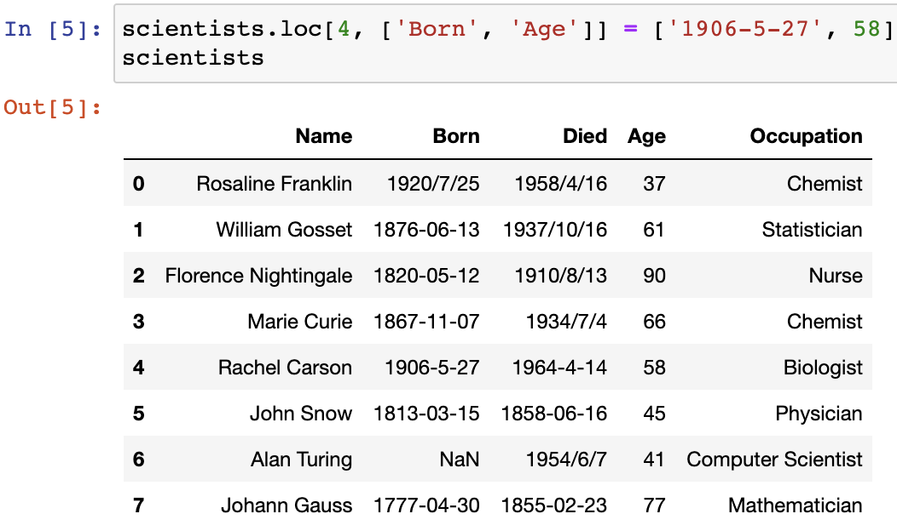
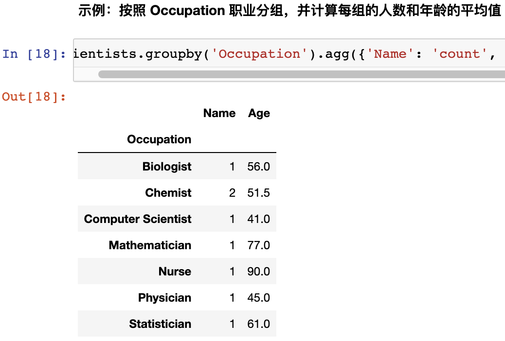
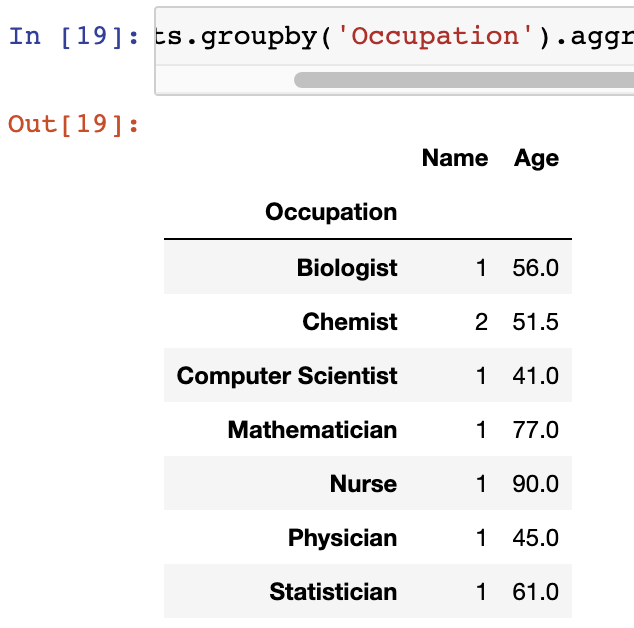
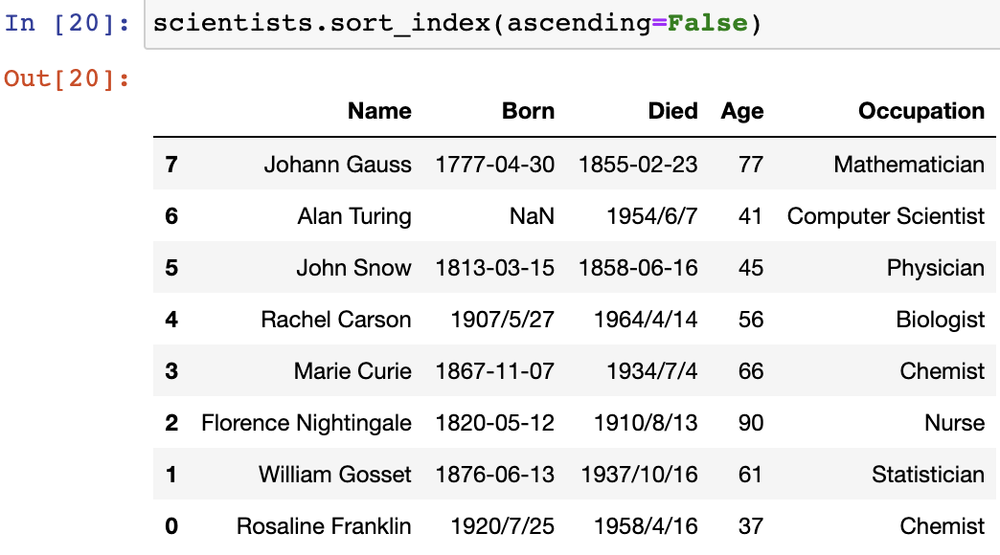
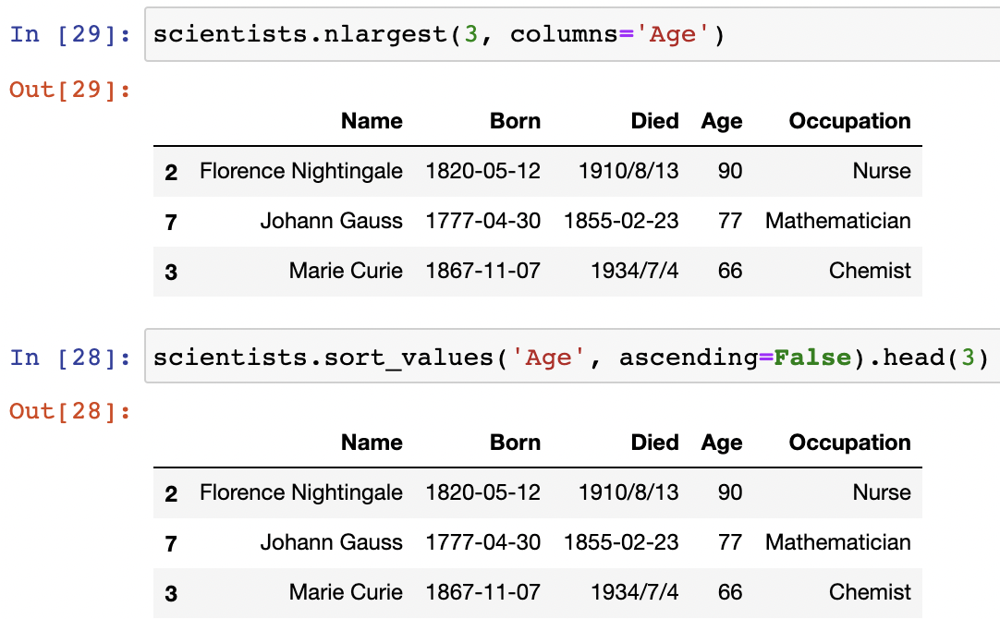
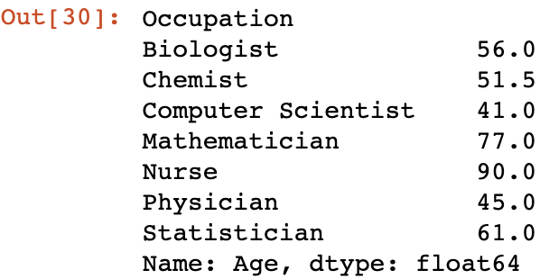
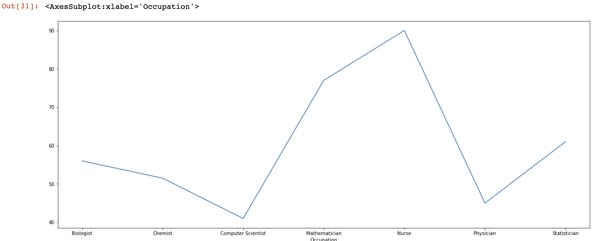
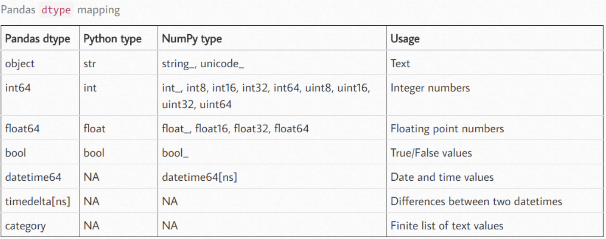
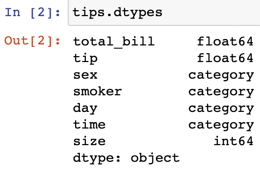
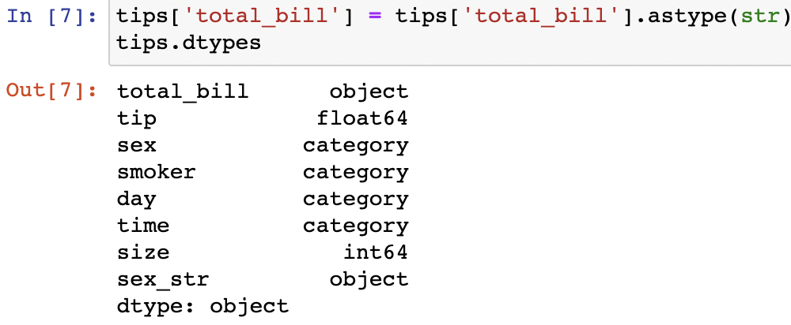

# I. DataFrame增删改

1. ## DataFrame行操作

    1. ### 添加行

        > ##### 注意：添加行时，会返回新的 DataFrame。

        **基本格式**：

        | 方法               | 说明                                                     |
        | ------------------ | -------------------------------------------------------- |
        | `df.append(other)` | 向 DataFrame 末尾添加 other 新行数据，返回新的 DataFrame |

        1）加载 `scientists.csv` 数据集

        ```python
        scientists = pd.read_csv('./data/scientists.csv')
        scientists
        ```

        2）示例：在 `scientists` 数据末尾添加一行新数据

        ```python
        # 准备新行数据
        new_series = pd.Series(['LuoGeng Hua', '1910-11-12', '1985-06-12', 75, 'Mathematician'], 
                               index=['Name', 'Born', 'Died', 'Age', 'Occupation'])
        scientists.append(new_series, ignore_index=True)
        ```

        

    2. ### 修改行

        > ##### 注意：修改行时，是直接对原始 DataFrame 进行修改。

        **基本格式**：

        | 方式                                       | 说明                           |
        | ------------------------------------------ | ------------------------------ |
        | `df.loc[['行标签', ...],['列标签', ...]]`  | 修改行标签对应行的对应列的数据 |
        | `df.iloc[['行位置', ...],['列位置', ...]]` | 修改行位置对应行的对应列的数据 |

         1）示例：修改行标签为 4 的行的所有数据

        ```python
        scientists.loc[4] = ['Rachel Carson', '1907-5-27', '1964-4-14', 56, 'Biologist']
        scientists
        ```

        

        2）示例：修改行标签为 4 的行的 Born 和 Age 列的数据

        ```python
        scientists.loc[4, ['Born', 'Age']] = ['1906-5-27', 58]
        scientists
        ```

        

        3）示例：修改行标签为 6 的行的 Born 列的数据为 `1912-06-23`

        ```python
        scientists.loc[6, 'Born'] = '1912-06-23'
        scientists
        ```

        

    3. ### 删除行

        > ##### 注意：删除行时，会返回新的 DataFrame。

          **基本格式**：

        | 方式                       | 说明                                       |
        | -------------------------- | ------------------------------------------ |
        | `df.drop(['行标签', ...])` | 删除行标签对应行的数据，返回新的 DataFrame |

        1）示例：删除行标签为 1 和 3 的行

        ```python
        scientists.drop([1, 3])
        ```

        

2. ## DataFrame列操作

    1. ### 新增列/修改列

        > ##### 注意：添加列/修改列时，是直接对原始 DataFrame 进行修改。

        **基本格式**：

        | 方式                     | 说明                                                         |
        | ------------------------ | ------------------------------------------------------------ |
        | `df['列标签']=新列`      | 1）如果 DataFrame 中不存在对应的列，则在 DataFrame 最右侧增加新列 2）如果 DataFrame 中存在对应的列，则修改 DataFrame 中该列的数据 |
        | `df.loc[:, 列标签]=新列` | 1）如果 DataFrame 中不存在对应的列，则在 DataFrame 最右侧增加新列 2）如果 DataFrame 中存在对应的列，则修改 DataFrame 中该列的数据 |

        1）示例：给 `scientists` 数据增加一个 `Country` 列

        ```python
        scientists['Country'] = ['England', 'England', 'England', 'French', 
                                 'America', 'England', 'England', 'Germany']
        或
        scientists.loc[:, 'Country'] = ['England', 'England', 'England', 'French', 
                                        'America', 'England', 'England', 'Germany']
        scientists
        ```

        

        2）示例：修改 `scientists` 数据中 `Country` 列的数据

        ```python
        scientists['Country'] = ['england', 'england', 'england', 'french', 
                                 'america', 'england', 'england', 'germany']
        
        或
        scientists.loc[:, 'Country'] = ['england', 'england', 'england', 'french', 
                                        'america', 'england', 'england', 'germany']
        scientists
        ```

        

    2. ### 删除列

        > ##### 注意：删除列时，会返回新的 DataFrame。

        **基本格式**：

        | 方式                               | 说明                                       |
        | ---------------------------------- | ------------------------------------------ |
        | `df.drop(['列标签', ...], axis=1)` | 删除列标签对应的列数据，返回新的 DataFrame |

        1）示例：删除 `scientists` 数据中 `Country` 列的数据

        ```python
        scientists.drop(['Country'], axis=1)
        ```

        

# II. DataFrame查询

1. ## DataFrame条件查询操作

      **基本格式**：

    | 方式                                 | 说明                            |
    | ------------------------------------ | ------------------------------- |
    | `df.loc[条件...]` `或` `df[条件...]` | 获取 DataFrame 中满足条件的数据 |
    | `df.query('条件...')`                | 获取 DataFrame 中满足条件的数据 |

    > ##### 注意：loc 和 query 中可以跟多个条件，可以使用 &(与)、|(或) 表示条件之间的关系。

    1）加载 `scientists.csv` 数据集

    ```python
    scientists = pd.read_csv('./data/scientists.csv')
    scientists
    ```

    2）示例：获取 Age 大于 60 且 Age < 80 的科学家信息

    ```python
    # scientists[(scientists['Age'] > 60) & (scientists['Age'] < 80)] 和下面效果等价
    scientists.loc[(scientists['Age'] > 60) & (scientists['Age'] < 80)]
    
    # scientists[(scientists.Age > 60) & (scientists.Age < 80)] 和下面效果等价
    scientists.loc[(scientists.Age > 60) & (scientists.Age < 80)]
    ```

    

    

    ```python
    scientists.query('Age > 60 & Age < 80')
    ```

    

    3）示例：筛选出职业是 Chemist 和 Nurse 的科学家数据

    ```python
    # 判断每一行的 Occupation 值是否是 'Chemist' 或 'Nurse'，结果是 bool 序列
    scientists.Occupation.isin(['Chemist', 'Nurse'])
    ```

    

    ```python
    scientists[scientists.Occupation.isin(['Chemist', 'Nurse'])]
    ```

    

2. ## DataFrame分组聚合操作

    **基本格式**：

    | 方式                                                         | 说明                                                   |
    | ------------------------------------------------------------ | ------------------------------------------------------ |
    | `df.groupby(列标签, ...).列标签.聚合函数()` 或 `df.groupby(列标签, ...)[列标签].聚合函数()` | 按指定列分组，并对分组 数据的相应列进行相应的 聚合操作 |
    | `df.groupby(列标签, ...).agg({'列标签': '聚合', ...})` 或 `df.groupby(列标签, ...).aggregate({'列标签': '聚合', ...})` | 按指定列分组，并对分组 数据的相应列进行相应的 聚合操作 |

    常见聚合函数：

    | 方式    | 说明               |
    | ------- | ------------------ |
    | `mean`  | 计算平均值         |
    | `max`   | 计算最大值         |
    | `min`   | 计算最小值         |
    | `sum`   | 求和               |
    | `count` | 计数(非空数据数目) |

    1）示例：按照 Occupation 职业分组，并计算每组年龄的平均值

    ```python
    scientists.groupby('Occupation')['Age'].mean()
    或
    scientists.groupby('Occupation').Age.mean()
    ```

    

    2）示例：按照 Occupation 职业分组，并计算每组的人数和年龄的平均值

    ```python
    scientists.groupby('Occupation').agg({'Name': 'count', 'Age': 'mean'})
    或
    scientists.groupby('Occupation').aggregate({'Name': 'count', 'Age': 'mean'})
    ```

      

    

3. ## DataFrame排序操作

      **基本格式**：

    | 方法                                            | 说明                                                         |
    | ----------------------------------------------- | ------------------------------------------------------------ |
    | `df.sort_values(by=['列标签'], ascending=True)` | 将 DataFrame 按照指定列的数据进行排序： ascending 参数默认为True，表示升序； 将 ascending 设置为 False，表示降序 |
    | `df.sort_index(ascending=True)`                 | 将 DataFrame 按照行标签进行排序： ascending 参数默认为True，表示升序； 将 ascending 设置为 False，表示降序 |

    1）示例：按照 Age 从小到大进行排序

    ```python
    # 示例：按照 Age 从小到大进行排序
    scientists.sort_values('Age')
    ```

    

    2）示例：按照 Age 从大到小进行排序

    ```python
    # 示例：按照 Age 从大到小进行排序
    scientists.sort_values('Age', ascending=False)
    ```

    

    3）示例：按照行标签从大到小进行排序

    ```python
    # 示例：按照行标签从大到小进行排序
    scientists.sort_index(ascending=False)
    ```

    

    > ##### 补充：Series 也可以使用 sort_values 和 sort_index 函数进行排序，只不过 Series 的 sort_values 方法没有 by 参数

    ```python
    # 按照 Series 数据的值进行排序
    scientists['Age'].sort_values()
    ```

    ```python
    # 按照 Series 数据的标签进行排序，此处为降序
    scientists['Age'].sort_index(ascending=False)
    ```

    

4. ## nlargest和nsmallest函数

      **基本格式**：

    | 方法                       | 说明                                               |
    | -------------------------- | -------------------------------------------------- |
    | `df.nlargest(n, columns)`  | 按照 columns 指定的列进行降序排序，并取前 n 行数据 |
    | `df.nsmallest(n, columns)` | 按照 columns 指定的列进行升序排序，并取前 n 行数据 |

    1）示例：获取 Age 最大的前 3 行数据

    ```python
    # 示例：获取 Age 最大的前 3 行数据
    scientists.nlargest(3, columns='Age')
    ```

    

    2）示例：获取 Age 最小的前 3 行数据

    ```python
    # 示例：获取 Age 最小的前 3 行数据
    scientists.nsmallest(3, columns='Age')
    ```

    

5. ## 基本绘图

      安装 matplotlib 扩展包：

    ```python
    # 注意先进入自己的虚拟环境，然后再安装 matplotlib 扩展包
    pip install matplotlib -i https://pypi.tuna.tsinghua.edu.cn/simple/
    ```

    可视化在数据分析的每个步骤中都非常重要，在理解或清理数据时，可视化有助于识别数据中的趋势，比如我们计算不同职业的科学家的平均寿命：

    ```python
    scientists_avg_age_by_occupation = scientists.groupby('Occupation').Age.mean()
    scientists_avg_age_by_occupation
    ```

    

    可以通过plot函数画图，通过图片更直观的得出结论：

    ```python
    # 设置 jupyter 内嵌 matplotlib 绘图
    %matplotlib inline
    # 绘图
    scientists_avg_age_by_occupation.plot(figsize=(20, 8))
    ```

    

# III. Pandas数据类型

1. ## Pandas数据类型简介

    1. ### Numpy介绍

        > ##### Numpy（Numerical Python）是一个开源的Python科学计算库，用于快速处理任意维度的数组。

        ##### Numpy底层是C语言, 效率及运行速度远远高于list

        1）Numpy 支持常见的数组和矩阵操作

        - 对于同样的数值计算任务，使用 Numpy 比直接使用 Python 要简洁的多

        2）Numpy 使用ndarray对象来处理多维数组，该对象是一个快速而灵活的大数据容器

        思考：使用 Python 列表可以存储一维数组，通过列表的嵌套可以实现存储多维数组，那么为什么还需要使用Numpy的ndarray呢？

        > 答：我们来做一个ndarray与Python原生list运算效率对比，ndarry 计算效率更高
        >
        > Numpy专门针对ndarray的操作和运算进行了设计，所以数组的存储效率和输入输出性能远优于Python中的嵌套列表，数组越大，Numpy的优势就越明显

        

        **Numpy ndarray的优势**：

        1）数据在内存中存储的风格

        - ndarray 在存储数据时所有元素的类型都是相同的，数据内存地址是连续的，批量操作数组元素时速度更快
        - python 原生 list 只能通过寻址方式找到下一个元素，这虽然也导致了在通用性方面 Numpy 的 ndarray 不及python 原生 list，但计算的时候速度就慢了

        2）ndarray 支持并行化运算

        3）Numpy 底层使用 C 语言编写，内部解除了 GIL（全局解释器锁），其对数组的操作速度不受 python 解释器的限制，可以利用CPU的多核心进行运算，效率远高于纯 python 代码

        

    2. ### Numpy的ndarray

        #### ndarray 的属性

        ##### ndarray的属性清单：

        | 属性             | 说明                       |
        | ---------------- | -------------------------- |
        | ndarray.shape    | 数组维度的元组             |
        | ndarray.ndim     | 数组维数                   |
        | ndarray.size     | 数组中的元素数量           |
        | ndarray.itemsize | 一个数组元素的长度（字节） |
        | ndarray.dtype    | 数组元素的类型             |

        ##### 下表为ndarray的全部数据类型；最常用的类型是布尔和int64，其他只要了解就好：

        | 名称          | 描述                                              | 简写  |
        | ------------- | ------------------------------------------------- | ----- |
        | np.bool       | 用一个字节存储的布尔类型（True或False）           | 'b'   |
        | np.int8       | 一个字节大小，-128 至 127                         | 'i'   |
        | np.int16      | 整数，-32768 至 32767                             | 'i2'  |
        | np.int32      | 整数，-2的31次方 至 2的32次方 -1                  | 'i4'  |
        | np.int64      | 整数，-2的63次方 至 2的63次方 - 1                 | 'i8'  |
        | np.uint8      | 无符号整数，0 至 255                              | 'u'   |
        | np.uint16     | 无符号整数，0 至 65535                            | 'u2'  |
        | np.uint32     | 无符号整数，0 至 2的32次方 - 1                    | 'u4'  |
        | np.uint64     | 无符号整数，0 至 2的64次方 - 1                    | 'u8'  |
        | np.float16    | 半精度浮点数：16位，正负号1位，指数5位，精度10位  | 'f2'  |
        | np.float32    | 单精度浮点数：32位，正负号1位，指数8位，精度23位  | 'f4'  |
        | np.float64    | 双精度浮点数：64位，正负号1位，指数11位，精度52位 | 'f8'  |
        | np.complex64  | 复数，分别用两个32位浮点数表示实部和虚部          | 'c8'  |
        | np.complex128 | 复数，分别用两个64位浮点数表示实部和虚部          | 'c16' |
        | np.object_    | python对象                                        | 'O'   |
        | np.string_    | 字符串                                            | 'S'   |
        | np.unicode_   | unicode类型                                       |       |

        

    3. ### Pandas的数据类型

        pandas 是基于 Numpy 的，很多功能都依赖于 Numpy 的 ndarray 实现的，pandas 的数据类型很多与 Numpy 类似，属性也有很多类似。比如 pandas 数据中的 NaN 就是 numpy.nan

        下图中为 pandas 的数据类型清单，其中 category 我们之前的学习中没有见过的：

        - category 是由固定的且有限数量的变量组成的。比如：性别、社会阶层、血型、国籍、观察时段、赞美程度等等。
        - category 类型的数据可以具有特定的顺序。比如：性别分为男、女，血型ABO。我们会在本章节的最后来了解这种数据类型。

        

        我们以 `seaborn` 包中自带的 `tips` 数据集为例，具体来查看数据类型：

        ```python
        import seaborn as sns
        tips = sns.load_dataset('tips')
        tips.head()
        ```

        

        ```python
        # 查看数据类型
        tips.dtypes
        ```

        

2. ## 数据类型转换

    1. #### astype函数

        > ##### astype 方法是通用函数，可用于把 DataFrame 中的任何列转换为其他 dtype，可以向 astype 方法提供任何内置类型或 numpy 类型来转换列的数据类型

    2. #### 转换为字符串对象

        在上面的tips数据中，sex、smoker、day 和 time 变量都是category类型。通常，如果变量不是数值类型，应先将其转换成字符串类型以便后续处理

        有些数据集中可能含有id列，id的值虽然是数字，但对id进行计算（求和，求平均等）没有任何意义，在某些情况下，可能需要把它们转换为字符串对象类型。

        1）把一列的数据类型转换为字符串，可以使用 `astype`方法：

        ```python
        tips['sex_str'] = tips['sex'].astype(str)
        print(tips.dtypes)
        ```

        

    3. #### 转换为数值类型

        1）为了演示效果，先把`total_bill`列转为`object/str`类型

        ```python
        tips['total_bill'] = tips['total_bill'].astype(str)
        tips.dtypes
        ```

        

        2）再把``object/str`类型的`total_bill`列转为`float64/float`类型

        ```python
        tips['total_bill'] = tips['total_bill'].astype(float)
        tips.dtypes
        ```

        

        #### to_numeric 函数

        > ##### 如果想把变量转换为数值类型（int、float），还可以使用 pandas 的 to_numeric 函数
        >
        > ##### astype 函数要求 DataFrame 每一列的数据类型必须相同，当有些数据中有缺失，但不是 NaN 时（如'missing'、'null'等），会使整列数据变成字符串类型而不是数值型，这个时候可以使用 to_numeric 处理

        1）抽取部分数据，人为制造'missing'作为缺失值的 df 数据

        ```python
        tips_sub_miss = tips.head(10)
        tips_sub_miss.loc[[1, 3, 5, 7], 'total_bill'] = 'missing'
        tips_sub_miss
        ```

        

        2）此时 `total_bill` 列变成了字符串对象类型

        ```
        tips_sub_miss.dtypes
        ```

        

        3）这时使用 `astype` 方法把 `total_bill` 列转换回`float`类型，会抛错，pandas 无法把`'missing'`转换成`float`

        ```python
        # 这句代码会出错
        tips_sub_miss['total_bill'].astype(float)
        ```

        

        4）如果使用 pandas 库中的 `to_numeric` 函数进行转换，默认也会得到类似的错误

        ```python
        # 这句代码也会出错
        pd.to_numeric(tips_sub_miss['total_bill'])
        ```

        

        > to_numeric 函数有一个参数 errors，它决定了当该函数遇到无法转换的数值时该如何处理：
        >
        > 1）默认情况下，该值为 raise，如果 to_numeric 遇到无法转换的值时，会抛错
        >
        > 2）设置为`coerce`：如果 to_numeric 遇到无法转换的值时，会返回NaN
        >
        > 3）设置为`ignore`：如果 to_numeric 遇到无法转换的值时，会放弃转换，什么都不做

        ```python
        pd.to_numeric(tips_sub_miss['total_bill'], errors='coerce')
        ```

        

        ```python
        pd.to_numeric(tips_sub_miss['total_bill'], errors='ignore')
        ```

        

        > to_numeric 函数还有一个 `downcast` 参数，默认是`None`，接受的参数值为`integer`、`signed`、`float` 和 `unsigned`：
        >
        > 1）如果设置了某一类型的数据，那么 pandas 会将原始数据转为该类型能存储的最小子型态
        >
        > 2）如 Pandas 中 float 的子型态有float32、float64，所以设置了downcast='float'，则会将数据转为能够以较少bytes去存储一个浮点数的float32
        >
        > 3）另外，downcast 参数和 errors 参数是分开的，如果 downcast 过程中出错，即使 errors 设置为 ignore 也会抛出异常

        ```python
        # downcast参数设置为float之后, total_bill的数据类型由float64变为float32
        pd.to_numeric(tips_sub_miss['total_bill'], errors='coerce', downcast='float')
        ```

        

        结果说明：从上面的结果看出，转换之后的数据类型为float32，意味着占用的内存更小了

3. ## 分类数据类型Category

    1. ### category类型转换

        > Pandas有一种数据类型`category`, 用于对分类值进行编码. 

        1）`category` 转换为 `object/str`

        ```python
        tips['sex'] = tips['sex'].astype(str)
        tips.info()
        ```

        

        2）`object/str`转换为 `category`

        ```python
        tips['sex'] = tips['sex'].astype('category')
        tips.info()
        ```

        

    2. ### 深入category数据类型

        > ##### category类型数据是由固定的且有限数量的变量组成的, 比如: 性别

        1）通过 `pd.Categorical` 创建 `category` 类型数据，同时指定可选项

        ```python
        s = pd.Series(    
            pd.Categorical(['a', 'b', 'c', 'd'],                  
                           categories=['c', 'b', 'a'])
        )
        s
        ```

        

        > ##### 注意：不在 category 限定范围内的数据会被置为 NaN

        2）通过 `dtype` 参数创建 `category` 类型数据

        ```python
        cat_series = pd.Series(['B', 'D', 'C', 'A'], dtype='category')
        cat_series
        ```

        

        3）此时对数据进行排序

        ```python
        # 排序
        cat_series.sort_values()
        ```

        

        4）通过 `CategoricalDtype` 指定 `category` 数据的类型顺序

        ```python
        from pandas.api.types import CategoricalDtype
        # 自定义一个有序的 category 类型
        cat = CategoricalDtype(categories=['B', 'D', 'A', 'C'], ordered=True)
        print(cat_series)
        print('=' * 20)
        print(cat_series.sort_values())
        print('=' * 20)
        print(cat_series.astype(cat).sort_values())
        ```

        

        5）若要修改排序规则，也可以使用`categories类型的series对象.cat.reorder_categories()`方法

        ```python
        print(cat_series)
        # 注意：cat是categories类型的Series对象的一个属性，用于对Series中的分类数据进行操作
        cat_series.cat.reorder_categories(['D', 'B', 'C', 'A'], ordered=True, inplace=True)
        print(cat_series)
        ```

        

4. ## 日期数据类型

    1. ### Python的datetime对象

        Python内置了datetime对象, 可以在datetime库中找到

        ```python
        from datetime import datetime
        # 获取当前时间
        t1 = datetime.now()
        t1
        ```

        还可以手动创建 datetime：

        ```python
        t2 = datetime(2020, 1, 1)
        t2
        ```

        

        两个 datetime 数据可以相减：

        ```python
        diff = t1 - t2
        print(diff)
        ```

        

        ```python
        # 查看两个日期相间的结果类型
        print(type(diff))
        ```

        

    2. ### pandas中的数据转换成datetime

        pandas 可以使用 `to_datetime` 函数把数据转换成 `datetime` 类型

        1）加载 `country_timeseries.csv` 数据，并查看前5行的前5列数据

        ```python
        ebola = pd.read_csv('./data/country_timeseries.csv')
        ebola.iloc[:5, :5]
        ```

        

        > 注：从数据中看出 Date 列是日期，但通过info查看加载后数据为object类型

        ```python
        ebola.info()
        ```

        

        3）可以通过 pandas 的 `to_datetime`方法把 `Date` 列转换为datetime，然后创建新列

        ```python
        ebola['Date_Dt'] = pd.to_datetime(ebola['Date'])
        ebola.info()
        ```

        

        4）如果数据中包含日期时间数据，可以在加载的时候，通过`parse_dates`参数指定自动转换为 datetime

        ```python
        # parse_dates 参数可以是列标签或列的位置编号，表示加载数据时，将指定列转换为 datetime 类型
        ebola = pd.read_csv('./data/country_timeseries.csv', parse_dates=[0])
        ebola.info()
        ```

        

    3. ### 提取datetime的各个部分

        1）获取了一个 datetime 对象，就可以提取日期的各个部分了

        ```python
        dt = pd.to_datetime('2021-06-01')
        dt
        ```

        

        > 可以看到得到的数据是Timestamp类型，通过Timestamp可以获取年、月、日等部分

        ```python
        dt.year
        dt.month
        dt.day
        ```

        

        除了获取 Timestamp 类型的年、月、日部分，还可以获取其他部分，具体参考文档：<https://pandas.pydata.org/pandas-docs/stable/user_guide/timeseries.html#time-date-components>

        2）通过 `ebola` 数据集的 `Date` 列，创建新列 `year`、`month`、`day`

        ```python
        # 注意：dt是日期类型的Series对象的属性，用于对Series中的日期数据操作，比如提取日期各个部分
        ebola['year'] = ebola['Date'].dt.year
        ebola['year']
        ```

        

        ```python
        ebola['month'] = ebola['Date'].dt.month
        ebola['day'] = ebola['Date'].dt.day
        ebola[['Date','year','month','day']].head()
        ```

        

        ```python
        ebola.info()
        ```

        

    4. ### 日期运算和TimeDelta

        > Ebola 数据集中的 Day 列表示一个国家爆发 Ebola 疫情的天数。这一列数据可以通过日期运算重建该列

        1）获取疫情爆发的第一天

        ```python
        # 获取疫情爆发的第一天
        ebola['Date'].min()
        ```

        

        结果说明：疫情爆发的第一天（数据集中最早的一天）是2014-03-22

        2）计算疫情爆发的天数时，只需要用每个日期减去这个日期即可

        ```python
        ebola['outbreak_day'] = ebola['Date'] - ebola['Date'].min()
        ebola[['Date', 'Day', 'outbreak_day']]
        ```

        

        ```python
        ebola[['Date', 'Day', 'outbreak_day']].tail()
        ```

        

        3）执行这种日期运算，会得到一个`timedelta`对象

        ```python
        ebola.info()
        ```

        

    5. ### 日期范围

        > 包含日期的数据集中，并非每一个都包含固定频率。比如在ebola数据集中，日期并没有规律

        ```python
        ebola_head = ebola.iloc[:5, :5]
        ebola_head
        ```

        

        > 从上面的数据中可以看到，缺少2015年1月1日，如果想让日期连续，可以创建一个日期范围来为数据集重建索引。

        1）可以使用 `date_range` 函数来创建连续的日期范围

        ```python
        head_range = pd.date_range(start='2014-12-31', end='2015-01-05')
        head_range
        ```

        

        2）对于 `ebola_head` 数据首先设置日期索引，然后为数据重建连续索引

        ```python
        ebola_head.index = ebola_head['Date']
        ebola_head
        ```

        

        ```python
        ebola_head.reindex(head_range)
        ```

        

        > 使用date_range函数创建日期序列时，可以传入一个参数freq，默认情况下freq取值为D，表示日期范围内的值是逐日递增的

        ```python
        # 产生 2020-01-01 到 2020-01-07 的工作日
        pd.date_range('2020-01-01', '2020-01-07', freq='B')	# business day
        ```

        

        结果说明：从结果中看到生成的日期中缺少1月4日，1月5日，为休息日

        **freq 参数的可能取值**：

        | Alias    | Description                     |
        | :------- | :------------------------------ |
        | B        | 工作日                          |
        | C        | 自定义工作日                    |
        | D        | 日历日                          |
        | W        | 每周                            |
        | M        | 月末                            |
        | SM       | 月中和月末（每月第15天和月末）  |
        | BM       | 月末工作日                      |
        | CBM      | 自定义月末工作日                |
        | MS       | 月初                            |
        | SMS      | 月初和月中（每月第1天和第15天） |
        | BMS      | 月初工作日                      |
        | CBMS     | 自定义月初工作日                |
        | Q        | 季度末                          |
        | BQ       | 季度末工作日                    |
        | QS       | 季度初                          |
        | BQS      | 季度初工作日                    |
        | A, Y     | 年末                            |
        | BA, BY   | 年末工作日                      |
        | AS, YS   | 年初                            |
        | BAS, BYS | 年初工作日                      |
        | BH       | 工作时间                        |
        | H        | 小时                            |
        | T, min   | 分钟                            |
        | S        | 秒                              |
        | L, ms    | 毫秒                            |
        | U, us    | microseconds                    |
        | N        | 纳秒                            |

        3）在 freq 传入参数的基础上，可以做一些调整

        ```python
        # 隔一个工作日取一个工作日
        pd.date_range('2020-01-01', '2020-01-07', freq='2B')
        ```

        

        4）freq 传入的参数可以传入多个

        ```python
        # 示例：2020年每个月的第一个星期四
        pd.date_range('2020-01-01','2020-12-31',freq='WOM-1THU')
        ```

        

        ```python
        # 示例：2020年每个月的第三个星期五
        pd.date_range('2020-01-01','2020-12-31',freq='WOM-3FRI')
        ```

        

    6. ### 日期序列数据操作

        1. #### DateTimeIndex设置

            1）加载丹佛市报警记录数据集 `crime.csv`

            ```python
            crime = pd.read_csv('./data/crime.csv', parse_dates=['REPORTED_DATE'])
            crime
            ```

            

            ```python
            crime.info()
            ```

            

            2）设置报警时间为行标签索引

            ```python
            crime = crime.set_index('REPORTED_DATE')
            crime
            ```

            

            ```python
            # 查看数据信息
            crime.info()
            ```

            

        2. #### 日期数据的筛选

            > 注：把行标签索引设置为日期对象后，可以直接使用日期来获取某些数据

            **根据日期各部分进行数据筛选：**

            1）示例：获取 `2016-05-02` 的报警记录数据

            ```python
            crime.loc['2016-05-02']
            ```

            

            2）示例：获取 `2015-03-01` 到 `2015-06-01` 之间的报警记录数据

            ```python
            crime.loc['2015-03-01': '2015-06-01'].sort_index()
            ```

            

            3）时间段可以包括小时分钟

            ```python
            crime.loc['2015-03-01 22': '2015-06-01 20:35:00'].sort_index()
            ```

            

            4）示例：查询凌晨两点到五点的报警记录

            ```python
            crime.between_time('2:00', '5:00')
            ```

            

            5）示例：查询在 `5:47` 分的报警记录

            ```python
            crime.at_time('5:47')
            ```

            

            **DateTimeIndex 行标签排序**：

            > 在按日期各部分筛选数据时，可以将数据先按日期行标签排序，排序之后根据日期筛选数据效率更高。
            >
            > 坑点：
            >
            > - 数据按照 DateTimeIndex 行标签排序之前，只能使用 df.loc[...] 的形式根据日期筛选数据，但排序之后，可以同时使用 df.loc[...] 或 df[...] 的形式根据日期筛选数据

            1）示例：获取 `2015-03-04` 到 `2015-06-01` 之间的报警记录数据

            ```python
            # 数据按照 DateTimeIndex 行标签排序之前
            %timeit crime.loc['2015-03-04': '2016-06-01']
            ```

            

            ```python
            # 数据按照 DateTimeIndex 行标签排序之后
            crime_sort = crime.sort_index()
            %timeit crime_sort.loc['2015-03-04': '2016-06-01']
            ```

            

            > 结论：数据按照 DateTimeIndex 行标签排序之后，根据日期筛选数据效率更高

            **日期序列数据的重采样**：

            > 对于设置了日期类型行标签之后的数据，可以使用 resample 方法重采样，按照指定时间周期分组

            1）示例：计算每周的报警数量

            ```python
            # W：即Week，表示按周进行数据重采样
            weekly_crimes = crime_sort.resample('W').size()
            weekly_crimes
            ```

            

            ```python
            # 也可以把周四作为每周的结束
            crime_sort.resample('W-THU').size()
            ```

            

            ```python
            # pandas 绘图
            %matplotlib inline
            import matplotlib.pyplot as plt
            # Windows 操作系统设置显示中文
            plt.rcParams['font.sans-serif'] = 'SimHei'
            # Mac 操作系统设置显示中文
            # plt.rcParams['font.sans-serif'] = 'Arial Unicode MS'
            
            weekly_crimes.plot(figsize=(16, 8), title='丹佛报警记录情况')
            ```

            

            2）示例：分析每季度的犯罪和交通事故数据

            ```python
            # Q：Quarter，表示按季度进行数据重采样
            crime_quarterly = crime_sort.resample('Q')['IS_CRIME', 'IS_TRAFFIC'].sum()
            crime_quarterly
            ```

            

            所有日期都是该季度的最后一天，使用`QS`生成每季度的第一天

            ```python
            crime_quarterly = crime_sort.resample('QS')['IS_CRIME', 'IS_TRAFFIC'].sum()
            crime_quarterly
            ```

            

            ```python
            # pandas 绘图
            crime_quarterly.plot(figsize=(16, 8))
            plt.title('丹佛犯罪和交通事故数据')
            ```

            

# IV. 缺失值处理

1. ## pandas缺失值NaN简介

    在实际进行数据处理的过程中，很多数据集都含缺失数据。

    **缺失数据有多重表现形式**：

    1）数据库中，缺失数据表示为`NULL`

    2）在某些编程语言中用`NA`或`None`表示

    3）缺失值也可能是空字符串`''`或数值 `0`

    4）在 pandas 中使用 `NaN` 表示缺失值

    - pandas 中的 NaN 值来自 NumPy 库

    - NumPy 中缺失值有几种表示形式：NaN，NAN，nan，他们都一样

        ```python
        import numpy as np
        print(np.NaN)
        print(np.NAN)
        print(np.nan)
        ```

        

    > 注意点1：缺失值和其它类型的数据不同，它毫无意义，NaN不等于0，也不等于空字符串

    ```python
    print(np.NaN==True)
    print(np.NaN==False)
    print(np.NaN==0)
    print(np.NaN=='')
    print(np.NaN==None)
    ```

    

    > 注意点2：两个NaN也不相等

    ```python
    print(np.NaN==np.NaN)
    print(np.NaN==np.nan)
    print(np.NaN==np.NAN)
    print(np.NAN==np.nan)
    ```

    

    **pandas 判断是否为缺失值方法**：

    | 方法                                 | 说明                  |
    | ------------------------------------ | --------------------- |
    | `pd.isnull(obj)` 或 `pd.isna(obj)`   | 判断 obj 是否为缺失值 |
    | `pd.notnull(obj)` 或 `pd.notna(obj)` | 判断 obj 不为缺失值   |

    ```python
    print(pd.isnull(np.NaN))
    print(pd.isnull(np.nan))
    print(pd.isnull(np.NAN))
    ```

    

    ```python
    print(pd.notnull(np.NaN))
    print(pd.notnull(42))
    ```

    

    **判断 Series 中的元素是否是缺失值**：

    | 方法              | 说明                                                         |
    | ----------------- | ------------------------------------------------------------ |
    | `series.isnull()` | 判断 Series 中的每个元素是否为缺失值，返回一个 bool 序列的 Series 数据 |

    ```python
    # 创建一个包含缺失值的 Series 数据
    series = pd.Series([1, 3, np.NaN, 2, np.NaN, 5])
    series
    ```

    

    ```python
    # 判断 Series 中的元素是否为 NaN 值
    series.isnull()
    ```

    

    ```python
    # 计算 Series 中 NaN 值的数量
    series.isnull().sum()
    ```

    

    **判断 DataFrame 中的数据是否是缺失值**：

    | 方法          | 说明                                                         |
    | ------------- | ------------------------------------------------------------ |
    | `df.isnull()` | 判断 DataFrame 中的每个元素是否为缺失值，返回一个 bool 序列的 DataFrame 数据 |

    ```python
    # 创建一个包含缺失值的 DataFrame 数据
    df = pd.DataFrame([
        [1, np.NaN, 3],
        [np.NaN, 2, 1],
        [np.NaN, 3, np.NaN]
    ], columns=['A', 'B', 'C'])
    df
    ```

    

    ```python
    # 判断 DataFrame 中的每个元素是否为缺失值
    df.isnull()
    ```

    

    ```python
    # 计算 DataFrame 中每一列的缺失值数量
    df.isnull().sum()
    ```

    

2. ## 加载包含缺失值的数据

    **缺失值从何而来呢？缺失值的来源有两个**：

    1）原始数据包含缺失值

    2）数据整理过程中产生缺失值

    **加载包含缺失值的数据**：

    1）使用 pandas 加载 `survey_visited.csv` 数据

    ```python
    # 加载包含缺失值的数据
    pd.read_csv('./data/survey_visited.csv')
    ```

    

    2）pandas 加载数据时，可以设置`keep_default_na=False`参数，不显示默认缺失值

    ```python
    # 加载数据时，不显示默认的缺失值，默认缺失值填充为''
    pd.read_csv('./data/survey_visited.csv', keep_default_na=False)
    ```

    

    3）pandas 加载数据时，也可以设置 `na_values` 参数，指定加载数据时把什么当做缺失值

    ```python
    # na_values=["DR-3"]：加载数据时，把 'DR-3' 当做缺失值
    pd.read_csv('./data/survey_visited.csv', na_values=["DR-3"], keep_default_na=False)
    ```

    

    > 注意：在做数据合并的时候，比如`merge`、`join`等操作时，也可能会产生缺失值，参数用法一致，这里不再赘述

3. ## 缺失值处理

    1. #### 加载数据并查看缺失情况

        > 注：本案例使用泰坦尼克生存预测数据 `titanic_train.csv`，其中Survived字段，代表该名乘客是否获救

        #### 3.1.1 加载数据集

        1）加载 `titanic_train.csv` 数据集

        ```python
        # 加载数据
        train = pd.read_csv('./data/titanic_train.csv')
        print(train.shape)
        train.head()
        ```

        

        **字段介绍**：

        | 字段名        | 说明                               |
        | ------------- | ---------------------------------- |
        | `PassengerId` | 乘客的ID                           |
        | `Survived`    | 乘客是否获救，0：没获救，1：已获救 |
        | `Pclass`      | 乘客船舱等级（1/2/3三个等级舱位）  |
        | `Name`        | 乘客姓名                           |
        | `Sex`         | 性别                               |
        | `Age`         | 年龄                               |
        | `SibSp`       | 乘客在船上的兄弟姐妹/配偶数量      |
        | `Parch`       | 乘客在船上的父母/孩子数量          |
        | `Ticket`      | 船票号                             |
        | `Fare`        | 船票价                             |
        | `Cabin`       | 客舱号码                           |
        | `Embarked`    | 登船的港口                         |

        #### 3.1.2 构造缺失值统计的函数

        ```python
        def missing_values_table(df):
            # 计算所有的缺失值
            mis_val = df.isnull().sum()
        
            # 计算缺失值的比例
            mis_val_percent = 100 * mis_val / len(df)
        
            # 将结果拼接成 DataFrame
            mis_val_table = pd.concat([mis_val, mis_val_percent], axis=1)
        
            # 将列重命名
            mis_val_table.columns = ['缺失值', '占比(%)']
        
            # 将缺失值为0的列去除，并按照缺失值占比进行排序
            mis_val_table_sorted = mis_val_table[mis_val_table['缺失值']!=0].sort_values(
                '占比(%)', ascending=False)
        
            # 打印信息
            print(f'传入的数据集共{df.shape[1]}列，\n其中{mis_val_table_sorted.shape[0]}列有缺失值')
        
            return mis_val_table_sorted
        ```

        #### 3.1.3 查看数据集中的缺失值情况

        ```python
        # 查看缺失值情况
        missing_values_table(train)
        ```

        

    2. #### 使用Missingno库对缺失值的情况进行可视化探查

          我们可以使用 Missingno 库来对缺失值进行可视化

        #### 3.2.1 安装 missingno 并初步查看

        1）完全关闭`jupyter notebook`

        2）重新打开anaconda提供的终端中，通过pip安装missingno

        ```python
        # pip安装missingno
        pip install missingno
        ```

        3）安装成功后重新打开`jupyter notebook`，并运行全部代码

        #### 3.2.2 缺失值数量可视化

        1）导包并利用`missingno.bar(df)`函数查看数据集数据完整性

        ```python
        import missingno as msno
        msno.bar(train)
        ```

        

        结果说明：

        - 图的下测是列名，可以看到"年龄"、"客舱号码"和"登船的港口"列包含值缺失
        - 左侧数值为百分比，右侧数值为具体数字，上方数字为非缺失值的数量

        #### 3.2.3 缺失值位置的可视化

        `missingno.matrix` 函数 提供了快速直观的查看缺失值的分布情况：

        ```python
        # 查看缺失值分布
        msno.matrix(train)
        ```

        

        结果说明：

        - 在有缺失值的地方，图都显示为空白。 例如在"Embarked"列中，只有两个丢失数据的实例，因此有两个白线。
        - 右侧的迷你图给出了数据完整性的情况，并在底部指出了最少有10列数据是完整的，最多有12列数据是完整的

        对数据集进行随机取样后再查看数据缺失情况：

        ```python
        # 随机从 train 数据中取出 100 条数据，查看缺失值分布情况
        msno.matrix(train.sample(100))
        ```

        

        #### 3.2.4 缺失值之间相关性

        1）查看缺失值之间是否具有相关性：

        ```python
        # 热力图
        msno.heatmap(train)
        ```

        

        结果说明：

        - 相关性取值 0 不相关，1强相关，-1强负相关
        - 通过上图发现，age 和 cabin的相关性为0.1，所以相关性不强，也就是说，age是否缺失，与Cabin是否缺失没多大关系

        2）进一步按age进行排序，再图形化展示缺失值情况，以验证age的缺失与cabin确实无关

        ```python
        _sorted = train.sort_values('Age')
        msno.matrix(_sorted)
        ```

        

    3. #### 缺失值处理

        #### 3.3.1 缺失值处理方式概述

        

        #### 3.3.2 删除缺失值

        > 删除缺失值：删除缺失值会损失信息，并不推荐删除，当缺失数据占比较低的时候，可以尝试使用删除缺失值

        1）按行删除：删除指定列为缺失值的行记录

        ```python
        # 复制一份数据
        train_cp = train.copy() 
        # 对Age列进行处理，空值就删除整行数据
        train_cp.dropna(subset=['Age'], how='any', inplace=True)
        # 输出Age列缺失值的总数
        print(train_cp['Age'].isnull().sum())
        # 图形化缺失值情况
        msno.matrix(train_cp)
        ```

        

        补充内容：dropna的参数

        > df.dropna(axis=0, how='any', thresh=None, subset=None, inplace=False)
        >
        > 参数说明：
        >
        > - 可选参数subset：不与thresh参数一起使用：接收一个列表，列表中的元素为列名: 对特定的列进行缺失值删除处理
        > - 可选参数thresh：参数为int类型，按行去除NaN值，去除NaN值后该行剩余数值的数量（列数）大于等于n，便保留这一行
        > - 可选参数axis：默认为0，设置为 0 或 'index' 表示按行删除，设置为 1 或 'columns' 表示按列删除
        > - 可选参数how：默认为'any'，表示如果存在NA值，则删除该行或列，设置为'all'，表示所有值都是NA，则删除该行或列
        > - 可选参数inplace：表示是否修改变原始的数据集，默认为False，可以设置为True

        2）按列删除：当一列包含了很多缺失值的时候（比如超过80%），可以使用df.drop(['列名',..], axis=1)函数将指定列删除，但最好不要删除数据

        ```python
        # 复制一份数据
        train_cp = train.copy() 
        # 对Age列进行处理，空值就删除整行数据
        train_cp.drop(['Age'], axis=1, inplace=True)
        # 图形化缺失值情况
        msno.matrix(train_cp)
        ```

        

        > 注意：Age 列没有了!!!

        #### 3.3.3 非时序数据填充缺失值

        > 填充缺失值（非时间序列数据）：填充缺失值是指用一个估算的值来去替代缺失值

        1）使用常量来替换（默认值）

        ```python
        # 复制一份数据
        train_constant = train.copy()
        # 计算各列空值总数
        print('填充缺失值之前：')
        print(train_constant.isnull().sum())
        
        # 将空值都填为0，inplace=True为必要参数
        train_constant.fillna(0, inplace=True)
        
        # 计算各列空值总数
        print('填充缺失值之后：')
        print(train_constant.isnull().sum())
        ```

        

        2）使用统计量替换（缺失值所处列的平均值、中位数、众数）

        ```python
        # 复制一份数据
        train_mean = train.copy()
        # 计算年龄的平均值
        age_mean = train_mean['Age'].mean()
        print(age_mean)
        # 使用年龄的平均值填充 Age 列的缺失值
        train_mean['Age'].fillna(age_mean, inplace=True)
        train_mean.isnull().sum()
        ```

        

        #### 3.3.4 时序数据缺失值处理

        时序数据在某一列值的变化往往有一定线性规律，绝大多数的时序数据，具体的列值随着时间的变化而变化，所以对于有时序的行数据缺失值处理有三种方式：

        - 用时间序列中空值的上一个非空值填充
        - 用时间序列中空值的下一个非空值填充
        - 线性插值方法

        1）加载样例时序数据集 `city_day.csv`，该数据集为印度城市空气质量数据（2015-2020）

        ```python
        city_day = pd.read_csv('./data/city_day.csv', parse_dates=True, index_col='Date')
        # 复制一份数据
        city_day_cp = city_day.copy()
        # 查看数据的前 5 行
        city_day_cp.head()
        ```

        

        2）用之前封装的方法（本章3.2.2小节），查看数据缺失情况：

        ```python
        city_day_missing = missing_values_table(city_day_cp)
        city_day_missing
        ```

        

        结果说明：

        - 我们可以观察到数据中有很多缺失值，比如Xylene有超过60%的缺失值（二甲苯），PM10 有超过30%的缺失值

        3）使用`fillna`函数中的`ffill`参数，用时间序列中空值的上一个非空值填充

        ```python
        # 截取一小部分数据用于填充效果查看
        city_day['Xylene'][50:64]
        ```

        

        ```python
        # 填充缺失值
        city_day.fillna(method='ffill', inplace=True)
        # 截取一小部分数据查看填充效果
        city_day['Xylene'][50:64]
        ```

        

        4）上面填充了缺失值之后，再次查看缺失值情况

        ```python
        # 查看缺失值比例
        missing_values_table(city_day)
        ```

        

        5）使用`fillna`函数中的`bfill`参数，用时间序列中空值的下一个非空值填充

        ```python
        # 截取一小部分数据用于填充效果查看
        city_day['AQI'][20:30]
        ```

        

        ```python
        # 填充缺失值
        city_day.fillna(method='bfill', inplace=True)
        # 截取一小部分数据查看填充效果
        city_day['AQI'][20:30]
        ```

        

        6）上面填充了缺失值之后，再次查看缺失值情况

        ```python
        # 查看缺失值比例
        missing_values_table(city_day)
        ```

        

        7）使用`df.interpolate(limit_direction="both", inplace=True)` 对缺失数据进行线性填充

        - 绝大多数的时序数据，具体的列值随着时间的变化而变化。 因此，使用bfill和ffill进行插补并不是解决缺失值问题的最优方案。
        - 线性插值法是一种插补缺失值技术，它假定数据点之间存在严格的线性关系，并利用相邻数据点中的非缺失值来计算缺失数据点的值

        ```python
        # 截取一小部分数据用于填充效果查看
        city_day_cp['Xylene'][50:65]
        ```

        

        ```python
        # 线性插值填充
        city_day_cp.interpolate(limit_direction='both', inplace=True)
        # 截取一小部分数据用于查看填充效果
        city_day_cp['Xylene'][50:65]
        ```

        

        #### 3.3.5 其它填充缺失值的方法

        > 上面介绍的线性填充缺失值的方法，其本质就是机器学习算法预测；当然还有其他机器学习算法可以用来做缺失值的计算，绝大多数场景只需要我们掌握上述缺失值填充的办法即可；一旦无法用上述办法来解决问题，那么将交由算法工程师来解决

    


