# I. DataFrame增删改

1. ## DataFrame行操作

    1. ### 添加行

        > ##### 注意：添加行时，会返回新的 DataFrame。

        **基本格式**：

        | 方法               | 说明                                                     |
        | ------------------ | -------------------------------------------------------- |
        | `df.append(other)` | 向 DataFrame 末尾添加 other 新行数据，返回新的 DataFrame |

        1）加载 `scientists.csv` 数据集

        ```python
        scientists = pd.read_csv('./data/scientists.csv')
        scientists
        ```

        2）示例：在 `scientists` 数据末尾添加一行新数据

        ```python
        # 准备新行数据
        new_series = pd.Series(['LuoGeng Hua', '1910-11-12', '1985-06-12', 75, 'Mathematician'], 
                               index=['Name', 'Born', 'Died', 'Age', 'Occupation'])
        scientists.append(new_series, ignore_index=True)
        ```

        

    2. ### 修改行

        > ##### 注意：修改行时，是直接对原始 DataFrame 进行修改。

        **基本格式**：

        | 方式                                       | 说明                           |
        | ------------------------------------------ | ------------------------------ |
        | `df.loc[['行标签', ...],['列标签', ...]]`  | 修改行标签对应行的对应列的数据 |
        | `df.iloc[['行位置', ...],['列位置', ...]]` | 修改行位置对应行的对应列的数据 |

         1）示例：修改行标签为 4 的行的所有数据

        ```python
        scientists.loc[4] = ['Rachel Carson', '1907-5-27', '1964-4-14', 56, 'Biologist']
        scientists
        ```

        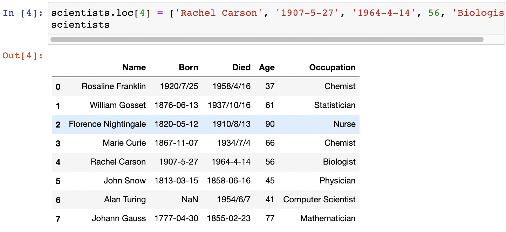

        2）示例：修改行标签为 4 的行的 Born 和 Age 列的数据

        ```python
        scientists.loc[4, ['Born', 'Age']] = ['1906-5-27', 58]
        scientists
        ```

        

        3）示例：修改行标签为 6 的行的 Born 列的数据为 `1912-06-23`

        ```python
        scientists.loc[6, 'Born'] = '1912-06-23'
        scientists
        ```

        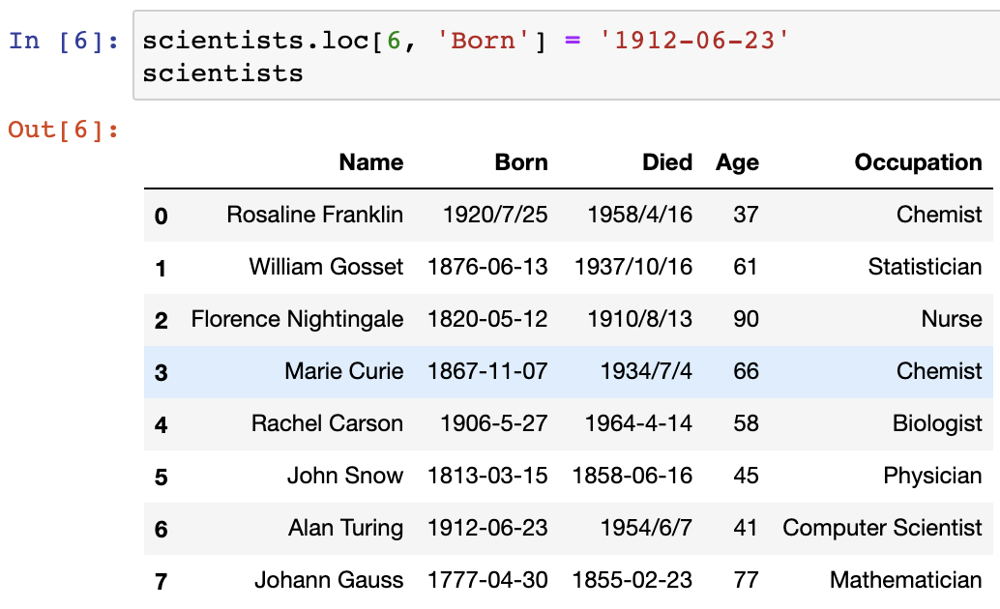

    3. ### 删除行

        > ##### 注意：删除行时，会返回新的 DataFrame。

          **基本格式**：

        | 方式                       | 说明                                       |
        | -------------------------- | ------------------------------------------ |
        | `df.drop(['行标签', ...])` | 删除行标签对应行的数据，返回新的 DataFrame |

        1）示例：删除行标签为 1 和 3 的行

        ```python
        scientists.drop([1, 3])
        ```

        

2. ## DataFrame列操作

    1. ### 新增列/修改列

        > ##### 注意：添加列/修改列时，是直接对原始 DataFrame 进行修改。

        **基本格式**：

        | 方式                     | 说明                                                         |
        | ------------------------ | ------------------------------------------------------------ |
        | `df['列标签']=新列`      | 1）如果 DataFrame 中不存在对应的列，则在 DataFrame 最右侧增加新列 2）如果 DataFrame 中存在对应的列，则修改 DataFrame 中该列的数据 |
        | `df.loc[:, 列标签]=新列` | 1）如果 DataFrame 中不存在对应的列，则在 DataFrame 最右侧增加新列 2）如果 DataFrame 中存在对应的列，则修改 DataFrame 中该列的数据 |

        1）示例：给 `scientists` 数据增加一个 `Country` 列

        ```python
        scientists['Country'] = ['England', 'England', 'England', 'French', 
                                 'America', 'England', 'England', 'Germany']
        或
        scientists.loc[:, 'Country'] = ['England', 'England', 'England', 'French', 
                                        'America', 'England', 'England', 'Germany']
        scientists
        ```

        

        2）示例：修改 `scientists` 数据中 `Country` 列的数据

        ```python
        scientists['Country'] = ['england', 'england', 'england', 'french', 
                                 'america', 'england', 'england', 'germany']
        
        或
        scientists.loc[:, 'Country'] = ['england', 'england', 'england', 'french', 
                                        'america', 'england', 'england', 'germany']
        scientists
        ```

        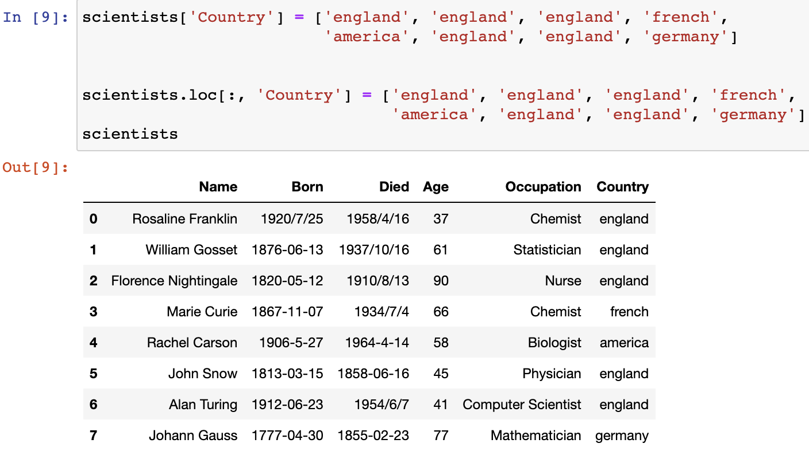

    2. ### 删除列

        > ##### 注意：删除列时，会返回新的 DataFrame。

        **基本格式**：

        | 方式                               | 说明                                       |
        | ---------------------------------- | ------------------------------------------ |
        | `df.drop(['列标签', ...], axis=1)` | 删除列标签对应的列数据，返回新的 DataFrame |

        1）示例：删除 `scientists` 数据中 `Country` 列的数据

        ```python
        scientists.drop(['Country'], axis=1)
        ```

        

# II. DataFrame查询

1. ## DataFrame条件查询操作

      **基本格式**：

    | 方式                                 | 说明                            |
    | ------------------------------------ | ------------------------------- |
    | `df.loc[条件...]` `或` `df[条件...]` | 获取 DataFrame 中满足条件的数据 |
    | `df.query('条件...')`                | 获取 DataFrame 中满足条件的数据 |

    > ##### 注意：loc 和 query 中可以跟多个条件，可以使用 &(与)、|(或) 表示条件之间的关系。

    1）加载 `scientists.csv` 数据集

    ```python
    scientists = pd.read_csv('./data/scientists.csv')
    scientists
    ```

    2）示例：获取 Age 大于 60 且 Age < 80 的科学家信息

    ```python
    # scientists[(scientists['Age'] > 60) & (scientists['Age'] < 80)] 和下面效果等价
    scientists.loc[(scientists['Age'] > 60) & (scientists['Age'] < 80)]
    
    # scientists[(scientists.Age > 60) & (scientists.Age < 80)] 和下面效果等价
    scientists.loc[(scientists.Age > 60) & (scientists.Age < 80)]
    ```

    

    

    ```python
    scientists.query('Age > 60 & Age < 80')
    ```

    

    3）示例：筛选出职业是 Chemist 和 Nurse 的科学家数据

    ```python
    # 判断每一行的 Occupation 值是否是 'Chemist' 或 'Nurse'，结果是 bool 序列
    scientists.Occupation.isin(['Chemist', 'Nurse'])
    ```

    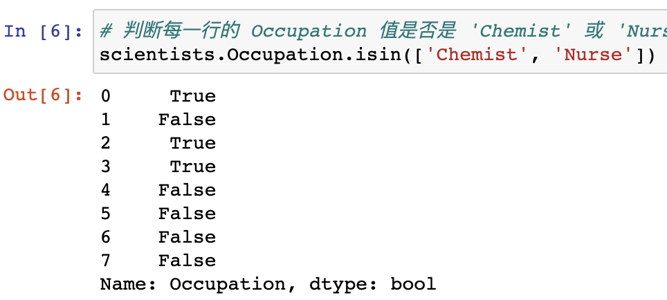

    ```python
    scientists[scientists.Occupation.isin(['Chemist', 'Nurse'])]
    ```

    

2. ## DataFrame分组聚合操作

    **基本格式**：

    | 方式                                                         | 说明                                                   |
    | ------------------------------------------------------------ | ------------------------------------------------------ |
    | `df.groupby(列标签, ...).列标签.聚合函数()` 或 `df.groupby(列标签, ...)[列标签].聚合函数()` | 按指定列分组，并对分组 数据的相应列进行相应的 聚合操作 |
    | `df.groupby(列标签, ...).agg({'列标签': '聚合', ...})` 或 `df.groupby(列标签, ...).aggregate({'列标签': '聚合', ...})` | 按指定列分组，并对分组 数据的相应列进行相应的 聚合操作 |

    常见聚合函数：

    | 方式    | 说明               |
    | ------- | ------------------ |
    | `mean`  | 计算平均值         |
    | `max`   | 计算最大值         |
    | `min`   | 计算最小值         |
    | `sum`   | 求和               |
    | `count` | 计数(非空数据数目) |

    1）示例：按照 Occupation 职业分组，并计算每组年龄的平均值

    ```python
    scientists.groupby('Occupation')['Age'].mean()
    或
    scientists.groupby('Occupation').Age.mean()
    ```

    

    2）示例：按照 Occupation 职业分组，并计算每组的人数和年龄的平均值

    ```python
    scientists.groupby('Occupation').agg({'Name': 'count', 'Age': 'mean'})
    或
    scientists.groupby('Occupation').aggregate({'Name': 'count', 'Age': 'mean'})
    ```

      

    

3. ## DataFrame排序操作

      **基本格式**：

    | 方法                                            | 说明                                                         |
    | ----------------------------------------------- | ------------------------------------------------------------ |
    | `df.sort_values(by=['列标签'], ascending=True)` | 将 DataFrame 按照指定列的数据进行排序： ascending 参数默认为True，表示升序； 将 ascending 设置为 False，表示降序 |
    | `df.sort_index(ascending=True)`                 | 将 DataFrame 按照行标签进行排序： ascending 参数默认为True，表示升序； 将 ascending 设置为 False，表示降序 |

    1）示例：按照 Age 从小到大进行排序

    ```python
    # 示例：按照 Age 从小到大进行排序
    scientists.sort_values('Age')
    ```

    

    2）示例：按照 Age 从大到小进行排序

    ```python
    # 示例：按照 Age 从大到小进行排序
    scientists.sort_values('Age', ascending=False)
    ```

    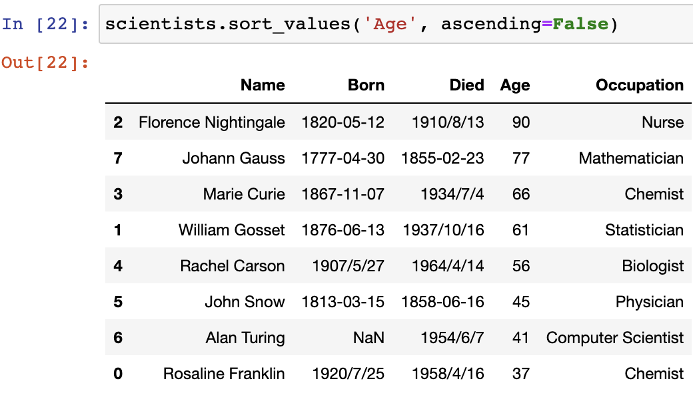

    3）示例：按照行标签从大到小进行排序

    ```python
    # 示例：按照行标签从大到小进行排序
    scientists.sort_index(ascending=False)
    ```

    

    > ##### 补充：Series 也可以使用 sort_values 和 sort_index 函数进行排序，只不过 Series 的 sort_values 方法没有 by 参数

    ```python
    # 按照 Series 数据的值进行排序
    scientists['Age'].sort_values()
    ```

    ```python
    # 按照 Series 数据的标签进行排序，此处为降序
    scientists['Age'].sort_index(ascending=False)
    ```

    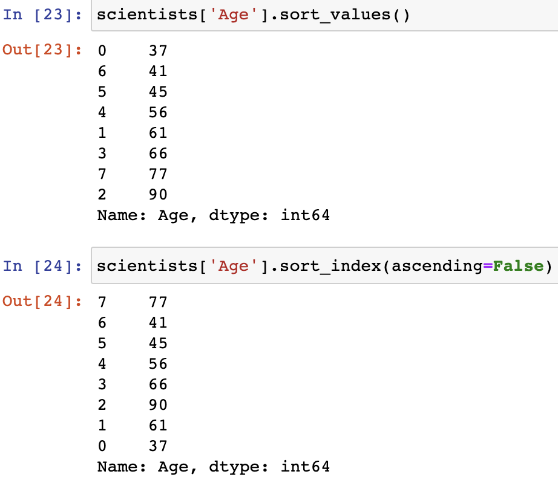

4. ## nlargest和nsmallest函数

      **基本格式**：

    | 方法                       | 说明                                               |
    | -------------------------- | -------------------------------------------------- |
    | `df.nlargest(n, columns)`  | 按照 columns 指定的列进行降序排序，并取前 n 行数据 |
    | `df.nsmallest(n, columns)` | 按照 columns 指定的列进行升序排序，并取前 n 行数据 |

    1）示例：获取 Age 最大的前 3 行数据

    ```python
    # 示例：获取 Age 最大的前 3 行数据
    scientists.nlargest(3, columns='Age')
    ```

    

    2）示例：获取 Age 最小的前 3 行数据

    ```python
    # 示例：获取 Age 最小的前 3 行数据
    scientists.nsmallest(3, columns='Age')
    ```

    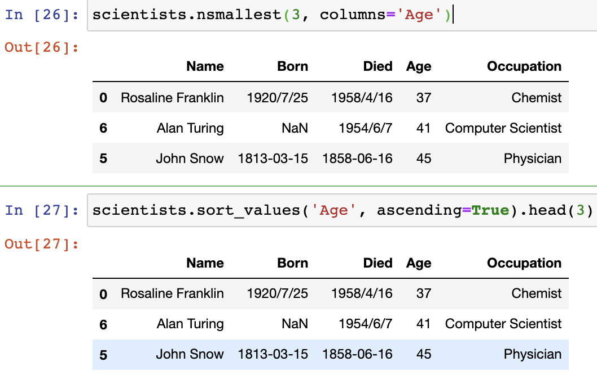

5. ## 基本绘图

      安装 matplotlib 扩展包：

    ```python
    # 注意先进入自己的虚拟环境，然后再安装 matplotlib 扩展包
    pip install matplotlib -i https://pypi.tuna.tsinghua.edu.cn/simple/
    ```

    可视化在数据分析的每个步骤中都非常重要，在理解或清理数据时，可视化有助于识别数据中的趋势，比如我们计算不同职业的科学家的平均寿命：

    ```python
    scientists_avg_age_by_occupation = scientists.groupby('Occupation').Age.mean()
    scientists_avg_age_by_occupation
    ```

    

    可以通过plot函数画图，通过图片更直观的得出结论：

    ```python
    # 设置 jupyter 内嵌 matplotlib 绘图
    %matplotlib inline
    # 绘图
    scientists_avg_age_by_occupation.plot(figsize=(20, 8))
    ```

    

# III. Pandas数据类型

1. ## Pandas数据类型简介

    1. ### Numpy介绍

        > ##### Numpy（Numerical Python）是一个开源的Python科学计算库，用于快速处理任意维度的数组。

        ##### Numpy底层是C语言, 效率及运行速度远远高于list

        1）Numpy 支持常见的数组和矩阵操作

        - 对于同样的数值计算任务，使用 Numpy 比直接使用 Python 要简洁的多

        2）Numpy 使用ndarray对象来处理多维数组，该对象是一个快速而灵活的大数据容器

        思考：使用 Python 列表可以存储一维数组，通过列表的嵌套可以实现存储多维数组，那么为什么还需要使用Numpy的ndarray呢？

        > 答：我们来做一个ndarray与Python原生list运算效率对比，ndarry 计算效率更高
        >
        > Numpy专门针对ndarray的操作和运算进行了设计，所以数组的存储效率和输入输出性能远优于Python中的嵌套列表，数组越大，Numpy的优势就越明显

        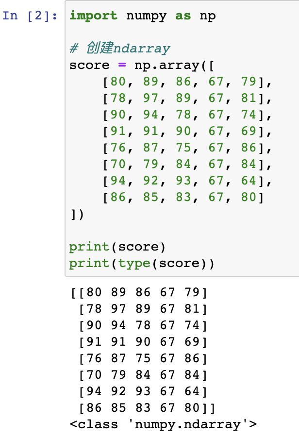

        **Numpy ndarray的优势**：

        1）数据在内存中存储的风格

        - ndarray 在存储数据时所有元素的类型都是相同的，数据内存地址是连续的，批量操作数组元素时速度更快
        - python 原生 list 只能通过寻址方式找到下一个元素，这虽然也导致了在通用性方面 Numpy 的 ndarray 不及python 原生 list，但计算的时候速度就慢了

        2）ndarray 支持并行化运算

        3）Numpy 底层使用 C 语言编写，内部解除了 GIL（全局解释器锁），其对数组的操作速度不受 python 解释器的限制，可以利用CPU的多核心进行运算，效率远高于纯 python 代码

        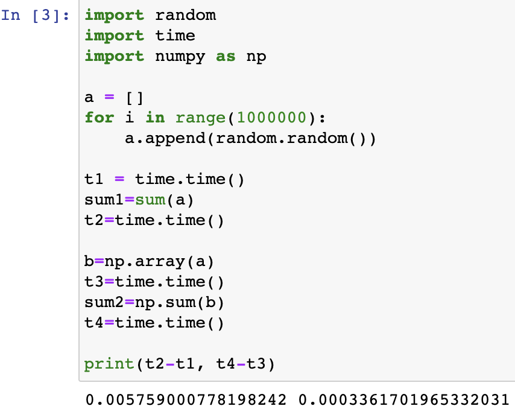

    2. ### Numpy的ndarray

        #### ndarray 的属性

        ##### ndarray的属性清单：

        | 属性             | 说明                       |
        | ---------------- | -------------------------- |
        | ndarray.shape    | 数组维度的元组             |
        | ndarray.ndim     | 数组维数                   |
        | ndarray.size     | 数组中的元素数量           |
        | ndarray.itemsize | 一个数组元素的长度（字节） |
        | ndarray.dtype    | 数组元素的类型             |

        ##### 下表为ndarray的全部数据类型；最常用的类型是布尔和int64，其他只要了解就好：

        | 名称          | 描述                                              | 简写  |
        | ------------- | ------------------------------------------------- | ----- |
        | np.bool       | 用一个字节存储的布尔类型（True或False）           | 'b'   |
        | np.int8       | 一个字节大小，-128 至 127                         | 'i'   |
        | np.int16      | 整数，-32768 至 32767                             | 'i2'  |
        | np.int32      | 整数，-2的31次方 至 2的32次方 -1                  | 'i4'  |
        | np.int64      | 整数，-2的63次方 至 2的63次方 - 1                 | 'i8'  |
        | np.uint8      | 无符号整数，0 至 255                              | 'u'   |
        | np.uint16     | 无符号整数，0 至 65535                            | 'u2'  |
        | np.uint32     | 无符号整数，0 至 2的32次方 - 1                    | 'u4'  |
        | np.uint64     | 无符号整数，0 至 2的64次方 - 1                    | 'u8'  |
        | np.float16    | 半精度浮点数：16位，正负号1位，指数5位，精度10位  | 'f2'  |
        | np.float32    | 单精度浮点数：32位，正负号1位，指数8位，精度23位  | 'f4'  |
        | np.float64    | 双精度浮点数：64位，正负号1位，指数11位，精度52位 | 'f8'  |
        | np.complex64  | 复数，分别用两个32位浮点数表示实部和虚部          | 'c8'  |
        | np.complex128 | 复数，分别用两个64位浮点数表示实部和虚部          | 'c16' |
        | np.object_    | python对象                                        | 'O'   |
        | np.string_    | 字符串                                            | 'S'   |
        | np.unicode_   | unicode类型                                       |       |

        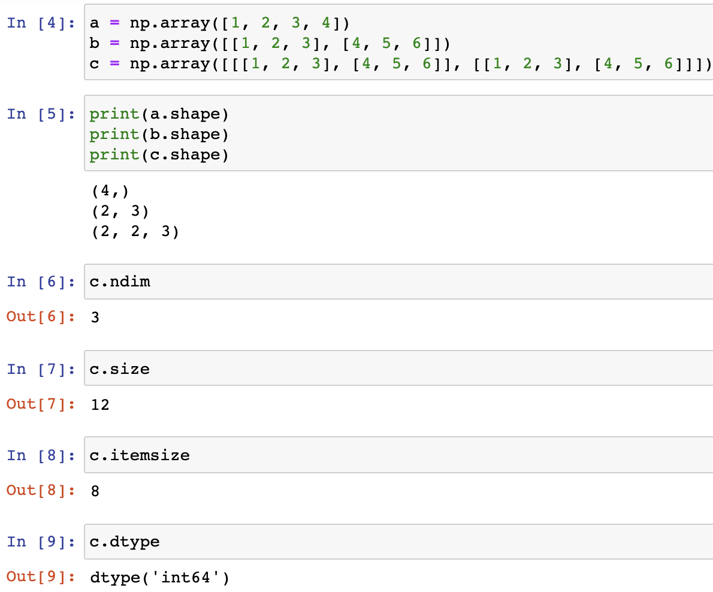

    3. ### Pandas的数据类型

        pandas 是基于 Numpy 的，很多功能都依赖于 Numpy 的 ndarray 实现的，pandas 的数据类型很多与 Numpy 类似，属性也有很多类似。比如 pandas 数据中的 NaN 就是 numpy.nan

        下图中为 pandas 的数据类型清单，其中 category 我们之前的学习中没有见过的：

        - category 是由固定的且有限数量的变量组成的。比如：性别、社会阶层、血型、国籍、观察时段、赞美程度等等。
        - category 类型的数据可以具有特定的顺序。比如：性别分为男、女，血型ABO。我们会在本章节的最后来了解这种数据类型。

        

        我们以 `seaborn` 包中自带的 `tips` 数据集为例，具体来查看数据类型：

        ```python
        import seaborn as sns
        tips = sns.load_dataset('tips')
        tips.head()
        ```

        

        ```python
        # 查看数据类型
        tips.dtypes
        ```

        

2. ## 数据类型转换

    1. #### astype函数

        > ##### astype 方法是通用函数，可用于把 DataFrame 中的任何列转换为其他 dtype，可以向 astype 方法提供任何内置类型或 numpy 类型来转换列的数据类型

    2. #### 转换为字符串对象

        在上面的tips数据中，sex、smoker、day 和 time 变量都是category类型。通常，如果变量不是数值类型，应先将其转换成字符串类型以便后续处理

        有些数据集中可能含有id列，id的值虽然是数字，但对id进行计算（求和，求平均等）没有任何意义，在某些情况下，可能需要把它们转换为字符串对象类型。

        1）把一列的数据类型转换为字符串，可以使用 `astype`方法：

        ```python
        tips['sex_str'] = tips['sex'].astype(str)
        print(tips.dtypes)
        ```

        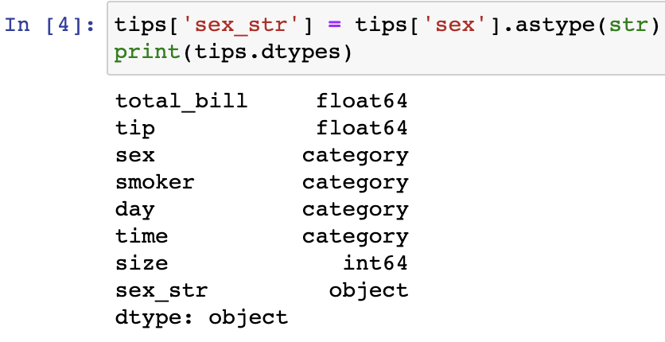

    3. #### 转换为数值类型

        1）为了演示效果，先把`total_bill`列转为`object/str`类型

        ```python
        tips['total_bill'] = tips['total_bill'].astype(str)
        tips.dtypes
        ```

        

        2）再把``object/str`类型的`total_bill`列转为`float64/float`类型

        ```python
        tips['total_bill'] = tips['total_bill'].astype(float)
        tips.dtypes
        ```

        

        #### to_numeric 函数

        > ##### 如果想把变量转换为数值类型（int、float），还可以使用 pandas 的 to_numeric 函数
        >
        > ##### astype 函数要求 DataFrame 每一列的数据类型必须相同，当有些数据中有缺失，但不是 NaN 时（如'missing'、'null'等），会使整列数据变成字符串类型而不是数值型，这个时候可以使用 to_numeric 处理

        1）抽取部分数据，人为制造'missing'作为缺失值的 df 数据

        ```python
        tips_sub_miss = tips.head(10)
        tips_sub_miss.loc[[1, 3, 5, 7], 'total_bill'] = 'missing'
        tips_sub_miss
        ```

        

        2）此时 `total_bill` 列变成了字符串对象类型

        ```
        tips_sub_miss.dtypes
        ```

        

        3）这时使用 `astype` 方法把 `total_bill` 列转换回`float`类型，会抛错，pandas 无法把`'missing'`转换成`float`

        ```python
        # 这句代码会出错
        tips_sub_miss['total_bill'].astype(float)
        ```

        

        4）如果使用 pandas 库中的 `to_numeric` 函数进行转换，默认也会得到类似的错误

        ```python
        # 这句代码也会出错
        pd.to_numeric(tips_sub_miss['total_bill'])
        ```

        

        > to_numeric 函数有一个参数 errors，它决定了当该函数遇到无法转换的数值时该如何处理：
        >
        > 1）默认情况下，该值为 raise，如果 to_numeric 遇到无法转换的值时，会抛错
        >
        > 2）设置为`coerce`：如果 to_numeric 遇到无法转换的值时，会返回NaN
        >
        > 3）设置为`ignore`：如果 to_numeric 遇到无法转换的值时，会放弃转换，什么都不做

        ```python
        pd.to_numeric(tips_sub_miss['total_bill'], errors='coerce')
        ```

        

        ```python
        pd.to_numeric(tips_sub_miss['total_bill'], errors='ignore')
        ```

        

        > to_numeric 函数还有一个 `downcast` 参数，默认是`None`，接受的参数值为`integer`、`signed`、`float` 和 `unsigned`：
        >
        > 1）如果设置了某一类型的数据，那么 pandas 会将原始数据转为该类型能存储的最小子型态
        >
        > 2）如 Pandas 中 float 的子型态有float32、float64，所以设置了downcast='float'，则会将数据转为能够以较少bytes去存储一个浮点数的float32
        >
        > 3）另外，downcast 参数和 errors 参数是分开的，如果 downcast 过程中出错，即使 errors 设置为 ignore 也会抛出异常

        ```python
        # downcast参数设置为float之后, total_bill的数据类型由float64变为float32
        pd.to_numeric(tips_sub_miss['total_bill'], errors='coerce', downcast='float')
        ```

        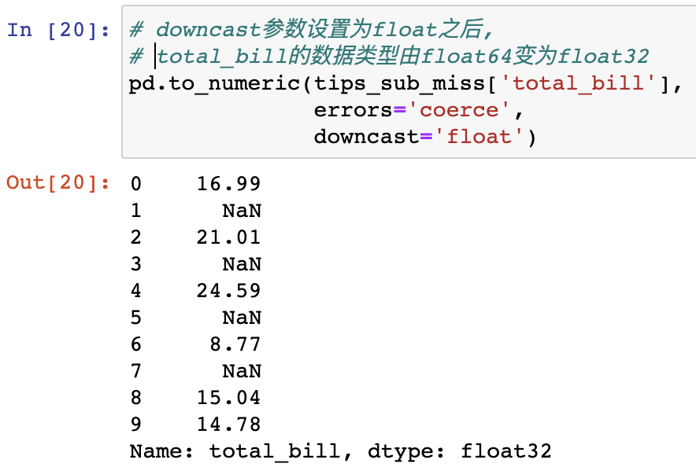

        结果说明：从上面的结果看出，转换之后的数据类型为float32，意味着占用的内存更小了

3. ## 分类数据类型Category

    1. ### category类型转换

      

    2. ### 深入category数据类型

      

4. ## 日期数据类型

    1. ### Python的datetime对象

      

    2. ### pandas中的数据转换成datetime

      

    3. ### 提取datetime的各个部分

      

    4. ### 日期运算和Timedelta

      

    5. ### 日期范围

      

    6. ### 日期序列数据操作

      

# IV. 缺失值处理

1. ## pandas缺失值NaN简介

    

2. ## 加载包含缺失值的数据

    

3. ## 缺失值处理

    1. #### 加载数据并查看缺失情况

        

    2. #### 使用Missingno库对缺失值的情况进行可视化探查

          

    3. #### 缺失值处理

        

    


