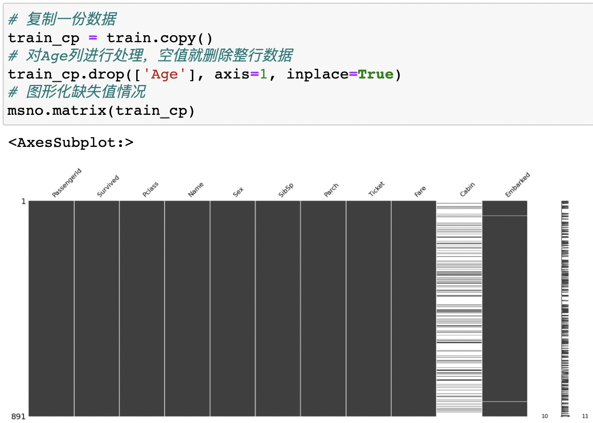
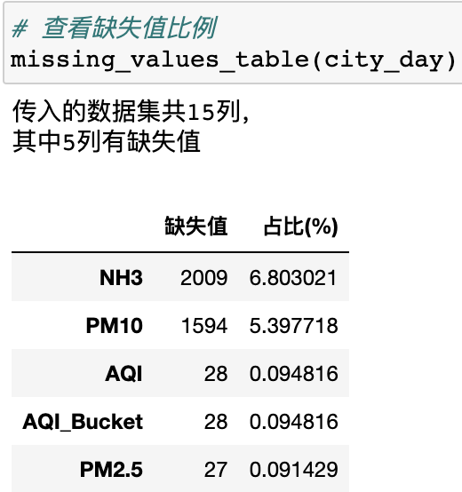
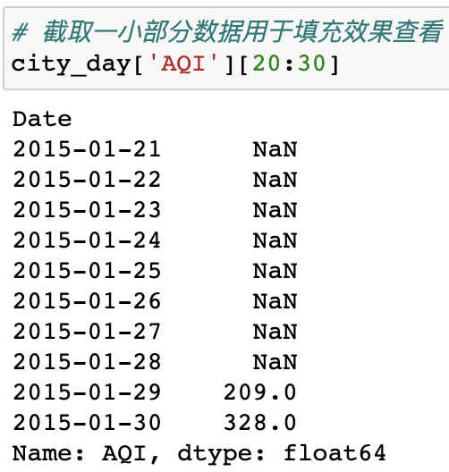
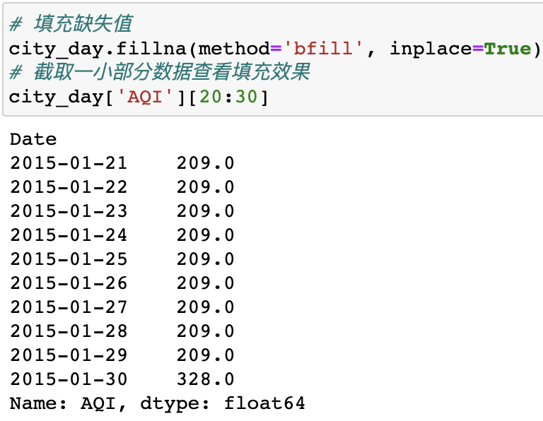

# I. 缺失值处理

1. ## 缺失值处理方式概述

    

2. ## 删除缺失值(不建议使用)

    > 删除缺失值：删除缺失值会损失信息，并不推荐删除，当缺失数据占比较低的时候，可以尝试使用删除缺失值

    1）按行删除：删除指定列为缺失值的行记录

    ```python
    # 复制一份数据
    train_cp = train.copy() 
    # 对Age列进行处理，空值就删除整行数据
    train_cp.dropna(subset=['Age'], how='any', inplace=True)
    # 输出Age列缺失值的总数
    print(train_cp['Age'].isnull().sum())
    # 图形化缺失值情况
    msno.matrix(train_cp)
    ```

    

    补充内容：dropna的参数

    > df.dropna(axis=0, how='any', thresh=None, subset=None, inplace=False)
    >
    > 参数说明：
    >
    > - 可选参数subset：不与thresh参数一起使用：接收一个列表，列表中的元素为列名: 对特定的列进行缺失值删除处理
    > - 可选参数thresh：参数为int类型，按行去除NaN值，去除NaN值后该行剩余数值的数量（列数）大于等于n，便保留这一行
    > - 可选参数axis：默认为0，设置为 0 或 'index' 表示按行删除，设置为 1 或 'columns' 表示按列删除
    > - 可选参数how：默认为'any'，表示如果存在NA值，则删除该行或列，设置为'all'，表示所有值都是NA，则删除该行或列
    > - 可选参数inplace：表示是否修改变原始的数据集，默认为False，可以设置为True

    2）按列删除：当一列包含了很多缺失值的时候（比如超过80%），可以使用df.drop(['列名',..], axis=1)函数将指定列删除，但最好不要删除数据

    ```python
    # 复制一份数据
    train_cp = train.copy() 
    # 对Age列进行处理，空值就删除整行数据
    train_cp.drop(['Age'], axis=1, inplace=True)
    # 图形化缺失值情况
    msno.matrix(train_cp)
    ```

    

    > 注意：Age 列没有了!!!

3. ## 非时序数据填充缺失值

    > 填充缺失值（非时间序列数据）：填充缺失值是指用一个估算的值来去替代缺失值

    1）使用常量来替换（默认值）

    ```python
    # 复制一份数据
    train_constant = train.copy()
    # 计算各列空值总数
    print('填充缺失值之前：')
    print(train_constant.isnull().sum())
    
    # 将空值都填为0，inplace=True为必要参数
    train_constant.fillna(0, inplace=True)
    
    # 计算各列空值总数
    print('填充缺失值之后：')
    print(train_constant.isnull().sum())
    ```

    

    2）使用统计量替换（缺失值所处列的平均值、中位数、众数）

    ```python
    # 复制一份数据
    train_mean = train.copy()
    # 计算年龄的平均值
    age_mean = train_mean['Age'].mean()
    print(age_mean)
    # 使用年龄的平均值填充 Age 列的缺失值
    train_mean['Age'].fillna(age_mean, inplace=True)
    train_mean.isnull().sum()
    ```

    

4. ## 时序数据缺失值处理

    时序数据在某一列值的变化往往有一定线性规律，绝大多数的时序数据，具体的列值随着时间的变化而变化，所以对于有时序的行数据缺失值处理有三种方式：

    - 用时间序列中空值的上一个非空值填充
    - 用时间序列中空值的下一个非空值填充
    - 线性插值方法

    1）加载样例时序数据集 `city_day.csv`，该数据集为印度城市空气质量数据（2015-2020）

    ```python
    city_day = pd.read_csv('./data/city_day.csv', parse_dates=True, index_col='Date')
    # 复制一份数据
    city_day_cp = city_day.copy()
    # 查看数据的前 5 行
    city_day_cp.head()
    ```

    

    2）用之前封装的方法（本章3.2.2小节），查看数据缺失情况：

    ```python
    city_day_missing = missing_values_table(city_day_cp)
    city_day_missing
    ```

    

    结果说明：

    - 我们可以观察到数据中有很多缺失值，比如Xylene有超过60%的缺失值（二甲苯），PM10 有超过30%的缺失值

    3）使用`fillna`函数中的`ffill`参数，用时间序列中空值的上一个非空值填充

    ```python
    # 截取一小部分数据用于填充效果查看
    city_day['Xylene'][50:64]
    ```

    

    ```python
    # 填充缺失值
    city_day.fillna(method='ffill', inplace=True)
    # 截取一小部分数据查看填充效果
    city_day['Xylene'][50:64]
    ```

    

    4）上面填充了缺失值之后，再次查看缺失值情况

    ```python
    # 查看缺失值比例
    missing_values_table(city_day)
    ```

    

    5）使用`fillna`函数中的`bfill`参数，用时间序列中空值的下一个非空值填充

    ```python
    # 截取一小部分数据用于填充效果查看
    city_day['AQI'][20:30]
    ```

    

    ```python
    # 填充缺失值
    city_day.fillna(method='bfill', inplace=True)
    # 截取一小部分数据查看填充效果
    city_day['AQI'][20:30]
    ```

    

    6）上面填充了缺失值之后，再次查看缺失值情况

    ```python
    # 查看缺失值比例
    missing_values_table(city_day)
    ```

    

    7）使用`df.interpolate(limit_direction="both", inplace=True)` 对缺失数据进行线性填充

    - 绝大多数的时序数据，具体的列值随着时间的变化而变化。 因此，使用bfill和ffill进行插补并不是解决缺失值问题的最优方案。
    - 线性插值法是一种插补缺失值技术，它假定数据点之间存在严格的线性关系，并利用相邻数据点中的非缺失值来计算缺失数据点的值

    ```python
    # 截取一小部分数据用于填充效果查看
    city_day_cp['Xylene'][50:65]
    ```

    

    ```python
    # 线性插值填充
    city_day_cp.interpolate(limit_direction='both', inplace=True)
    # 截取一小部分数据用于查看填充效果
    city_day_cp['Xylene'][50:65]
    ```

    

5. ## 其它填充缺失值的方法

    > ##### 上面介绍的线性填充缺失值的方法，其本质就是机器学习算法预测；当然还有其他机器学习算法可以用来做缺失值的计算，绝大多数场景只需要我们掌握上述缺失值填充的办法即可；一旦无法用上述办法来解决问题，那么将交由算法工程师来解决

# II. 