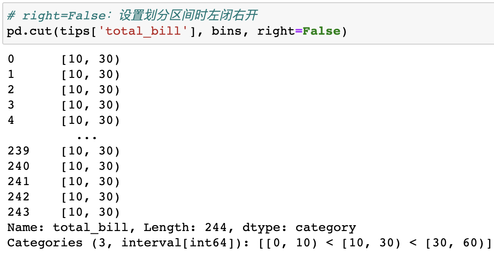
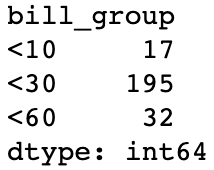

# I. 数据分组

1. ## 数据划分区间(cut函数)

    可以使用 pandas 中的 cut 函数将传递的数据划分成几个区间。

    | 方式                                           | 说明                                                         |
    | ---------------------------------------------- | ------------------------------------------------------------ |
    | `pandas.cut(x, bins, right=True, labels=None)` | 将 x 中的每个数据划分到指定的区间： * x：待划分区间的数据，一维数据，可以是Series * bins：list，直接划分时每个区间的边界值 * right：划分区间时，默认左开右闭，设置为False，则表示左闭右开 * labels：可选项，指定每个区间的显示 label |

    1）加载 tips.csv 数据

    ```python
    tips = pd.read_csv('./data/tips.csv')
    tips
    ```

    

    ```python
    # 查看数据列的信息
    tips.info()
    ```

    

    ```python
    # 查看数据中 total_bill 列的统计值
    tips['total_bill'].describe()
    ```

    

    2）将 tips 数据按照 total_bill 列的值划分为 3 个区间：`0-10、10-30、30-60`

    ```python
    # 指定划分区间的边界值
    bins = [0, 10, 30, 60]
    pd.cut(tips['total_bill'], bins)
    ```

    

    ```python
    # right=False：设置划分区间时左闭右开
    pd.cut(tips['total_bill'], bins, right=False)
    ```

    

    ```python
    # 设置划分区间的 labels
    labels = ['<10', '<30', '<60']
    pd.cut(tips['total_bill'], bins, right=False, labels=labels)
    ```

    

    ```python
    # 在 tips 数据中增加消费金额区间这一列
    tips['bill_group'] = pd.cut(tips['total_bill'], bins, right=False, labels=labels)
    tips
    ```

    

    3）按照消费区间列统计每组消费数据的数目

    ```python
    # 按照消费区间列统计每组消费数据的数目
    tips.groupby('bill_group').size()
    ```

    

# II. 数据整理

1. ## melt/pivot整理数据

    1. ### melt函数功能演示

        

    2. ### melt函数的参数

        

    3. ### pivot函数功能演示

        

2. ## stack/unstack整理数据

    

3. ## wide_to_long整理数据

    

# III. 数据透视表

1. ## pandas透视表概述

    

# IV. 数据导入和导出

1. ## 常见数据的导入和导出

    

# V. Python数据可视化

1. ## Matplotlib绘图

    