# I. pandas绘图

1. ## pandas数据可视化简介

    > pandas库是Python数据分析的核心库

    1）它不仅可以加载和转换数据，还可以可视化

    2）DataFrame 对象或 Series 对象直接调用`plot()`函数即可绘图

    > plot 默认为折线图，折线图也是最常用和最基础的可视化图形，足以满足我们日常 80% 的需求：
    >
    > ```
    > df.plot()
    > s.plot()
    > ```

    我们可以在 plot 后增加调用来使用其他的图形，当然这些图形对数据结构也有自己的要求，教程后边会逐个介绍：

    ```python
    df.plot.line() # 折线图的全写方式
    df.plot.bar() # 条形图(柱状图)
    df.plot.barh() # 条形图(横向柱状图)
    df.plot.hist() # 直方图
    df.plot.box() # 箱形图
    df.plot.kde() # 核密度估计图
    df.plot.density() # 同 df.plot.kde()
    df.plot.area() # 面积图
    df.plot.pie() # 饼图
    df.plot.scatter() # 散点图
    df.plot.hexbin() # 六边形箱体图，或简称六边形图
    ```

    Pandas 处理的结果可视化，建议直接用 Seaborn 绘图，具体 Pandas 的可视化可以参考如下文档

    <https://www.gairuo.com/p/pandas-plot>

# II. seaborn绘图

1. ## seaborn简介

    seaborn 是基于 matplotlib 的图形可视化 python 包。它提供了一种高度交互式界面，便于用户能够做出各种有吸引力的统计图表。

    1）seaborn 是在 matplotlib 的基础上进行了更高级的 API 封装，从而使得作图更加容易，在大多数情况下使用seaborn 能做出很具有吸引力的图，而使用 matplotlib 就能制作具有更多特色的图

    2）seaborn和 pandas 的 API 配合的很好，使用 DataFrame/Series 的数据就可以绘图  

2. ## seaborn绘图

    1）加载 `tips` 数据集类

    ```python
    tips = sns.load_dataset('tips')
    tips
    ```

    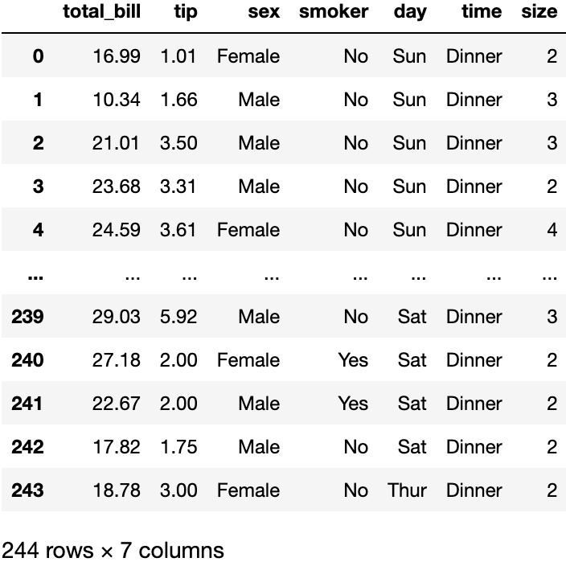

    ### 2.1 单变量绘图

    **直方图 vs 密度图**

    1）查看客户消费金额 total_bill 的分布情况

    ```python
    # 绘制直方图
    sns.histplot(tips, x='total_bill')
    ```

    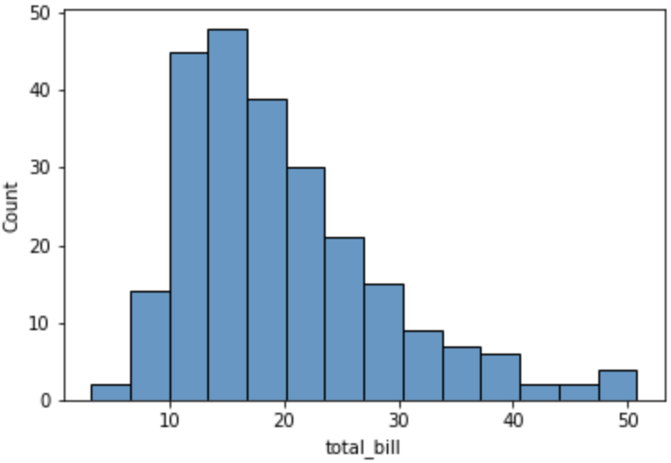

    ```python
    # 绘制密度图
    sns.kdeplot(tips['total_bill'])
    ```

    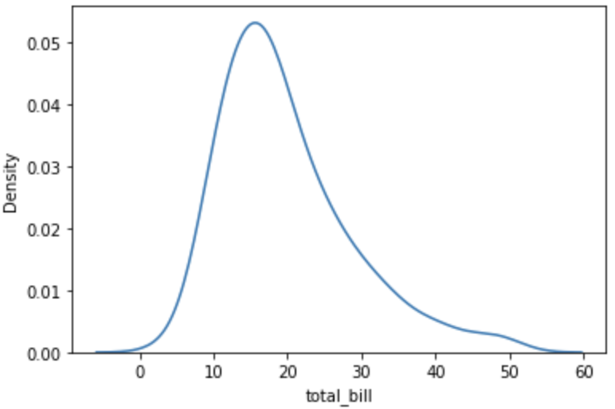

    ```python
    # 绘制直方图+密度曲线
    sns.histplot(tips, x='total_bill', bins=10, kde=True)	# bins: 分多少个区间
    ```

    

    **箱线图**：

    ```python
    # 绘制箱线图
    sns.boxplot(y='total_bill', data=tips)
    ```

    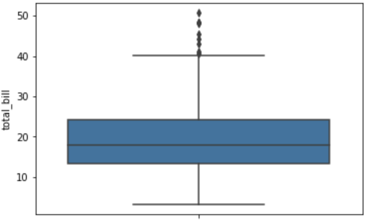

    **小提琴图**：

    ```python
    # 绘制小提琴图
    sns.violinplot(y='total_bill', data=tips)
    ```

    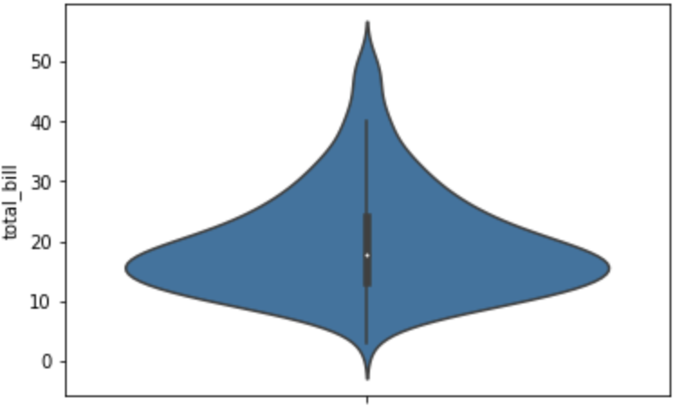

    **条形图**：

    1）按照 day(周几) 统计每天的消费数量

    ```bash
    # 按照 day(周几) 统计每天的消费数量
    result = tips['day'].value_counts()
    
    # 绘制条形图
    sns.barplot(x=result.index, y=result.values)
    ```

    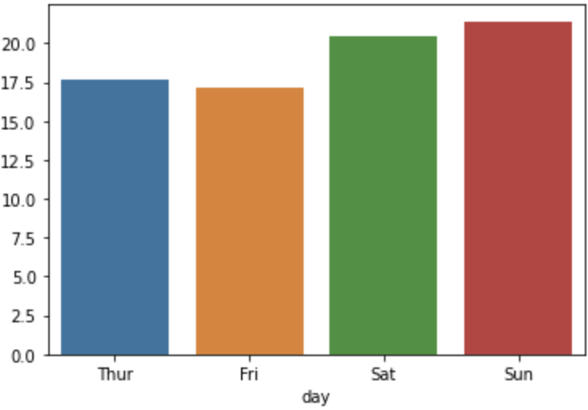

    ```python
    # 绘制条形图(计数图)
    sns.countplot(x='day', data=tips)
    ```

    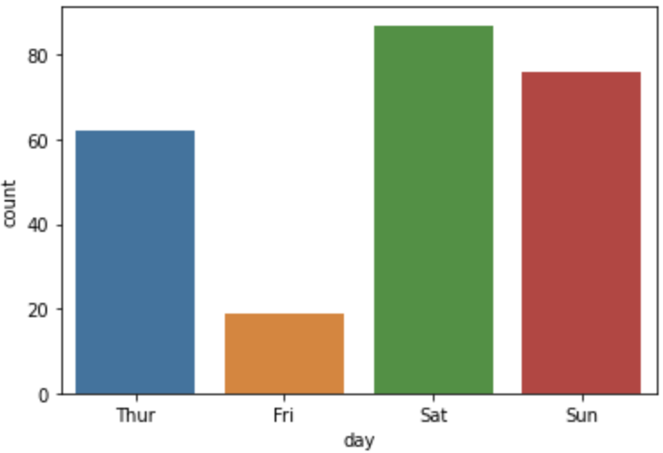

    **饼图**：

    > 注：seaborn 没有提供绘制饼图的方法，可以使用 matplotlib 或 pandas 的方法绘制饼图。

    ### 2.3.2 双变量绘图

    **散点图**

    1）查看消费数据中消费tip随着消费金额total_bill的变化情况

    ```python
    # 绘制散点图
    sns.scatterplot(x='total_bill', y='tip', data=tips)
    ```

    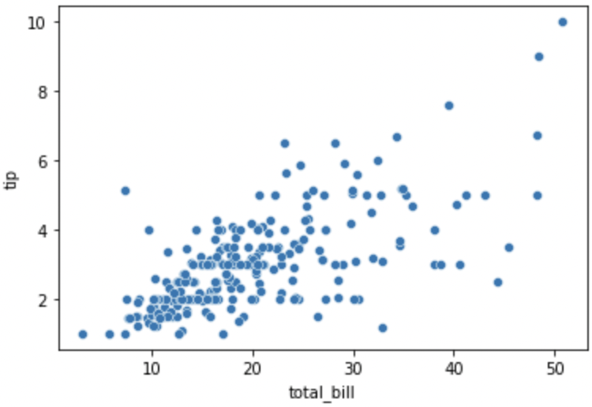

    **蜂巢图**：

    ```python
    # 绘制蜂巢图
    sns.jointplot(x='total_bill', y='tip', data=tips, kind='hex')
    ```

    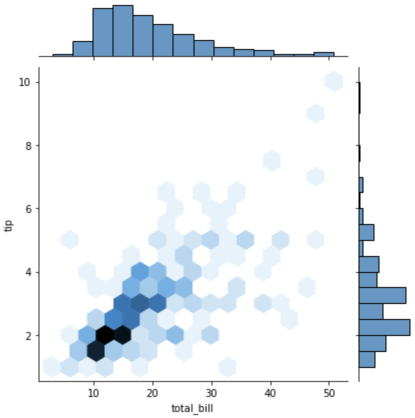

    **条形图**：

    1）按 day(周几) 统计每餐消费的平均值并绘图

    ```python
    # 按 day(周几) 统计每餐消费的平均值
    result = tips.groupby('day').total_bill.mean()
    # 绘制条形图
    sns.barplot(x=result.index, y=result.values)
    ```

    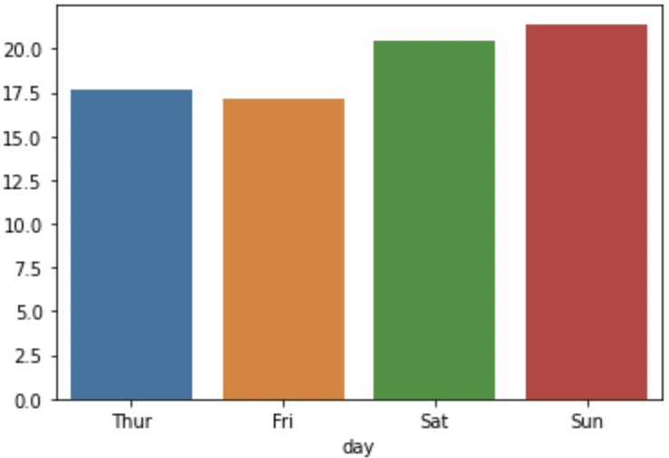

    ```python
    # 绘制条形图
    sns.barplot(x='day', y='total_bill', data=tips)
    ```

    

    **折线图**：

    ```python
    # 按 day(周几) 统计每餐消费的平均值
    result = tips.groupby('day').total_bill.mean()
    # 绘制折线图
    sns.lineplot(x=result.index, y=result.values)
    ```

    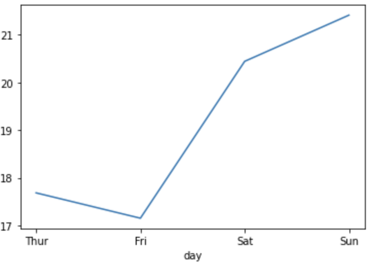

    ```python
    # 绘制折线图
    sns.lineplot(x='day', y='total_bill', data=tips)
    ```

    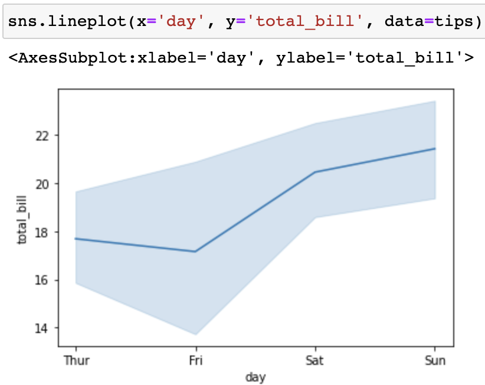

    ### 2.3.3 多变量绘图

    **散点图**：

    1）查看不同性别的消费客户中，消费 tip 随着消费金额 total_bill 的变化情况

    ```python
    # 绘制散点图，同时 hue 指定列对绘制的点进行分类，用不同的颜色表示
    sns.scatterplot(x='total_bill', y='tip', data=tips, hue='sex')
    ```

    

    2）查看不同性别的消费客户中，消费金额 total_bill 随着 day 的变化情况

    ```python
    import matplotlib.pyplot as plt
    fig = plt.figure(figsize=(8, 7))
    axes = fig.subplots(1, 1)
    # 绘制折线图
    sns.lineplot(x='day', y='total_bill', data=tips, hue='sex', ax=axes)
    ```

    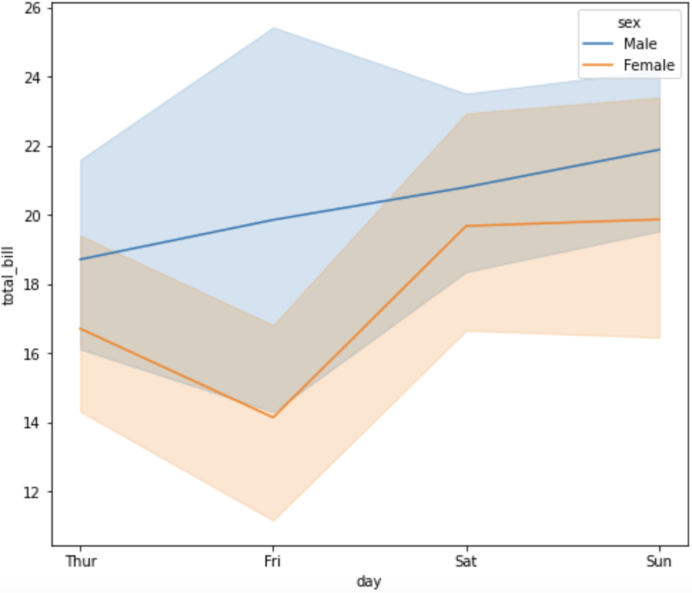

# III. pyecharts绘图

1. ## echarts和pyecharts简介

    **echarts 简介**:

    - echarts 是一个使用 JavaScript 实现的开源可视化库，涵盖各行业图表，满足各种需求
    - echarts 遵循 Apache-2.0 开源协议，免费商用
    - echarts 兼容当前绝大部分浏览器（IE8/9/10/11、Chrome、Firefox、Safari等）及兼容多种设备，可随时随地任性展示

    **pyecharts 简介**：

    - pyecharts 是一个用于生成 echarts 图表的 Python 开源类库
    - 使用 echarts 的绘图效果比 matplotlib 等更加炫酷

2. ## pyecharts绘图案例

    由于前面的内容基本已经介绍了常用可视化图表和各自的特点，下面通过一个案例来介绍 Pyecharts 的使用：

    > 案例中使用的 pyecharts 版本是 1.6.0 ，pyecharts 0.X版本和 1.X版本 API 变化较大，不能向下兼容，网上查资料的时候需要注意

    **直方图**：

    参考文档：<https://gallery.pyecharts.org/#/Bar/bar_xyaxis_name> ，更加详细的 API 可以参考 pyecharts 的[官方文档](https://pyecharts.org/#/zh-cn/intro)和[案例](https://gallery.pyecharts.org/#/README)

    1）按 day(周几) 统计每餐消费的平均值并进行可视化

    ```python
    from pyecharts import options as opts
    from pyecharts.charts import Bar
    
    # 按 day(周几) 统计每餐消费的平均值
    result = tips.groupby('day').total_bill.mean()
    
    c = (
        Bar()
        .add_xaxis(result.index.tolist()) # 需要将 result.index 转换为列表
        .add_yaxis("平均消费金额", result.values.tolist()) # 需要将 result.values 转换为列表
        .set_global_opts(
            title_opts=opts.TitleOpts(title="用餐平均消费(按周几)"),
            yaxis_opts=opts.AxisOpts(name="平均消费金额"),
            xaxis_opts=opts.AxisOpts(name="周几"),
        )
    )
    # 在 jupyter notebook 中绘制图形，显示需要调用 render_notebook 方法
    c.render_notebook()
    ```

    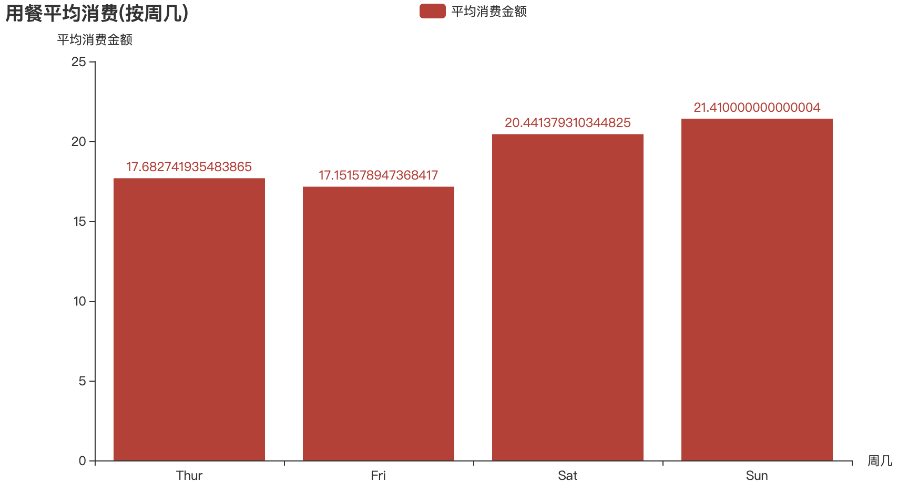

# IV. RFM用户分群分析

> 会员价值度用来评估用户的价值情况，是区分会员价值的重要模型和参考依据，也是衡量不同营销效果的关键指标之一。

价值度模型一般基于交易行为产生，衡量的是有实体转化价值的行为。常用的价值度模型是：**RFM**

1. ## 会员价值度模型介绍

    **什么是 RFM 模型？**

    RFM 模型是根据会员：

    - 最近一次购买时间R（Recency）
    - 购买频率F（Frequency）
    - 购买金额M（Monetary）

    计算得出 RFM 得分，通过这 3 个维度来评估客户的订单活跃价值，常用来做客户分群或价值区分

    | R    | F    | M    | 用户类别     |
    | ---- | ---- | ---- | ------------ |
    | 高   | 高   | 高   | 重要价值用户 |
    | 高   | 低   | 高   | 重要发展用户 |
    | 低   | 高   | 高   | 重要保持用户 |
    | 低   | 低   | 高   | 重要挽留用户 |
    | 高   | 高   | 低   | 一般价值用户 |
    | 高   | 低   | 低   | 一般发展用户 |
    | 低   | 高   | 低   | 一般保持用户 |
    | 低   | 低   | 低   | 一般挽留用户 |

    > 注：RFM模型基于一个固定时间点来做模型分析，不同时间计算的的RFM结果可能不一样

    **RFM 模型的基本实现过程**：

    1）设置要做计算时的截止时间节点(例如：2017-5-30)，用来做基于该时间的数据选取和计算

    2）在会员数据库中，以今天为时间界限向前推固定周期(例如：1年)，得到包含每个会员的会员ID、订单时间、订单金额的原始数据集

    - 一个会员可能会产生多条订单记录

    3）数据预计算

    - 从订单时间中找到各个会员距离截止时间节点最近的订单时间作为最近购买时间R
    - 以会员ID为维度统计每个用户的订单数量作为购买频率F
    - 将用户多个订单的订单金额求和得到总订单金额M
    - 由此得到R、F、M三个原始数据量

    4）R、F、M分区

    - 对于 F 和 M 变量来讲，值越大代表购买频率越高、订单金额越高
    - 但对 R 来讲，值越小代表离截止时间节点越近，因此值越好
    - 对R、F、M分别使用五分位（三分位也可以，分位数越多划分得越详细）法做数据分区
    - 需要注意的是，对于R来讲需要倒过来划分，离截止时间越近的值划分越大
    - 这样就得到每个用户的R、F、M三个变量的分位数值

    5）将 3 个值组合或相加得到总的 RFM 得分

    - 方式1：直接将3个值拼接到一起。例如：RFM得分为312、333、132
    - 方式2：直接将 3 个值相加求得一个新的汇总值。例如：RFM得分为6、9、6

    ### 1.2 Excel 实现 RFM 划分案例

    **以某电商公司为例**：

    - R：例如：正常新用户注册1周内交易，7天是重要的值，日用品采购周期是1个月，30天是重要的值
    - F：例如：1次购买、2次购买、3次购买、4~10次、10次以上
    - M：例如：客单价300，热销单品价格240 等

    **常见的确定 RFM 划分区间的套路**：

    - 业务实际判断
    - 平均值或中位数
    - 二八法则

    **RFM 划分过程**：

    1）提取用户最近一次的交易时间，算出距离计算时间的差值

    > 获取当前时间=TODAY()

    

    2）计算最近一次交易时间距当前时间的间隔

    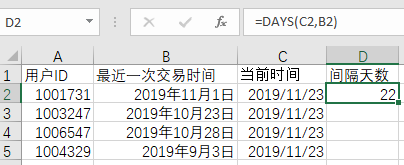

    3）根据间隔天数长短赋予对应的 R 值

    > =IF(D2>60,1,IF(D2>30,2,IF(D2>14,3,IF(D2>7,4,5))))

    

    4）从历史数据中取出所有用户的购买次数，根据次数多少赋予对应的 F 值

    > =IF(E2>10,5,IF(E2>3,4,IF(E2>2,3,IF(E2>1,2,1))))

    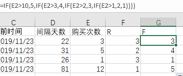

    5）从历史数据中汇总，求得该用户的交易总额，根据金额大小赋予对应的 M 值

    > =IF(F2>1000,5,IF(F2>500,4,IF(F2>300,3,IF(F2>230,2,1))))

    

    6）求出 RFM的 中值，例如中位数，用中值和用户的实际值进行比较，高于中值的为高，否则为低

    

    7）在得到不同会员的RFM之后，根据步骤 5 产生的两种结果有两种应用思路：

    > 思路1：基于3个维度值做用户群体划分和解读，对用户的价值度做分析

    - 得分为212的会员往往购买频率较低，针对购买频率低的客户应定期发送促销活动邮件
    - 得分为321的会员虽然购买频率高但是订单金额低等，这些客户往往具有较高的购买黏性，可以考虑通过关联或搭配销售的方式提升订单金额。

    > 思路2：基于RFM的汇总得分评估所有会员的价值度价值，并可以做价值度排名。同时，该得分还可以作为输入维度与其他维度一起作为其他数据分析和挖掘模型的输入变量，为分析建模提供基础

2. ## RFM计算案例

    > ### 明确需求是第一步

    1. ### 案例背景

        > 用户价值细分是了解用户价值度的重要途径，针对交易数据分析的常用模型是 RFM 模型

        **业务对 RFM 的结果要求**:

        - 对用户做分组
        - 将每个组的用户特征概括和总结出来，便于后续精细化运营不同的客户群体，且根据不同群体做定制化或差异性的营销和关怀

        **规划目标将RFM的3个维度分别做3个区间的离散化**：

        - 用户群体最大有3×3×3=27个
        - 划分区间过多则不利于用户群体的拆分
        - 区间过少则可能导致每个特征上的用户区分不显著

        **交付结果**：

        - 给业务部门做运营的分析结果要导出为 Excel 文件，用于做后续分析和二次加工使用
        - RFM 的结果还会供其他模型的建模使用，RFM 本身的结果可以作为新的局部性特征，因此数据的输出需要有本地文件和写数据库两种方式

        **数据说明**：

        - 选择近 4 年订单数据，从不同的年份对比不同时间下各个分组的绝对值变化情况，方便了解会员的波动
        - 案例的输入源数据`sales.xlsx`
        - 程序输出RFM得分数据写入本地文件`sales_rfm_score.xlsx`和MySQL数据库`sales_rfm_score`表中

    2. ### 用到的技术点

        通过 Python 代码手动实现 RFM 模型，主要用到的库包括：

        - time、numpy和pandas
        - 在结果展示时使用了pyecharts 的 3D 柱形图

    3. ### 案例数据

        > 案例数据是某企业从 2015 年到 2018 年共 4 年的用户订单抽样数据，数据来源于销售系统

        1）数据在 Excel 中包含 5 个 sheet

        - 前 4 个 sheet 以年份为单位存储为单个 sheet 中，包含了某企业从 2015 年到 2018 年共 4 年的用户订单抽样数据
        - 第 5 个 sheet 为会员等级表，所有会员的会员ID对应会员等级的情况

        2）前 4 张表的数据概要如下：

        - 特征变量数：4
        - 数据记录数：30774/41278/50839/81349
        - 是否有NA值：有
        - 是否有异常值：有

        3）具体数据特征如下：

        **用户订单表字段**：

        | 字段     | 说明                           |
        | -------- | ------------------------------ |
        | 会员ID   | 每个会员的ID唯一，整型         |
        | 提交日期 | 订单日提交日期                 |
        | 订单号   | 订单ID，每个订单的ID唯一，整型 |
        | 订单金额 | 订单金额，浮点型数据           |

        **会员等级表字段**：

        | 字段     | 说明                                   |
        | -------- | -------------------------------------- |
        | 会员ID   | 该ID可与前面的订单表中的会员ID关联     |
        | 会员等级 | 会员等级以数字区分，数字越大，级别越高 |

    4. ### 代码实现

        1. #### 加载数据

            1）导入模块

            ```python
            import pandas as pd
            import numpy as np
            import time
            import pymysql
            
            from pyecharts.charts import Bar3D
            ```

            用到了5个库：time、numpy、pandas、pymysql和pyecharts

            - time：用来记录插入数据库时的当前日期
            - numpy：用来做基本数据处理等
            - pandas：有关日期转换、数据格式化处理、主要RFM计算过程等
            - pymysql：数据库连接工具，读写 MySQL 数据库。
            - pyecharts：展示 3D 柱形图

            2）读取数据

            ```python
            sheet_names = ['2015', '2016', '2017', '2018', '会员等级']
            sheet_datas = [pd.read_excel('./data/sales.xlsx', sheet_name=i) for i in sheet_names]
            ```

            3）查看数据基本情况

            ```python
            for each_name, each_data in zip(sheet_names, sheet_datas):
                print('[data summary for ============={}===============]'.format(each_name))
                print('Overview:', '\n', each_data.head(4))# 展示数据前4条
                print('DESC:', '\n', each_data.describe())# 数据描述性信息
                print('NA records', each_data.isnull().any(axis=1).sum()) # 缺失值记录数    
                print('Dtypes', each_data.dtypes) # 数据类型
            ```

            **输出结果**：

            ```python
            [data summary for =============2015===============]
            Overview: 
                       会员ID         订单号       提交日期    订单金额
            0  15278002468  3000304681 2015-01-01   499.0
            1  39236378972  3000305791 2015-01-01  2588.0
            2  38722039578  3000641787 2015-01-01   498.0
            3  11049640063  3000798913 2015-01-01  1572.0
            DESC: 
                            会员ID           订单号           订单金额
            count  3.077400e+04  3.077400e+04   30774.000000
            mean   2.918779e+10  4.020414e+09     960.991161
            std    1.385333e+10  2.630510e+08    2068.107231
            min    2.670000e+02  3.000305e+09       0.500000
            25%    1.944122e+10  3.885510e+09      59.000000
            50%    3.746545e+10  4.117491e+09     139.000000
            75%    3.923593e+10  4.234882e+09     899.000000
            max    3.954613e+10  4.282025e+09  111750.000000
            NA records 0
            Dtypes 会员ID             int64
            订单号              int64
            提交日期    datetime64[ns]
            订单金额           float64
            dtype: object
            [data summary for =============2016===============]
            Overview: 
                       会员ID         订单号       提交日期    订单金额
            0  39288120141  4282025766 2016-01-01    76.0
            1  39293812118  4282037929 2016-01-01  7599.0
            2  27596340905  4282038740 2016-01-01   802.0
            3  15111475509  4282043819 2016-01-01    65.0
            DESC: 
                            会员ID           订单号           订单金额
            count  4.127800e+04  4.127800e+04   41277.000000
            mean   2.908415e+10  4.313583e+09     957.106694
            std    1.389468e+10  1.094572e+07    2478.560036
            min    8.100000e+01  4.282026e+09       0.100000
            25%    1.934990e+10  4.309457e+09      59.000000
            50%    3.730339e+10  4.317545e+09     147.000000
            75%    3.923182e+10  4.321132e+09     888.000000
            max    3.954554e+10  4.324911e+09  174900.000000
            NA records 1
            Dtypes 会员ID             int64
            订单号              int64
            提交日期    datetime64[ns]
            订单金额           float64
            dtype: object
            [data summary for =============2017===============]
            Overview: 
                       会员ID         订单号       提交日期    订单金额
            0  38765290840  4324911135 2017-01-01  1799.0
            1  39305832102  4324911213 2017-01-01   369.0
            2  34190994969  4324911251 2017-01-01   189.0
            3  38986333210  4324911283 2017-01-01   169.0
            DESC: 
                            会员ID           订单号           订单金额
            count  5.083900e+04  5.083900e+04   50839.000000
            mean   2.882368e+10  4.332466e+09     963.587872
            std    1.409416e+10  4.404350e+06    2178.727261
            min    2.780000e+02  4.324911e+09       0.300000
            25%    1.869274e+10  4.328415e+09      59.000000
            50%    3.688044e+10  4.331989e+09     149.000000
            75%    3.923020e+10  4.337515e+09     898.000000
            max    3.954554e+10  4.338764e+09  123609.000000
            NA records 0
            Dtypes 会员ID             int64
            订单号              int64
            提交日期    datetime64[ns]
            订单金额           float64
            dtype: object
            [data summary for =============2018===============]
            Overview: 
                       会员ID         订单号       提交日期    订单金额
            0  39229691808  4338764262 2018-01-01  3646.0
            1  39293668916  4338764363 2018-01-01  3999.0
            2  35059646224  4338764376 2018-01-01    10.1
            3      1084397  4338770013 2018-01-01   828.0
            DESC: 
                            会员ID           订单号           订单金额
            count  8.134900e+04  8.134900e+04   81348.000000
            mean   2.902317e+10  4.348372e+09     966.582792
            std    1.404116e+10  4.183774e+06    2204.969534
            min    2.780000e+02  4.338764e+09       0.000000
            25%    1.902755e+10  4.345654e+09      60.000000
            50%    3.740121e+10  4.349448e+09     149.000000
            75%    3.923380e+10  4.351639e+09     899.000000
            max    3.954614e+10  4.354235e+09  174900.000000
            NA records 1
            Dtypes 会员ID             int64
            订单号              int64
            提交日期    datetime64[ns]
            订单金额           float64
            dtype: object
            [data summary for =============会员等级===============]
            Overview: 
                       会员ID  会员等级
            0       100090     3
            1  10012905801     1
            2  10012935109     1
            3  10013498043     1
            DESC: 
                            会员ID           会员等级
            count  1.543850e+05  154385.000000
            mean   2.980055e+10       2.259701
            std    1.365654e+10       1.346408
            min    8.100000e+01       1.000000
            25%    2.213894e+10       1.000000
            50%    3.833022e+10       2.000000
            75%    3.927932e+10       3.000000
            max    3.954614e+10       5.000000
            NA records 0
            Dtypes 会员ID    int64
            会员等级    int64
            dtype: object
            ```

            **结果说明**：

            - 每个 sheet 中的数据都能正常读取，无任何错误
            - 日期列(提交日期)已经被自动识别为日期格式，后期不必转换
            - 订单金额的分布是不均匀的，里面有明显的极大值
                - 例如2016年的数据中，最大值为174900，最小值仅为0.1
                - 极大极小值相差过大，数据会受极值影响
            - 订单金额中的最小值包括0、0.1这样的金额，可能为非正常订单，与业务方沟通后确认
                - 最大值的订单金额有效，通常是客户一次性购买多个大家电商品
                - 而订单金额为 0.1 元这类使用优惠券支付的订单，没有实际意义
                - 除此之外，所有低于 1 元的订单均有这个问题，因此需要在后续处理中去掉
            - 有的表中存在缺失值记录，但数量不多，选择丢弃或填充均可

        2. #### 数据预处理

            1）缺失值、异常值处理

            ```python
            # 去除缺失值和异常值
            for i, each_data in enumerate(sheet_datas[:-1]):
                sheet_datas[i] = each_data.dropna()
                sheet_datas[i] = each_data[each_data['订单金额'] > 1]
                sheet_datas[i]['max_year_date'] = each_data['提交日期'].max()
            ```

            **代码说明**：

            - 通过 for 循环配合 enumerate 方法，获得每个可迭代元素的索引和具体值
            - 处理缺失值和异常值只针对订单数据，因此 sheet_datas 通过索引实现不包含最后一个对象（即会员等级表）
            - 直接将 each_data 使用 dropna 丢弃缺失值后的 dataframe 代原来 sheet_datas 中的 dataframe
            - 使用`each_data[each_data['订单金额']>1]`来过滤出包含`订单金额>1`的记录数，然后替换原来sheet_datas中的dataframe
            - 最后一行代码的目的是在每个年份的数据中新增一列max_year_date，通过`each_data['提交日期'].max()`获取一年中日期的最大值，这样方便后续针对每年的数据分别做RFM计算，而不是针对4年的数据统一做RFM计算

            2）合并四年的用户订单数据

            ```python
            # 汇总所有数据
            data_merge = pd.concat(sheet_datas[:-1])
            data_merge
            ```

            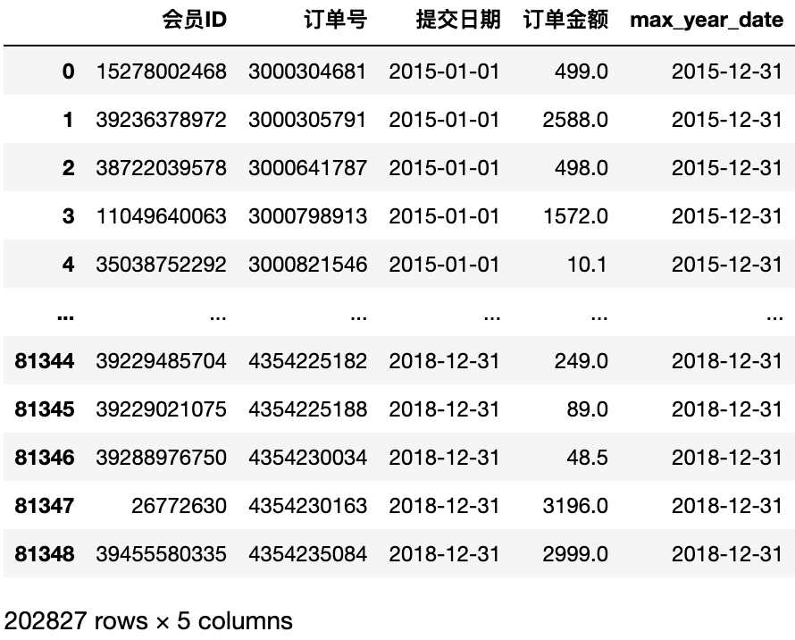

            **代码说明**：

            - 汇总所有数据：将 4 年的数据使用pd.concat方法合并为一个完整的DataFrame `data_merge`，后续的所有计算都能基于同一个DataFrame进行，而不用写循环代码段对每个年份的数据单独计算

            3）订单数据处理：增加`date_interval` 和 `year` 两列

            ```python
            # 获取各自年份数据
            data_merge['date_interval'] = data_merge['max_year_date'] - data_merge['提交日期']
            data_merge['year'] = data_merge['提交日期'].dt.year
            # 转换日期间隔为数字
            data_merge['date_interval'] = data_merge['date_interval'].apply(lambda x: x.days)
            data_merge
            ```

            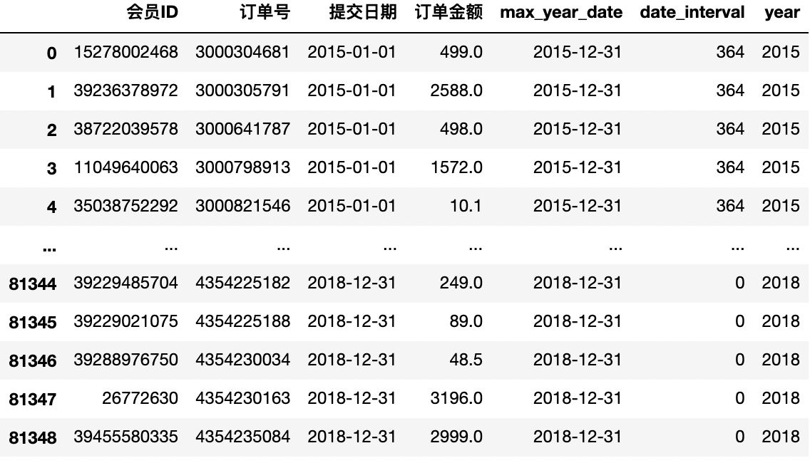

            **代码说明**：

            - 获取各自年份数据:
                - 先计算各自年份的最大日期与每个行的日期的差，得到日期间隔
                - 再增加一列新的字段，为每个记录行发生的年份，使用`data_merge['提交日期'].dt.year`实现
            - 关于pandas的 datetime类型
                - dt是pandas中Series时间序列datetime类属性的访问对象
                - 除了代码中用到的year外，还包括：date、dayofweek、dayofyear、days_in_month、freq、days、hour、microsecond、minute、month、quarter、second、time、week、weekday、weekday_name、weekofyear等
            - 转换日期间隔为数字
                - `data_merge['date_interval'].apply(lambda x: x.days)` 是将`data_merge['date_interval']`的时间间隔转换为数值型计算对象，这里使用了apply方法
                - apply方法是对某个 pandas 对象(DataFrame或Series)使用自定义函数

            4）汇总每个会员的 RFM 原始数据

            ```python
            # 按年份和会员 ID 进行汇总
            rfm_gb = data_merge.groupby(['year', '会员ID'], as_index=False).agg({
                'date_interval': 'min',  # 计算最近一次订单时间
                '提交日期': 'count', # 计算订单频率
                '订单金额': 'sum'}) # 计算订单总金额
            
            # 重命名列
            rfm_gb.columns = ['year', '会员ID', 'r', 'f', 'm']
            rfm_gb.head()
            ```

            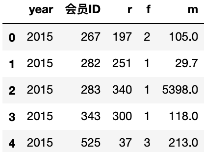

            **代码说明**：

            - 上面代码框中的第一行代码，是基于年份和会员ID，分别做RFM原始值的聚合计算
            - 这里使用groupby分组，以year和会员ID为联合主键，设置as_index=False意味着year和会员ID不作为index列，而是普通的数据框结果列
            - 后面的agg方法实际上是一个"批量"聚合功能的函数，它实现了对date_interval、提交日期、订单金额三列分别以min、count、sum做聚合计算的功能。否则，我们需要分别写3条goupby来实现3个聚合计算

        3. #### RFM计算

            **确定RFM划分区间**：

            > 在做 RFM 划分时，基本逻辑是分别对R、F、M做离散化操作，然后再计算 RFM。

            而离散化本身有多种方法可选，由于我们要对数据做 RFM 离散化，因此需要先看下数据的基本分布状态：

            ```python
            rfm_gb.iloc[:, 2:].describe().T
            ```

            

            ```python
            # 定义区间边界
            r_bins = [-1, 79, 255, 365] # 注意起始边界小于最小值
            f_bins = [0, 2, 5, 130] 
            m_bins = [0, 69, 1199, 206252]
            ```

            **结果说明**：

            1）从基本概要看出

            - 汇总后的数据总共有14万条
            - r和m的数据分布相对较为离散，表现在min、25%、50%、75%和max的数据没有特别集中
            - 而从f（购买频率）则可以看出，大部分用户的分布都趋近于1，表现是从min到75%的分段值都是1且mean（均值）才为1.365
            - 计划选择25%和75%作为区间划分的2个边界值

            2）f 的分布情况说明

            - r和m本身能较好地区分用户特征，而 f 则无法区分（大量的用户只有1个订单）
            - 行业属性（家电）原因，1年购买1次比较普遍（其中包含新客户以及老客户在当年的第1次购买）
            - 与业务部门沟通，划分时可以使用2和5来作为边界
                - 业务部门认为当年购买>=2次可被定义为复购用户（而非累计订单的数量计算复购用户）
                - 业务部门认为普通用户购买5次已经是非常高的次数，超过该次数就属于非常高价值用户群体
                - 该值是基于业务经验和日常数据报表获得的

            3）区间边界的基本原则如下

            - 中间2个边界值：r和m是分别通过25%和75%的值获取的，f是业务与数据部门定义的
            - 最小值边界：比各个维度的最小值小即可
            - 最大值边界：大于等于各个维度的最大值即可
            - 最小值边界为什么要小于各个维度的最小值:
                - 这是由于在边界上的数据归属有一个基本准则，要么属于区间左侧，要么属于区间右侧。如：f_bins中的2处于边界上，要么属于左侧区间，要么属于右侧区间
                - 在后续使用pd.cut方法中，对于自定义边界实行的是左开右闭的原则，即数据属于右侧区间，f_bins中的2就属于右侧区间。最左侧的值是无法划分为任何区间的，因此，在定义最小值时，一定要将最小值的边界值
                - 举例：数据：[1，2，3，4，5]，假如数据划分的区间边界是：[1，3，5]，即划分为2份
                    - 其中的2/3被划分到(1，3]区间中
                    - 3/4/5被划分到(3，5]区间中
                    - 1无法划分到任何一个正常区间内

            **RFM计算过程**：

            ```python
            # RFM 计算过程
            rfm_gb['r_score'] = pd.cut(rfm_gb['r'], r_bins, labels=[3, 2, 1])
            rfm_gb['f_score'] = pd.cut(rfm_gb['f'], f_bins, labels=[1, 2, 3])
            rfm_gb['m_score'] = pd.cut(rfm_gb['m'], m_bins, labels=[1, 2, 3])
            rfm_gb
            ```

            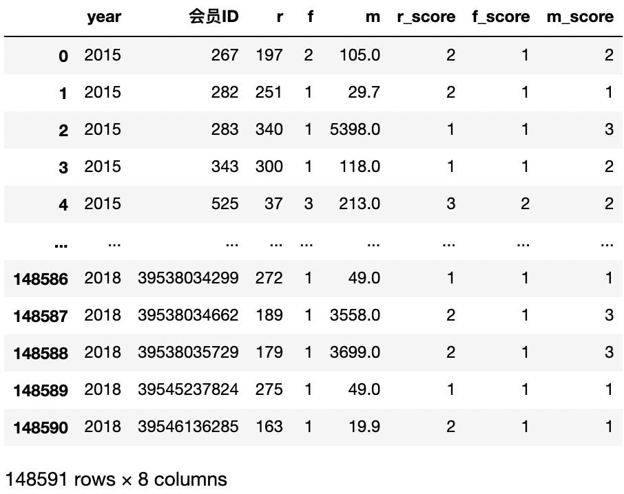

            **代码说明**：

            - 每个rfm的过程使用了pd.cut方法，基于自定义的边界区间做划分
            - labels用来显示每个离散化后的具体值
            - F和M的规则是值越大，等级越高；而R的规则是值越小，等级越高，因此labels的规则与F和M相反
            - 在labels指定时需要注意，4个区间的结果是划分为3份

            ```python
            # 计算 RFM 组合
            rfm_gb['r_score'] = rfm_gb['r_score'].astype(np.str)
            rfm_gb['f_score'] = rfm_gb['f_score'].astype(np.str)
            rfm_gb['m_score'] = rfm_gb['m_score'].astype(np.str)
            rfm_gb['rfm_group'] = rfm_gb['r_score'].str.cat(rfm_gb['f_score']).str.cat(rfm_gb['m_score'])
            rfm_gb
            ```

            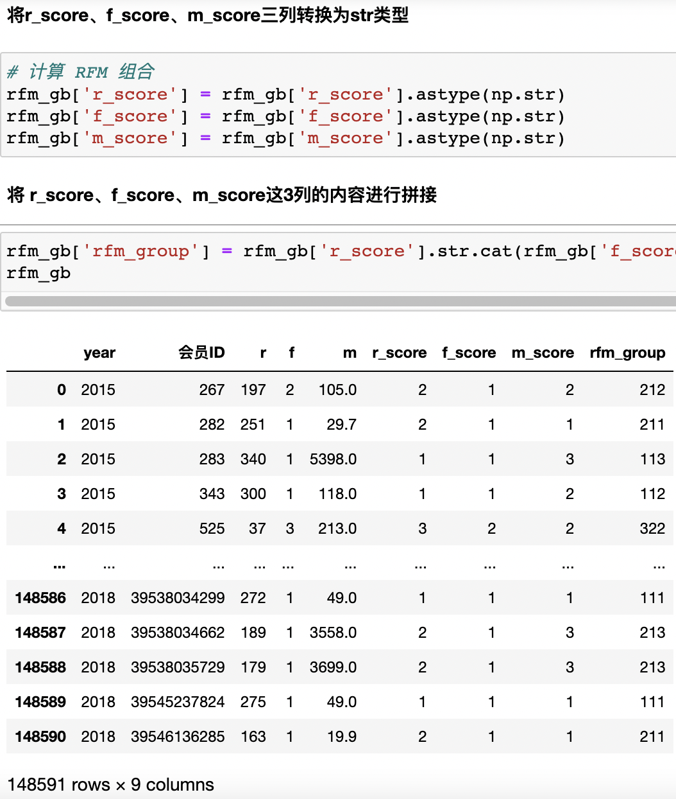

            **代码说明**：

            - 代码中，先针对3列使用astype方法将数值型转换为字符串型
            - 然后使用pandas的字符串处理库str中的cat方法做字符串合并，该方法可以将右侧的数据合并到左侧
            - 再连续使用两个str.cat方法得到总的R、F、M字符串组合

        4. #### RFM结果保存

            **保存RFM结果到Excel**：

            ```python
            # 保存结果到Excel
            rfm_gb.to_excel('sales_rfm_score1.xlsx')
            ```

            **保存RFM结果到数据库**：

            1）创建 `sales_rfm_score` 数据表

            ```python
            # 写入数据到数据库
            config = {'host': '192.168.19.131',  # 默认127.0.0.1
                      'user': 'root',  # 用户名
                      'password': 'mysql',  # 密码
                      'port': 3306,  # 端口，默认为3306
                      'database': 'rfm_db',  # 数据库名称
                      'charset': 'utf8'  # 字符编码
                      }
            
            # 建表操作
            con = pymysql.connect(**config)  # 建立mysql连接
            cursor = con.cursor()  # 获得游标
            cursor.execute("show tables")  # 查询表
            table_list = [t[0] for t in cursor.fetchall()]  # 读出所有库
            # 查找数据库是否存在目标表，如果没有则新建
            table_name = 'sales_rfm_score'  # 要写库的表名
            if not table_name in table_list:  # 如果目标表没有创建
                cursor.execute('''
                CREATE TABLE %s (
                userid               VARCHAR(20),
                r_score              int(2),
                f_score              int(2),
                m_score              int(2),
                rfm_group            VARCHAR(10),
                insert_date          VARCHAR(20)
                )ENGINE=InnoDB DEFAULT CHARSET=utf8
                ''' % table_name)  # 创建新表
            ```

            2）写入数据到 `sales_rfm_score` 数据表

            ```python
            # 梳理数据
            write_db_data = rfm_gb[['会员ID','r_score','f_score','m_score','rfm_group']] # 主要数据
            timestamp = time.strftime('%Y-%m-%d', time.localtime(time.time()))  # 日期
            
            # 写库
            for each_value in write_db_data.values:
                insert_sql = "INSERT INTO `%s` VALUES ('%s',%s,%s,%s,'%s','%s')" % \
                             (table_name, each_value[0], each_value[1], each_value[2], \
                              each_value[3],each_value[4],
                              timestamp)  # 写库SQL依据
                cursor.execute(insert_sql)  # 执行SQL语句，execute函数里面要用双引号
                con.commit()  # 提交命令
            cursor.close()  # 关闭游标
            con.close()  # 关闭数据库连接
            ```

        5. #### 结果可视化

            > 为了更好地了解不同周期下RFM分组人数的变化，通过3D柱形图展示结果
            >
            > 展示结果时只有3个维度，分别是年份、rfm分组和用户数量

            1）进行数据汇总

            ```python
            display_data = rfm_gb.groupby(['rfm_group', 'year'], as_index=False)['会员ID'].count()
            display_data.columns = ['rfm_group', 'year', 'number']
            display_data['rfm_group'] = display_data['rfm_group'].astype(np.int32)
            display_data.head()
            ```

            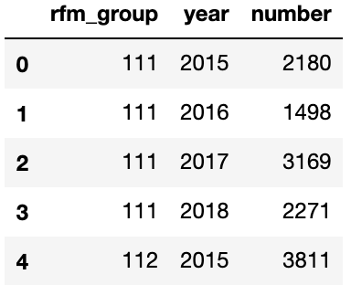

            **代码说明**：

            - 第1行代码使用数据框的groupby以rfm_group和year为联合对象，以会员ID会为计算维度做计数，得到每个RFM分组、年份下的会员数量
            - 第2行代码对结果列重命名
            - 第3行代码将rfm分组列转换为int32形式

            2）使用 Pyecharts 绘制 3D 图形

            ```python
            from pyecharts.commons.utils import JsCode
            from pyecharts import options as opts
            
            range_color = ['#313695', '#4575b4', '#74add1', '#abd9e9', '#e0f3f8', '#ffffbf',
                           '#fee090', '#fdae61', '#f46d43', '#d73027', '#a50026']
            range_max = int(display_data['number'].max())
            
            # 绘制 3D 图形
            bar = Bar3D().add(
                series_name='',
                data=[d.tolist() for d in display_data.values],
                xaxis3d_opts=opts.Axis3DOpts(type_='category', name='分组名称'),
                yaxis3d_opts=opts.Axis3DOpts(type_='category', name='年份'),
                zaxis3d_opts=opts.Axis3DOpts(type_='value', name='会员数量')
            ).set_global_opts(
                visualmap_opts=opts.VisualMapOpts(max_=range_max, range_color=range_color),
                title_opts=opts.TitleOpts(title="RFM分组结果")
            )
            
            bar.render_notebook()
            ```

            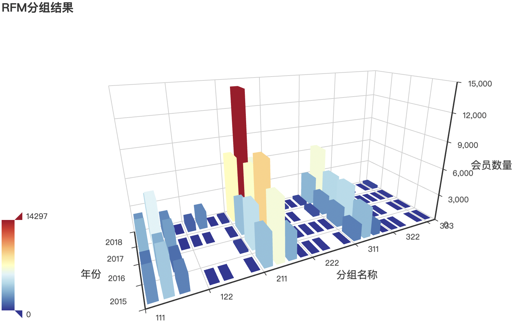

            输出3D图像中:

            - X轴为RFM分组、Y轴为年份、Z轴为用户数量
            - 该3D图可旋转、缩放，以便查看不同细节
            - 调节左侧的滑块条，用来显示或不显示特定数量的分组结果

    5. ### 案例结论

        1. #### 基于图形的交互式分析

            **重点人群分布**：

            - 在整个分组中，212群体的用户是相对集中且变化最大的
            - 从2016年到2017年用户群体数量变化不大，但到2018年增长了近一倍
            - 这部分人群将作为重点分析人群

            **重点分组分布**：

            - 除了212人群外，312、213、211及112人群都在各个年份占据很大数量
            - 虽然各自规模不大，但组合起来的总量超过212本身，也要重点做分析。
            - 如果拖动左侧的滑块，仅过滤出用户数量在4085以内的分组结果。观察图形发现，很多分组的人群非常少，甚至没有人

        2. #### 基于RFM分组结果的分析

            经过上面的分析，得到了要分析的重点客户群体。可根据用户的量级分为两类：

            - 第1类是用户群体占比超过10%的群体
            - 第2类是占比在个位数的群体。这两类人由于量级不同，因此需要分别有针对性的策略场景。
            - 除此以外，我们还会增加第3类人群，虽然从用户量级上小，但是单个人的价值度非常高。

            > 第1类人群：占比超过10%的群体。由于这类人群基数大，必须采取批量操作和运营的方式落地运营策略，一般需要通过系统或产品实现，而不能主要依赖于人工

            - 212：可发展的一般性群体。这类群体购买新近度和订单金额一般，且购买频率低。考虑到其最大的群体基础，以及在新近度和订单金额上都可以，因此可采取常规性的礼品兑换和赠送、购物社区活动、签到、免运费等手段维持并提升其消费状态。
            - 211：可发展的低价值群体。这类群体相对于212群体在订单金额上表现略差，因此在211群体策略的基础上，可以增加与订单相关的刺激措施，例如组合商品优惠券发送、积分购买商品等
            - 312：有潜力的一般性群体。这类群体购买新近度高，说明最近一次购买发生在很短时间之前，群体对于公司尚有比较熟悉的接触渠道和认知状态；购物频率低，说明对网站的忠诚度一般；订单金额处于中等层级，说明其还具有可提升的空间。因此，可以借助其最近购买的商品，为其定制一些与上次购买相关的商品，通过向上销售等策略提升购买频次和订单金额
            - 112：可挽回的一般性群体。这类群体购买新近度较低，说明距离上次购买时间较长，很可能用户已经处于沉默或预流失、流失阶段；购物频率低，说明对网站的忠诚度一般；订单金额处于中等层级，说明其还可能具有可提升的空间。因此，对这部分群体的策略首先是通过多种方式（例如邮件、短信等）触达客户并挽回，然后通过针对流失客户的专享优惠（例如流失用户专享优惠券）措施促进其消费。在此过程中，可通过增加接触频次和刺激力度的方式，增加用户的回访、复购以及订单价值回报
            - 213：可发展的高价值群体。这类人群发展的重点是提升购物频率，因此可指定不同的活动或事件来触达用户，促进其回访和购买，例如不同的节日活动、每周新品推送、高价值客户专享商品等。

            > 第2类人群：占比为1%～10%的群体。这部分人群数量适中，在落地时无论是产品还是人工都可接入

            - 311：有潜力的低价值群体。这部分用户与211群体类似，但在购物新近度上更好，因此对其可采取相同的策略。除此以外，在这类群体的最近接触渠道上可以增加营销或广告资源投入，通过这些渠道再次将客户引入网站完成消费。
            - 111：这是一类在各个维度上都比较差的客户群体。一般情况下，会在其他各个群体策略和管理都落地后才考虑他们。主要策略是先通过多种策略挽回客户，然后为客户推送与其类似的其他群体，或者当前热销的商品或折扣非常大的商品。在刺激消费时，可根据其消费水平、品类等情况，有针对性地设置商品暴露条件，先在优惠券及优惠商品的综合刺激下使其实现消费，再考虑消费频率以及订单金额的提升。
            - 313：有潜力的高价值群体。这类群体的消费新近度高且订单金额高，但购买频率低，因此只要提升其购买频次，用户群体的贡献价值就会倍增。提升购买频率上，除了在其最近一次的接触渠道上增加曝光外，与最近一次渠道相关的其他关联访问渠道也要考虑增加营销资源。另外，213中的策略也要组合应用其中
            - 113：可挽回的高价值群体。这类群体与112群体类似，但订单金额贡献更高，因此除了应用112中的策略外，可增加部分人工的参与来挽回这些高价值客户，例如线下访谈、客户电话沟通等

            > 第3类群体：占比非常少，但却是非常重要的群体

            - 333：绝对忠诚的高价值群体。虽然用户绝对数量只有355，但由于其各方面表现非常突出，因此可以倾斜更多的资源，例如设计VIP服务、专享服务、绿色通道等。另外，针对这部分人群的高价值附加服务的推荐也是提升其价值的重点策略
            - 233、223和133：一般性的高价值群体。这类群体的主要着手点是提升新近购买度，即促进其实现最近一次的购买，可通过DM、电话、客户拜访、线下访谈、微信、电子邮件等方式直接建立用户挽回通道，以挽回这部分高价值用户
            - 322、323和332：有潜力的普通群体。这类群体最近刚完成购买，需要提升的是购买频次及购买金额。因此可通过交叉销售、个性化推荐、向上销售、组合优惠券、打包商品销售等策略，提升其单次购买的订单金额及促进其重复购买

    6. ### 案例应用

        针对上述得到的分析结论，会员部门采取了以下措施：

        - 分别针3类群体，按照公司实际运营需求和当前目标，制定了不同的群体落地的排期
        - 录入数据库的RFM得分数据已经应用到其他数据模型中，成为建模输入的关键维度特征之一

    7. ### 案例注意点

        > 注意点1：不同品类、行业对于RFM的依赖度是有差异的，即使是一个公司在不同的发展阶段和周期下，3个维度的优先级上也会有调整

        - 大家电等消费周期较长的行业，R和M会更重要一些
        - 快消等消费周期短且快的行业，更看重R和F
        - 具体要根据当前运营需求与业务部门沟通

        > 注意点2：对R、F、M区间的划分是一个离散化的过程，具体需要划分为几个区间需要与业务方确认

        - 本案例划分为3个区间，结果对于业务分析而言有些多，意味着业务方需要制定十几套甚至更多的策略
        - 如果业务方要求简化，也可以划分为2个区间，这样出来的分组数最多有8组，策略制定更加简单
        - 具体是划分为2个还是3个，取决于当前业务方有多少资源可以投入到这个事情中来。

        > 注意点3：R、F、M的权重打分

        - 除了案例中提到的建模方式外，结合业务经验的专家打分法也是常用的思路，这时推荐结合AHP层次分析法打分，这样出来的权重结果更加科学、严谨。
        - 虽然订单数据库中的数据质量相对较高，但可能由于数据采集、数据库同步、ETL、查询、误操作等问题，还是会导致NA值的出现，而NA值的处理非常重要。
        - R、F、M三个维度的处理（包括计算、离散化、组合、转换）之前都需要注意其数据类型和格式，尤其是有关时间项的转换操作应提前完成

