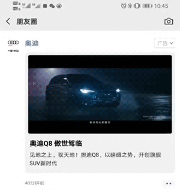
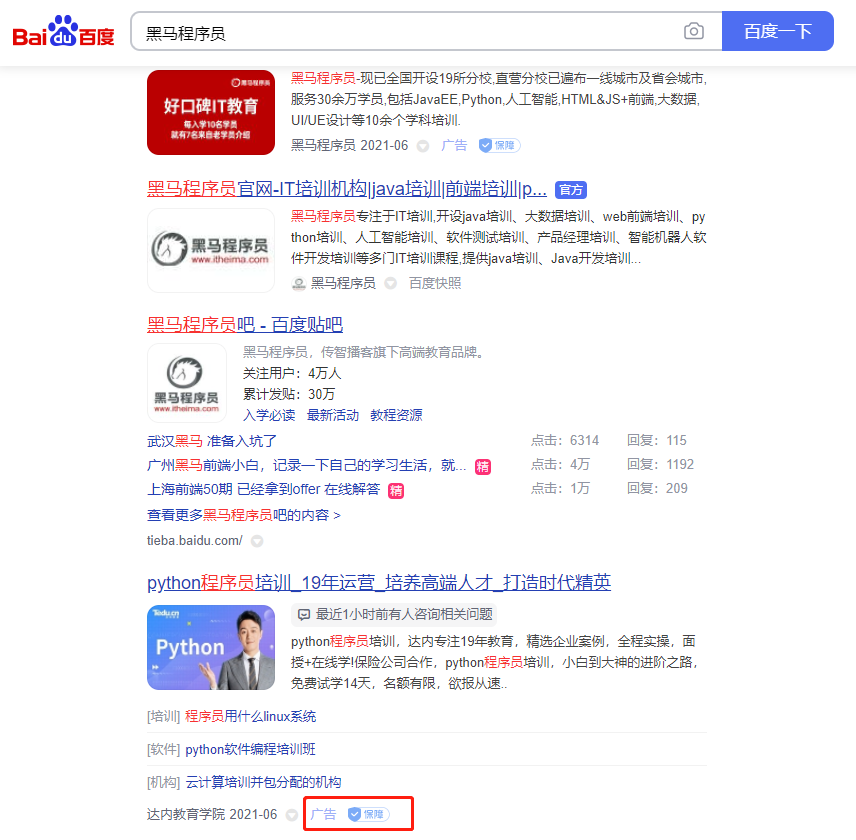

# 常见业务指标运算

1. ## 数据指标简介

    ##### 数据分析/大数据分析的目的是为了用数据驱动运营，用数据驱动业务增长（数据驱动设计，数据驱动决策，数据驱动XXX……），要做到数据驱动，最基本的层次就是描述性分析，也就是用数据来记录企业的业务状况，用数据记录每天实际发生的事实。

    ##### 在这个阶段，我们需要建立一套**数据指标**来描述我们的业务，并使用这一套指标建立相关的报表（日报，周报，月报），有了这一套指标，我们就可以**监控**每天业务运行的情况，方便及时发现问题。

    1. ### 什么是数据指标

        - 数据指标概念：可将某个事件量化，且可形成数字，来衡量目标。
        - 数据指标的作用：当我们确定下来一套指标，就可以用指标来衡量业务，判断业务好坏
            - 最近的业务不错，昨天注册了一万多人 XX月XX日 新注册用户9820人，超过目标820人
            - 最近用户很多对我们的产品不满意 XX月XX日 某产品日退货85件 ，累计30天退货率10%

    2. ### 常见的业务指标

        - **活跃用户指标**：一个产品是否成功，如果只看一个指标，那么这个指标一定是活跃用户数

            - 日活（DAU）：一天内日均活跃设备数(去重，有的公司启动过APP就算活跃，有的必须登录账户才算活跃)
            - 月活（MAU）：一个月内的活跃设备数(去重，一般用月活来衡量APP用户规模)。
            - 周活跃数（WAU）：一周内活跃设备数(去重)
            - 活跃度（DAU/MAU）：体现用户的总体粘度，衡量期间内每日活跃用户的交叉重合情况

        - **新增用户指标**：主要是衡量营销推广渠道效果的最基础指标

            - 日新增注册用户量：统计一天内，即指安装应用后，注册APP的用户数。
            - 周新增注册用户量：统计一周内，即指安装应用后，注册APP的用户数。
            - 月新增注册用户量：统计一月内，即指安装应用后，注册APP的用户数。
            - 注册转化率：从点击广告/下载应用到注册用户的转化。
            - DNU占比：新增用户占活跃用户的比例，可以用来衡量产品健康度
                - 新用户占比活跃用户过高，那说明该APP的活跃是靠推广得来

        - **留存指标**：是验证APP对用户吸引力的重要指标。通常可以利用用户留存率与竞品进行对比，衡量APP对用户的吸引力

            - 次日留存率：某一统计时段新增用户在第二天再次启动应用的比例
            - 7日留存率：某一统计时段新增用户数在第7天再次启动该应用的比例，14日和30日留存率以此类推

        - **行为指标**：

            - PV（访问次数，Page View）：一定时间内某个页面的浏览次数，用户每打开一个网页可以看作一个PV。
                - 某一个网页1天中被打开10次，那么PV为10。
            - UV（访问人数，Unique Visitor）：一定时间内访问某个页面的人数。
                - 某一个网页1天中被1个人打开过10次，那么UV是1。
                - 通过比较PV或者UV的大小，可以看到用户喜欢产品的哪个功能，不喜欢哪个功能，从而根据用户行为来优化产品
            - 转化率：计算方法与具体业务场景有关
                - 淘宝店铺，转化率=购买产品的人数／所有到达店铺的人数
                    - “双11”当天，有100个用户看到了你店铺的推广信息，被吸引进入店铺，最后有10个人购买了店铺里的东西，那么转化率=10（购买产品的人数）/100（到店铺的人数）=10%。
                - 在广告业务中，广告转化率=点击广告进入推广网站的人数／看到广告的人数。
                    - 例如经常使用百度，搜索结果里会有广告，如果有100个人看到了广告，其中有10个人点击广告进入推广网站，那么转化率=10（点击广告进入推广网站的人数）/100（看到广告的人数）=10%
            - 转发率：转发率=转发某功能的用户数／看到该功能的用户数
                - 现在很多产品为了实现“病毒式”推广都有转发功能
                - 公众号推送一篇文章给10万用户，转发这篇文章的用户数是1万，那么转发率=1万（转发这篇文章的用户数）/10万（看到这篇文章的用户数）=10%

        - **产品数据指标**

            - GMV （Gross Merchandise Volume）：指成交总额，也就是零售业说的“流水”
                - 需要注意的是，成交总额包括销售额、取消订单金额、拒收订单金额和退货订单金额。
                - 成交数量对于电商产品就是下单的产品数量，**下单就算**
            - 人均付费=总收入／总用户数
                - 人均付费在游戏行业叫**ARPU**（Average Revenue Per User）
                - 电商行业叫**客单价**
            - 付费用户人均付费（ARPPU，Average Revenue Per Paying User）=总收入／付费人数，这个指标用于统计付费用户的平均收入
            - 付费率=付费人数／总用户数。付费率能反映产品的变现能力和用户质量
                - 例如，某App产品有100万注册用户，其中10万用户有过消费，那么该产品的付费率=付费人数（10万）/总用户数（100万）=10%。
            - 复购率是指重复购买频率，用于反映用户的付费频率。
                - 复购率指一定时间内，消费两次以上的用户数／付费人数

        - **推广付费指标**：

            - CPM（Cost Per Mille） ：展现成本，或者叫千人展现成本

                - 广告每展现给一千个人所需花费的成本。按CPM计费模式的广告，只看展现量，按展现量收费，不管点击、下载、注册。一般情况下，APP启动开屏，视频贴片、门户banner等非常优质的广告位通常采用CPM收费模式。

                    

            - CPC（Cost Per Click） 点击成本，即每产生一次点击所花费的成本

                - 典型的按点击收费的模式就是搜索引擎的竞价排名，如谷歌、百度、360、搜狗的竞价排名。在CPC的收费模式下，不管广告展现了多少次，只要不产生点击，广告主是不用付费的。只有产生了点击，广告主才按点击数量进行付费

                

            - 按投放的实际效果付费（CPA，Cost Per Action）包括：

                - CPD（Cost Per Download）：按App的下载数付费；
                - CPI（Cost Per Install）：按安装App的数量付费，也就是下载后有多少人安装了App；
                - CPS（Cost Per Sales）：按完成购买的用户数或者销售额来付费。

        - 不同的业务可能关心的指标不尽相同

    3. ### 如何选择指标

        - 好的数据指标应该是比例
            - 公众号打开次日文章用户数（活跃用户数）是1万，让你分析公众号是否有问题。这其实是看不出什么的
            - 总粉丝量是10万，那么可以计算出次日活跃率=1万（活跃用户数）/10万（总用户数）=10%
            - 和行业平均活跃率（公众号的平均活跃率是5%）比较，会发现这个公众号活跃率很高。
        - 根据目前的业务重点，找到北极星指标
            - 在实际业务中，北极星指标一旦确定，可以像天空中的北极星一样，指引着全公司向着同一个方向努力
            - 根据目前的业务重点寻找北极星指标：
                - 北极星指标没有唯一标准。不同的公司关注的业务重点不一样
                - 同一家公司在不同的发展阶段，业务重点也不一样

2. ## Pandas计算指标案例

    接下来我们将使用在线零售的流水数据计算相关指标，首先我们来了解一下要用到的数据：

    

    - 数据中包含了某电商网站从2009年12月到2011年12月两年间的销售流水，每条记录代表了一条交易记录，包含如下字段：

        `Invoice`: 发票号码

        `StockCode`: 商品编码

        `Description`: 商品简介

        `Quantity`: 购买数量

        `InvoiceDate`: 发票日期

        `Price`: 商品单价

        `Customer ID`: 用户ID

        `Country`: 用户所在国家

    我们将要计算如下指标：

    - 月销售金额(月GMV) ： 对流水数据按月分组， 将每个月的每笔交易汇总， 对销售金额求和

        - 对于零售业务而言， 总销售金额是最重要的指标， 我们称之为**北极星指标**
        - GMV（全称Gross Merchandise Volume），即商品交易总额，多用于电商行业，一般包含拍下未支付订单金额。

    - 月销售额环比：当前月销售金额/上一个月的销售金额 * 100%

        月销售额环比发生波动剧烈时，为了找到具体原因我们进一步将核心的月销量指标拆解:

        月销量 = **月均活跃用户数** * **月均用户消费金额**

    为了衡量当前业务的健康程度， 我们还会计算如下指标

    - 新用户占比：新老用户
    - 激活率
    - 月留存率

    北极星指标是最能体现您的产品为客户提供的核心价值的单一指标。该指标取决于我们产品、定位、目标等。

    - Airbnb 的 North Star Metric 是预订夜数，而对于 Facebook，它是每日活跃用户。
    - 接下来我们使用在线零售的示例数据集。 对于在线零售，我们选择每月收入**(月GMV)** 作为北极星指标

    1. ### 导入模块&加载数据

        ```python
        from datetime import datetime, timedelta
        import pandas as pd
        %matplotlib inline
        import matplotlib.pyplot as plt
        # 设置中文字体
        plt.rcParams['font.sans-serif'] = 'SimHei'
        
        import numpy as np
        import seaborn as sns
        
        data_1 = pd.read_excel('data/online_retail_II.xlsx', 
                               sheet_name='Year 2009-2010', engine='openpyxl')
        data_2 = pd.read_excel('data/online_retail_II.xlsx', 
                               sheet_name='Year 2010-2011', engine='openpyxl')
        ```

        数据在Excel文件中，分别保存在两个不同的Sheet中，分别记录了2009-2010年和2010-2011的销售记录，接下来我们将它们合并到一个DataFrame中

        ```python
        data = pd.concat([data_1, data_2], ignore_index=True)
        data.head()
        ```

        

        ```
        data.info()
        ```

        

        - 从数据中看出，一共有1067371 条数据，记录了交易的相关信息，与后续指标计算相关的字段

            - CustomerID 用户ID
            - UnitPrice 商品单价
            - Quantity 商品购买数量
            - InvoiceDate 购买日期

            利用上面的字段我们先计算我们的北极星指标，月收入

    2. ### 数据清洗

        整理数据，将后续用不到的字段Country去掉, 为了方便大家对代码的理解把列名换为中文

        ```python
        retail_data = data[['Invoice', 'StockCode', 'Description', 'Quantity', 
                            'InvoiceDate', 'Price', 'Customer ID']]
        retail_data.columns = ['订单编号', '商品编号', '商品描述',
                               '购买数量', '购买时间', '商品单价', '用户ID']
        retail_data.head()
        ```

        

        ```python
        retail_data['购买时间'].describe(datetime_is_numeric=True)
        ```

        

        可以看出，我们的数据从2009年12月到2011年12月

        ```python
        # 查看数据分布情况
        retail_data.describe()
        ```

        

        发现购买数量和商品单价最小值均小于零，我们在计算GMV之类的指标时都不统计退货，所以需要处理这部分数据

        ```python
        retail_data.query('购买数量<0')
        ```

        

        - 通过dataframe 的query API查询 购买数量<0 和 商品单价<0的订单
        - 购买数量< 0 订单的发票号码都是以C开头，属于有退货的订单

        ```python
        retail_data.query('商品单价<0')
        ```

        

        - price小于零的是坏账调整，我们把购买数量<0和商品单价<0的订单删除

        ```python
        retail_data_clean = retail_data.query('购买数量>0 & 商品单价 >0')
        retail_data_clean.describe()
        ```

        

        进一步了解一下`商品编号`列，我们发现`商品编号`列中，有的只有一个字母比如M，B，还有的是5位或者6位的编号，这里 `商品编号`相当于 SKU

        - SKU=Stock Keeping Unit（库存量单位）。即库存进出计量的基本单元，可以是以件，盒，托盘等为单位
            - SKU是用来定价和管理库存的，比如一个产品有很多颜色，很多配置，每个颜色和配置的组合都会形成新的产品，这时就产生很多SKU
            - sku在零售行业是一个非常常用的概念，如服装，同款不同尺码不同色都是独立的SKU，需要有独立的条形码，独立的库存管理等
        - 我们看一下这些特殊的SKU都有哪些，都代表什么意思

        ```python
        # 过滤长度<5的内容
        retail_data_clean[retail_data_clean.StockCode.str.len().fillna(5)<5]['商品编号'].unique()
        ```

        

        ```python
        # 过滤长度>6的内容
        retail_data_clean[retail_data_clean.StockCode.str.len().fillna(5)>6]['商品编号'].unique()
        ```

        

        我们发现特殊的SKU有如下这些，我们进一步打印一下他们的描述信息

        ```python
        special_sku = ['POST', 'DOT', 'M', 'C2', 'PADS', 'm', 'D', 'S', 'B', 
                       'BANK CHARGES', 'TEST001', 'TEST002', 'ADJUST2', 'AMAZONFEE']
        for i in special_sku:
            print(i+'=>'+retail_data_clean[retail_data_clean['商品编号']==i]['商品描述'].unique())
        ```

        

        POST、DOT、C2 属于运费，PADS、m和M属于配件，B属于坏账调整，AMAZONFEE 和 Bank Charges 属于渠道费用，TEST001，TEST002属于测试数据。

        我们看一下这些特殊的SKU都有哪些，都代表什么意思，经过与业务部门沟通得知如下特殊SKU

        - `POST` 、`DOT`、`C2` : 运费
        - `PADS`、`m` 、`M` : 配件
        - `B`: 坏账调整
        - `BANK CHARGES`、`AMAZONFEE`: 渠道费用
        - `TEST001`、`TEST002`：测试数据

        由于运费、包装费、银行的费用**一般都计入到GMV中**，所以我们这里只是把['B', 'TEST001', 'TEST002'] 这几个去掉

        ```python
        retail_data_clean = retail_data_clean[~retail_data_clean['商品编号'].isin(['B', 'TEST001', 'TEST002'])]
        retail_data_clean.shape
        # 结果
        (1041660, 7)
        ```

    3. ### 计算月交易额(月GMV)

        接下来我们添加一个字段，用来表示交易的月份:

        ```python
        retail_data_clean['购买年月'] = retail_data_clean['购买时间'].astype('datetime64[M]')
        retail_data_clean
        ```

        

        用单价*数量计算每条交易记录的交易金额，然后按照月份分组，计算每月的总收入

        ```python
        retail_data_clean['金额'] = retail_data_clean['商品单价'] * retail_data_clean['购买数量']
        retail_data_clean
        ```

        

        将每笔交易按照购买年月进行分组，计算每月的总交易金额(月GMV)

        ```python
        gmv_m = retail_data_clean.groupby('购买年月', as_index=False)['金额'].sum()
        gmv_m
        ```

        

        使用pandas，对结果做可视化

        ```python
        # 创建画布
        plt.figure(figsize=(16, 6))
        # 绘制折线图
        gmv_m['金额'].plot()
        # 使用购买年月的数据作为X轴显示的标签
        x_label = gmv_m['购买年月'].astype(str)
        # 设置X轴标签
        # 参数1 当前的标签(从0开始的数字) 
        # 参数2 要替换的标签
        # 参数3 rotation 标签字体旋转45度
        plt.xticks(range(0, 25), x_label, rotation=45)
        # 显示网格线
        plt.grid(True)
        ```

        

        > 从上图看出，我们的业务有周期性，每年的三季度开始销量开始上升，四季度是业务的峰值，从商品描述看主要是圣诞新年礼品，印证了年底是销售旺季的原因

    4. ### 计算月销售额环比

        环比概念：当前月跟上一月对比

        > 我们经常还能听到同比的概念，同比是与上一年同期对比，比如今年双十一 与去年双十一对比，叫同比

        ```python
        # pct_change 计算环比
        gmv_m['月销售额环比'] = gmv_m['金额'].pct_change()
        gmv_m
        ```

        

        绘制图形，可视化月销售额环比数据

        ```python
        plt.figure(figsize=(16, 6))
        gmv_m['月销售额环比'].plot()
        plt.xticks(range(0, 25), x_label, rotation=45)
        plt.grid(True)
        ```

        

        > 从分析结果中看出， 每年1月环比数据有明显下跌，由于业务的周期性原因， 1月数据下降可以理解， 但是4月份环比数据也有明显下降，我们来进一步分析

        - 收入= 活跃用户数 * 活跃用户平均消费金额
        - 接下来我们就从这两个个维度做进一步分析：月活跃用户数，活跃用户平均消费金额

    5. ### 月均活跃用户分析

        我们分析一下月均活跃用户的情况，由于我们的数据中用户编号有缺失，我们把这部分缺失数据删除

        数据中只有购买记录，没有其它记录，所以我们**用购买行为来定义活跃**

        ```python
        mau = retail_data_clean.groupby('购买年月', as_index=False)['用户ID'].nunique()
        mau.columns = ['购买年月', '用户数']
        mau.head()
        ```

        

        Pandas绘图展示月活变化情况

        ```python
        plt.figure(figsize=(16, 6))
        mau['用户数'].plot(kind = 'bar')
        plt.xticks(range(0, 25), x_label, rotation=45)
        plt.grid(True)
        ```

        

        > 对比3月和4月的活跃用户情况，确实有下降

    6. ### 月客单价(活跃用户平均消费金额)

        将月销量数据和月活数据合并，然后计算客单价

        - 客单价 = 月GMV/月活跃用户数

        ```python
        final = mau.merge(gmv_m, on='购买年月')
        final['客单价'] = final['金额']/final['用户数']
        final
        ```

        

        - 可视化

        ```python
        plt.figure(figsize=(16,6))
        final['客单价'].plot()
        plt.xticks(range(0, 25), x_label, rotation=45)
        plt.grid(True)
        ```

        

        > 从上图中看出，对比3月和4月的数据，客单价也有所下降
        >
        > 从上面的分析可以看出，无论是月活人数，还是月客单价每年4月的数据都低于3月的数据，所以导致4月的北极星指标，月销售额，对比3月份有大幅度的下降

    7. ### 新用户占比

        我们已经计算了与北极星指标直接相关的数据，接下来我们分析一下其它比较重要的指标

        - 新用户占比是衡量业务健康程度的重要指标
        - 这里我们需要确定， 如何定义新用户。

        **区分新老用户**

        找到每个用户第一次购买的日期

        ```python
        # 按照用户ID分组，找到每个用户购买时间的最小值
        retail = retail_data_clean.groupby('用户ID', as_index=False)['购买时间'].min()
        # 修改列标签
        retail.columns = ['用户ID','首次购买时间']
        # 创建新的字段 首次购买年月
        retail['首次购买年月'] = retail['首次购买时间'].astype('datetime64[M]')
        retail
        ```

        

        将首次购买日期的数据与原始数据合并

        ```python
        retail_data_clean = pd.merge(retail_data_clean, retail, on='用户ID')
        retail_data_clean
        ```

        

        创建`用户类型`字段来区分新老用户

        ```python
        # 给所有的用户先赋值：新用户
        retail_data_clean['用户类型'] = '新用户'
        # 把满足条件的行, 对应的用户类型列 改成 老用户
        retail_data_clean.loc[retail_data_clean['购买年月']>retail_data_clean['首次购买年月'], 
                              '用户类型'] = '老用户'
        retail_data_clean['用户类型'].value_counts()
        ```

        

        ```python
        retail_data_clean
        ```

        

        接下来我们统计新用户和老用户的销售额：

        ```python
        revenue = retail_data_clean.groupby(['购买年月', '用户类型'], 
                                            as_index=False)['金额'].sum()
        revenue.head()
        ```

        

        由于2009年12月和2011年12月的数据不全，我们不处理这两部分数据

        ```python
        revenue = revenue.query('购买年月!="2009-12-01" & 购买年月!="2011-12-01"')
        ```

        可视化，这里我们需要把新老用户的购买情况都绘制到一张图表中

        ```python
        import numpy as np
        
        new_revenue = revenue[revenue['用户类型']=='新用户']['金额']
        
        # 修改新用户对应行索引，保证和老用户行索引对齐
        new_revenue.index = new_revenue.index + 1
        old_revenue = revenue[revenue['用户类型']=='老用户']['金额']
        
        # 绘图操作
        plt.figure(figsize=(16,6))
        new_revenue.plot()
        old_revenue.plot()
        plt.xticks(range(0,50,2), x_label, rotation=45)
        
        # 添加图例
        plt.legend(['新用户', '老用户'])
        plt.grid(True)
        ```

        

        > 上图绘制了新老用户交易额的对比，可以看出还是有明显的周期性，但是对比2010年，2011年新用户的交易额有下降的趋势，我们再计算一下新老用户的数量对比

        按月分组计算新用户数量和老用户数量并计算新用户占比：

        - 新用户占比 = 每月新用户/每月有购买的总用户数

        ```python
        # 按月统计新用户数量
        user_ratio = retail_data_clean.query("用户类型 == '新用户'").groupby(
            '购买年月', as_index=False)['用户ID'].nunique()
        user_ratio.columns = ['购买年月', '新用户数']
        # 按月统计有购买的用户数量
        user_ratio['总用户数']= retail_data_clean.groupby('购买年月')['用户ID'].nunique().values
        # 计算新用户占比
        user_ratio['新用户占比'] = user_ratio['新用户数']/user_ratio['总用户数']
        user_ratio.head()
        ```

        

        由于数据从2009年12月开始，缺少前面的数据， 而我们的数据又是以出现在数据集中，首次购买记录作为新用户的认定方式，所以，这里只展示2011年的新用户占比数据。

        ```python
        # 数据切片, 截取2011-01 以后的数据
        user_ratio[13:]
        ```

        

        数据可视化：

        ```python
        # 截取2011-01-01以后的数据
        plot_data = user_ratio[13:-1]
        
        x_label = plot_data['购买年月'].astype(str).tolist()
        plt.figure(figsize=(16, 6))
        plot_data['新用户占比'].plot.bar()
        plt.xticks(range(0, 11), labels=x_label, rotation=0)
        plt.grid(True)
        ```

        

        > 从上图中可以看出， 新用户占比有下降的趋势，即使是在年底的旺季也也没有比2011第一季度的情况好

    8. ### 激活率计算

        - 用户激活的概念：用户激活不等同于用户注册了账号/登录了APP，不同类型产品的用户激活定义各有差别
        - 总体来说，用户激活是指用户一定时间内在产品中完成一定次数的关键行为
            - 一定时间是用户激活的时间窗口，针对特定产品指定用户激活时间周期，也是用户激活的主要运营周期；
            - 一定次数是指用户激活行为的发生次数，也被称作魔法数字，是用户激活重点关注的数据；
            - 关键行为是指用户激活行为
            - 举例：短视频类应用，用户激活可以定义为**3日**内，**浏览**超过**n个短视频**
        - 我们现在定义激活：用户注册后30日内完成至少一次购买被认为是激活用户

        加载用户注册日期数据：

        ```python
        retail = pd.read_csv('data/retail_user_data.csv')
        retail
        ```

        

        加载数据之后我们发现首次购买年月、注册年月、安装年月字段包含了具体时刻信息，我们把时刻数据去掉

        ```python
        retail['首次购买年月'] = retail['首次购买年月'].astype('datetime64[M]')
        retail['注册年月'] = retail['注册年月'].astype('datetime64[M]')
        retail['安装年月'] = retail['安装年月'].astype('datetime64[M]')
        ```

        为了能分析的更加细致，我们的数据中还包含渠道来源字段， 一般我们的产品（网站，APP）有如下推广渠道

        - 百度，360，搜狗（谷歌）等搜索引擎的竞价排名广告
        - 流量比较大的产品的信息流广告， 开屏广告，头图广告（微信，抖音，头条等）
        - 社群运营（私域流量）：微信群
        - 地推：线下扫码
        - 传统媒体：公交，地铁，电视媒体，楼宇媒体的硬广
        - 三方广告商（对接流量主和广告主，通过开发广告SDK，流量主在自己的产品里添加广告SDK预留广告展示位，广告主直接联系三方广告商提供广告素材和访问链接）
        - 如果是APP还有如下渠道
            - 应用市场：应用宝，360市场，百度助手，谷歌商店，各大手机厂商的应用商店
            - 与手机厂商合作的应用预装
            - 与ROM团队合作的应用预装

        **计算用户激活率**

        - 数据加载好之后，我们就可以计算用户激活率了，需要注意的是，我们这里注册时间，安装时间，渠道来源都是模拟的数据，实际业务中，如果缺少这些字段，需要跟开发部门沟通埋点
        - 统计注册时间和首次购买时间都在同一个月份的用户数量，我们把这类用户作为激活用户

        ```python
        # 统计每月激活用户数量
        activation_count = retail[retail['首次购买年月'] == retail['注册年月']].groupby(
            '注册年月')['用户ID'].count()
        # 统计每月注册的用户数
        register_count = retail.groupby('注册年月')['用户ID'].count()
        # 计算激活率 = 每月激活用户/每月注册用户数
        retail_activation = activation_count/register_count
        retail_activation = retail_activation.reset_index()
        # 修改列标签
        retail_activation.columns = ['注册年月', '激活率']
        retail_activation.head()
        ```

        

        - 可视化

        ```python
        # 数据可视化
        plot_data = retail_activation[1:-1]
        
        # 绘图
        x_label = plot_data['注册年月'].astype(str).tolist()
        plt.figure(figsize=(16, 6))
        plot_data['激活率'].plot.bar()
        plt.xticks(range(0, 22), x_label, rotation=45)
        plt.grid(True)
        ```

        

        - 由于数据是模拟的，所以图表中的数据没有实际业务价值，需要同学们注意，这里只是介绍如何计算激活率这个指标
        - 激活率越高说明我们的产品吸引力越强，注册用户能够快速进入到活跃的状态，为公司带来价值
        - 我们也可以按照渠道这个维度来进一步拆解，看一看哪个渠道的用户质量高

        ```python
        # 统计每月不同渠道的激活用户数
        activation_count = retail[retail['首次购买年月']==retail['注册年月']].groupby(
            ['注册年月', '渠道'])['用户ID'].count()
        # 统计每月不同渠道的注册用户数
        register_count = retail.groupby(['注册年月', '渠道'])['用户ID'].count()
        
        # 计算每月不同渠道的激活率
        activation_ratio = activation_count / register_count
        activation_ratio = activation_ratio.reset_index()
        activation_ratio
        ```

        

        提取各渠道2010年的激活数据用于可视化：

        ```python
        data_wechat = activation_ratio.query(
            "注册年月>20091201 and 注册年月<20110101 and 渠道=='微信'").reset_index()
        data_baidu = activation_ratio.query(
            "注册年月>20091201 and 注册年月<20110101 and 渠道=='百度'").reset_index()
        data_tiktok = activation_ratio.query(
            "注册年月>20091201 and 注册年月<20110101 and 渠道=='抖音'").reset_index()
        ```

        渠道激活率可视化：

        ```python
        plt.figure(figsize=(16, 6))
        data_wechat['用户ID'].plot()
        data_baidu['用户ID'].plot()
        data_tiktok['用户ID'].plot()
        
        x_label = data_wechat['注册年月'].astype(str).tolist()
        plt.xticks(data_wechat.index, x_label, rotation=45)
        plt.grid(True)
        ```

        

        如果不同渠道的激活率有比较大的差异，需要进一步思考，激活率比较低的渠道用户构成与我们产品的目标用户群体是否有偏差

    9. ### 月留存率

        月留存率可以反应对老用户是否有足够的吸引力， 可以反映出我们产品的健康程度，在当前业务场景下，我们的月留存率定义为：

        - 月留存率 = 当月与上月都有购买的用户数/上月购买的用户数

        首先我们来按月统计用户是否有购买的情况

        ```python
        # 创建透视表，有购买的月份对购买数量求和，没有购买的月份补0
        user_retention = retail_data_clean.pivot_table(index='用户ID', columns='购买年月', 
                                                       values='购买数量', aggfunc='sum').fillna(0)
        user_retention
        ```

        

        提取出月份数据：我们从上面的结果中， 截取出2010年1月以后的数据来计算，计算到2011年10月, 因为2011年12月的数据不全所以2011年11月的数据无法准确计算

        ```python
        months = user_retention.columns[1:-1]
        months
        DatetimeIndex(['2010-01-01', '2010-02-01', '2010-03-01', '2010-04-01',
                       '2010-05-01', '2010-06-01', '2010-07-01', '2010-08-01',
                       '2010-09-01', '2010-10-01', '2010-11-01', '2010-12-01',
                       '2011-01-01', '2011-02-01', '2011-03-01', '2011-04-01',
                       '2011-05-01', '2011-06-01', '2011-07-01', '2011-08-01',
                       '2011-09-01', '2011-10-01', '2011-11-01'],
                      dtype='datetime64[ns]', name='购买年月', freq=None)
        ```

        计算每个月的月留存率

        ```python
        retention_list = []
        
        for i in range(1, len(months)):
            retention_ = {}
            # 当前月份
            current_month = months[i]
            # 前一月份
            prev_month = months[i-1]
            # 创建一列，用来记录当前月份
            retention_['购买年月'] = current_month
            # 当月有购买的用户数量
            retention_['总用户数'] = (user_retention[current_month]>0).sum()
            # 当月和前一月都有购买的用户数量
            retention_['留存用户数'] = ((user_retention[current_month] > 0) & (user_retention[prev_month]>0)).sum()
            # 将数据保存到 list 中
            retention_list.append(retention_)
        
        # 将 list 中的数据转换为 DataFrame 并计算留存率
        monthly_retention = pd.DataFrame(retention_list)
        monthly_retention['留存率'] = monthly_retention['留存用户数'] / monthly_retention['总用户数']
        monthly_retention
        ```

        

        绘制折线图

        ```python
        plt.figure(figsize=(16, 6))
        monthly_retention['留存率'].plot()
        x_label = monthly_retention['购买年月'].astype(str).tolist()
        plt.xticks(monthly_retention.index, x_label, rotation=45)
        plt.grid(True)
        ```

        

        > 从上图看出，留存在35%左右浮动，也具有一定的周期性，四季度的表现较好