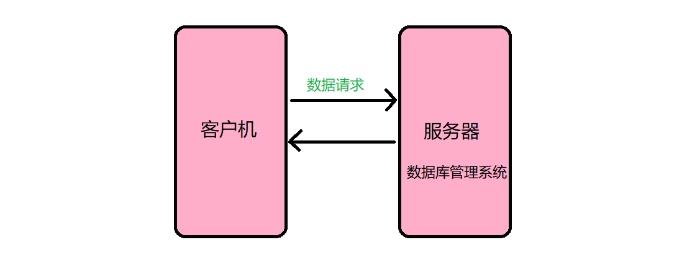
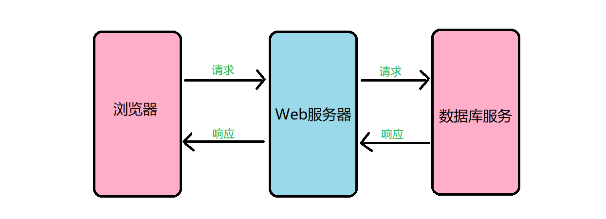
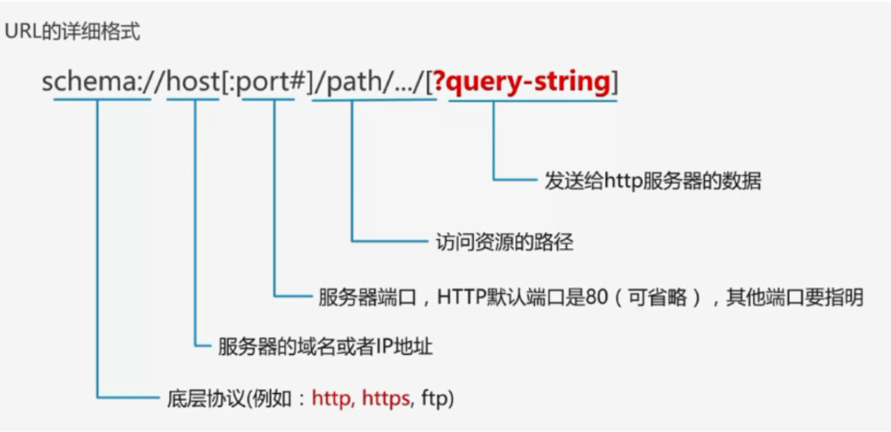
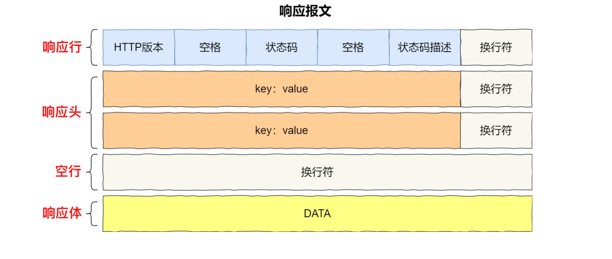
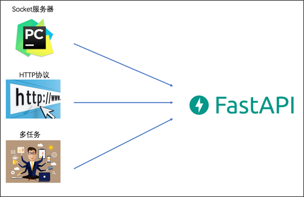

[TOC]

# I. HTTP协议

1. #### C/S架构和B/S架构

    - ##### C/S架构: Client/Server

        

        第一层为客户端, 第二层为服务端

        举例: 音乐播放器, 杀毒软件, QQ, 微信等

        缺点: 必须下载客户端软件才能使用, 部署难度大, 不易扩展

    - ##### B/S架构: Browser/Server

        

        第一层为浏览器, 第二层为Web服务器, 第三层为数据库服务器

        举例: 淘宝, 微博, 京东

        优势: 只要有浏览器就能访问, 容易拓展

2. #### HTTP协议

    - ##### 功能简介

        - HyperText Transfer Protocol: 超文本传输协议
        - 它规定了浏览器和Web服务器数据通信的格式
        - HTTP协议是**应用层**协议, 规定数据传输的格式, 不关心数据怎么传输; TCP协议是**传输层**协议, 负责底层数据传输, 不关心数据格式
        - Web网站开发的标准, 为了通用性

    - ##### URL地址: 俗称网址

        - Uniform Resource Locator: 统一资源定位符

        - 网址格式:

            

            底层协议://服务器域名或IP地址[:端口#(http默认80, https默认443)]/访问资源的路径[?发送给http服务器的数据(?参数名=值&参数名=值)]

        - 底层协议: http, https, ftp等等

    - ##### 请求报文

        > 请求行, 请求头, 空行, 请求体

        - 请求行: 请求方法 空格 URI 空格 HTTP版本 换行符(\r\n)
        - 请求头: key: value\r\n
        - 请求体(GET请求时, 不能携带请求体数据)

        

    - ##### 响应报文

        > 响应行, 响应头, 空行, 响应体

        - 响应行: HTTP版本 空格 状态码 空格 状态码描述 换行符

            状态码: 3位数字代码, 200, 404, 500...

            

        - 响应头: key: value/r/n

        - 响应体: 网页HTML等等

        

3. #### 谷歌浏览器开发者工具

    - 使用检查-network-刷新-request/response headers-view source, 查看报文
    - 检查快捷键: F12

    

# II. Web服务器

1. #### Web服务器简介

    

    - 能和浏览器进行http通信的服务器称为web服务器, 否则为非web服务器
    - 本质也是TCP服务器, 但是可以解析http请求报文, 并可以返回响应报文

2. #### 简单Web服务器实现

    - 返回HelloWorld

    ```python
    """
    简单Web服务器-返回HelloWorld
    学习目标：能够实现浏览器和Web服务器简单通信
    """
    
    """
    TCP服务端程序开发步骤：
    1）创建服务端监听套接字对象
    2）绑定端口号
    3）设置监听
    4）等待接受客户端的连接请求
    5）接收数据
    6）发送数据
    7）关闭套接字
    """
    
    import socket
    
    # 创建一个服务端监听套接字socket对象
    # socket.AF_INET：表示使用 IPV4 地址
    # socket.SOCK_STREAM：表示使用 TCP 协议
    server = socket.socket(socket.AF_INET, socket.SOCK_STREAM)  # 门迎
    # 设置端口重用，服务器程序关闭之后，端口马上能够重复使用
    server.setsockopt(socket.SOL_SOCKET, socket.SO_REUSEADDR, True)
    
    # 绑定服务端程序监听的 IP 和 PORT
    server.bind(('127.0.0.1', 8080))
    
    # 设置服务器监听，127表示同一时间最多处理127个客户端连接请求
    server.listen(127)
    print('服务器开始进行监听...')
    while True:
        # 等待接受客户端的连接：如果没有客户端连接时，这句代码会阻塞等待，直到有客户端连接
        # server_client：和客户端进行通信的 socket 对象，服务员
        # ip_port：客户端的 IP 和 Port
        server_client, ip_port = server.accept()
        print(f'接受到来自客户端{ip_port}的连接请求...')
    
        # 接受客户端发送的消息，1024表示最多接受1024个字节
        # 如果客户端没有发消息，recv方法会阻塞等待
        recv_msg = server_client.recv(1024)  # 返回值是 bytes 类型
        print('客户端发送的消息为：\n', recv_msg.decode())
    
        # TODO：给浏览器返回 Hello World 响应内容
        response_line = 'HTTP/1.1 200 OK\r\n'
        response_head = 'Server: YYDS\r\nContent-Type: text/html;charset=utf-8\r\n'
        response_body = 'Hello world!'
        # 拼接响应报文
        response_msg = response_line + response_head + '\r\n' + response_body
        server_client.send(response_msg.encode())
    
        # 关闭和客户端通信的套接字、监听套接字
        server_client.close()
    
    server.close()
    ```

    - 返回固定html页面

    ```python
    """
    简单Web服务器-返回固定html内容
    学习目标：能够实现Web服务器给浏览器返回固定html内容
    """
    
    import socket
    
    # 创建一个服务端监听套接字socket对象
    # socket.AF_INET：表示使用 IPV4 地址
    # socket.SOCK_STREAM：表示使用 TCP 协议
    server = socket.socket(socket.AF_INET, socket.SOCK_STREAM)  # 门迎
    # 设置端口重用，服务器程序关闭之后，端口马上能够重复使用
    server.setsockopt(socket.SOL_SOCKET, socket.SO_REUSEADDR, True)
    
    # 绑定服务端程序监听的 IP 和 PORT
    server.bind(('127.0.0.1', 8080))
    
    # 设置服务器监听，127表示同一时间最多处理127个客户端连接请求
    server.listen(127)
    print('服务器开始进行监听...')
    
    while True:
        # 等待接受客户端的连接：如果没有客户端连接时，这句代码会阻塞等待，直到有客户端连接
        # server_client：和客户端进行通信的 socket 对象，服务员
        # ip_port：客户端的 IP 和 Port
        server_client, ip_port = server.accept()
        print(f'接受到来自客户端{ip_port}的连接请求...')
    
        # 接受客户端发送的消息，1024表示最多接受1024个字节
        # 如果客户端没有发消息，recv方法会阻塞等待
        recv_msg = server_client.recv(1024)  # 返回值是 bytes 类型
        print('客户端发送的消息为：\n', recv_msg.decode())
    
        # TODO：给浏览器返回 gdp.html 网页的内容
        response_line = 'HTTP/1.1 200 OK\r\n'
        response_head = 'Server: JohnChow\r\nContent-Type: text/html;charset=utf-8\r\n'
        file = open('./sources/html/gdp.html', 'r', encoding='utf8')
        response_body = file.read()
        file.close()
        response_msg = response_line + response_head + '\r\n' + response_body
        server_client.send(response_msg.encode())
    
        # 关闭和客户端通信的套接字、监听套接字
        server_client.close()
    
    server.close()
    ```

    - 返回任意html页面

    ```python
    """
    简单Web服务器-返回任意html内容
    学习目标：能够实现Web服务器给浏览器返回任意html内容
    """
    import os
    import socket
    
    # 创建一个服务端监听套接字socket对象
    # socket.AF_INET：表示使用 IPV4 地址
    # socket.SOCK_STREAM：表示使用 TCP 协议
    server = socket.socket(socket.AF_INET, socket.SOCK_STREAM)  # 门迎
    # 设置端口重用，服务器程序关闭之后，端口马上能够重复使用
    server.setsockopt(socket.SOL_SOCKET, socket.SO_REUSEADDR, True)
    
    # 绑定服务端程序监听的 IP 和 PORT
    server.bind(('127.0.0.1', 8080))
    
    # 设置服务器监听，127表示同一时间最多处理127个客户端连接请求
    server.listen(127)
    print('服务器开始进行监听...')
    
    while True:
        # 等待接受客户端的连接：如果没有客户端连接时，这句代码会阻塞等待，直到有客户端连接
        # server_client：和客户端进行通信的 socket 对象，服务员
        # ip_port：客户端的 IP 和 Port
        server_client, ip_port = server.accept()
        print(f'接受到来自客户端{ip_port}的连接请求...')
    
        # 接受客户端发送的消息，1024表示最多接受1024个字节
        # 如果客户端没有发消息，recv方法会阻塞等待
        recv_msg = server_client.recv(1024)  # 返回值是 bytes 类型
        print('客户端发送的消息为：\n', recv_msg.decode())
    
        # TODO：解析请求报文内容，获取浏览器请求的 URL 地址
        # 将请求报文按照\r\n进行切割, 然后获取请求行的内容
        recv_msg = recv_msg.decode()
        recv_msg_list = recv_msg.split('\r\n')  # list
        request_line = recv_msg_list[0]
        # 将请求行按照空格进行切割, 然后获取资源路径内容
        request_line_tags = request_line.split(' ')  # list
        request_url = request_line_tags[1]
        # TODO：组织 HTTP 响应报文并返回，根据浏览器请求的 URL 地址并返回相应的 html 内容
        # 响应行
        response_line = b'HTTP/1.1 200 OK\r\n'
        # 响应头
        response_head = b'Server: JohnChow\r\nContent-Type: text/html;charset=utf-8\r\n'
        if request_url == '/':
            file_path = './sources/html/gdp.html'
        else:
            file_path = './sources/html' + request_url
        if os.path.isfile(file_path):   # os.path.exists()只判断路径是否存在, 并不能保证是一个文件, 应使用isfile()
            file = open(file_path, 'rb')
            response_body = file.read()
            file.close()
        else:
            response_body = b'not found!'
        response_msg = response_line + response_head + b'\r\n' + response_body
        server_client.send(response_msg)
    
        # 关闭和客户端通信的套接字、监听套接字
        server_client.close()
    
    server.close()
    ```

# III. FastAPI框架

1. #### 框架简介

    

    - FastAPI是一个现代的, 快速(高性能)Python web框架
    - 封装一些重复性工作, 开发者只要关注具体业务实现即可

2. #### 基本使用

    - 安装:
        - pip install fastapi
        - pip install uvicorn
    - 使用步骤:
        1. 创建FastAPI对象
        2. 定义处理函数并绑定URL地址
        3. 启动Web服务器
    - 设置服务器自动重启: reload=True
    - 返回HelloWorld

    ```python
    """
    FastAPI基本使用-HelloWorld程序
    学习目标：能够使用 FastAPI 完成 HelloWorld 案例程序
    pip install fastapi
    pip install uvicorn
    """
    # 导入FastAPI类
    from fastapi import FastAPI
    # 导入uvicorn
    import uvicorn
    
    app = FastAPI()
    
    
    # 需求: 当浏览器访问/index 资源路径时, 给浏览器返回Hello World
    # 定义业务处理函数并设置对应的URL地址
    # get: 表示请求方式
    # /index: 表示请求的URL地址
    @app.get('/index')
    def index():
        # "Hello World"是响应体的内容
        return "Hello World"
    
    
    if __name__ == '__main__':
        # 启动FastAPI程序
        # 使用uvicorn内置的Web服务器启动
        uvicorn.run(app, host='127.0.0.1', port=8080)
    ```

    - 返回html

    ```python
    """
    FastAPI 基本使用-返回html内容
    学习目标：能够使用 FastAPI 定义处理函数返回 html 内容
    """
    # 导入 FastAPI 类
    from fastapi import FastAPI
    from fastapi import Response
    # 导入 uvicorn
    import uvicorn
    
    # 创建 FastAPI 对象
    app = FastAPI()
    
    '''
    {
        '/index': index,
        '/': gdp,
        '/gdp.html': gdp,
        '/render.html': render
    }
    '''
    
    
    # 定义业务处理函数并设置对应的 URL 地址
    # get：表示请求方式
    # /index：表示请求的 URL 地址
    @app.get('/index')
    def index():
        # 'Hello World'是响应体的内容
        return 'Hello World'
    
    
    # TODO：定义处理函数，访问 / 和 /gdp.html 地址时，返回 gdp.html 内容
    @app.get('/')
    @app.get('gdp.html')
    def gdp():
        # 读取gdp.html文件内容
        with open('./sources/html/gdp.html', 'r', encoding='utf8') as file:
            content = file.read()
        # 返回 html 时，不能直接 return，默认会告诉浏览器这是 json 格式
        return Response(content, media_type='text/html')
    
    
    # TODO：定义处理函数，访问 /render.html 地址时，返回 render.html 内容
    @app.get('/render.html')
    def render():
        # 读取render.html文件内容
        with open('./sources/html/render.html', 'r', encoding='utf8') as file:
            content = file.read()
        return Response(content, media_type='text/html')
    
    
    if __name__ == '__main__':
        # 启动 Web 服务器
        # reload=True：检测到代码修改之后，服务器会自动进行重启
        # 注意：设置reload=True时，第一个参数的格式："文件名:app"
        uvicorn.run("05-FastAPI 基本使用-返回html内容:app", host='127.0.0.1', port=8080, reload=True)
    ```

    

