# PySpark安装部署及入门案例

## 大数据技术框架

> 整个大数据技术框架学习，可以划分为4个阶段：==离线分析、内存分析、实时存储和实时分析。==

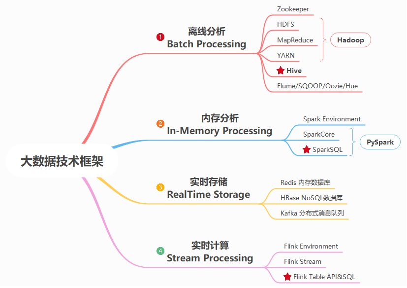

```ini
# 第1部分、离线分析（Batch Processing）
	分布式协作服务框架Zookeeper
	大数据基础框架Hadoop（HDFS、MapReduce和YARN）
	大数据数仓框架Hive
	大数据辅助框架：FLUME、SQOOP、Oozie和Hue

# 第2部分、内存分析（In-Memory Processing）
	Apache Spark（Environment环境、Core、SQL等），属于批处理，相比MapReduce快
	将分析数据封装到数据结构：RDD（分布式集合），类似Python中列表list，调用函数处理数据

# 第3部分、实时存储
	基于Key-Value内存数据Redis
	大数据NoSQL海量数据库HBase
	分布式消息队列Kafka
	
# 第4部分、实时计算
	Apache Flink（实时流式计算框架，天猫双十一实时大屏）：Environment、DataStream和Table API & SQL
		数据流封装DataStream，调用函数处理
		Table API和SQL批处理和流计算
```

## 集中式计算和分布式计算

> ​	对于数据的计算形式可以多种多样，如果从数据处理的历史进程来划分，可以分为：**大数据时代之前的集中式数据计算**和**大数据时代的分布式数据计算**。


​																		[数据计算定义：将特定数据集处理成业务需要的样子。]()

> 1、集中式计算：在大数据时代之前的数据计算，可以称之为集中式计算，所谓集中式，意思就是**单个进程内部或者单机内部对数据进行计算**。


- 最大的瓶颈是**只能利用单台服务器的资源**，因此其计算规模很容易达到极限。

> 2、分布式计算：**针对一类数据进行计算过程中，将共性部分进行抽象形成的软件框架叫做计算引擎**。

- MapReduce 作为大数据时代分布式计算的开山鼻祖，具有划时代意义，**最核心的思想就是：分而治之**。
- 原来一台机器搞不定，那就多台机器一起帮忙，**每台机器计算一部分，然后将每台机器计算的结果再传到其中的一台或者几台机器进行汇总，最终得出计算结果**。
- 对于大数据时代而言，其**数据计算的共性部分就是map跟reduce**。注意，这里的map跟reduce是广义的。


## Spark框架概述

### Spark发展及概念

​			Apache  Spark是一个开源的类似于Hadoop MapReduce的==通用的并行计算框架==，Spark基于map reduce算法实现的分布式计算，拥有Hadoop MapReduce所具有的优点；**但不同于MapReduce的**是Spark中的Job中间输出和结果**可以保存在内存中**，从而不再需要频繁读写磁盘，因此Spark能更好地适用于数据挖掘与机器学习等需要迭代的map reduce的算法。


- 2009年Spark诞生于伯克利AMPLab，伯克利大学的研究性项目
- 2010年通过BSD 许可协议正式对外开源发布
- 2012年Spark第一篇论文发布，第一个正式版（Spark 0.6.0）发布
- 2013年Databricks公司成立并将Spark捐献给Apache软件基金会
- 2014年2月成为Apache顶级项目，同年5月发布Spark 1.0正式版本
- 2015年引入DataFrame大数据分析的设计概念
- 2016年引入DataSet更强大的数据分析设计概念并正式发布Spark2.0
- 2017年Structured streaming 发布，统一化实时与离线分布式计算平台
- 2018年Spark2.4.0发布，成为全球最大的开源项目
- 2019年11月Spark官方发布3.0预览版
- 2020年6月Spark发布3.0.0正式版

​	Aapche Spark 是一种快速、通用、可扩展的**大数据分析引擎**，2009 年诞生于加州大学伯克利分校 AMPLab，2010 年开源， 2013年6月成为Apache孵化项目，2014年2月成为 Apache 顶级项目，`用 Scala进行编写项目框架`。


​	从世界著名的开发者论坛，Stack Overflow的数据可以看出，2015年开始Spark每月的问题提交数量已经超越Hadoop，而2018年Spark Python版本的API PySpark每月的问题提交数量也已超过Hadoop。2019年排名Spark第一，PySpark第二；而十年的累计排名是Spark第一，PySpark第三。按照这个趋势发展下去，**Spark和PySpark在未来很长一段时间内应该还会处于垄断地位。**

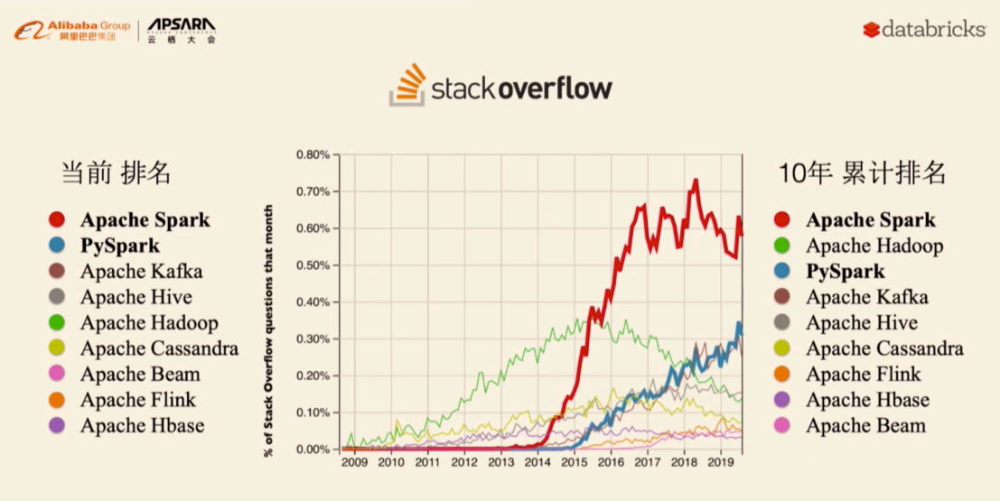

> Apache Spark是用于**大规模数据（large-scala data）**处理的**统一（unified）**分析引擎。

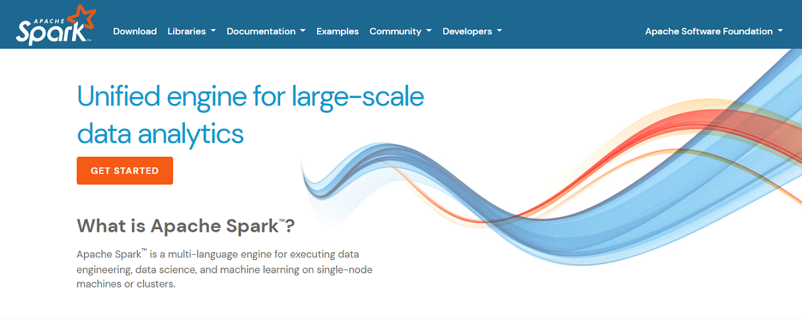

- 1、Apache Spark 官网：http://spark.apache.org/
- 2、Databricks 官网：https://databricks.com/spark/about


```ini
Aapche Spark 是一种快速、通用、可扩展的大数据分析引擎，基于内存分析数据，可以处理任何类型数据业务分析。

# 1、分析引擎（计算引擎）
	分析处理数据，类似MapReduce框架(分布式处理框架，分而治之思想)
# 2、大规模数据
	海量数据，数据很多，多数据源（存储在任何地方数据）
# 3、统一的分析引擎
	离线分析
	实时计算
	机器学习: 推荐系统
	图形计算: 计算最短最优路径, 导航软件
	科学计算: Pandas, R语言
# 4、分布式并行计算
	分而治之思想，与MapReduce计算思想完全一致
```

> Spark具有**运行速度快、易用性好、通用性强和随处运行**等特点。http://spark.apache.org/

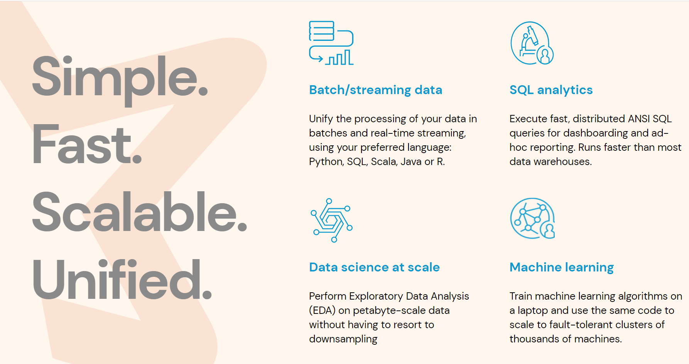

- **Batch/Streaming data**：统一化离线计算和实时计算开发方式，支持多种开发语言
- **SQL analytics**：通用的SQL分析快速构建分析报表，运行速度快于大多数数仓计算引擎
- **Data science at scale**：大规模的数据科学引擎，支持PB级别的数据进行探索性数据分析
- **Machine learning**：支持在笔记本电脑上训练机器学习算法，并使用相同的代码扩展到数千台机器的集群

> Spark编程支持5种语言：`Java、Scala、Python、R及SQL`，满足各种分析需求，目前Python语言全球最多

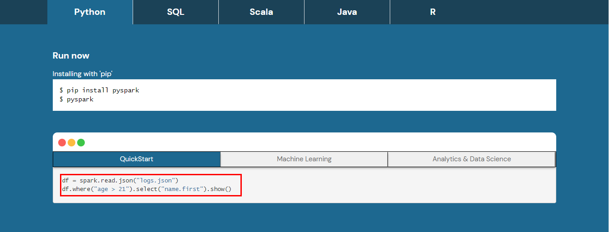

> Spark框架中，最核心要点：抽象，称为`RDD`，是一种封装数据结构, 相当于集合，比如列表List，存储数据

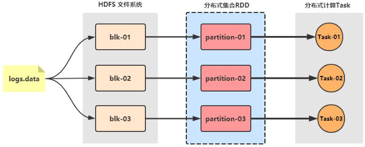

> Spark程序无处不在运行【`Runs Everywhere`】

- 1、数据存储

  [Spark分析的数据在哪里？任何地方都是可以，最主要还是HDFS、Hive、HBase、Kafka等等]()

  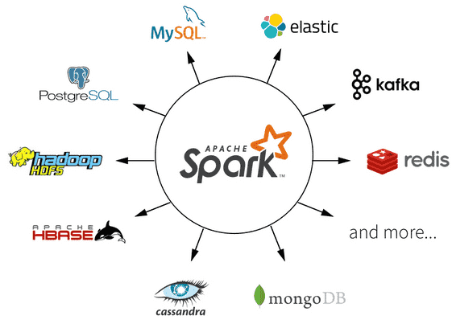

  

- 2、程序运行

  **Spark 编程代码，在何处执行，分析数据？？**

  [本地模式、集群模式【Hadoop `YARN`、Mesos、Standalone】、`容器（K8s）`]()

  

### ★Spark vs MapReduce

> ​	2014 年的时候Benchmark测试中，Spark 秒杀Hadoop，在使用十分之一计算资源的情况下，相同数据的排序上，Spark 比Map Reduce快3倍！

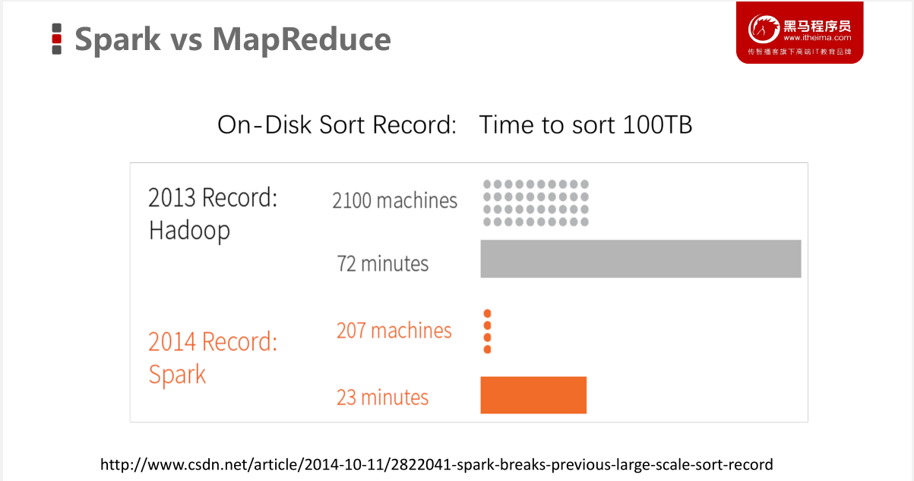

> Spark处理数据与MapReduce处理数据相比，有如下两个不同点：

- 1、其一、Spark处理数据时，可以将==中间处理结果数据存储到内存==中；

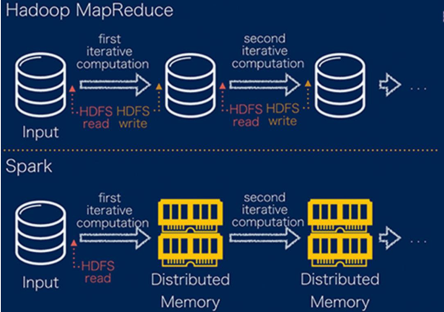

- 2、其二、Spark Job调度以`DAG（有向无环图）`方式，并且每个任务Task执行以`线程（Thread）`方式，并不是像MapReduce以`进程（Process）方式`执行。

> ​		Spark是一个通用的DAG引擎，使得用户能够在一个应用程序中描述复杂的逻辑，以便于优化整个数据流，并让不同计算阶段直接通过本地磁盘或内存交换数据，而不是像MapReduce那样需要通过HDFS。


下面左图是MapReduce生成的DAG数据流，右图是Spark生成的DAG数据流。

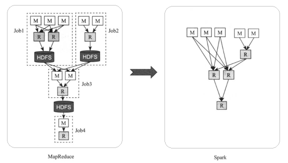

> Spark 与 MapReduce 比较：Spark 为什么比MapReduce计算要快？

|     比较方面     |         MapRedue 计算引擎          |                    Spark 计算引擎                     |
| :--------------: | :--------------------------------: | :---------------------------------------------------: |
| 1、Job 程序结构  |  1 个Map Stage + 1个 Reduce Stage  | 构架DAG图，多个Stage, 多个Map Stage + 多个Redue Stage |
| 2、中间结果存储  |            本地磁盘Disk            |             没有Shuffle时，存储内存Memory             |
| 3、Task 运行方式 | 进程Process：MapTask 和Reduce Task |         线程Thread：Task，无需频繁启动和销毁          |
| 4、程序编程模型  |   直接读取文件数据，map + reduce   |            文件数据封装：RDD，调用函数处理            |

### Spark框架模块

> ​	整个Spark 框架模块包含：Spark `Core`、 Spark `SQL`、 Spark Streaming、 Spark GraphX、Spark MLlib，而后四项的能力都是建立在核心引擎之上 。


```ini
# 1、最核心，最基础
	SparkCore【★★★★★】：RDD 数据结构，分布式集合，目前理解为列表list=[1,2,3,4]

# 2、四大公共模块
	SparkSQL【★★★★★★★★★★】：使用最多模块，提供SQL和DSL编程分析数据
	SparkStreaming：流式计算
	GraphX：图形计算
	MLlib：机器学习库
	
# 3、高级分析模块
	PySpark：基于Python语言编程
	SparkR：基于R语言编程

# 4、新的模块：从Spark 2.0开始
	Structured Streaming：针对流式数据处理模块，官方推荐使用
```

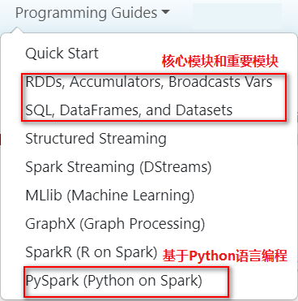

### ★Spark应用组成

> 每个MapReduce运行时（比如运行YARN集群），由2部分组成：

- **MRAppMaster：MapReduce**应用程序管理者，负责申请资源，调度任务执行和监控等；
- **MapTask或ReducetTask**：要么是处理数据任务MapTask，要么是聚合数据任务ReduceTask；

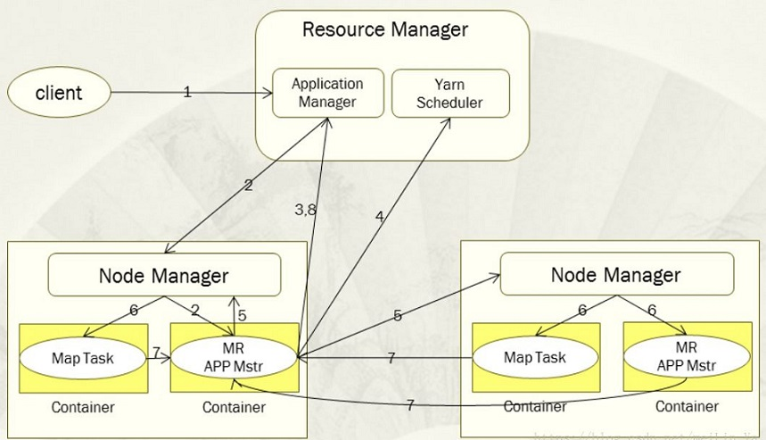

> 每个Spark 应用运行在集群上时，有2部分组成：`Driver和Executors`

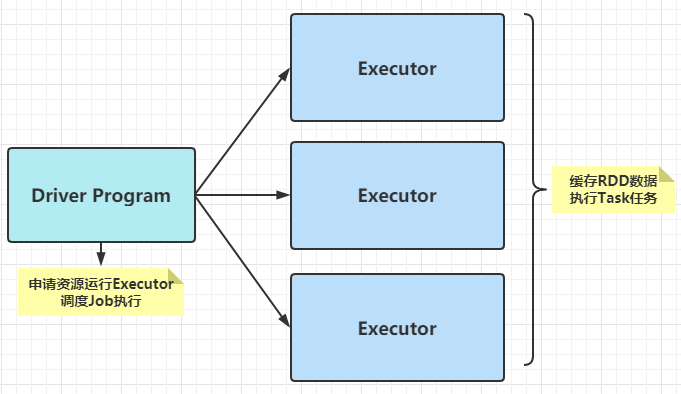

- ==第一、Driver Program==

  

- ==第二、Executors==

  


### Spark运行模式

> ​	Spark 框架编写的应用程序可以运行在`本地模式（Local Mode）`、`集群模式（Cluster Mode）`和**云模式（K8s）**，方便开发测试和生产部署。[基于当前最新版本：Spark-3.1.2 版本学习。]()

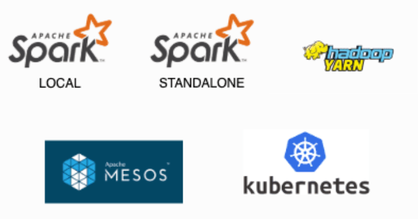


> - 第一、本地模式：`Local Mode`，[在当前操作系统，启动1个JVM 进程，指定最多同时运行Task任务数目，以线程Thead方式运行Task任务]()

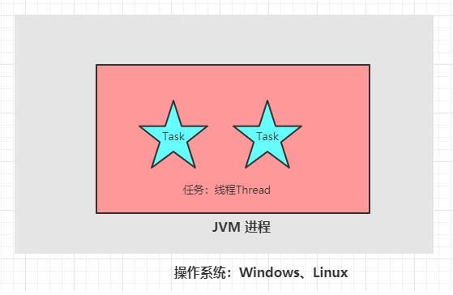

当Spark程序运行在本地模式时，设置最多同时运行几个Task：`--master local[K]`，其中K含义

- [ ] 其一、表示==并行Task数目==；
- [ ] 其二、表示线程数目（每个Task任务以线程Thread方式运行）；
- [ ] 其三、表示虚拟CPU Cores核数（在Spark程序运行时，1个Task任务，需要1Core CPU）

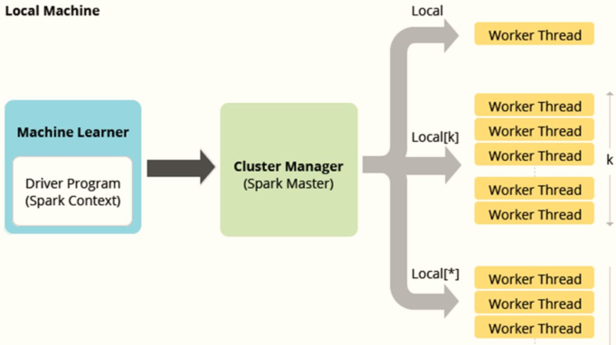

> - 第二、集群模式：`Cluster Mode`，[以Standalone集群和YARN集群为例讲解]()

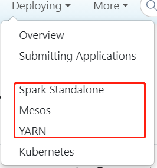

​			在实际项目中，Spark 应用程序运行最多集群模式：`Hadoop YARN`。

```ini
# 1、Hadoop YARN集群模式（生产环境使用）：
	运行在 YARN 集群之上，由 YARN 负责资源管理，Spark 负责任务调度和计算
	好处：计算资源按需伸缩，集群利用率高，共享底层存储，避免数据跨集群迁移。
	
# 2、Spark Standalone集群模式（开发测试及生成环境使用）：
	类似Hadoop YARN架构，典型的Mater/Slaves模式，使用Zookeeper搭建高可用，避免Master是有单点故障的。
	
# 3、 Apache Mesos集群模式（国内使用较少）：
	运行在 Mesos 资源管理器框架之上，由 Mesos负责资源管理，Spark 负责任务调度和计算。
```

> - 第三、云模式：`Kubernetes` 模式，[中小公司未来会更多的使用云服务，Spark 2.3开始支持将Spark 开发应用运行到K8s上。]()

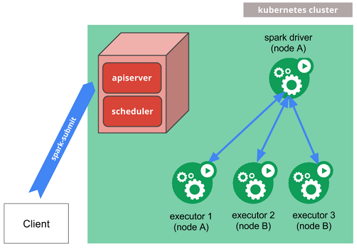

## Spark快速入门

### ★Anaconda软件安装

使用Python编写Spark代码，首先需要安装Python语言包，此时安装Anaconda科学数据分析包。


> ​	Anaconda是一个**开源的Python发行版本**，其包含了conda、Python等180多个科学包及其依赖项。Anaconda 是跨平台的，有 Windows、MacOS、Linux 版本。

```ini
# 下载地址：	
	https://repo.anaconda.com/archive/
```

> 使用Python编程Spark程序，无论是开发还是运行，需要安装如下基本组件：

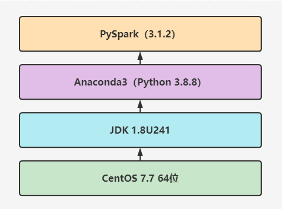

```ini
# 可以直接安装Spark 软件包
	包含pyspark库
	spark-3.1.2-bin-hadoop3.2.tgz
	
# 直接安装pyspark库
	pip install pyspark==3.1.2
```

> 在CentOS7系统上安装**Anaconda3-2021-05**版本，具体步骤如下，[集群所有集群如下方式安装。]()

1、安装包上传并解压

```bash
[root@node1 ~]# cd /export/server/
[root@node1 server]# rz

[root@node1 server]# chmod u+x Anaconda3-2021.05-Linux-x86_64.sh 

[root@node1 server]# sh ./Anaconda3-2021.05-Linux-x86_64.sh 
第一次：【直接回车】
    Please, press ENTER to continue
    >>> 
第二次：【输入yes】
	Do you accept the license terms? [yes|no]
	[no] >>> yes
第三次：【输入解压路径：/export/server/anaconda3】
	[/root/anaconda3] >>> /export/server/anaconda3
第四次：【输入yes，是否在用户的.bashrc文件中初始化Anaconda3的相关内容】
	Do you wish the installer to initialize Anaconda3
    by running conda init? [yes|no]
    [no] >>> yes
```

2、进入 conda 虚拟环境

​	第一次需要先激活，命令行键入以下命令： `source /root/.bashrc`，进入conda默认虚拟环境(base)

```bash
[root@node1 ~]# source /root/.bashrc

## 测试python3
(base) [root@node1 ~]# python3
Python 3.8.8 (default, Apr 13 2021, 19:58:26) 
[GCC 7.3.0] :: Anaconda, Inc. on linux
Type "help", "copyright", "credits" or "license" for more information.
>>> print("Hello Python")
Hello Python
```

3、设置系统环境变量

```bash
[root@node1 ~]# vim /etc/profile
```

文件末尾，添加内容：

```ini
# Anaconda Home
export ANACONDA_HOME=/export/server/anaconda3
export PATH=$PATH:$ANACONDA_HOME/bin
```

设置环境变量生效

```bash
[root@node1 ~]# source /etc/profile
```

4、创建软链接

```ini
[root@node1 ~]# ln -s /export/server/anaconda3/bin/python3 /usr/bin/python
```

> **注意**：集群中三台机器node1、node2和node3都需按照上述步骤安装Anconada3，不要使用`scp`命令拷贝。

### ★Spark Python Shell

> ​	在Spark框架中，提供基于Python交互式命令：`pyspark`，以本地模式运行：`启动一个JVM Process进程，执行任务Task，`通过`--master`参数 指定运行模式。


> 本地模式启动JVM Process进程，示意图：

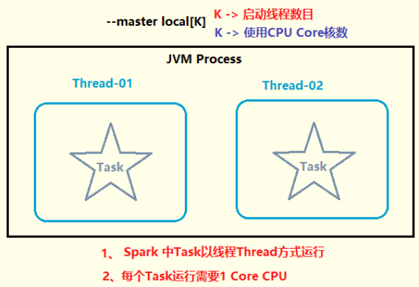

- 1、框架安装包上传解压

```bash
# 第一、进入软件安装目录
(base) [root@node1 ~]# cd /export/server/
# 第二、上传框架软件包
(base) [root@node1 server]# rz
# 第三、赋予执行权限
(base) [root@node1 server]# chmod u+x spark-3.1.2-bin-hadoop3.2.tgz 

# 第四、解压软件包
(base) [root@node1 server]# tar -zxf spark-3.1.2-bin-hadoop3.2.tgz 
# 第五、赋予root用户和组
(base) [root@node1 server]# chown -R root:root spark-3.1.2-bin-hadoop3.2

# 第六、重命名为spark-local
(base) [root@node1 server]# mv spark-3.1.2-bin-hadoop3.2 spark-local
```

- 2、启动`pyspark shell`命令行

```bash
# 第一、进入spark框架安装目录
(base) [root@node1 ~]# cd /export/server/spark-local
(base) [root@node1 spark-local]# ll

# 查看Spark软件安装包目录结构：
```

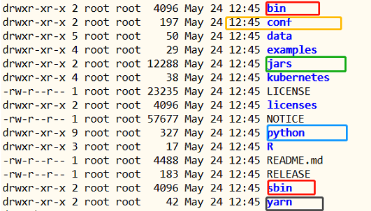

```bash
# 第二、启动pyspark shell命令行，设置本地模式运行
(base) [root@node1 ~]# /export/server/spark-local/bin/pyspark --master local[2]

Python 3.8.8 (default, Apr 13 2021, 19:58:26) 
[GCC 7.3.0] :: Anaconda, Inc. on linux
Type "help", "copyright", "credits" or "license" for more information.
21/09/18 15:08:25 WARN NativeCodeLoader: Unable to load native-hadoop library for your platform... using builtin-java classes where applicable
Using Spark's default log4j profile: org/apache/spark/log4j-defaults.properties
Setting default log level to "WARN".
To adjust logging level use sc.setLogLevel(newLevel). For SparkR, use setLogLevel(newLevel).
Welcome to
      ____              __
     / __/__  ___ _____/ /__
    _\ \/ _ \/ _ `/ __/  '_/
   /__ / .__/\_,_/_/ /_/\_\   version 3.1.2
      /_/

Using Python version 3.8.8 (default, Apr 13 2021 19:58:26)
Spark context Web UI available at http://node1.itcast.cn:4040
Spark context available as 'sc' (master = local[2], app id = local-1631948908036).
SparkSession available as 'spark'.
>>> 
```

其中，==创建SparkContext实例对象：`sc` 和 SparkSession会话实例对象：`spark`==，方便加载数据源数据。


- ==1、Spark context Web UI available at== http://node1.itcast.cn:4040
  - 每个Spark应用运行，提供WEB UI监控页面，默认端口号：`4040`
- ==2、Spark context available as 'sc' (master = local[2], app id = local-1631948908036).==
  - 创建SparkContext类对象，名称为：`sc`
  - Spark应用程序入口，读取数据和调度Job执行

- ==3、Spark session available as 'spark'.==
  - Spark2.0开始，提供新的程序入口：SparkSession，创建对象，名称为：`spark`	

> ​	启动`pyspark shell`命令行后，可以直接书写**pyspark和python代码**， 数据分析处理，如果是pyspark代码，将运行Task任务计算处理数据。

**案例演示**：[并行化列表为RDD，对其中元素进行平方]()。


```python
# 第一、创建RDD，并行化列表
>>> input_rdd = sc.parallelize([1, 2, 3, 4, 5])
>>> 
# 第二、对集合中每个元素平方
>>> result_rdd = input_rdd.map(lambda number: number * number)
>>> 
# 第三、将RDD数据转存本地列表List
>>> result_rdd.collect()
[1, 4, 9, 16, 25]     
```


### 词频统计WordCount


### 运行圆周率PI


## Standalone集群

### 架构及安装部署


### 服务启动及测试


### ★应用运行架构


### 高可用HA