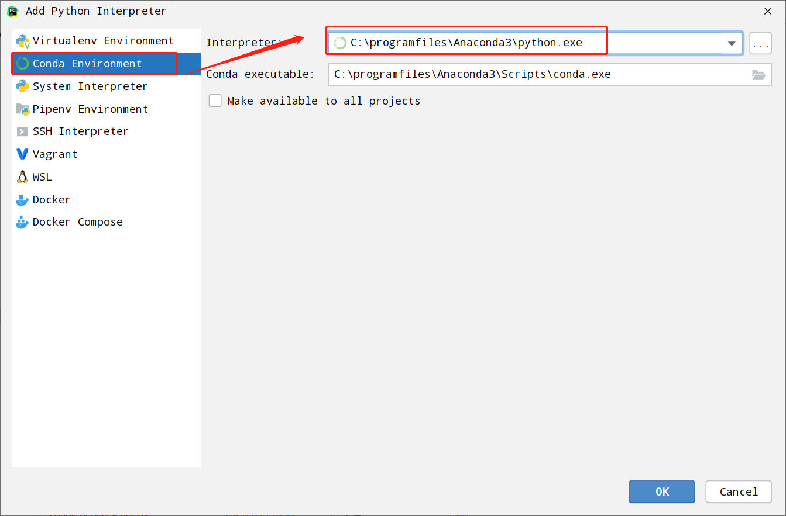
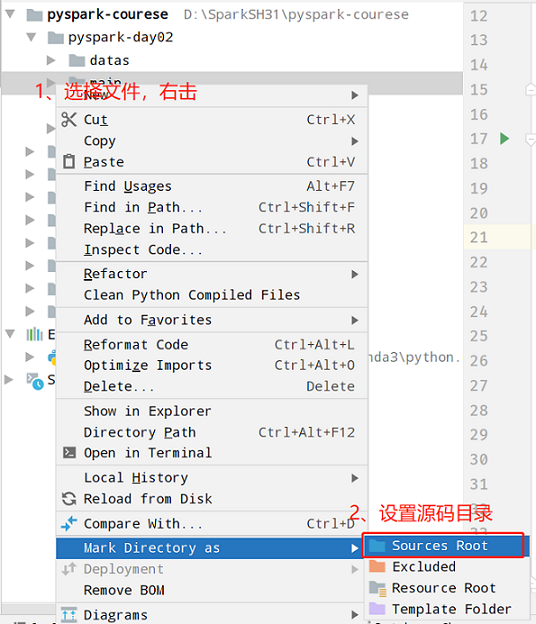
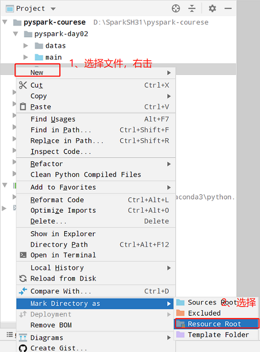
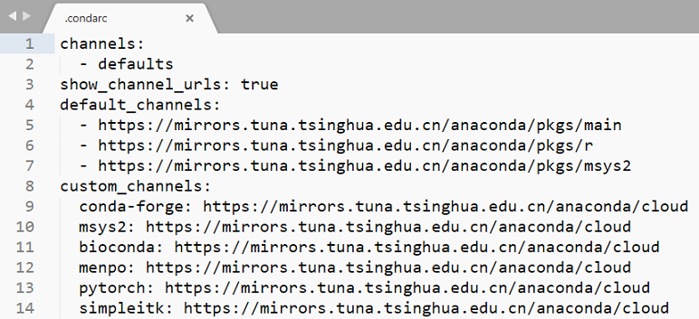

# PySpark安装部署与应用开发

## PySpark应用开发

### Windows环境准备

> 无论在Windows系统还是Linux系统开发PySpark程序（使用Python编写Spark代码），需要安装一些软件：


```ini
# 1、安装JDK 8
	Spark 框架使用Scala语言编写，最终运行代码转换为字节码，运行在JVM 虚拟机中

# 2、安装Hadoop 3.3.0
	Spark 程序往往读写HDFS上文件数据，在Windows系统需要Hadoop库包支持

# 3、安装Python3
	使用Python语言编写代码，安装Python语言包，此处使用Anaconda科学工具包
	
# 4、安装pyspark模块（库）
	在PyCharm中开发PySpark代码时，需要使用pyspark库，调用Spark 提供API
```

- 1、Windows 系统安装JDK

> 直接解压提供JDK压缩包： `jdk1.8.0_241.zip`到指定目录（建议：英文字符目录）中，比如解压路径：`D:\BigdataUser\Java`


- 2、Windows 系统安装Hadoop

> 直接解压提供的`hadoop-3.3.0-Windows.zip`到指定（建议：英文字符目录）中，比如解压路径：`D:\BigdataUser`
>
> 配置java环境变量: 


​	将 `hadoop-3.3.0\hadoop.dll`文件放入到Windows系统目录：`C:\Windows\System32`，重启电脑。


- 3、Windows 系统安装Anaconda

> 在讲解Pandas时，已经安装完整，同样建议安装目录为英文字符目录，比如安装目录为：`C:\programfiles\Anaconda3`


- 4、Anaconda 中安装pyspark库

> ​	使用PyCharm开发PySpark代码时，需要选择Python解释器，其中需要包含pyspark库，[在Anaconda 基础虚拟环境base中安装pyspark库]()。

```bash
# step1、切换虚拟环境
conda activate base
```


```ini
# step2、安装pyspark类库
pip install pyspark==3.1.2 -i https://pypi.tuna.tsinghua.edu.cn/simple
```

> ​	`pyspark库`在Anaconda中**base基础虚拟环境**安装完成以后，查看`$ANACONDA_HOME/Lib/site-packages`目录，添加【`py4j`】和【`pyspark`】目录。


> 至此，在Windows系统下，使用PyCharm开发PySpark程序环境准备全部完成。

### ★构建PyCharm Project

> 本次Spark课程中所有代码，都是基于Python语言开发，使用PyCharm集成开发环境。


> 在Windows上创建PyCharm Project工程，设置Python解析器Interpreter，如下步骤设置：

- 1、打开PyCharm软件，点击【Create New Project】创建新的工程


- 2、指定工程的名称（路径）、选择Window系统中安装Anaconda的base基础虚拟环境即可。


- 3、添加Anaconda中base基础虚拟环境



点击【OK】以后，为创建新工程Project添加刚刚指定Python Interpreter解释器


点击【Create】安装，创建新的PyCharm Project。

> ​	**约定规范**：每天Spark课程，创建一个目录，比如第二天课程代码，目录名称：`pyspark-day02`，包含四个子目录：
>
> - `main`目录：源码目录，编写python代码存放位置
> - `resources`目录：资源目录，存储配置文件
> - `datas`目录：测试数据存储
> - `test` 目录：编写Python测试代码


- 代码目录：`main`



- 资源文件目录：`resources`



> 编写Python测试代码：**HelloWorld程序**，文件名称：`python_hello_world.py`。

```python
#!/usr/bin/env python
# -*- coding: utf-8 -*-

if __name__ == '__main__':
    """
    Python 入门程序：Hello World
    """
    print("Hello World.................")
```

​	执行Python代码，控制台打印：`Hello World`。


### ★应用入口 - SparkContext


### ★WordCount编程实现


### ★远程Python解析器


## Spark应用提交

### spark-submit命令


### ★提交执行WordCount


### 部署模式DeployMode


### Job作业组成


## Spark on YARN

### Hadoop YARN


### ★配置部署及测试


### ★yarn-client模式


### ★yarn-cluster模式


## 配置Anaconda下载镜像源地址

> ​	有时候pip install 或conda install 安装一些依赖包，网不好直接超时，或者包死都下不下来，可以配置或指定国内源镜像。

- 1）、Windows 系统，配置镜像源

第1步、创建 .condarc 配置文件，Windows系统文件位置：C:/Users/用户名/.condarc

```ini
conda config --set show_channel_urls yes
```


​	第2步、编辑文件 `.condarc`，**删除**里面所有内容，替换如下内容

```ini
channels:
  - defaults
show_channel_urls: true
default_channels:
  - https://mirrors.tuna.tsinghua.edu.cn/anaconda/pkgs/main
  - https://mirrors.tuna.tsinghua.edu.cn/anaconda/pkgs/r
  - https://mirrors.tuna.tsinghua.edu.cn/anaconda/pkgs/msys2
custom_channels:
  conda-forge: https://mirrors.tuna.tsinghua.edu.cn/anaconda/cloud
  msys2: https://mirrors.tuna.tsinghua.edu.cn/anaconda/cloud
  bioconda: https://mirrors.tuna.tsinghua.edu.cn/anaconda/cloud
  menpo: https://mirrors.tuna.tsinghua.edu.cn/anaconda/cloud
  pytorch: https://mirrors.tuna.tsinghua.edu.cn/anaconda/cloud
  simpleitk: https://mirrors.tuna.tsinghua.edu.cn/anaconda/cloud
```



- 2）、Linunx系统，配置镜像源地址

step1、切换虚拟环境

```ini
conda activate base
```

step2、创建 `.condarc` 配置文件，Linux系统文件位置：`/root/.condarc`

```ini
conda config --set show_channel_urls yes
```

step3、编辑文件 /root/.condarc，删除里面所有内容，替换如下内容

```ini
channels:
  - defaults
show_channel_urls: true
default_channels:
  - https://mirrors.tuna.tsinghua.edu.cn/anaconda/pkgs/main
  - https://mirrors.tuna.tsinghua.edu.cn/anaconda/pkgs/r
  - https://mirrors.tuna.tsinghua.edu.cn/anaconda/pkgs/msys2
custom_channels:
  conda-forge: https://mirrors.tuna.tsinghua.edu.cn/anaconda/cloud
  msys2: https://mirrors.tuna.tsinghua.edu.cn/anaconda/cloud
  bioconda: https://mirrors.tuna.tsinghua.edu.cn/anaconda/cloud
  menpo: https://mirrors.tuna.tsinghua.edu.cn/anaconda/cloud
  pytorch: https://mirrors.tuna.tsinghua.edu.cn/anaconda/cloud
  simpleitk: https://mirrors.tuna.tsinghua.edu.cn/anaconda/cloud
```

> 也可以使用 `pip` 安装包时，通过 `i` 指定镜像源地址：`pip install -i 国内镜像地址 包名`

```
pip install -i  http://mirrors.aliyun.com/pypi/simple/ numpy
```

国内镜像源地址：

```ini
清华：https://pypi.tuna.tsinghua.edu.cn/simple
阿里云：http://mirrors.aliyun.com/pypi/simple/
中国科技大学 https://pypi.mirrors.ustc.edu.cn/simple/
华中理工大学：http://pypi.hustunique.com/
山东理工大学：http://pypi.sdutlinux.org/ 
豆瓣：http://pypi.douban.com/simple/
```