# RDD弹性分布式数据集

## -I. PyCharm创建代码模板Template

> 编写每次PySpark程序，都是如下5步，其中第1步和第5步相同的，每次都要重新写一遍非常麻烦，[可以在PyCharm中构建PySpark程序的代码模板。]()


> PyCharm 中设置 Python 代码模板：**设置 File > Settings > File and Code Template > Python Script**


新建Python Spark程序模板Template：`PySpark Linux Script`


```python
#!/usr/bin/env python
# -*- coding: utf-8 -*-

import os
from pyspark import SparkConf, SparkContext

if __name__ == '__main__':
    """
       
    """
    # 设置系统环境变量
    os.environ['JAVA_HOME'] = '/export/server/jdk'
    os.environ['HADOOP_HOME'] = '/export/server/hadoop'
    os.environ['PYSPARK_PYTHON'] = '/export/server/anaconda3/bin/python'
    os.environ['PYSPARK_DRIVER_PYTHON'] = '/export/server/anaconda3/bin/python'

    # 1. 获取上下文对象-context
    spark_conf = SparkConf().setAppName("PySpark Example").setMaster("local[2]")
    sc = SparkContext(conf=spark_conf)

    # 2. 加载数据源-source

    # 3. 数据转换处理-transformation

    # 4. 处理结果输出-sink

    # 5. 关闭上下文对象-close
    sc.stop()

```

## I. RDD概念

### 1. 分布式计算思想

> 首先回顾一下，MapReduce分布式并行计算引擎思想：[先分再合，分而治之]()

所谓“分而治之”就是**把一个复杂的问题，按照一定的“分解”方法分为等价的规模较小的若干部分，然后逐个解决，分别找出各部分的结果，然后把各部分的结果组成整个问题的最终结果**。


> 基于MapReduce实现词频统计WordCount，流程分为5个部分：input 、**map、shuffle、reduce**、output。


```ini
# MapReduce 对海量数据处理时，分为3个大方面，每个方面都是操作数据
    step1、输入数据input
    step2、处理数据transformation
        map、shuffle、reduce
    step3、输出数据output
```

> 在Spark计算引擎中，思想与MapReduce一样，但是**将输入数据、处理数据和输出数据封装抽象，称为RDD（弹性分布式数据集）**，便于==对数据管理和对数据操作方便==（调用RDD 函数即可）。


> Spark实现词频统计，首先将要处理数据封装到RDD，处理数据时，直接调用函数，最后将结果RDD输出。

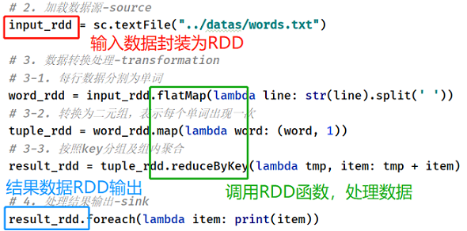

> 思考：Spark中RDD到底是什么呢？[RDD就是一个集合，封装数据，往往数据是大规模海量数据]()

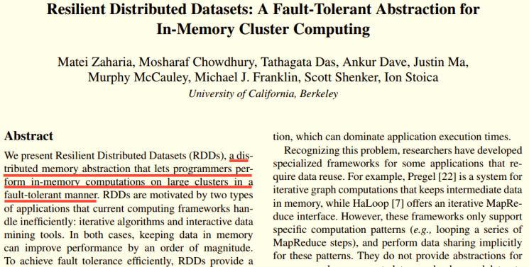

```
官方文档：
	https://spark.apache.org/docs/3.1.2/rdd-programming-guide.html
```

### 2. RDD是什么

> `RDD（Resilient Distributed Dataset）`叫做==弹性分布式数据集==，是Spark中最基本的**数据抽象**，代表一个**不可变**、**可分区**、里面的元素可**并行计算**的集合。

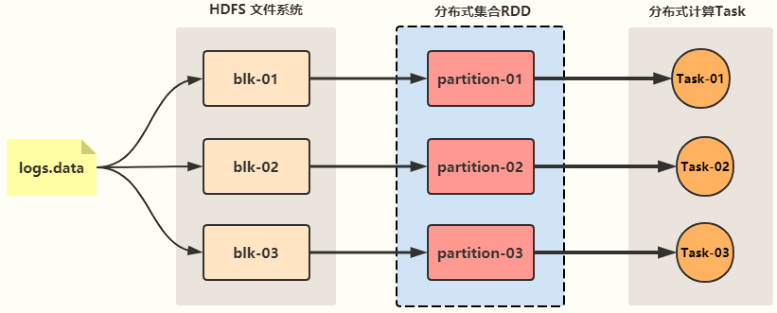

> RDD 分布式集合，三个主要特质：**不可变的集合、分区的集合和并行处理数据的集合**。

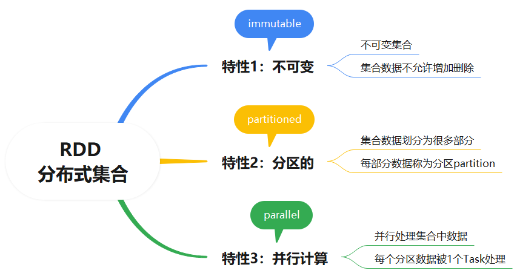

> RDD分布式集合，可以认为RDD是==分布式的列表List==，底层源码`RDD`是一个抽象类`Abstract Class`和泛型`Generic Type`：


> 以**词频统计WordCount**程序为例，查看其中所有RDD，其中代码中RDD默认分区数目为2：


### 3. RDD内部五大特性

> RDD 数据结构内部有五个特性（**摘录RDD 源码**）：前3个特性，必须包含的；后2个特性，可选的。


- 第一个：`a list of partitions`

  [每个RDD由一系列分区Partitions组成，一个RDD包含多个分区]()


> 查看RDD中分区数目，调用`getNumPartitios` 方法，返回值int类型，RDD分区数目

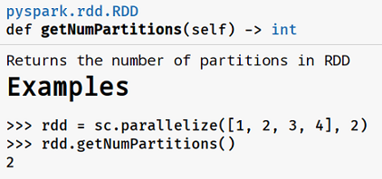

- 第二个：`A function for computing each split`

  [对RDD中数据处理时，每个分区（分片）数据应用函数进行处理，1个分区数据被1个Task处理]()


- 第三个：`A list of dependencies on other RDDs`

  1. [一个RDD依赖于一些列RDD]()

     

  2. RDD的每次转换都会生成一个新的RDD，所以RDD之间就会形成类似于流水线一样的前后依赖关系。

  3. 在部分分区数据丢失时，Spark可以通过这个依赖关系重新计算丢失的分区数据，而不是对RDD的所有分区进行重新计算（Spark的容错机制）；


- 第四个：`Optionally, a Partitioner for key-value RDDs`

  1. [当RDD中数据类型为Key/Value（二元组），可以设置分区器`Partitioner`]()

     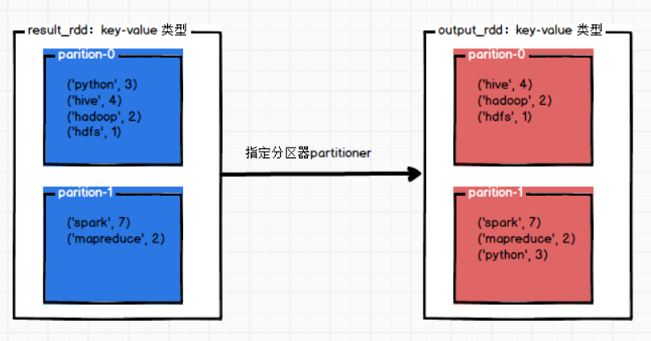

  2. Partitioner函数不但决定了RDD本身的分片数量，也决定了parent RDD Shuffle输出时的
     分片数量。


- 第五个：`Optionally, a list of preferred locations to compute each split on`

  

  1. [对RDD中每个分区数据进行计算时，找到`最佳位置`列表]()
  2. 对数据计算时，考虑数据本地性，**数据在哪里，尽量将Task放在哪里，快速读取数据进行处理**

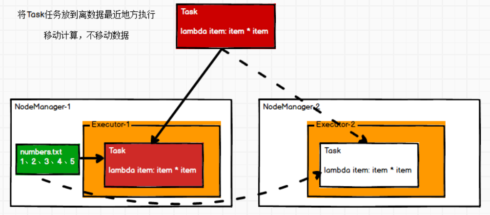

> 再次回顾：RDD是什么呢？
>
> [RDD是Spark 计算引擎中，对数据抽象封装，是一个不可变的、分区的和并行计算集合，方便管理数据和对数据处理分析。]()

## II. RDD创建

### 1. 两种创建方式

> 如何将数据封装到RDD集合，主要有两种方式：`并行化本地集合`（Driver Program中）和`引用加载外部存储系统`（如HDFS、Hive、HBase、Kafka、Elasticsearch等）数据集。


> **方式一：并行化集合**，将一个 Python 中集合（比如列表list）转为RDD集合

- 方法：`parallelize`，将一个集合转换为RDD

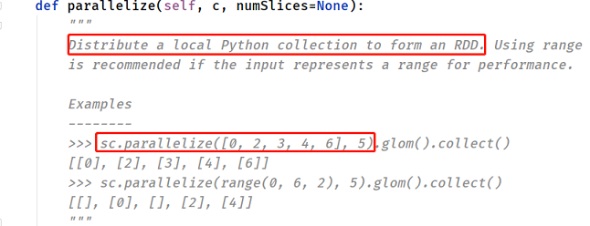

> **方式二：外部存储**，加载外部存储系统的数据集创建RDD

- 方法：`textFile`，读取HDFS或LocalFS上文本文件，指**定文件路径和RDD分区数目**

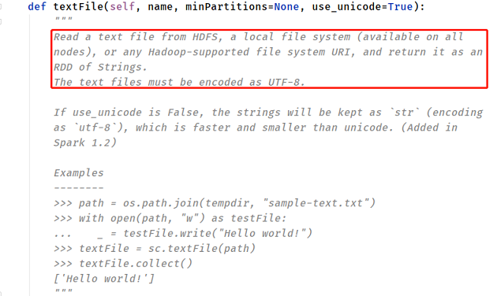

```ini
# 1、如果是HDFS文件，必须使用绝对路径
	hdfs://namenode-host:8020/xxxxx

# 2、如果是LocalFS文件，可以使用相对路径，也可以使用绝对路径
	Windows 系统：file:///D:/datas/words.txt
	Linunx 系统：file:///root/words.txt
```

> 案例代码演示 `01_create_rdd`：并行列表为RDD和加载本地文件系统文件数据为RDD

```python
#!/usr/bin/env python
# -*- coding: utf-8 -*-

import os
from pyspark import SparkConf, SparkContext


if __name__ == '__main__':
    """
    采用2种方式，创建RDD：并行化Python集合和加载文件系统文本文件数据   
    """

    # 设置系统环境变量
    os.environ['JAVA_HOME'] = '/export/server/jdk'
    os.environ['HADOOP_HOME'] = '/export/server/hadoop'
    os.environ['PYSPARK_PYTHON'] = '/export/server/anaconda3/bin/python3'
    os.environ['PYSPARK_DRIVER_PYTHON'] = '/export/server/anaconda3/bin/python3'

    # 1. 获取上下文对象-context
    spark_conf = SparkConf().setAppName("PySpark Example").setMaster("local[2]")
    sc = SparkContext(conf=spark_conf)

    # 2. 加载数据源-source
    # TODO: 2-1. 并行化本地集合
    rdd_1 = sc.parallelize([1, 2, 3, 4, 5, 6, 7, 8, 9, 10], numSlices=2)
    print(rdd_1.getNumPartitions())

    # TODO: 2-2. 读取本地文件系统文本文件数据
    rdd_2 = sc.textFile('../datas/words.txt', minPartitions=2)
    print(rdd_2.getNumPartitions())

    # 3. 数据转换处理-transformation

    # 4. 处理结果输出-sink

    # 5. 关闭上下文对象-close
    sc.stop()

```

### 2. 小文件数据处理

> 在实际项目中，有时往往处理的数据文件属于**小文件（每个文件数据数据量很小，比如KB，几十MB等），文件数量又很大**，如果一个个文件读取为RDD的一个个分区，计算数据时很耗时性能低下，使用SparkContext中提供：**`wholeTextFiles`**方法，专门读取小文件数据。


- 将每个文件作为一条KV存储在RDD中，[K：文件名的绝对路径，V：文件的内容]()
- 用于解决小文件的问题，可以将多个小文件变成多个KV，自由指定分区个数

> 案例代码演示 `02_create_rdd_wholefile.py`：从LocalFS加载文本文件数据，全部为小文件。

```python
#!/usr/bin/env python
# -*- coding: utf-8 -*-

import os
from pyspark import SparkConf, SparkContext

if __name__ == '__main__':
    """
    Spark 中加载小文件数据，使用方法：wholeTextFiles，指定RDD集合分区数目 
    """

    # 设置系统环境变量
    os.environ['JAVA_HOME'] = '/export/server/jdk'
    os.environ['HADOOP_HOME'] = '/export/server/hadoop'
    os.environ['PYSPARK_PYTHON'] = '/export/server/anaconda3/bin/python3'
    os.environ['PYSPARK_DRIVER_PYTHON'] = '/export/server/anaconda3/bin/python3'

    # 1. 获取上下文对象-context
    spark_conf = SparkConf().setAppName("PySpark Example").setMaster("local[2]")
    sc = SparkContext(conf=spark_conf)

    # 2. 加载数据源-source
    # TODO: 指定目录，加载小文件文本数据
    input_rdd = sc.wholeTextFiles('../datas/ratings100', minPartitions=2)

    # 分区数目和条目数
    print("Partitions:", input_rdd.getNumPartitions())
    print("count:", input_rdd.count())

    # 获取第一条数据
    print(input_rdd.first())

    # 3. 数据转换处理-transformation

    # 4. 处理结果输出-sink

    # 5. 关闭上下文对象-close
    sc.stop()

```

## III. RDD算子

### 1. 算子分类

> RDD 的操作主要可以分为 `Transformation` 和 `Action` 两种。


```
文档：
	https://spark.apache.org/docs/3.1.2/rdd-programming-guide.html#rdd-operations
```

> 1、转换算子：`Transformation` ，[当RDD调用算子，对数据进行处理，产生一个新的RDD ；]()

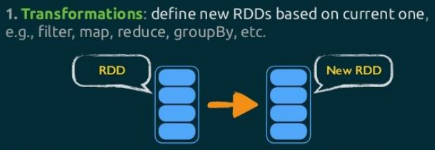

```ini
# 特点：
	属于lazy懒执行，不会立即将1个RDD转换另外1个RDD
	
# 常用算子：
	map、flatMap、filter、reduceByKey等等
```

> 2、触发算子：`Action`，[当RDD调用算子，触发一个Job执行]()


```ini
# 特点：
	RDD调用Action算子，要么没有返回值，要么非RDD类型
	立即执行Job，对RDD数据进行转换，最后输出或获取值

# 常用算子：
	count、collect、foreach、saveAsTextFile等等
```

> RDD 中2类算子（函数）：转换transformation和触发action。


> RDD 中常用基本算子，包含转换算子和触发算子。

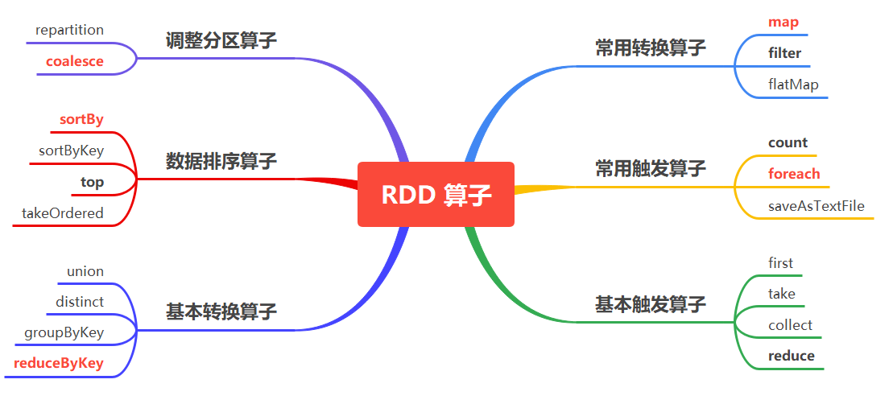

### 2. 常用转换算子


### 3. 常用触发算子


### 4. 基本触发算子


### 5. 基本转换算子


### 6. 数据排序算子


### 7. 调整分区算子


