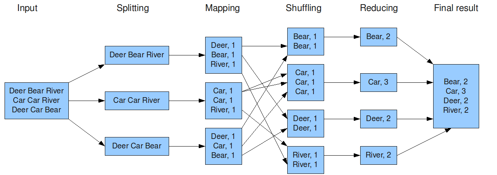

# RDD弹性分布式数据集

## -I. PyCharm创建代码模板Template

> 编写每次PySpark程序，都是如下5步，其中第1步和第5步相同的，每次都要重新写一遍非常麻烦，[可以在PyCharm中构建PySpark程序的代码模板。]()


> PyCharm 中设置 Python 代码模板：**设置 File > Settings > File and Code Template > Python Script**


新建Python Spark程序模板Template：`PySpark Linux Script`


```python
#!/usr/bin/env python
# -*- coding: utf-8 -*-

import os
from pyspark import SparkConf, SparkContext

if __name__ == '__main__':
    """
       
    """
    # 设置系统环境变量
    os.environ['JAVA_HOME'] = '/export/server/jdk'
    os.environ['HADOOP_HOME'] = '/export/server/hadoop'
    os.environ['PYSPARK_PYTHON'] = '/export/server/anaconda3/bin/python'
    os.environ['PYSPARK_DRIVER_PYTHON'] = '/export/server/anaconda3/bin/python'

    # 1. 获取上下文对象-context
    spark_conf = SparkConf().setAppName("PySpark Example").setMaster("local[2]")
    sc = SparkContext(conf=spark_conf)

    # 2. 加载数据源-source

    # 3. 数据转换处理-transformation

    # 4. 处理结果输出-sink

    # 5. 关闭上下文对象-close
    sc.stop()

```

## I. RDD概念

### 1. 分布式计算思想

> 首先回顾一下，MapReduce分布式并行计算引擎思想：[先分再合，分而治之]()

所谓“分而治之”就是**把一个复杂的问题，按照一定的“分解”方法分为等价的规模较小的若干部分，然后逐个解决，分别找出各部分的结果，然后把各部分的结果组成整个问题的最终结果**。


> 基于MapReduce实现词频统计WordCount，流程分为5个部分：input 、**map、shuffle、reduce**、output。



```ini
# MapReduce 对海量数据处理时，分为3个大方面，每个方面都是操作数据
    step1、输入数据input
    step2、处理数据transformation
        map、shuffle、reduce
    step3、输出数据output
```

> 在Spark计算引擎中，思想与MapReduce一样，但是**将输入数据、处理数据和输出数据封装抽象，称为RDD（弹性分布式数据集）**，便于==对数据管理和对数据操作方便==（调用RDD 函数即可）。


> Spark实现词频统计，首先将要处理数据封装到RDD，处理数据时，直接调用函数，最后将结果RDD输出。


> 思考：Spark中RDD到底是什么呢？[RDD就是一个集合，封装数据，往往数据是大规模海量数据]()


```
官方文档：
	https://spark.apache.org/docs/3.1.2/rdd-programming-guide.html
```

### 2. RDD是什么


### 3. RDD内部五大特性


## II. RDD创建

### 1. 两种创建方式


### 2. 小文件数据处理


## III. RDD算子

### 1. 算子分类


### 2. 常用转换算子


### 3. 常用触发算子


### 4. 基本触发算子


### 5. 基本转换算子


### 6. 数据排序算子


### 7. 调整分区算子


