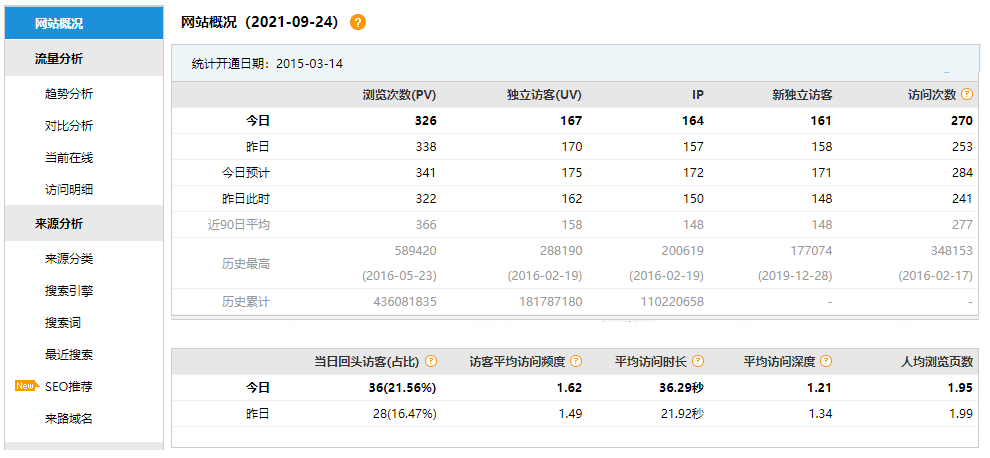
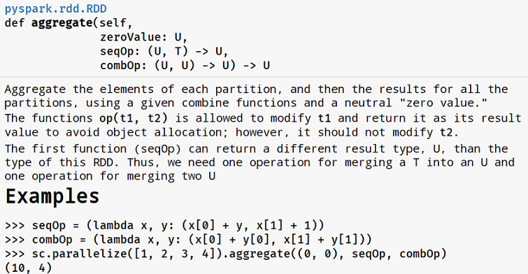

# RDD Operations & Shared Variables

## I. 网站统计分析

### 1. 业务需求分析

> 大数据最早应用场景：离线分析处理网站海量用户行为日志数据，其中 **友盟+**公司开发一系列产品，方便统计分析网站数据。==友盟+== 网站：https://www.umeng.com/



> 从上述图中可以看出，网站统计分析基本指标：`PV、UV、IP`，具体含义如下所示：

- 第一、**PV（page view）**即==页面浏览量==或==点击量==
  - **用户每1次对网站中的每个网页访问均被记录1个PV**，用户对同一页面的多次访问，访问量累计，用以衡量网站用户访问的网页数量；

- 第二、**UV（unique visitor）**即==唯一访客数==
  - 指通过互联网访问、浏览这个网页的自然人。
  - 访问您网站的一台电脑客户端为一个访客，00:00-24:00内相同的客户端只被计算一次。
  - **一天内同个访客多次访问仅计算一个UV。**

- 第三、**IP（Internet Protocol）**即==独立IP==
  - **指访问过某站点的IP总数，以用户的IP地址作为统计依据**，00:00-24:00内相同IP地址之被计算一次。
  - **UV与IP区别**：你和你的家人用各自的账号在同一台电脑上登录新浪微博，则IP数+1，UV数+2。由于使用的是同一台电脑，所以IP不变，但使用的不同账号，所以UV+2。

> 以阿里巴巴移动电商平台的**真实用户-商品行为数据**为基础，进行基本网站指标分析统计：PV、UV等。

- 业务数据：用户浏览网页数据记录日志


- 字段含义：


- 业务需求及分析说明


> 编写PySpark代码，加载用户日志数据，封装为RDD，进行解析，统计每日PV和UV。


### 2. 加载日志数据

> 编写代码 `09_web_analysis.py`：从本地文件系统加载日志数据，解析每条数据，封装元组中。


```python
#!/usr/bin/env python
# -*- coding: utf-8 -*-

import os
from pyspark import SparkConf, SparkContext


if __name__ == '__main__':
    """
    基于阿里提供用户行为日志数据，使用Spark RDD进行基本指标统计分析：pv和uv   
    """

    # 设置系统环境变量
    os.environ['JAVA_HOME'] = '/export/server/jdk'
    os.environ['HADOOP_HOME'] = '/export/server/hadoop'
    os.environ['PYSPARK_PYTHON'] = '/export/server/anaconda3/bin/python3'
    os.environ['PYSPARK_DRIVER_PYTHON'] = '/export/server/anaconda3/bin/python3'

    # 1. 获取上下文对象-context
    spark_conf = SparkConf().setAppName("PySpark Example").setMaster("local[4]")
    sc = SparkContext(conf=spark_conf)

    # 2. 加载数据源-source
    input_rdd = sc.textFile('../datas/tianchi_user.csv', minPartitions=4)
    # print(input_rdd.first())
    # print("count:", input_rdd.count())
    """
    98047837,232431562,1,,4245,2014-12-06 02
    count: 1048575
    """

    # 3. 数据转换处理-transformation
    """
        3-1. 过滤脏数据，解析数据，每条数据封装到元组中
        3-2. pv统计
        3-3. uv统计
    """
    # 3-1. 过滤脏数据，解析数据，每条数据封装到元组中
    """
    对原始日志数据进行ETL转换操作，包括过滤、解析和转换
        数据格式：98047837,232431562,1,,4245,2014-12-06 02
    """
    parse_rdd = input_rdd\
        .map(lambda line: str(line).split(',')) \
        .filter(lambda line: len(str(line).split(',')) == 6) \
        .map(lambda list: (
            list[0], list[1], int(list[2]), list[3], list[4], list[5], str(list[5])[0:10]
        ))
    print("count:", parse_rdd.count())
    print(parse_rdd.first())
    """
        ('98047837', '232431562', 1, '', '4245', '2014-12-06 02', '2014-12-06')
    """

    # 3-2. pv统计
    

    # 3-3. uv统计
    

    # 4. 处理结果输出-sink

    # 5. 关闭上下文对象-close
    sc.stop()

```

### 3. 每日PV统计

> **需求一**：每日PV统计，使用字段【time】，获取访问日期。


```python
# 3-2. pv统计
"""
    ('2014-12-06', 1)
    ('2014-12-06', 1)       ->  reduceByKey
    ('2014-12-06', 1)
    ----------------------------
    解析数据  -map->  ('2014-12-06', 1) -reduceByKey-> ('2014-12-06', 988777) ->coalesce降低RDD分区数目为1 ->sortBy降序排序
    ......
"""
pv_rdd = parse_rdd\
    .map(lambda tuple: (tuple[6], 1))\
    .reduceByKey(lambda tmp, item: tmp + item)\
    .coalesce(1)\
    .sortBy(lambda tuple: tuple[1], ascending=False)
# pv_rdd.foreach(lambda item: print(item))
```


运行程序，输出结果如下：

```ini
('2014-12-12', 59327)
('2014-12-11', 41727)
('2014-12-10', 35835)
('2014-12-03', 34896)
('2014-11-30', 34824)
('2014-12-13', 34801)
('2014-12-14', 34656)
('2014-12-02', 34625)
('2014-12-07', 34400)
('2014-12-04', 34286)
('2014-12-15', 34208)
('2014-12-16', 34077)
('2014-12-09', 33731)
('2014-12-01', 33658)
('2014-12-06', 33119)
('2014-12-17', 33038)
('2014-12-08', 32719)
('2014-11-23', 32458)
('2014-11-24', 32292)
('2014-11-29', 31685)
('2014-11-18', 31581)
('2014-11-25', 31510)
('2014-12-05', 31370)
('2014-11-27', 31338)
('2014-12-18', 31318)
('2014-11-22', 31283)
('2014-11-26', 30792)
('2014-11-20', 30598)
('2014-11-19', 30567)
('2014-11-28', 29817)
('2014-11-21', 28039)
```

### 4. 每日UV统计

## II. RDD算子

### 1. reduce聚合原理


### 2. 数据聚合算子

> 在RDD中除了讲解`reduce`函数聚合外，还有`fold`和`aggregate`算子，也是对RDD中数据聚合，更加灵活。

- 算子：`reduce`


**示意图**：对数值类型RDD中数据求和。


- 算子：`fold`，[比reduce算子，多一个参数，可以设置聚合时中间临时变量的初始值]()


**示意图**：对数值类型RDD中数据求和。


- 算子：`aggregate`，[比如fold多一个参数，分别设置RDD数据集合时局部聚合函数和全局聚合函数]()



**示意图**：对数值类型RDD中数据求和。


> 案例代码演示 `02_rdd_agg.py`：分别使用reduce、fold和aggregate函数对RDD数据求和。

```python
#!/usr/bin/env python
# -*- coding: utf-8 -*-

import os
from pyspark import SparkConf, SparkContext, TaskContext

if __name__ == '__main__':
    """
    RDD中三个数据聚合算子：reduce、fold和aggregate案例演示   
    """

    # 设置系统环境变量
    os.environ['JAVA_HOME'] = '/export/server/jdk'
    os.environ['HADOOP_HOME'] = '/export/server/hadoop'
    os.environ['PYSPARK_PYTHON'] = '/export/server/anaconda3/bin/python3'
    os.environ['PYSPARK_DRIVER_PYTHON'] = '/export/server/anaconda3/bin/python3'

    # 1. 获取上下文对象-context
    spark_conf = SparkConf().setAppName("PySpark Example").setMaster("local[2]")
    sc = SparkContext(conf=spark_conf)

    # 2. 加载数据源-source
    input_rdd = sc.parallelize([1, 2, 3, 4, 5, 6, 7, 8, 9, 10], numSlices=2)

    # 3. 数据转换处理-transformation
    # TODO： reduce 算子
    reduce_value = input_rdd.reduce(lambda tmp, item: tmp + item)
    print("reduceValue:", reduce_value)

    # TODO: fold 算子，需要指定聚合时临时变量初始值
    fold_value = input_rdd.fold(0, lambda tmp, item: tmp + item)
    print("foldValue:", fold_value)

    # TODO: aggregate 算子，先指定聚合临时变量初始值、分区数据聚合函数和分区间数据聚合函数
    agg_value = input_rdd.aggregate(0, lambda tmp, item: tmp + item, lambda tmp, item: tmp + item)
    print("foldValue:", agg_value)

    # 4. 处理结果输出-sink

    # 5. 关闭上下文对象-close
    sc.stop()

```

### 3. KeyValue类型算子


### 4. Join关联算子


### 5. 分区处理算子


## III. SogouQ日志分析

### 1. 业务需求分析


### 2. Jieba中文分词


### 3. 数据加载解析


### 4. 搜索关键词统计


### 5. 用户搜索点击统计


### 6. 搜索时间段统计


