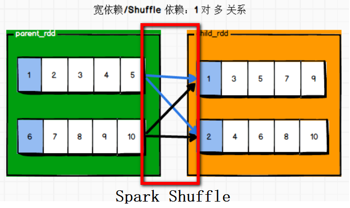
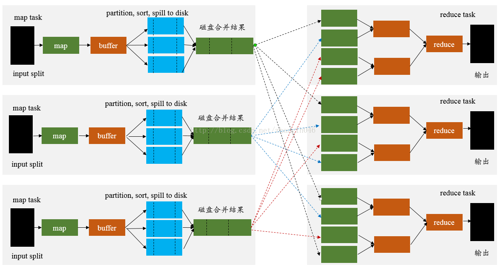
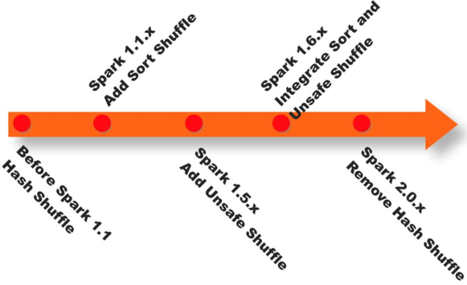
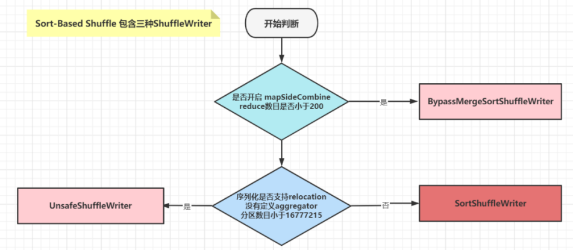
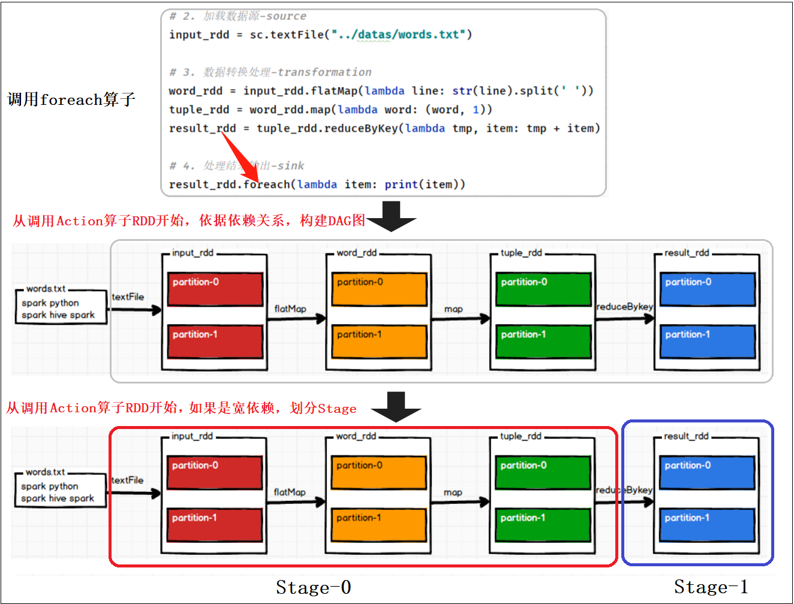
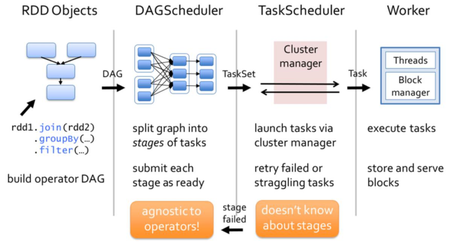
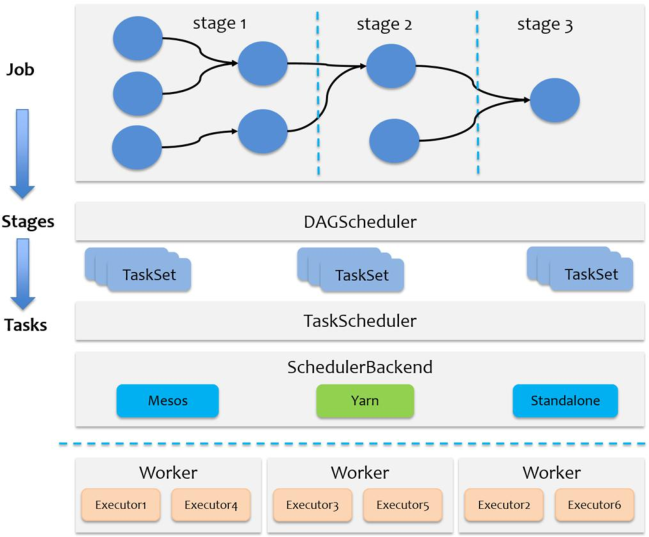

# Spark高级特性与内核调度

## I. Spark高级特性

### 1. RDD持久化


### 2. RDD Checkpoint


### 3. Spark累加器


### 4. Spark广播变量


## II. Spark内核调度

### 1. 应用提交流程

> 当开发完成Spark程序以后，使用`spark-submit`提交执行时，2件事情：

- 第一、申请资源，运行Driver和Executors 进程
- 第二、调度Job，执行Task任务


> 1、使用spark-submit脚本，提交应用执行，比如以==**yarn-cluster**==方式执行


> 2、启动运行Driver Program进程，执行MAIN方法代码，先创建SparkContext对象，申请资源，运行Executors


> 3、当应用的Executors启动运行后，向Driver Program反向注册，等待发送Task任务执行


- **主节点：ResourceManager，管理节点，集群老大**
  1. 接受客户端Client请求应用Application请求
  2. 管理从节点NodeManager，分配容器启动AppMaster
- **从节点：NodeManager，工作节点，集群小弟**
  1. 管理当前节点资源，包含Memory内存和CPU Core核数
  2. 接收老大ResourceManager和应用管理者AppMaster请求，分配资源到Container容器，运行对应进程
- **应用管理者：DriverProgram/AppMaster，应用老大**
  1. yarn-cluster时，由ResourceManager分配资源，在NodeManager的容器Container，启动JVM进程
  2. 向主节点ResourceManager申请资源，在NodeManager的容器Container中启动运行Executors
  3. 调度应用中每个Job执行执行（Job划分Stage，Stage划分Task任务及Task任务运行Executor）
- **应用执行进程：Executors，应用小弟**
  1. 运行在从节点NodeManager容器Container中JVM进程，每个应用都有自己Executors进程
  2. 执行应用中各个Job生成Task任务
  3. 缓存RDD中数据

> 4、继续执行MAIN方法代码，比如创建RDD、调用RDD转换算子和触发算子，当**RDD调用`foreach`触发函数**，触发Job执行，生成DAG图，划分Stage阶段，计算Task任务，调度到Executors中执行。


### 2. RDD依赖关系

> ==RDD之间的依赖（Dependency）关系==，[每个RDD记录，如何从父RDD得到的，调用哪个转换函数]()


> 从DAG图上来看，RDD之间依赖关系存在2种类型：
>
> - **窄依赖**，[2个RDD之间依赖，使用有向箭头表示]()
> - 宽依赖，又叫Shuffle 依赖，[2个RDD之间依赖，使用S曲线有向箭头表示]()


> - **窄依赖（Narrow Dependency）**
>   - 定义：`父RDD的1个分区数据只给子RDD的1个分区`，一（父RDD）对一（子RDD）
>   - 不产生Shuffle，如果子RDD的某个分区数据丢失，重构父RDD的对应分区


> - Shuffle 依赖（宽依赖 Wide Dependency）
>   - 定义：`父RDD的1个分区数据给了子RDD的N个分区`，[一（父）对多（子）]()
>   - 产生Shuffle，如果子RDD的某个分区数据丢失，必须重构父RDD的所有分区


> **RDD之间依赖为什么有宽窄依赖之分？**

```ini
# 1、从数据血脉恢复角度来说：
	如果宽依赖：
		子RDD某个分区的数据丢失，必须重新计算整个父RDD的所有分区
	如果窄依赖：
		子RDD某个分区的数据丢失，只需要计算父RDD对应分区的数据即可
  
# 2、从性能的角度来考虑：
  需要经过shuffle：使用宽依赖
  不需要经过shuffle：使用窄依赖
```


### 3. Spark Shuttle

> 在Spark中RDD之间依赖为宽依赖时，也叫Shuffle 依赖，此时2个RDD之间数据传输称之为Spark Shuffle，类似MapReduce Shuffle。



> 在MapReduce框架中，Shuffle是连接Map和Reduce之间的桥梁，[Map阶段的数据通过shuffle输出到对应的Reduce中，然后Reduce对数据执行计算。]()
>
> **在整个shuffle过程中，伴随大量的磁盘和网络I/O，所以shuffle性能的高低直接决定整个程序的性能高低。**



> Spark Shuffle 过程主要分为两个部分：`Shuffle Write` 和 `Shuffle Read`


- **Shuffle Write**：
  - Shuffle 的前半部分输出叫做 Shuffle Write，类似MapReduce Shuffle中Map Shuffle；
  - 将处理数据先写入内存，后写入磁盘。

- **Shuffle Read**：
  - Shuffle 的前半部分输出叫做 Shuffle Read，类似MapReduce Shuffle中Reduce Shuffle；
  - 拉取ShuffleWrite写入磁盘的数据，进行处理。

> Spark Shuffle 实现方式，经历一个漫长发展过程，直到Spark 2.0以后，Shuffle 实现机制才稳定成熟。



1. 在`1.1以前`的版本一直是采用==Hash Shuffle==的实现的方式
   - Spark 0.8及以前 Hash Based Shuffle
   - Spark 0.8.1 为Hash Based Shuffle引入File Consolidation机制
   - Spark 0.9 引入ExternalAppendOnlyMap
2. `1.1版本`时**参考HadoopMapReduce**的实现开始引入==Sort Shuffle==
   - Spark 1.1 引入Sort Based Shuffle，但默认仍为Hash Based Shuffle
   - Spark 1.2 默认的Shuffle方式改为Sort Based Shuffle
3. 在`1.5版本`时开始Tungsten钨丝计划，引入==UnSafe Shuffle优化内存及CPU==的使用
4. 在`1.6版本`中将Tungsten统一到Sort Shuffle中，实现==自我感知选择最佳Shuffle==方式
5. `2.0版本`，Hash Shuffle已被删除，所有Shuffle方式全部统一到Sort Shuffle一个实现中。

> Spark 2.0中 Sort-Based Shuffle实现机制中，包含三种ShuffleWriter：



- 第1种：**SortShuffleWriter**，普通机制
  - 第1步、先将数据写入内存，达到一定大小，进行排序
  - 第2步、再次写入内存缓冲，最后写入磁盘文件
  - 第3步、最终合并一个文件和生成索引文件
- 第2种：**BypassMergeSortShuffleWriter**，bypass机制
  - [当map端不用聚合，并且partition分区数目小于200时，采用该机制]()
  - 第1步、直接将数据写入内存缓冲，再写入磁盘文件
  - 第2步、最后合并一个文件和生成索引文件
- 第3种：**UnsafeShuffleWriter**，钨丝优化机制
  - [当map端不用聚合，分区数目小于16777215，并且支持relocation序列化]()
  - 第1步、利用Tungsten的内存作为缓存，将数据写入到缓存，达到一定大小写入磁盘
  - 第2步、最后合并一个文件和生成索引文件

### 4. Job调度流程

> 在Spark程序代码中，**当RDD调用Action 触发算子时，触发1个Job执行，首先构建Job对应DAG图，然后划分DAG图为Stage，最后将Stage中Task任务发送Executors执行**。

- 第一步、构建Job对应DAG图
  - [从调用Action函数RDD开始，依据RDD依赖关系，向前倒推，构建Job中所有RDD依赖关系图]()
  - DAG图展示RDD之间依赖关系
- 第二步、划分DAG图为Stage
  - [从调用Action函数RDD开始，判断相邻2个RDD依赖关系，如果是宽依赖，将后面RDD划分到1个Stage中]()
  - 1个Job中，Stage之间是相互依赖的，每个Stage中有很多RDD，相互转换
  - 1个Stage中Task数目等于最后1个RDD分区数目



> 当启动Spark Application的时候，运行MAIN函数，首先创建SparkContext对象，此时构建DAG调度器`DAGScheduler`和Task任务调度器`TaskScheduler`实例对象。

1. `DAGScheduler`实例对象
   - 将每个Job的DAG图划分为Stage，依据RDD之间依赖为宽依赖（产生Shuffle）
2. `TaskScheduler`实例对象
   - 调度每个Stage中所有Task：`TaskSet`，发送到Executor上执行
   - 每个Stage中会有多个Task，所有Task处理数据不一样（每个分区数据被1个Task处理），但是处理逻辑一样的。
   - 将每个Stage中所有Task任务，放在一起称为`TaskSet`。



> Spark的任务调度总体来说分两路进行，一路是Stage级的调度，一路是Task级的调度。



