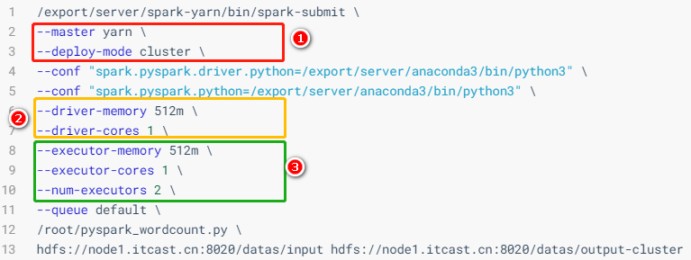
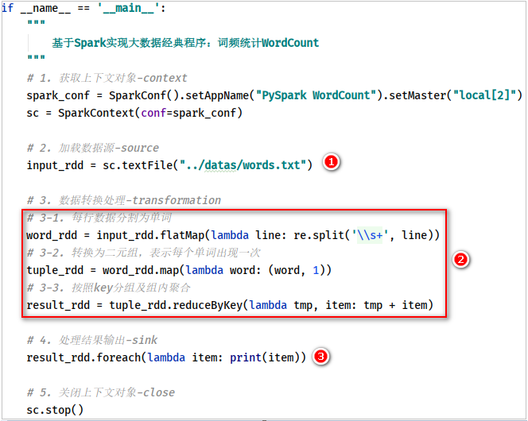
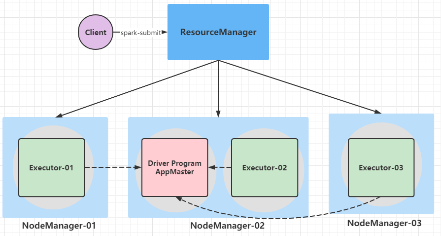
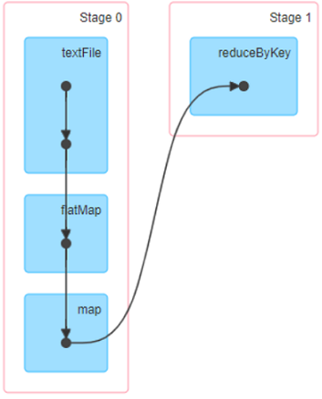
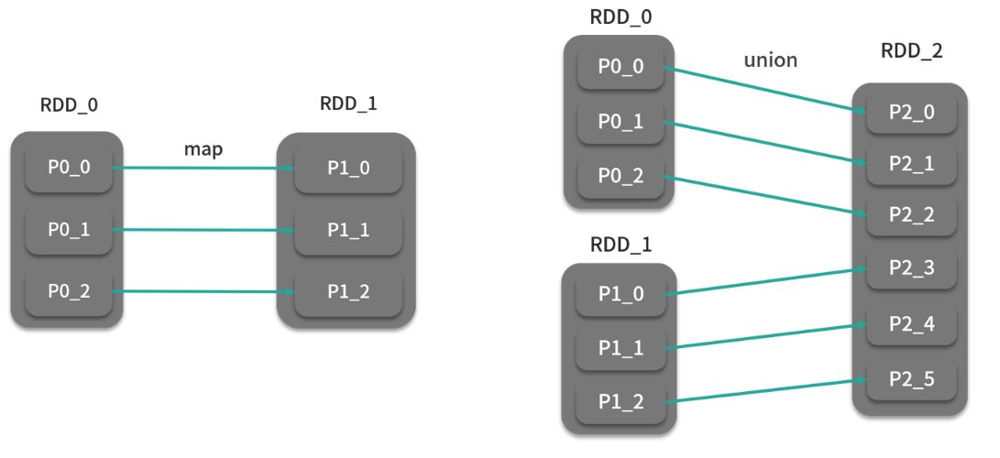

# Spark高级特性与内核调度

## I. Spark高级特性

### 1. RDD持久化


### 2. RDD Checkpoint


### 3. Spark累加器


### 4. Spark广播变量


## II. Spark内核调度

### 1. 应用提交流程

> 当开发完成Spark程序以后，使用`spark-submit`提交执行时，2件事情：

- 第一、申请资源，运行Driver和Executors 进程
- 第二、调度Job，执行Task任务


> 1、使用spark-submit脚本，提交应用执行，比如以==**yarn-cluster**==方式执行



> 2、启动运行Driver Program进程，执行MAIN方法代码，先创建SparkContext对象，申请资源，运行Executors



> 3、当应用的Executors启动运行后，向Driver Program反向注册，等待发送Task任务执行



- **主节点：ResourceManager，管理节点，集群老大**
  1. 接受客户端Client请求应用Application请求
  2. 管理从节点NodeManager，分配容器启动AppMaster
- **从节点：NodeManager，工作节点，集群小弟**
  1. 管理当前节点资源，包含Memory内存和CPU Core核数
  2. 接收老大ResourceManager和应用管理者AppMaster请求，分配资源到Container容器，运行对应进程
- **应用管理者：DriverProgram/AppMaster，应用老大**
  1. yarn-cluster时，由ResourceManager分配资源，在NodeManager的容器Container，启动JVM进程
  2. 向主节点ResourceManager申请资源，在NodeManager的容器Container中启动运行Executors
  3. 调度应用中每个Job执行执行（Job划分Stage，Stage划分Task任务及Task任务运行Executor）
- **应用执行进程：Executors，应用小弟**
  1. 运行在从节点NodeManager容器Container中JVM进程，每个应用都有自己Executors进程
  2. 执行应用中各个Job生成Task任务
  3. 缓存RDD中数据

> 4、继续执行MAIN方法代码，比如创建RDD、调用RDD转换算子和触发算子，当**RDD调用`foreach`触发函数**，触发Job执行，生成DAG图，划分Stage阶段，计算Task任务，调度到Executors中执行。



### 2. RDD依赖关系

> ==RDD之间的依赖（Dependency）关系==，[每个RDD记录，如何从父RDD得到的，调用哪个转换函数]()


> 从DAG图上来看，RDD之间依赖关系存在2种类型：
>
> - **窄依赖**，[2个RDD之间依赖，使用有向箭头表示]()
> - 宽依赖，又叫Shuffle 依赖，[2个RDD之间依赖，使用S曲线有向箭头表示]()


> - **窄依赖（Narrow Dependency）**
>   - 定义：`父RDD的1个分区数据只给子RDD的1个分区`，一（父RDD）对一（子RDD）
>   - 不产生Shuffle，如果子RDD的某个分区数据丢失，重构父RDD的对应分区



> - Shuffle 依赖（宽依赖 Wide Dependency）
>   - 定义：`父RDD的1个分区数据给了子RDD的N个分区`，[一（父）对多（子）]()
>   - 产生Shuffle，如果子RDD的某个分区数据丢失，必须重构父RDD的所有分区


> **RDD之间依赖为什么有宽窄依赖之分？**

```ini
# 1、从数据血脉恢复角度来说：
	如果宽依赖：
		子RDD某个分区的数据丢失，必须重新计算整个父RDD的所有分区
	如果窄依赖：
		子RDD某个分区的数据丢失，只需要计算父RDD对应分区的数据即可
  
# 2、从性能的角度来考虑：
  需要经过shuffle：使用宽依赖
  不需要经过shuffle：使用窄依赖
```


### 3. Spark Shuttle


### 4. Job调度流程


