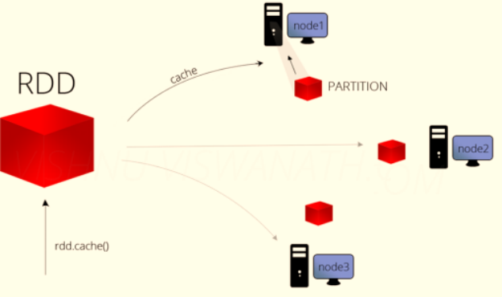
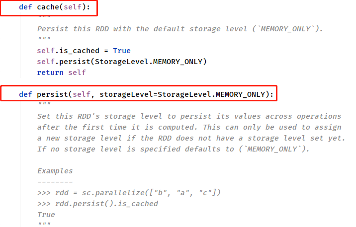
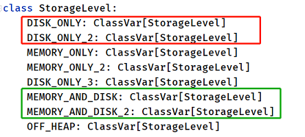
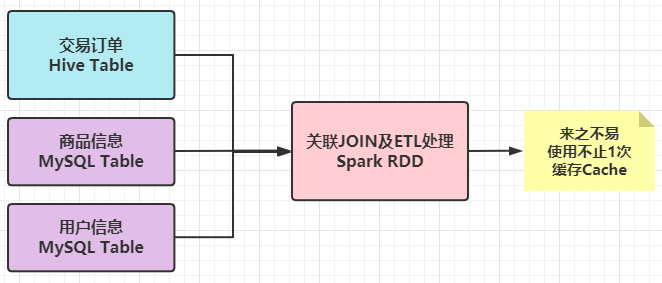
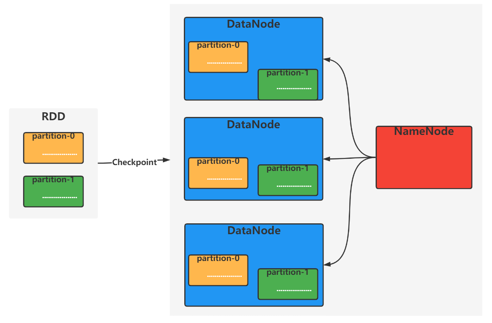
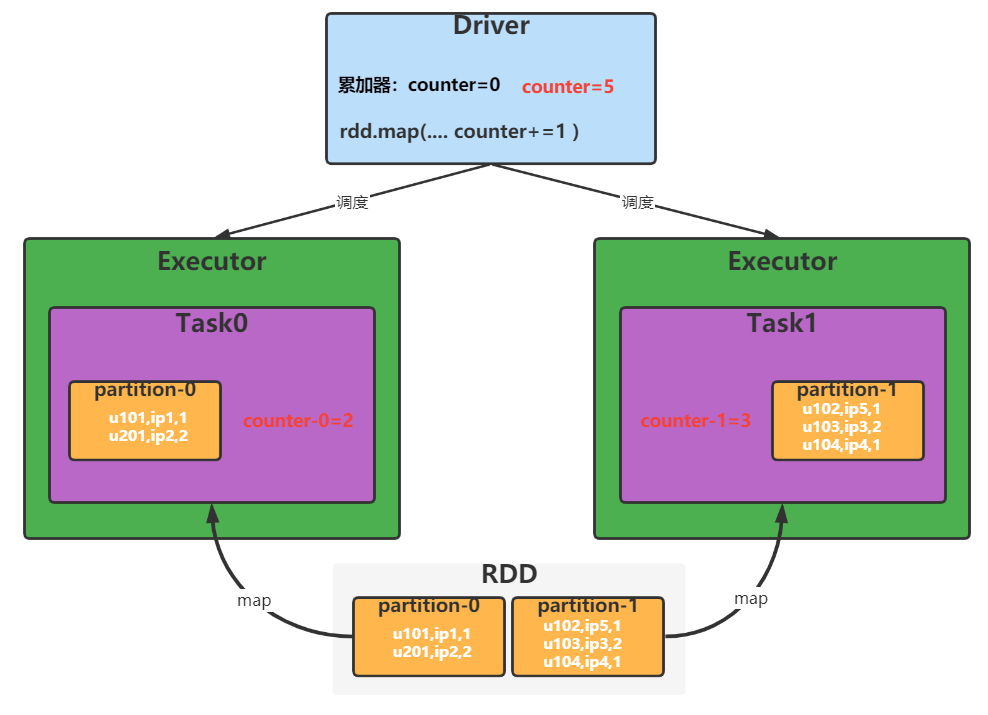
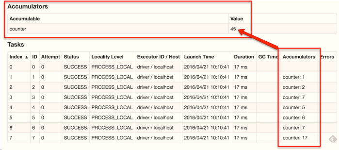
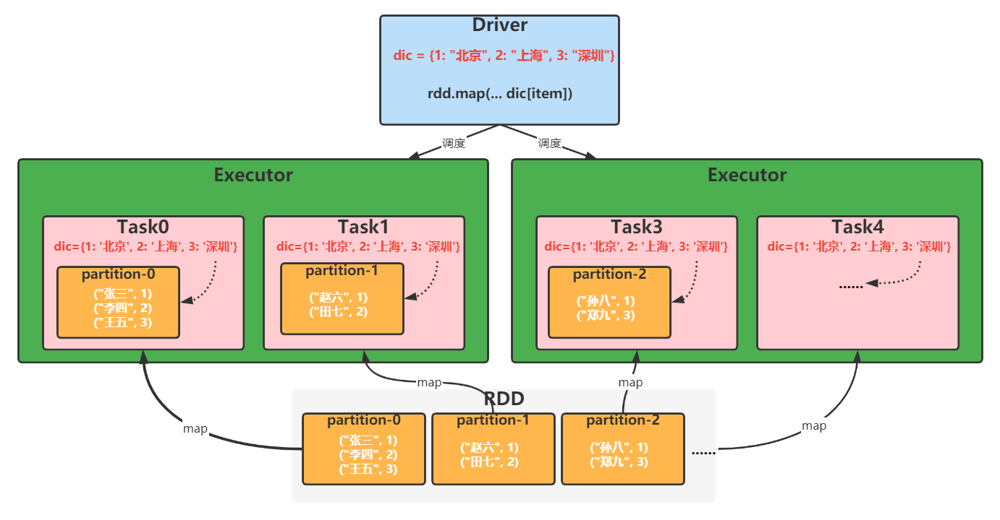
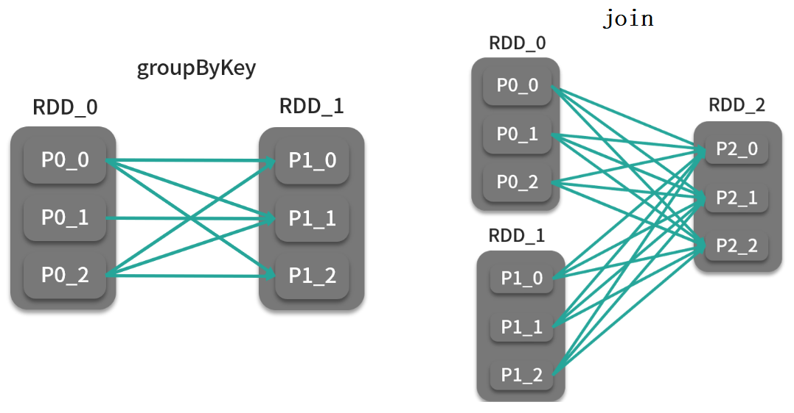
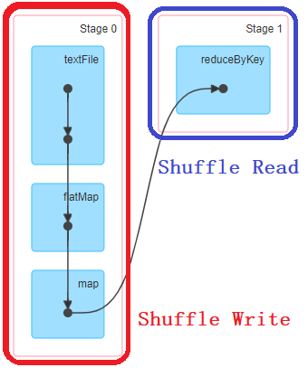

# Spark高级特性与内核调度

## I. Spark高级特性

### 1. RDD持久化

> 在实际开发中**某些RDD的计算或转换可能会比较耗费时间，如果这些RDD后续还会频繁的被使用到**，那么可以将这些RDD进行持久化/缓存，这样下次再使用到的时候就不用再重新计算了，提高了程序运行的效率。



[将RDD数据进行缓存时，本质上就是将RDD各个分区数据进行缓存]()

> - **第一点：缓存函数**，可以将RDD数据直接缓存到内存中，函数声明如下：



但是实际项目中，直接使用上述的缓存函数，**RDD数据量往往很多，内存放不下的**。在实际的项目中缓存RDD数据时，依据具体的业务和数据量，指定缓存的级别：


> - **第二点：**在Spark框架中==对数据缓存可以指定不同的级别==，对于开发来说至关重要，如下所示：



实际项目中缓存数据时，往往选择如下两种级别：


缓存函数与Transformation函数一样，都是`Lazy`操作，**需要Action函数触发，通常使用`count`函数触发**。

> 案例代码演示 `07_rdd_persist.py`：将RDD中数据保存到文件中（LocalFS或HDFS）。

```python
#!/usr/bin/env python
# -*- coding: utf-8 -*-

import os
import time
from pyspark import SparkConf, SparkContext, StorageLevel

if __name__ == '__main__':
    """
    RDD 数据持久化，使用persist函数，指定缓存级别   
    """

    # 设置系统环境变量
    os.environ['JAVA_HOME'] = '/export/server/jdk'
    os.environ['HADOOP_HOME'] = '/export/server/hadoop'
    os.environ['PYSPARK_PYTHON'] = '/export/server/anaconda3/bin/python3'
    os.environ['PYSPARK_DRIVER_PYTHON'] = '/export/server/anaconda3/bin/python3'

    # 1. 获取上下文对象-context
    spark_conf = SparkConf().setAppName("PySpark Example").setMaster("local[2]")
    sc = SparkContext(conf=spark_conf)

    # 2. 加载数据源-source
    input_rdd = sc.textFile('../datas/words.txt', minPartitions=2)

    # 3. 数据转换处理-transformation
    # TODO: 可以直接将数据放到内存中
    # input_rdd.cache()
    # input_rdd.persist()

    # TODO: 缓存RDD数据，指定存储级别，先放内存，不足放磁盘
    input_rdd.persist(storageLevel=StorageLevel.MEMORY_AND_DISK)
    # 使用触发函数触发，使用count
    input_rdd.count()

    # 当再次使用缓存数据时，直接从缓存读取
    print(input_rdd.count())

    # TODO: 当缓存RDD数据不在被使用时，一定记住需要释放资源
    input_rdd.unpersist()

    # 4. 处理结果输出-sink


    time.sleep(1000000)
    # 5. 关闭上下文对象-close
    sc.stop()

```

> 在实际项目开发中，==什么时候缓存RDD数据==最好呢？

- **第一点**：==当某个RDD被使用多次的时候，建议缓存此RDD数据==

  [比如，从HDFS上读取网站行为日志数据，进行多维度的分析，最好缓存数据]()

```python
log_rdd = sc.textFile("")

# 将RDD数据进行缓存
log_rdd.cache()

# pv 计算
pv_rdd = log_rdd.xx
# uv 计算
uv_rdd = log_rdd.yy
# ip
ip_rdd = log_rdd.zz
# ....

# 释放缓存资源
log_rdd.unpersist()
```

- **第二点**：==当某个RDD来之不易，并且使用不止一次，建议缓存此RDD数据==

  

### 2. RDD Checkpoint

> **RDD Checkpoint**：[将RDD数据保存到可靠文件系统（比如HDFS），防止数据丢失]()。适合于复杂计算（机器学习、迭代计算等），避免计算中间结果丢失，需要再次重复计算，确保中间数据安全。



> RDD 数据可以持久化/缓存，但是**持久化/缓存可以把数据放在内存**中，虽然是快速的，但是也是==最不可靠==的；也可以把数据放在磁盘上，也不是完全可靠的，例如磁盘会损坏等。

- Checkpoint 产生：为了更加可靠的数据持久化，在Checkpoint的时候一般`把数据放在在HDFS上`，这就天然的借助了HDFS天生的高容错、高可靠来实现数据最大程度上的安全，实现了RDD的容错和高可用。
- 当RDD数据checkpoint，切断checkpoint RDD的依赖关系，原因：保存到可靠存储（如HDFS）以便数据恢复；


> 案例代码演示 `08_rdd_checkpoint.py`：将RDD中数据进行Checkpoint检查点保存。

```python
#!/usr/bin/env python
# -*- coding: utf-8 -*-

import os
import time
from pyspark import SparkConf, SparkContext

if __name__ == '__main__':
    """
    RDD Checkpoint：将RDD数据保存到可以文件系统，比如HDFS系统   
    """

    # 设置系统环境变量
    os.environ['JAVA_HOME'] = '/export/server/jdk'
    os.environ['HADOOP_HOME'] = '/export/server/hadoop'
    os.environ['PYSPARK_PYTHON'] = '/export/server/anaconda3/bin/python3'
    os.environ['PYSPARK_DRIVER_PYTHON'] = '/export/server/anaconda3/bin/python3'

    # 1. 获取上下文对象-context
    spark_conf = SparkConf().setAppName("PySpark Example").setMaster("local[2]")
    sc = SparkContext(conf=spark_conf)
    # TODO: step1、设置Checkpoint保存目录
    sc.setCheckpointDir('../datas/ckpt')

    # 2. 加载数据源-source
    input_rdd = sc.textFile('../datas/words.txt', minPartitions=2)

    # TODO: step2、将RDD进行Checkpoint
    input_rdd.checkpoint()
    input_rdd.count()

    # TODO: 当RDD进行Checkpoint以后，再次使用RDD数据时，直接从Checkpoint读取数据
    print(input_rdd.count())

    # 3. 数据转换处理-transformation

    # 4. 处理结果输出-sink

    time.sleep(100000)
    # 5. 关闭上下文对象-close
    sc.stop()

```

> RDD 持久化Persist和RDD Checkpoint检查点区别：


### 3. Spark累加器

> Spark提供两种类型的共享变量（`Shared Variables`）：广播变量（`Broadcast Variables`）和累加器（`Accumulators`）：

- 1）广播变量Broadcast Variables：将变量在所有节点的内存之间进行共享，在每个机器上缓存一个只读的变量，而不是为机器上每个任务都生成一个副本。
- 2）累加器Accumulators：支持在所有不同节点之间进行累加计算（比如技术或者求和）

文档：https://spark.apache.org/docs/3.1.2/rdd-programming-guide.html#shared-variables

> **累加器Accumulator**只提供**累加**的功能，多个task对一个变量并行操作的功能。但是`task`只能对累加器Accumulator进行累加操作，不能读取Accumulator的值，只有`Driver`程序可以读取Accumulator的值。

**案例场景**：将数据封装到RDD中，调用map算子处理每条数据时，想要统计RDD中数据条目数，定义1个变量counter，累加统计数目，[先每个分区统计数目，最后合并分区统计数目即可]()。



> Spark内置三种类型Accumulator：`LongAccumulator`累加整数型，`DoubleAccumulator`累加浮点型，`CollectionAccumulator`累加集合元素。[SparkCore提供接口，允许用户自定义累加器Accumulator]()


> [创建的Accumulator变量的值能够在Spark Web UI上看到，在创建时应该尽量为其命名。]()



> 案例代码演示 `09_rdd_accamulator.py`：创建RDD数据集，使用累加器计数处理数据量

```python
#!/usr/bin/env python
# -*- coding: utf-8 -*-

import os
from pyspark import SparkConf, SparkContext

if __name__ == '__main__':
    """
    RDD中累加器Accumulator：使用累加器统计处理文件中有多少条数据   
    """

    # 设置系统环境变量
    os.environ['JAVA_HOME'] = '/export/server/jdk'
    os.environ['HADOOP_HOME'] = '/export/server/hadoop'
    os.environ['PYSPARK_PYTHON'] = '/export/server/anaconda3/bin/python3'
    os.environ['PYSPARK_DRIVER_PYTHON'] = '/export/server/anaconda3/bin/python3'

    # 1. 获取上下文对象-context
    spark_conf = SparkConf().setAppName("PySpark Example").setMaster("local[2]")
    sc = SparkContext(conf=spark_conf)

    # TODO: 第1步、定义累加器
    counter = sc.accumulator(0)

    # 2. 加载数据源-source
    input_rdd = sc.textFile('../datas/words.txt', minPartitions=2)

    # 3. 数据转换处理-transformation
    def map_func(line):
        # TODO：第2步、使用累加器
        counter.add(1)
        return line

    output_rdd = input_rdd.map(map_func)

    # 4. 处理结果输出-sink
    print(output_rdd.count())

    # TODO: 第3步、获取累加器值
    print("counter =", counter.value)

    # 5. 关闭上下文对象-close
    sc.stop()

```

### 4. Spark广播变量

> **场景**：先对RDD中数据进行处理，依据cityId，查询字典dic数据，获取cityName，示意图如下所示：

```python
 # 字典信息
dic = {1: "北京", 2: "上海", 3: "深圳"}
    
# 模拟数据集RDD
input_rdd = sc.parallelize([
	("张三", 1), ("李四", 2), ("王五", 3), ("赵六", 1), ("田七", 2)
])    

# 调用map算子，处理每条数据
map_rdd = input_rdd.map(lambda tuple: (tuple[0], dic[tuple[1]]))
```



> 广播变量（==Broadcast Variables==）允许开发人员`在每个节点（Worker or Executor）缓存只读变量`，而`不是在Task之间传递这些变量`。

```python
 # TODO：step1、将小表数据（变量）进行广播
broadcast_dic = sc.broadcast(dic)
```


> 调用`sc.broadcast(v)`创建一个广播变量，该广播变量的值封装在v变量中，可使用获取该变量`value`的方法进行访问。


> 案例代码演示 `10_rdd_broadcast.py`：创建数据集RDD，广播维度数据，对RDD中数据进行关联。

```python
#!/usr/bin/env python
# -*- coding: utf-8 -*-

import os
from pyspark import SparkConf, SparkContext

if __name__ == '__main__':
    """
    RDD 中广播变量：将Driver中变量（可以是列表，或字典）广播到Executor中，所有Task可以共享变量的值，节省内存。   
    """

    # 设置系统环境变量
    os.environ['JAVA_HOME'] = '/export/server/jdk'
    os.environ['HADOOP_HOME'] = '/export/server/hadoop'
    os.environ['PYSPARK_PYTHON'] = '/export/server/anaconda3/bin/python3'
    os.environ['PYSPARK_DRIVER_PYTHON'] = '/export/server/anaconda3/bin/python3'

    # 1. 获取上下文对象-context
    spark_conf = SparkConf().setAppName("PySpark Example").setMaster("local[2]")
    sc = SparkContext(conf=spark_conf)

    # 字典信息
    dic = {1: "北京", 2: "上海", 3: "深圳"}
    # TODO：step1、将小表数据（变量）进行广播
    broadcast_dic = sc.broadcast(dic)

    # 2. 加载数据源-source
    input_rdd = sc.parallelize([
        ("张三", 1), ("李四", 2), ("王五", 3), ("赵六", 1), ("田七", 2)
    ])

    # 3. 数据转换处理-transformation
    def map_func(tuple):
        # TODO: step2、使用广播变量
        city_dic = broadcast_dic.value
        # 依据城市ID获取城市名称
        city_id = tuple[1]
        city_name = city_dic[city_id]
        # 返回
        return (tuple[0], city_name)

    output_rdd = input_rdd.map(map_func)

    # 4. 处理结果输出-sink
    print(output_rdd.collect())

    # 5. 关闭上下文对象-close
    sc.stop()

```

## II. Spark内核调度

### 1. 应用提交流程

> 当开发完成Spark程序以后，使用`spark-submit`提交执行时，2件事情：

- 第一、申请资源，运行Driver和Executors 进程
- 第二、调度Job，执行Task任务


> 1、使用spark-submit脚本，提交应用执行，比如以==**yarn-cluster**==方式执行


> 2、启动运行Driver Program进程，执行main方法代码，先创建SparkContext对象，申请资源，运行Executors


> 3、当应用的Executors启动运行后，向Driver Program反向注册，等待发送Task任务执行


- **主节点：ResourceManager，管理节点，集群老大**
  1. 接受客户端Client请求应用Application请求
  2. 管理从节点NodeManager，分配容器启动AppMaster
- **从节点：NodeManager，工作节点，集群小弟**
  1. 管理当前节点资源，包含Memory内存和CPU Core核数
  2. 接收老大ResourceManager和应用管理者AppMaster请求，分配资源到Container容器，运行对应进程
- **应用管理者：DriverProgram/AppMaster，应用老大**
  1. yarn-cluster时，由ResourceManager分配资源，在NodeManager的容器Container，启动JVM进程
  2. 向主节点ResourceManager申请资源，在NodeManager的容器Container中启动运行Executors
  3. 调度应用中每个Job执行执行（Job划分Stage，Stage划分Task任务及Task任务运行Executor）
- **应用执行进程：Executors，应用小弟**
  1. 运行在从节点NodeManager容器Container中JVM进程，每个应用都有自己Executors进程
  2. 执行应用中各个Job生成Task任务
  3. 缓存RDD中数据

> 4、继续执行main方法代码，比如创建RDD、调用RDD转换算子和触发算子，当**RDD调用`foreach`触发函数**，触发Job执行，生成DAG图，划分Stage阶段，计算Task任务，调度到Executors中执行。


### 2. RDD依赖关系

> ==RDD之间的依赖（Dependency）关系==，[每个RDD记录，如何从父RDD得到的，调用哪个转换函数]()


> 从DAG图上来看，RDD之间依赖关系存在2种类型：
>
> - **窄依赖**，[2个RDD之间依赖，使用有向箭头表示]()
> - 宽依赖，又叫Shuffle依赖，[2个RDD之间依赖，使用S曲线有向箭头表示]()


> - **窄依赖（Narrow Dependency）**
>   - 定义：`父RDD的1个分区数据只给子RDD的1个分区`，一（父RDD）对一（子RDD）
>   - 不产生Shuffle，如果子RDD的某个分区数据丢失，重构父RDD的对应分区


> - Shuffle 依赖（宽依赖 Wide Dependency）
>   - 定义：`父RDD的1个分区数据给了子RDD的N个分区`，[一（父）对多（子）]()
>   - 产生Shuffle，如果子RDD的某个分区数据丢失，必须重构父RDD的所有分区



> **RDD之间依赖为什么有宽窄依赖之分？**

```ini
# 1、从数据血脉恢复角度来说：
	如果宽依赖：
		子RDD某个分区的数据丢失，必须重新计算整个父RDD的所有分区
	如果窄依赖：
		子RDD某个分区的数据丢失，只需要计算父RDD对应分区的数据即可
  
# 2、从性能的角度来考虑：
  需要经过shuffle：使用宽依赖
  不需要经过shuffle：使用窄依赖
```


### 3. Spark Shuffle

> 在Spark中RDD之间依赖为宽依赖时，也叫Shuffle 依赖，此时2个RDD之间数据传输称之为Spark Shuffle，类似MapReduce Shuffle。


> 在MapReduce框架中，Shuffle是连接Map和Reduce之间的桥梁，[Map阶段的数据通过shuffle输出到对应的Reduce中，然后Reduce对数据执行计算。]()
>
> **在整个shuffle过程中，伴随大量的磁盘和网络I/O，所以shuffle性能的高低直接决定整个程序的性能高低。**


> Spark Shuffle 过程主要分为两个部分：`Shuffle Write` 和 `Shuffle Read`



- **Shuffle Write**：
  - Shuffle 的前半部分输出叫做 Shuffle Write，类似MapReduce Shuffle中Map Shuffle；
  - 将处理数据先写入内存，后写入磁盘。

- **Shuffle Read**：
  - Shuffle 的前半部分输出叫做 Shuffle Read，类似MapReduce Shuffle中Reduce Shuffle；
  - 拉取ShuffleWrite写入磁盘的数据，进行处理。

> Spark Shuffle 实现方式，经历一个漫长发展过程，直到Spark 2.0以后，Shuffle 实现机制才稳定成熟。


1. 在`1.1以前`的版本一直是采用==Hash Shuffle==的实现的方式
   - Spark 0.8及以前 Hash Based Shuffle
   - Spark 0.8.1 为Hash Based Shuffle引入File Consolidation机制
   - Spark 0.9 引入ExternalAppendOnlyMap
2. `1.1版本`时**参考HadoopMapReduce**的实现开始引入==Sort Shuffle==
   - Spark 1.1 引入Sort Based Shuffle，但默认仍为Hash Based Shuffle
   - Spark 1.2 默认的Shuffle方式改为Sort Based Shuffle
3. 在`1.5版本`时开始Tungsten钨丝计划，引入==UnSafe Shuffle优化内存及CPU==的使用
4. 在`1.6版本`中将Tungsten统一到Sort Shuffle中，实现==自我感知选择最佳Shuffle==方式
5. `2.0版本`，Hash Shuffle已被删除，所有Shuffle方式全部统一到Sort Shuffle一个实现中。

> Spark 2.0中 Sort-Based Shuffle实现机制中，包含三种ShuffleWriter：


- 第1种：**SortShuffleWriter**，普通机制
  - 第1步、先将数据写入内存，达到一定大小，进行排序
  - 第2步、再次写入内存缓冲，最后写入磁盘文件
  - 第3步、最终合并一个文件和生成索引文件
- 第2种：**BypassMergeSortShuffleWriter**，bypass机制
  - [当map端不用聚合，并且partition分区数目小于200时，采用该机制]()
  - 第1步、直接将数据写入内存缓冲，再写入磁盘文件
  - 第2步、最后合并一个文件和生成索引文件
- 第3种：**UnsafeShuffleWriter**，钨丝优化机制
  - [当map端不用聚合，分区数目小于16777215，并且支持relocation序列化]()
  - 第1步、利用Tungsten的内存作为缓存，将数据写入到缓存，达到一定大小写入磁盘
  - 第2步、最后合并一个文件和生成索引文件

### 4. Job调度流程

> 在Spark程序代码中，**当RDD调用Action 触发算子时，触发1个Job执行，首先构建Job对应DAG图，然后划分DAG图为Stage，最后将Stage中Task任务发送Executors执行**。

- 第一步、构建Job对应DAG图
  - [从调用Action函数RDD开始，依据RDD依赖关系，向前倒推，构建Job中所有RDD依赖关系图]()
  - DAG图展示RDD之间依赖关系
- 第二步、划分DAG图为Stage
  - [从调用Action函数RDD开始，判断相邻2个RDD依赖关系，如果是宽依赖，将后面RDD划分到1个Stage中]()
  - 1个Job中，Stage之间是相互依赖的，每个Stage中有很多RDD，相互转换
  - 1个Stage中Task数目等于最后1个RDD分区数目


> 当启动Spark Application的时候，运行main函数，首先创建SparkContext对象，此时构建DAG调度器`DAGScheduler`和Task任务调度器`TaskScheduler`实例对象。

1. `DAGScheduler`实例对象
   - 将每个Job的DAG图划分为Stage，依据RDD之间依赖为宽依赖（产生Shuffle）
2. `TaskScheduler`实例对象
   - 调度每个Stage中所有Task：`TaskSet`，发送到Executor上执行
   - 每个Stage中会有多个Task，所有Task处理数据不一样（每个分区数据被1个Task处理），但是处理逻辑一样的。
   - 将每个Stage中所有Task任务，放在一起称为`TaskSet`。


> Spark的任务调度总体来说分两路进行，一路是Stage级的调度，一路是Task级的调度。


Spark Application应用提交集群(如Hadoop YARN集群)执行Job整体流程:

1. 启动集群资源服务

   - 启动ResourceManager和NodeManagers

2. 使用spark-submit提交应用到YARN上运行, 采用yarn-cluster

   1. 提交应用到ResourceManager, 分配资源, 在NodeManager上启动容器运行AppMaster(DriverProgram)
   2. AppMaster向RM申请资源, 在NM上启动容器运行Executors
   3. 每个Executor运行后, 向AppMaster进行反向注册, 等待Task任务执行
   4. 当AppMaster接收到所有Executor注册以后, 开始执行main方法中代码

3. 当执行到RDD调用Action算子时, 触发1个Job执行(将Job转换为Task任务, 到Executor执行)

   1. 首先依据RDD依赖关系, 构建Job对应DAG图

      从调用Action算子RDD开始, 采用回溯法, 依据RDD以来关系, 构建DAG图

   2. 将DAG图划分为Stage阶段, 依据RDD之间依赖为宽依赖时划为

      从调用Action算子RDD开始, 采用回溯法, 当相邻2个RDD之间以来为宽依赖时, 划分后面为Stage, 以此类推

   3. 对Job中所有Stage, 从前向后开始调度: 确定Stage中Task任务数目, 打包为TaskSet, 发送到Executor执行

      每个Stage中Task数目 = Stage中最后一个RDD的分区数目

      Stage执行时从前向后, 彼此之间有依赖关系, 后面的Stage处理的数据依赖于前面Stage输出的数据

   **如果有多个Job执行, 都是按照第3步进行调度执行**

4. 当应用中所有Job执行完成, 整个应用也就执行结束, 此时执行sc.stop()终止程序