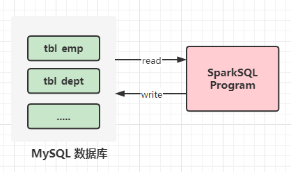

# SQL and DataFrames

## I. SparkSQL数据分析

### 1. SQL分析


### 2. DSL分析之API函数


### 3. DSL分析之SQL函数


### 4. Catalyst优化器


## II. 外部数据源

### 1. 加载load和保存save


### 2. text文本文件


### 3. json文本文件


### 4. parquet列式存储


### 5. csv文本文件


### 6. jdbc数据库



> SparkSQL模块内置：`jdbc` 方法，可以从常见RDBMS数据库中加载数据和保存数据。

- **load**：加载数据，`spark.read.jdbc()`


- **save**：保存数据，`dataframe.write.jdbc()`


> 向MySQL数据库写入数据时，需要将**MySQL JCBC 驱动包**放入到`pyspark`库安装目录`jars`下。

- 远程Python解析器，Linux系统开发测试，目录：`ANACONDA_HOME/lib/python3.8/site-packages/pyspark/jars`

```ini
# 进入目录
cd /export/server/anaconda3/lib/python3.8/site-packages/pyspark/jars

# 上传jar包：mysql-connector-java-5.1.32.jar
rz

```


- Window系统开发测试，目录：`ANACONDA_HOME/Lib/site-packages/pyspark/jars`，如下图：


> 保存数据至MySQL数据库，表的创建语句

```SQL
 CREATE TABLE db_company.emp_v2 (
  `empno` int(11) NOT NULL,
  `ename` varchar(10) DEFAULT NULL,
  `job` varchar(9) DEFAULT NULL,
  `sal` double DEFAULT NULL,
  `deptno` int(11) DEFAULT NULL,
  PRIMARY KEY (`empno`)
) ENGINE=InnoDB DEFAULT CHARSET=utf8 ;
```

> **案例代码演示**： `09_datasource_jdbc.py`：加载数据库表数据，选择字段后，再次保存数据库表中

```python
#!/usr/bin/env python
# -*- coding: utf-8 -*-

import os
from pyspark.sql import SparkSession

if __name__ == '__main__':
    """
    SparkSQL 内置数据源，对MySQL数据库数据进行加载和保存。  
    """

    # 设置系统环境变量
    os.environ['JAVA_HOME'] = '/export/server/jdk'
    os.environ['HADOOP_HOME'] = '/export/server/hadoop'
    os.environ['PYSPARK_PYTHON'] = '/export/server/anaconda3/bin/python3'
    os.environ['PYSPARK_DRIVER_PYTHON'] = '/export/server/anaconda3/bin/python3'

    # 1. 获取会话实例对象-session
    spark = SparkSession.builder \
        .appName('SparkSession Test') \
        .master('local[2]') \
        .getOrCreate()

    # 2. 加载数据源-source
    props = { 'user': 'root', 'password': '123456', 'driver': 'com.mysql.jdbc.Driver'}
    jdbc_df = spark.read.jdbc(
        'jdbc:mysql://node1.itcast.cn:3306/?serverTimezone=UTC&characterEncoding=utf8&useUnicode=true',
        'db_company.emp',
        properties=props
    )
    jdbc_df.printSchema()
    jdbc_df.show(n=20, truncate=False)

    # 3. 数据转换处理-transformation
    dataframe = jdbc_df.select('empno', 'ename', 'job', 'sal', 'deptno')

    # 4. 处理结果输出-sink
    dataframe.coalesce(1).write.mode('append').jdbc(
        'jdbc:mysql://node1.itcast.cn:3306/?serverTimezone=UTC&characterEncoding=utf8&useUnicode=true',
        'db_company.emp_v2',
        properties=props
    )

    # 5. 关闭会话实例对象-close
    spark.stop()

```

### 7. hive表


## III. 分布式SQL引擎

### 1. spark-sql命令行


### 2. Thrift Server服务


### 3. DataGrip JDBC连接


## 拓展内容

### 1. SQL开窗函数


### 2. Top10电影分析升级版

