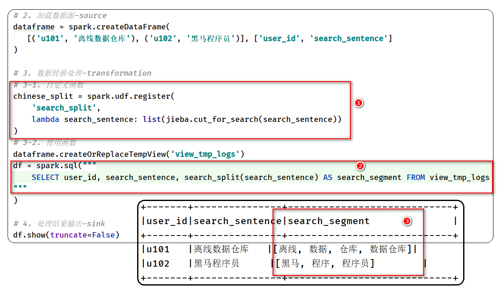
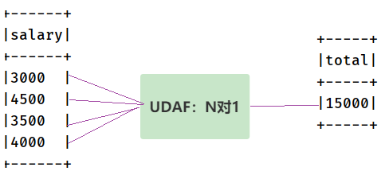
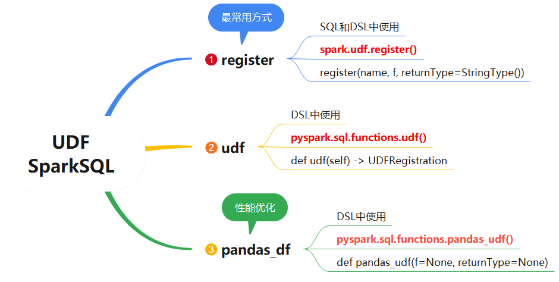
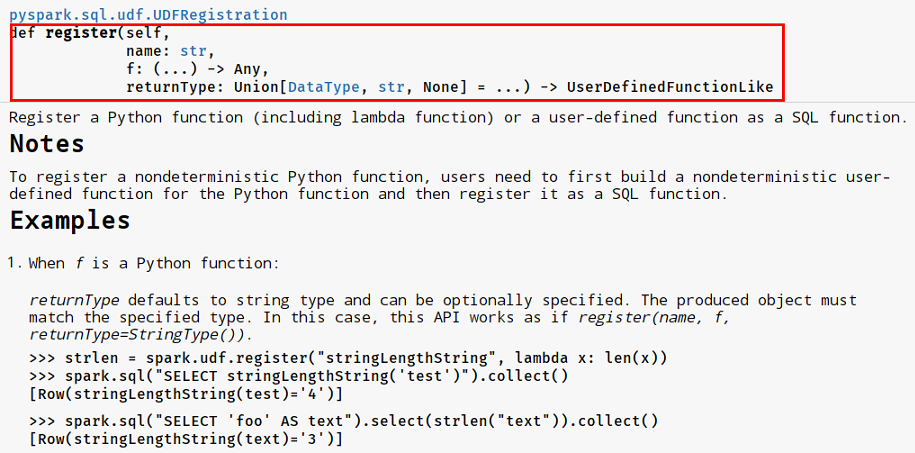

# UDF And Action

## I. 自定义函数

### 1. UDF函数

> 无论Hive还是SparkSQL分析处理数据时，往往需要使用函数，SparkSQL模块本身自带很多实现公共功能的函数，在`pyspark.sql.functions`中。
>
> 文档：https://spark.apache.org/docs/3.1.2/api/sql/index.html


```ini
# 第一类函数： 输入一条数据 -> 输出一条数据（1 -> 1）
    split 分割函数
    round 四舍五入函数

# 第二类函数： 输入多条数据 -> 输出一条数据 (N -> 1)
    count 计数函数
    sum 累加函数
    max/min 最大最小函数
    avg 平均值函数
# 第三类函数：输入一条数据 -> 输出多条数据  (1 -> N)
	explode 爆炸函数
```

[如果框架（如Hive、SparkSQL、Presto）提供函数，无法满足实际需求，提供自定义函数接口，只要实现即可。]()

```
默认split分词函数，不支持中文分词
	可以自定义函数，使用jieba进行分词
```



> 在SparkSQL中，目前仅仅支持==UDF函数==（**1对1关系**）和==UDAF函数==（**多对1关系**）：
>
> - ==UDF函数==：一对一关系，输入一条数据输出一条数据


> - ==UDAF函数==：聚合函数，多对一关系，输入多条数据输出一条数据，通常与**group by** 分组函数连用



> 在SparkSQL中，自定义UDF函数，有如下3种方式：



### 2. register注册定义

> SparkSQL中自定义UDF（1对1）函数，可以直接使用`spark.udf.register`注册和定义函数。



> **案例代码演示**： `01_udf_register.py`：自定义UDF函数，将字符串名称name，全部转换为大写。

```python
#!/usr/bin/env python
# -*- coding: utf-8 -*-

import os
from pyspark.sql import SparkSession
import pyspark.sql.functions as F


if __name__ == '__main__':
    """
    SparkSQL中自定义UDF函数，采用register方式注册定义函数  
    """

    # 设置系统环境变量
    os.environ['JAVA_HOME'] = '/export/server/jdk'
    os.environ['HADOOP_HOME'] = '/export/server/hadoop'
    os.environ['PYSPARK_PYTHON'] = '/export/server/anaconda3/bin/python3'
    os.environ['PYSPARK_DRIVER_PYTHON'] = '/export/server/anaconda3/bin/python3'

    # 1. 获取会话实例对象-session
    spark = SparkSession.builder \
        .appName('SparkSession Test') \
        .master('local[2]') \
        .getOrCreate()

    # 2. 加载数据源-source
    people_df = spark.read.json('../datas/resources/people.json')
    # people_df.printSchema()
    # people_df.show(n=10, truncate=False)

    # 3. 数据转换处理-transformation
    """
        将DataFrame数据集中name字段值转换为大写UpperCase
    """
    # TODO: 注册定义函数
    upper_udf = spark.udf.register(
        'to_upper',
        lambda name: str(name).upper()
    )

    # TODO：在SQL中使用函数
    people_df.createOrReplaceTempView("view_tmp_people")
    spark\
        .sql("""
            SELECT name, to_upper(name) AS new_name FROM view_tmp_people
        """)\
        .show(n=10, truncate=False)

    # TODO：在DSL中使用函数
    people_df\
        .select(
            'name', upper_udf('name').alias('upper_name')
        )\
        .show(n=10, truncate=False)

    # 4. 处理结果输出-sink

    # 5. 关闭会话实例对象-close
    spark.stop()

```

运行程序，执行UDF函数，结果如下：


> 采用register方式注册定义UDF函数，名称不同，使用地方不同。


### 3. udf注册定义


### 4. pandas_udf注册定义


## II. 零售数据分析

### 1. 业务需求分析


### 2.  业务指标一


### 3. Top3省份数据


### 4. 业务指标二


### 5. 业务指标三


### 6. 业务指标四


### III. 其他知识

### 1. 与Pandas DataFrame相互转换


### 2. Jupyter Notebook开发PySpark


### 3. PySpark应用运行架构


## III. 在线教育数据分析

### 1. 业务需求分析


### 2. 需求一


### 3. 需求二


## 附录: Jupyter Notebook启动配置

