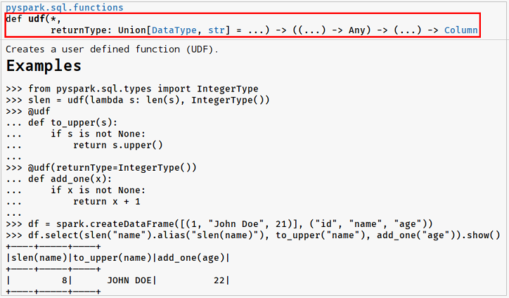
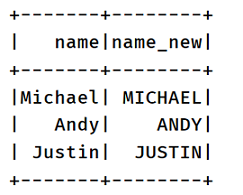
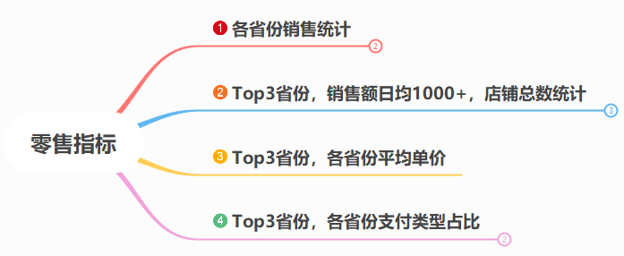
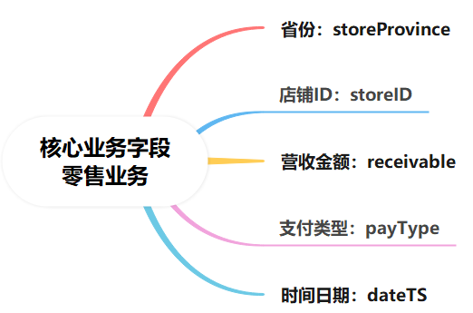

# UDF And Action

## I. 自定义函数

### 1. UDF函数

> 无论Hive还是SparkSQL分析处理数据时，往往需要使用函数，SparkSQL模块本身自带很多实现公共功能的函数，在`pyspark.sql.functions`中。
>
> 文档：https://spark.apache.org/docs/3.1.2/api/sql/index.html


```ini
# 第一类函数： 输入一条数据 -> 输出一条数据（1 -> 1）
    split 分割函数
    round 四舍五入函数

# 第二类函数： 输入多条数据 -> 输出一条数据 (N -> 1)
    count 计数函数
    sum 累加函数
    max/min 最大最小函数
    avg 平均值函数
# 第三类函数：输入一条数据 -> 输出多条数据  (1 -> N)
	explode 爆炸函数
```

[如果框架（如Hive、SparkSQL、Presto）提供函数，无法满足实际需求，提供自定义函数接口，只要实现即可。]()

```
默认split分词函数，不支持中文分词
	可以自定义函数，使用jieba进行分词
```


> 在SparkSQL中，目前仅仅支持==UDF函数==（**1对1关系**）和==UDAF函数==（**多对1关系**）：
>
> - ==UDF函数==：一对一关系，输入一条数据输出一条数据


> - ==UDAF函数==：聚合函数，多对一关系，输入多条数据输出一条数据，通常与**group by** 分组函数连用


> 在SparkSQL中，自定义UDF函数，有如下3种方式：


### 2. register注册定义

> SparkSQL中自定义UDF（1对1）函数，可以直接使用`spark.udf.register`注册和定义函数。


> **案例代码演示**： `01_udf_register.py`：自定义UDF函数，将字符串名称name，全部转换为大写。

```python
#!/usr/bin/env python
# -*- coding: utf-8 -*-

import os
from pyspark.sql import SparkSession
import pyspark.sql.functions as F


if __name__ == '__main__':
    """
    SparkSQL中自定义UDF函数，采用register方式注册定义函数  
    """

    # 设置系统环境变量
    os.environ['JAVA_HOME'] = '/export/server/jdk'
    os.environ['HADOOP_HOME'] = '/export/server/hadoop'
    os.environ['PYSPARK_PYTHON'] = '/export/server/anaconda3/bin/python3'
    os.environ['PYSPARK_DRIVER_PYTHON'] = '/export/server/anaconda3/bin/python3'

    # 1. 获取会话实例对象-session
    spark = SparkSession.builder \
        .appName('SparkSession Test') \
        .master('local[2]') \
        .getOrCreate()

    # 2. 加载数据源-source
    people_df = spark.read.json('../datas/resources/people.json')
    # people_df.printSchema()
    # people_df.show(n=10, truncate=False)

    # 3. 数据转换处理-transformation
    """
        将DataFrame数据集中name字段值转换为大写UpperCase
    """
    # TODO: 注册定义函数
    upper_udf = spark.udf.register(
        'to_upper',
        lambda name: str(name).upper()
    )

    # TODO：在SQL中使用函数
    people_df.createOrReplaceTempView("view_tmp_people")
    spark\
        .sql("""
            SELECT name, to_upper(name) AS new_name FROM view_tmp_people
        """)\
        .show(n=10, truncate=False)

    # TODO：在DSL中使用函数
    people_df\
        .select(
            'name', upper_udf('name').alias('upper_name')
        )\
        .show(n=10, truncate=False)

    # 4. 处理结果输出-sink

    # 5. 关闭会话实例对象-close
    spark.stop()

```

运行程序，执行UDF函数，结果如下：


> 采用register方式注册定义UDF函数，名称不同，使用地方不同。


### 3. udf注册定义

> SparkSQL中函数库`pyspark.sql.functions`中提供函数：`udf`，用来用户自定义函数。



> **案例代码演示**： `02_udf_function.py`：自定义UDF函数，将字符串名称name，全部转换为大写。

```python
#!/usr/bin/env python
# -*- coding: utf-8 -*-

import os
from pyspark.sql import SparkSession
from pyspark.sql.types import *
import pyspark.sql.functions as F

if __name__ == '__main__':
    """
    SparkSQL自定义UDF函数，采用udf函数方式注册定义，仅仅只能在DSL中使用。  
    """

    # 设置系统环境变量
    os.environ['JAVA_HOME'] = '/export/server/jdk'
    os.environ['HADOOP_HOME'] = '/export/server/hadoop'
    os.environ['PYSPARK_PYTHON'] = '/export/server/anaconda3/bin/python3'
    os.environ['PYSPARK_DRIVER_PYTHON'] = '/export/server/anaconda3/bin/python3'

    # 1. 获取会话实例对象-session
    spark = SparkSession.builder \
        .appName('SparkSession Test') \
        .master('local[2]') \
        .getOrCreate()

    # 2. 加载数据源-source
    people_df = spark.read.json('../datas/resources/people.json')
    # people_df.printSchema()
    # people_df.show(n=10, truncate=False)

    # 3. 数据转换处理-transformation
    """
        将DataFrame数据集中name字段值转换为大写UpperCase
    """
    # TODO: 注册定义函数，采用编程：封装函数
    upper_udf = F.udf(
        f=lambda name: str(name).upper(),
        returnType=StringType()
    )

    # 在DSL中使用
    people_df\
        .select(
            'name', upper_udf('name').alias('name_new')
        )\
        .show()

    # 4. 处理结果输出-sink

    # 5. 关闭会话实例对象-close
    spark.stop()

```

运行程序，执行UDF函数，结果如下：



### 4. pandas_udf注册定义

> 在Spark 2.3中提供函数：`pandas_udf()`，用于定义和注册UDF函数，底层使用**列存储和零复制技术**提高**数据传输效率**，在PySpark SQL中建议使用。


> 使用pandas_udf定义UDF函数，需要安装arrow库和启动Arrow技术。

- 第1步、安装arrow库

```ini
pip install pyspark[sql]==3.1.2 -i https://pypi.tuna.tsinghua.edu.cn/simple
```

- 第2步、设置属性参数，启动Arrow技术

```ini
spark.sql.execution.arrow.pyspark.enabled = true
```

> 函数：`pandas_udf` ，要求传递处理数据函数function中参数类型：`Series`，表示`某列数据`。


> 案例演示 `03_udf_pandas.py`：实现字符串类型name，转换为大写字面upper。

```python
#!/usr/bin/env python
# -*- coding: utf-8 -*-

import os
from pyspark.sql import SparkSession
from pyspark.sql.types import *
import pyspark.sql.functions as F
import pandas as pd

if __name__ == '__main__':
    """
    SparkSQL自定义UDF函数，采用pandas_udf函数方式注册定义，仅仅只能在DSL中使用，底层技术：列存储和零拷贝技术。
    """

    # 设置系统环境变量
    os.environ['JAVA_HOME'] = '/export/server/jdk'
    os.environ['HADOOP_HOME'] = '/export/server/hadoop'
    os.environ['PYSPARK_PYTHON'] = '/export/server/anaconda3/bin/python3'
    os.environ['PYSPARK_DRIVER_PYTHON'] = '/export/server/anaconda3/bin/python3'

    # 1. 获取会话实例对象-session
    spark = SparkSession.builder \
        .appName('SparkSession Test') \
        .master('local[2]') \
        .config('spark.sql.execution.arrow.pyspark.enabled', 'true')\
        .getOrCreate()

    # 2. 加载数据源-source
    people_df = spark.read.json('../datas/resources/people.json')
    # people_df.printSchema()
    people_df.show(n=10, truncate=False)

    # 3. 数据转换处理-transformation
    """
        将DataFrame数据集中name字段值转换为大写UpperCase
    """
    # TODO: 注册定义函数，装饰器方式
    @F.pandas_udf(StringType())
    def func_upper(name: pd.Series) -> pd.Series:
        return name.str.upper()

    # 在DSL中使用
    people_df\
        .select(
            'name', func_upper('name').alias('upper_name')
        )\
        .show()

    # 4. 处理结果输出-sink

    # 5. 关闭会话实例对象-close
    spark.stop()

```

## II. 零售数据分析

### 1. 业务需求分析

> 某公司是做**零售**相关业务， 旗下==出品各类收银机==。目前公司的**收银机已经在全国铺开，在各个省份均有店铺使用**。机器是联网的，==每一次使用都会将售卖商品数据上传到公司后台==。

- 零售业务数据，JSON格式

```JSON
{
    "discountRate":1,
    "dayOrderSeq":8,
    "storeDistrict":"雨花区",
    "isSigned":0,
    "storeProvince":"湖南省",
    "origin":0,
    "storeGPSLongitude":"113.01567856440359",
    "discount":0,
    "storeID":4064,
    "productCount":4,
    "operatorName":"OperatorName",
    "operator":"NameStr",
    "storeStatus":"open",
    "storeOwnUserTel":12345678910,
    "corporator":"hnzy",
    "serverSaved":true,
    "payType":"alipay",
    "discountType":2,
    "storeName":"杨光峰南食店",
    "storeOwnUserName":"OwnUserNameStr",
    "dateTS":1563758583000,
    "smallChange":0,
    "storeGPSName":"",
    "erase":0,
    "product":[
        {
            "count":1,
            "name":"百事可乐可乐型汽水",
            "unitID":0,
            "barcode":"6940159410029",
            "pricePer":3,
            "retailPrice":3,
            "tradePrice":0,
            "categoryID":1
        },
        {
            "count":1,
            "name":"馋大嘴盐焗鸡筋110g",
            "unitID":0,
            "barcode":"6951027300076",
            "pricePer":2.5,
            "retailPrice":2.5,
            "tradePrice":0,
            "categoryID":1
        },
        {
            "count":2,
            "name":"糯米锅巴",
            "unitID":0,
            "barcode":"6970362690000",
            "pricePer":2.5,
            "retailPrice":2.5,
            "tradePrice":0,
            "categoryID":1
        },
        {
            "count":1,
            "name":"南京包装",
            "unitID":0,
            "barcode":"6901028300056",
            "pricePer":12,
            "retailPrice":12,
            "tradePrice":0,
            "categoryID":1
        }
    ],
    "storeGPSAddress":"",
    "orderID":"156375858240940641230",
    "moneyBeforeWholeDiscount":22.5,
    "storeCategory":"normal",
    "receivable":22.5,
    "faceID":"",
    "storeOwnUserId":4082,
    "paymentChannel":0,
    "paymentScenarios":"PASV",
    "storeAddress":"StoreAddress",
    "totalNoDiscount":22.5,
    "payedTotal":22.5,
    "storeGPSLatitude":"28.121213726311993",
    "storeCreateDateTS":1557733046000,
    "payStatus":-1,
    "storeCity":"长沙市",
    "memberID":"0"
}
```

- 需求：零售业务数据，**按照省份维度进行不同指标统计分析**。



- 业务指标分析相关字段



> 首先数据过滤提取：加载业务数据，过滤掉异常数据，提取业务指标计算时相关字段（数据转换处理）。


> **案例代码演示**： `retail_analysis.py`：加载业务数据，按照需要过滤数据，提取相关业务字段。

```python
#!/usr/bin/env python
# -*- coding: utf-8 -*-

import os
from pyspark.sql import SparkSession
from pyspark.sql.types import DecimalType
import pyspark.sql.functions as F


if __name__ == '__main__':
    """
    零售数据分析，JSON格式业务数据，加载数据封装DataFrame中，再进行转换处理分析。  
    """

    # 设置系统环境变量
    os.environ['JAVA_HOME'] = '/export/server/jdk'
    os.environ['HADOOP_HOME'] = '/export/server/hadoop'
    os.environ['PYSPARK_PYTHON'] = '/export/server/anaconda3/bin/python3'
    os.environ['PYSPARK_DRIVER_PYTHON'] = '/export/server/anaconda3/bin/python3'

    # 1. 获取会话实例对象-session
    spark = SparkSession.builder \
        .appName('SparkSession Test') \
        .master('local[2]') \
        .config('spark.sql.shuffle.partitions', '4')\
        .getOrCreate()

    # 2. 加载数据源-source
    dataframe = spark.read.json('../datas/retail.json')
    # print("count:", retail_df.count())
    # dataframe.printSchema()
    # dataframe.show(10, truncate=False)

    # 3. 数据转换处理-transformation
    """
        3-1. 过滤测试数据和提取字段与转换值，此外字段名称重命名
    """
    retail_df = dataframe\
        .filter(
            (F.col('receivable') < 10000) &
            (F.col('storeProvince').isNotNull()) &
            (F.col('storeProvince') != 'null')
        )\
        .select(
            F.col('storeProvince').alias('store_province'),
            F.col('storeID').alias('store_id'),
            F.col('payType').alias('pay_type'),
            F.from_unixtime(
                F.substring(F.col('dateTS'), 0, 10), 'yyyy-MM-dd'
            ).alias('day'),
            F.col('receivable').cast(DecimalType(10, 2)).alias('receivable_money')
        )
    retail_df.printSchema()
    retail_df.show(n=20, truncate=False)

    # 4. 处理结果输出-sink

    # 5. 关闭会话实例对象-close
    spark.stop()

```

执行程序，结果如下：

```ini
Count: 99968
root
 |-- store_province: string (nullable = true)
 |-- store_id: long (nullable = true)
 |-- pay_type: string (nullable = true)
 |-- day: string (nullable = true)
 |-- receivable_money: decimal(10,2) (nullable = true)

+--------------+--------+--------+----------+----------------+
|store_province|store_id|pay_type|day       |receivable_money|
+--------------+--------+--------+----------+----------------+
|湖南省        |4064    |alipay  |2019-07-22|22.50           |
|湖南省        |718     |alipay  |2019-01-06|7.00            |
|湖南省        |1786    |cash    |2019-01-03|10.00           |
|广东省        |3702    |wechat  |2019-05-29|10.50           |
|广西壮族自治区|1156    |cash    |2019-01-27|10.00           |
|广东省        |318     |wechat  |2019-01-24|3.00            |
|湖南省        |1699    |cash    |2018-12-21|6.50            |
|湖南省        |1167    |alipay  |2019-01-12|17.00           |
|湖南省        |3466    |cash    |2019-07-23|19.00           |
|广东省        |333     |wechat  |2019-05-07|4.00            |
|湖南省        |3354    |cash    |2019-06-16|22.00           |
```

### 2.  业务指标一

> **需求一**：[各省份销售统计]()，按照省份字段分组，进行累加金额。

```python
    """
        3-2. 需求一：各个省份销售额统计，按照省份分组，统计销售额
    """
    province_total_df = retail_df\
        .groupBy('store_province')\
        .agg(
            F.sum('receivable_money').alias('total_money')
        )
    province_total_df.printSchema()
    province_total_df.show(n=34, truncate=False)
```

执行程序，结果如下：

```ini
root
 |-- store_province: string (nullable = true)
 |-- total: decimal(20,2) (nullable = true)

+--------------+-----------+
|store_province|total_money|
+--------------+-----------+
|广东省        |1713207.92 |
|北京市        |10926.91   |
|浙江省        |4568.10    |
|湖南省        |1701303.53 |
|广西壮族自治区|37828.22   |
|江苏省        |6357.90    |
|上海市        |7358.50    |
|江西省        |553.50     |
|山东省        |664.00     |
+--------------+-----------+

```

### 3. Top3省份数据

> 分析可知，需求二、需求三和需求四，都是针对**销售金额Top3省份的数据进行处理**，所以先提取出Top3省份数据，再按照需求编写DSL或SQL分析。


```python
    """
        3-3. 分析可知，需求2、3和4 处理业务数据都是top3省份数据，所以首先过滤出top3省份业务数据
    """
    # 第1、top3省份
    top3_province_list = province_total_df\
        .orderBy(
            F.col('total_money').desc()
        )\
        .limit(3) \
        .select('store_province') \
        .rdd\
        .map(lambda row: row.store_province)\
        .collect()
    print(top3_province_list)

    # 第2、过滤获取top3省份业务数据
    top3_retail_df = retail_df.filter(
        F.col('store_province').isin(top3_province_list)
    )
    top3_retail_df.printSchema()
    top3_retail_df.show(10, truncate=False)
```

执行程序，结果如下：

```ini
['广东省', '湖南省', '广西壮族自治区']

root
 |-- store_province: string (nullable = true)
 |-- store_id: long (nullable = true)
 |-- pay_type: string (nullable = true)
 |-- day: string (nullable = true)
 |-- receivable_money: decimal(10,2) (nullable = true)

+--------------+--------+--------+----------+----------------+
|store_province|store_id|pay_type|day       |receivable_money|
+--------------+--------+--------+----------+----------------+
|湖南省        |4064    |alipay  |2019-07-22|22.50           |
|湖南省        |718     |alipay  |2019-01-06|7.00            |
|湖南省        |1786    |cash    |2019-01-03|10.00           |
|广东省        |3702    |wechat  |2019-05-29|10.50           |
|广西壮族自治区|1156    |cash    |2019-01-27|10.00           |
|广东省        |318     |wechat  |2019-01-24|3.00            |
|湖南省        |1699    |cash    |2018-12-21|6.50            |
|湖南省        |1167    |alipay  |2019-01-12|17.00           |
|湖南省        |3466    |cash    |2019-07-23|19.00           |
|广东省        |333     |wechat  |2019-05-07|4.00            |
+--------------+--------+--------+----------+----------------+
```

### 4. 业务指标二

> **需求二**：[Top3 省份中，日均销售金额1000+，店铺总数统计]()，分析思路如下：

- a. 按照省份、店铺和日期分组，统计每天销售额
- b. 过滤日销售额大于1000 数据
- c. 一个店铺多天销售额大于1000，进行数据去重
- d. 按照省份分组，统计店铺总数


```python
    # TODO：需求2、3、4使用SQL分析，先注册DataFrame为临时视图
    top3_retail_df.createOrReplaceTempView("view_tmp_top3_retail")
    # 缓存数据，被使用多次
    spark.catalog.cacheTable('view_tmp_top3_retail')

    """
        3-4. Top3 省份中，日均销售金额1000+，店铺总数统计
            a. 分组统计每个省份，每个商铺，每天总销售额
            b. 过滤获取大于1000+数据
                浙江省, 商铺1, 20211201, 1100
                浙江省, 商铺1, 20211202, 1000
                浙江省, 商铺1, 20211203, 1500
                浙江省, 商铺2, 20211203, 1050
            c. 去重，由于商铺可能多天销售额大于1000
            d. 按照省份分组，统计商铺总数
    """
    top3_province_count_df = spark.sql("""
        WITH tmp AS ( 
            SELECT 
              store_province, store_id, day, SUM(receivable_money) AS total_money
            FROM view_tmp_top3_retail
            GROUP BY store_province, store_id, day
            HAVING total_money > 1000
        )
        SELECT 
            store_province, COUNT(DISTINCT store_id) as total 
        FROM tmp GROUP BY store_province
    """)
    top3_province_count_df.printSchema()
    top3_province_count_df.show(n=3, truncate=False)

    # 当数据不再被使用时，记住需要释放资源
    spark.catalog.uncacheTable('view_tmp_top3_retail')
```

执行程序，结果如下：

```ini
root
 |-- store_province: string (nullable = true)
 |-- total: long (nullable = false)

+--------------+-----+
|store_province|total|
+--------------+-----+
|广东省        |105  |
|湖南省        |97   |
|广西壮族自治区|3    |
+--------------+-----+
```

### 5. 业务指标三


> **需求三：** [TOP3 省份中 各个省份的平均单价]()，按照省份分组，计算金额平均值。

```python
    """
        3-5. 需求三： TOP3 省份中 各个省份的平均单价    
            先按照省份分组，使用avg函数求取所有订单金额平均值
    """
    top3_province_avg_df = spark.sql("""
        SELECT 
            store_province, ROUND(AVG(receivable_money), 2) AS avg_money
        FROM view_tmp_top3_retail 
        GROUP BY store_province
    """)
    top3_province_avg_df.printSchema()
    top3_province_avg_df.show(n=3, truncate=False)
```

执行程序，结果如下：

```ini
+--------------+---------+
|store_province|avg_money|
+--------------+---------+
|广东省        |32.81    |
|湖南省        |36.86    |
|广西壮族自治区|40.03    |
+--------------+---------+
```

### 6. 业务指标四

> **需求四**：[各个省份的支付类型比例]()，注册DataFrame临时视图，编写SQL完成，此处使用开窗函数。

```python
    """
        3-6. 需求四：各个省份的支付类型比例
            a. 各个省份各种支付类型总数
                江苏省 alipay  40
                江苏省 wechat  20
                江苏省 cash  25
                江苏省 card  15
            b. 同一个省份数据，添加一行：各种类型总的支付次数
                江苏省 alipay  40      100
                江苏省 wechat  20      100
                江苏省 cash    25      100
                江苏省 card    15      100
            c. 每行数据，计算占比
                江苏省 alipay  40/100 = 0.4
                江苏省 wechat  20/100 = 0.2 
                江苏省 cash    25/100 = 0.25
                江苏省 card    15/100 = 0.15
    """
    top3_province_pay_df = spark.sql("""
        WITH tmp AS ( 
            SELECT
              store_province, pay_type, COUNT(1) AS total
            FROM view_tmp_top3_retail
            GROUP BY store_province, pay_type       
        ), tmp_1 AS ( 
            SELECT 
                t1.*, SUM(total) OVER (PARTITION BY store_province) AS all_total 
            FROM tmp t1
        )
        SELECT 
            t2.store_province, t2.pay_type, 
            ROUND(t2.total / (t2.all_total * 1.0), 2) AS rate 
        FROM tmp_1 t2
    """)
    top3_province_pay_df.printSchema()
    top3_province_pay_df.show(n=50, truncate=False)
```

执行程序，结果如下：

```ini
+--------------+--------+----+
|store_province|pay_type|rate|
+--------------+--------+----+
|广东省        |wechat  |0.39|
|广东省        |cash    |0.53|
|广东省        |bankcard|0.01|
|广东省        |alipay  |0.07|
|广西壮族自治区|wechat  |0.22|
|广西壮族自治区|cash    |0.73|
|广西壮族自治区|bankcard|0.01|
|广西壮族自治区|alipay  |0.04|
|湖南省        |cash    |0.71|
|湖南省        |bankcard|0.00|
|湖南省        |alipay  |0.04|
|湖南省        |wechat  |0.25|
+--------------+--------+----+
```

### III. 其他知识

### 1. 与Pandas DataFrame相互转换


### 2. Jupyter Notebook开发PySpark


### 3. PySpark应用运行架构


## III. 在线教育数据分析

### 1. 业务需求分析


### 2. 需求一


### 3. 需求二


## 附录: Jupyter Notebook启动配置

