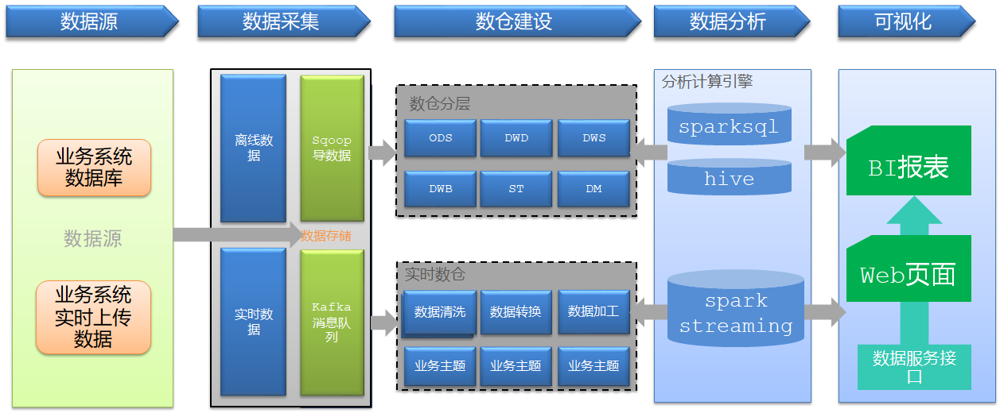
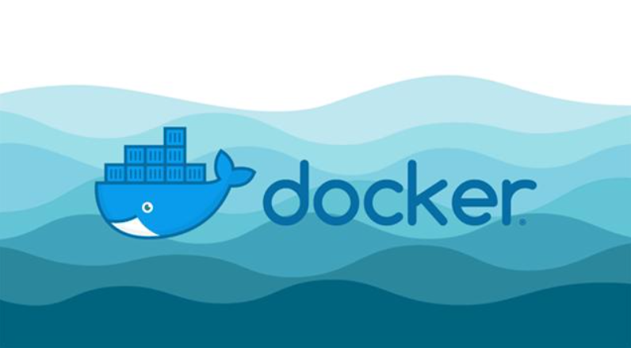
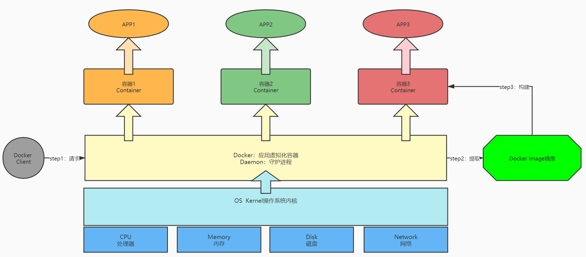
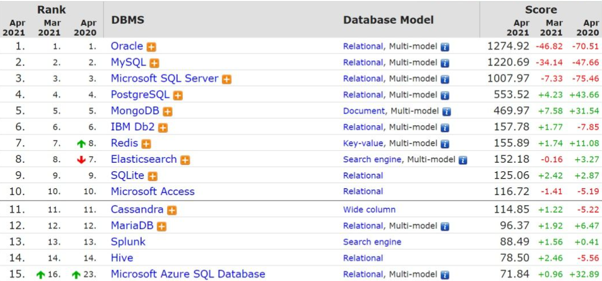

# 项目介绍及环境构建

## 项目背景

- 目标**：**了解项目应用背景**
  - 项目所属行业是什么？
- **实施**
  - **工业**
    - 产业分类 
      - 第一产业：植业、林业、畜牧业、水产养殖业等直接以自然物为生产对象的产业
      - 第二产业：工业、建筑业
      - 第三产业：交通运输业、通讯产业、商业、餐饮业、金融业、教育产业
    - 定义：属于第二产业，指的是采集原料，并把它们加工成产品的工作和过程
    - 划分
      - 开采业：对自然资源的开采，对采矿、晒盐、森林采伐等
      - 加工业：粮油加工、食品加工、 轧花、缫丝、纺织、制革等
      - 制造业：炼铁、炼钢、化工生产、 石油加工、机器制造、木材加工等，以及电力、自来水、煤气的生产和供应等
      - 机修业：对工业品的修理、翻新，如机器设备的修理、 交通运输工具的修理等
  - **物理网：IOT**（Internet Of Things）
    - 定义：指的是互联网、传统电信网等信息承载体，让所有能行使独立功能的普通物体实现互联互通的网络
    - 特点
      - 物物相连
      - 远程监控和设备控制
      - 设备自动化，提升用户体验
      - 设备故障分析处理
    - 场景
      - 智能设备：手机、平板、手表、眼镜、汽车
      - 智能家居：锁、空调、洗衣机、水壶、窗帘、灯具、马桶、牙刷
      - 智能机器人：语音助手、家庭管家、工业机器手臂、快递机器人
      - ……
  - **工业物联网：IIOT**（Industrial Internet of Things）
    - 定义：指数以亿计的工业设备，在这些设备上装置传感器，连接到网络以收集和共享数据
    - 发展
      - IDC预测，**到2024年全球物联网的联接量将接近650亿，是手机联接量的11.4倍**
- **小结**
  - 了解项目应用背景

## 项目需求

- **目标**：**掌握项目业务需求**

- **实施**

  - **项目行业**：工业物联网大数据

  - **项目名称**：加油站服务商数据运营管理平台 /  一站制造项目

    - 公司：设备服务公司
    - 客户：中石油、中石化、道达尔、壳牌
    - 设备：加油机
    - 服务：安装、维修、巡检、改造
    - 问题：客户量在减少、收益在减少、成本在变高
    - 需求：通过构建数据平台，发现公司中存在的问题，支撑运营，最终提高ROI

  - **整体需求**

    - **需求一：通过数据分析提高公司产品的服务质量**
      - 基于设备服务的整体流程：来电、服务、回访进行分析，判断用户满意度
      - 主要体现：通过订单实现以后的回访
    - **需求二：通过数据分析支撑公司的成本运营核算**
      - 基于整个公司所有的工单、报销数据进行分析，统计收入和支出情况
      - 基于所有仓储、物料、物流的数据进行分析，统计物料成本
      - 主要体现：工单费用、物料仓储、报销核算
    - 需求三：为未来自动化加油机设备做数据准备
      - 获取所有用户和车辆的信息来实现自动化加油的管理
      - 主动监控所有加油站的设备运行情况，实时分析检测

  - **具体分析需求**

    - 运营分析：呼叫中心服务单数、设备工单数、参与服务工程师个数、零部件消耗与供应指标等
    - 设备分析：设备油量监控、设备运行状态监控、安装个数、巡检次数、维修次数、改造次数
    - 呼叫中心：呼叫次数、工单总数、派单总数、完工总数、核单次数
    - 员工分析：人员个数、接单次数、评价次数、出差次数
    - 报销统计分析、仓库物料管理分析、用户分析、回访分析

  - **报表**

    

    

- **小结**

  - 这个项目属于哪个行业？
    - 工业物联网
  - 为什么要做这个项目？
    - 问题：客户量减少、成本增加、收益减少
    - 需求：通过数据分析平台，发现公司目前存在的问题，用数据支撑公司的运营，对成本、收益、服务进行统计分析，提供更好的决策，最终提高ROI
  - 这个项目具体需求是什么？
    - 需求一：基于所有工单数据进行分析，对服务评价的进行统计
      - 工单分析、回访分析
    - 需求二：基于所有费用的数据进行分析，对收入和支出进行统计
      - 差旅费用分析、报销分析、维修安装费用分析

## 业务流程

- **目标**：**掌握加油站设备维护的主要业务流程**

  - 如果不懂业务流程，项目没办法听懂

- **实施**

  

  - step1：加油站服务商联系呼叫中心，申请服务：安装/巡检/维修/改造加油机
    - **来电数据**
  - step2：呼叫中心联系对应服务站点，分派工单：联系站点主管，站点主管分配服务人员
    - **工单数据**
  - step3：服务人员确认工单和加油站点信息
    - **工单类型数据**：安装单、维修单、改造单、巡检单
    - **油站数据**
  - step4：服务人员在指定日期到达加油站，进行设备检修
  - step5：如果为安装或者巡检服务，安装或者巡检成功，则服务完成
  - step6：如果为维修或者改造服务，需要向服务站点申请物料，物料到达，实施结束，则服务完成
    - 物料数据、物流数据
  - step7：服务完成，与加油站站点服务商确认服务结束，完成订单核验
  - step8：工程师报销过程中产生的费用
    - **差旅费用数据**
  - step9：呼叫中心会定期对该工单中的工程师的服务做回访
    - **回访数据**

- **小结**

  - 掌握加油站设备维护的主要业务流程

## 技术选型

- **目标**：**掌握加油站服务商数据运营平台的技术选型**

- **实施**

  - 新零售项目：基于CDH+CM实现的

  - **数据生成**：Oracle数据库

  - **数据采集**：Sqoop

  - **数据存储**：Hive数据仓库

  - **数据计算**：Spark分布式计算【SparkSQL】

    - SparkCore：基于RDD的代码编程

    - SparkSQL：基于DataFrame的代码编程【Spark统一的编程模块】

      - 离线+SparkSQL，实时+StructStreaming

      - DSL：类似于使用SparkCore进行开发

      - SQL：类似于使用HiveSQL进行开发

      - 使用方式

        - Python文件中开发：DSL或者SQL

          ```
          df = sparkSession.sql("SQL语句")
          ```

          - 提交到集群运行：spark-submit  python|jar包

        - 提交运行SQL脚本：SQL

          ```
          spark-sql -f xxxxx.sql
          ```

        - **基于ThriftServer来实现运行：SQL**

          - 类似于HiveServer2
          - 类似于Python操作MySQL数据库

  - **数据应用**：FineBI + MySQL

  - **监控工具**：Prometheus + Grafana

  - **调度工具**：Airflow

  - 容器工具：Docker

  - **技术架构**：Lambda架构

    

    

- **小结**

  - 项目中用到了哪些技术？
    - 数据来源：Oracle
    - 数据采集：Sqoop
    - 数据存储：Hive
    - 数据计算：SparkSQL
    - 数据应用：FineBI
    - 集群监控：Prometheus + Grafana
    - 集群调度：Airflow

## Docker

### 1. Docker介绍

- **目标**：**了解Docker的基本功能和设计**

  - 为什么要用Docker？
  - 什么是Docker？

- **路径**

  - step1：生产环境的问题
  - step2：容器的概念
  - step3：Docker的设计

- **实施**

  - **生产环境的问题**

    - 运维层面：一台机器上的应用太多，不同的环境，安装过程也不一样，管理麻烦，怎么办？
    - 开发层面：不同程序的运行受到环境、资源等因素的干扰，不同的环境，开发的方式也不一样，怎么办？

  - **容器的概念**

    - 硬件容器：将一个硬件虚拟为多个硬件，底层共用硬件：共享硬件
      - 公有云平台：阿里云、百度云、腾讯云、华为云
    - 应用容器：将一个操作系统虚拟为多个操作系统，不同操作系统之间互相隔离：共享操作系统
      - 容器化工具：Docker、K8s

  - **Docker的设计**

    

    - **定义**：Docker是一个开源的应用容器引擎，使用GO语言开发，基于Linux内核的cgroup，namespace，Union FS等技术，对应用程序进行封装隔离，并且独立于宿主机与其他进程，这种运行时封装的状态称为容器。

    - **目标**

      - 提供简单的应用程序打包工具
      - 开发人员和运维人员职责逻辑分离
      - 多环境保持一致性,消除了环境差异

    - **功能**：“Build，Ship and Run Any App，Anywhere”

      - 通过对应用组件的封装，分发，部署，运行等生命周期的管理，达到应用组件级别的一次封装，多次分发，到处部署

    - **应用**

      - 一般不用Docker，用K8s
      - 运维资源管理工具：运维部署、构建

    - **架构**

      

      

    - **组成**

      - 宿主机：安装Docker的那台实际的物理机器

      - docker client 【客户端】：用于连接服务端，提交命令给服务端

        ```shell
        #拉取镜像
        docker pull ……
        #启动容器
        docker run ……
        #进入容器
        docker exec ……
        #查看容器
        docker ps ……
        ```

      - docker daemon【服务端】：用于接收客户端请求，实现所有容器管理操作

      - docker image【镜像】：用于安装APP的软件库，简单点理解为软件的安装包

      - docker container 【容器】：用于独立运行、隔离每个APP的单元，相当于每个独立的Linux系统

- **小结**

  - 了解Docker的基本功能和设计

### 2. Docker的网络

- **目标**：**了解Docker的网络管理设计**

- **路径**

  - step1：问题
  - step2：模式
  - step3：选型

- **实施**

  - **问题**：Docker的本质在一个操作上虚拟了多个操作系统出来，那每个操作之间如何进行网络通信呢？

  - **模式**

    - **host模式**：每个虚拟系统与主机共享网络，IP一致，用不同端口区分不同虚拟系统

      

    - **container模式**：第一个容器构建一个独立的虚拟网络，其他的容器与第一个容器共享网络

      

      

    - **none模式**：允许自定义每个容器的网络配置及网卡信息，每个容器独立一个网络

      

    - **bridge模式**：构建虚拟网络桥，所有容器都可以基于网络桥来构建自己的网络配置

      

      

  - **选型**：本次项目中使用bridge模式，类似于VM中的NAT模式使用

  - **管理**：了解即可，不用操作

    - 创建

      ```shell
      docker network create --subnet=172.33.0.0/24 docker-bd0
      ```

    - 查看模式

      ```shell
      docker network ls
      ```

    - 删除

      ```shell
      docker network rm ……
      ```

- **小结**

  - 了解Docker的网络管理设计

### 3. Docker的使用

- **目标**：**掌握docker的基本使用**

- **路径**

  - step1：docker管理
  - step2：image管理
  - **step3：container管理**

- **实施**

  - docker管理

    - 默认开机自启

    - 了解即可，不用操作

    - 启动服务

      ```shell
      systemctl start docker
      ```

    - 查看状态

      ```shell
      systemctl status docker
      ```

    - 关闭服务

      ```shell
      systemctl stop docker
      ```

  - image管理

    - 了解即可，不用操作

    - 添加镜像

      ```shell
      docker pull registry.cn-hangzhou.aliyuncs.com/helowin/oracle_11g
      
      ```

    - 列举镜像

      ```shell
      docker images
      ```

    - 移除镜像

      ```shell
      docker rmi ……
      ```

  - **container管理**

    - **熟悉常用操作**

    - 创建并启动container：不用做

      ```shell
      docker run --net docker-bd0 --ip 172.33.0.100 -d -p 1521:1521 --name oracle 3fa112fd3642
      ```

      - run = create + start

    - **列举container**

      ```shell
      #列举所有的
      docker ps -a
      #列举正在运行的
      docker ps
      ```

    - **启动container**

      ```
      docker start 容器名称
      ```

    - **关闭container**

      ```
      docker stop 容器名称
      ```

    - **进入container**

      ```shell
      docker exec -it 容器名称 bash
      ```

    - **退出container**

      ```shell
      exit
      
      ```

    - 删除container

      ```shell
      docker rm ……
      ```

- **小结**

  - 了解docker的基本使用

## Oracle

- **目标**：**了解Oracle工具的基本功能和应用场景**

- **路径**

  - step1：数据库分类
  - step2：Oracle的介绍

- **实施**

  - **数据库分类**

    - **RDBMS**：关系型数据库管理系统
      - 工具：MySQL、Oracle、SQL Server……
      - 应用：业务性数据存储系统：事务和稳定性
      - 特点：体现数据之间的关系，支持事务，保证业务完整性和稳定性，小数据量的性能也比较好
      - 开发：SQL
    - **NoSQL**：Not Only SQL：非关系型数据库
      - 工具：Redis、HBASE、MongoDB……
      - 分类：KV、文档、时序、图……
      - 应用：一般用于高并发高性能场景下的数据缓存或者数据库存储
      - 特点：读写速度特别快，并发量非常高，相对而言不如RDBMS稳定，对事务性的支持不太友好
      - 开发：每种NoSQL都有自己的命令语法

  - **Oracle的介绍**

    - 概念：甲骨文公司的一款关系数据库管理系统

      - Oracle在古希腊神话中被称为“神谕”，指的是上帝的宠儿
      - 在中国的商周时期，把一些刻在龟壳上的文字也称为上天的指示，所以在中国Oracle又翻译为甲骨文
      - Oracle是现在全世界最大的数据库提供商，编程语言提供商，应用软件提供商，它的地位等价于微软的地位

    - 分类：RDBMS，属于大型RDBMS数据库

      - 大型数据库：IBM DB2、Oracle、Sybase
      - 中型数据库：SQL Server、MySQL、Informix、PostgreSQL
      - 小型数据库：Access、Visual FoxPro、SQLite、derby

    - 功能：实现大规模关系型数据存储

    - 特点

      - 功能全面：数据字典、动态性能视图、TRACE跟踪、AWR、ASH、SQL Monitor等
      - 性能优越：支持SQL大量的表连接、子查询、集合运算，长度可达上千行
      - 数据量大：相比较于其他的数据库，Oracle支持千万级别以上的数据高性能存储
      - 高可靠性：基于Oracle自带的RAC架构下，可靠性和稳定性相对比较高

    - 综合排名

      

    - 应用：中国各大银行、电信、政府单位等机构所有系统

    - 趋势：去IOE【IBM服务器、Oracle数据库、EMC存储】

- **小结**

  - 了解Oracle工具的基本功能和应用场景

## 集群软件规划